## 1. 大数据基本导论

### 1.1 大数据基本概念


​	大数据是指无法在一定时间范围内用常规软件工具进行捕获, 管理 和处理的数据集合 ;

​	数据存储的单位:  bit、Byte、KB、MB、GB、TB、PB、EB、ZB、YB、BB、NB、DB

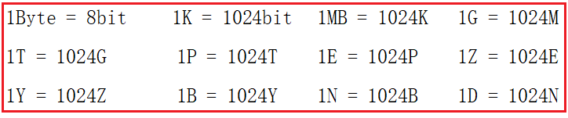

​	数据量的发展：


​	如上图所示，1986年，全球只有0.02EB也就是约21000TB的数据量，而到了2007年，全球就是280EB也就是约300000000TB的数据量，翻了14000倍。
​	而最近，由于移动互联网及物联网的出现，各种终端设备的接入，各种业务形式的普及，平均每40个月，全球的数据量就会翻倍！如果这样说还没有什么印象，可以再举个简单的例子，在2012年，每天会产生2.5EB的数据量。基于IDC的报告预测，从2013年到2020年，全球数据量会从4.4ZB猛增到44ZB！而到了2025年，全球会有163ZB的数据量！

​	由此可见，截至目前，全球的数据量已经大到爆了！而传统的关系型数据库根本处理不了如此海量的数据！

### 1.2 大数据的特点

- 1) 大量 : 

```
	截至目前，人类生产的所有印刷材料的数据量是200PB，而历史上全人类总共说过的话的数据量大约是5EB。当前，典型个人计算机硬盘的容量为TB量级，而一些大企业的数据量已经接近EB量级
```

- 2) 高速:

```
	这是大数据区分于传统数据挖掘的最显著特征。根据IDC的“数字宇宙”的报告，预计到2020年，全球数据使用量将达到35.2ZB。在如此海量的数据面前，处理数据的效率就是企业的生命。
```

​	例如: 天猫双十一 :  2018年2分5秒, 总交易额超100亿


- 3) 多样 :

```
	这种类型的多样性也让数据被分为结构化数据和非结构化数据。相对于以往便于存储的以数据库/文本为主的结构化数据，非结构化数据越来越多，包括网络日志、音频、视频、图片、地理位置信息等，这些多类型的数据对数据的处理能力提出了更高要求。
```

- 4)  低价值密度 :

```
	价值密度的 高低与数据总量的大小成反比。比如，在一天监控视频中，我们只关心宋宋老师晚上在床上健身那一分钟，如何快速对有价值数据“提纯”成为目前大数据背景下待解决的难题。
```

### 1.3 大数据的作用

- 1)  O2O : 百度大数据+平台通过先进的线上线下打通技术和客流分析能力，助力商家精细化运营，提升销量


- 2) 零售：探索用户价值，提供个性化服务解决方案；贯穿网络与实体零售，携手创造极致体验。经典案例  尿布+啤酒。


- 3) 旅游：深度结合百度独有大数据能力与旅游行业需求，共建旅游产业智慧管理、智慧服务和智慧营销的未来


- 4) 商品广告推荐：给用户推荐访问过的商品广告类型
- 5) 房产：大数据全面助力房地产行业，打造精准投策与营销，选出更合适的地，建造更合适的楼，卖给更合适的人
- 6) 保险： 海量数据挖掘及风险预测，助力保险行业精准营销，提升精细化定价能力
- 7) 金融：多维度体现用户特征，帮助金融机构推荐优质客户，防范欺诈风险。


- 8) 移动联通：移动联通：根据用户年龄、职业、消费情况，分析统计哪种套餐适合哪类人群。对市场人群精准定制


- 9) 人工智能 : 


### 1.4 大数据发展前景

​	1）党的十八届五中全会提出“实施国家大数据战略”，国务院印发《促进大数据发展行动纲要》，大数据技术和应用处于创新突破期，国内市场需求处于爆发期，我国大数据产业面临重要的发展机遇。

​	2）国际数据公司IDC预测，到2020年，企业基于大数据计算分析平台的支出将突破5000亿美元。目前，我国大数据人才只有46万，未来3到5年人才缺口达150万之多。

```
人才缺口计算
	150w-40w=110w
	110W/5年 = 22w/年
	22w/12月=1.83w/月
自古不变的真理：先入行者吃肉，后入行者喝汤，最后到的买单！
```

- 3) 2017年北京大学、中国人民大学、北京邮电大学等25所高校成功申请开设大数据课程。
- 4) 大数据属于高新技术，大牛少，升职竞争小；
- 5) 在北京大数据开发工程师的平均薪水已经到17800元（数据统计来职友集），而且目前还保持强劲的发展势头


## 2. 大数据课程预备了解知识

### 2.1 服务器基本介绍

​	服务器，也称伺服器，是提供计算服务的设备。由于服务器需要响应服务请求，并进行处理，因此一般来说服务器应具备承担服务并且保障服务的能力。

​	服务器的构成包括[处理器](https://baike.baidu.com/item/%E5%A4%84%E7%90%86%E5%99%A8/914419)、[硬盘](https://baike.baidu.com/item/%E7%A1%AC%E7%9B%98/159825)、[内存](https://baike.baidu.com/item/%E5%86%85%E5%AD%98/103614)、[系统](https://baike.baidu.com/item/%E7%B3%BB%E7%BB%9F)[总线](https://baike.baidu.com/item/%E6%80%BB%E7%BA%BF)等，和通用的计算机架构类似，但是由于需要[提供](https://baike.baidu.com/item/%E6%8F%90%E4%BE%9B/2290673)高可靠的服务，因此在处理能力、稳定性、可靠性、安全性、可扩展性、可管理性等方面要求较高。

​	在网络环境下，根据服务器提供的服务类型不同，分为文件服务器、[数据库服务器](https://baike.baidu.com/item/%E6%95%B0%E6%8D%AE%E5%BA%93%E6%9C%8D%E5%8A%A1%E5%99%A8/613818)、应用程序服务器、WEB服务器等

​	在实际工作中，公司一般都会选择阿里云服务器或者自己购买一些机房托管的服务，或者再大型的公司会自己构建机房。  

​	可以简单的理解为服务器就是一台电脑，只不过硬盘比普通的PC机更大，CPU比普通的PC机处理速度更快，网卡比普通的PC机更快。。。


### 2.2 存储磁盘基本介绍


​	服务器需要存储数据，免不了得要磁盘的支持，磁盘就是一类存储介质，专门用于存储我们各种类型的数据，其中磁盘按照接口类型又可以有好多种分类，接下来我们来简单看一下不同接口的各类磁盘的基本特性吧

- 1) SAS接口硬盘介绍

```
	SAS 该盘分为两种协议，即SAS1.0及SAS 2.0接口，SAS1.0接口传输带宽为3.0GB/s转速有7.2kr 10kr 15kr。该盘现已被SAS2.0接口盘取代，该盘尺寸有2.5寸及3.5寸两种。SAS2.0接口传输带宽为6.0GB/s转速有10kr 15kr，常见容量为73.6G 146G 300G 600G 900G。常见转速：15000转/分。
```

- 2) SCSI接口硬盘介绍

```
	SCSi传统服务器老传输接口，转速为10kr 15kr。但是由于受到线缆及其阵列卡和传输协议的限制，该盘片有固定的插法，例如要顺着末端接口开始插第一块硬盘，没有插硬盘的地方要插硬盘终结器等。该盘现已经完全停止发售。该盘只有3.5寸版。常见转速：10000转/分。
```

- 3)  NL SAS接口硬盘介绍

```
	NL SAS 该盘片专业翻译为近线SAS，由于SAS盘价格高昂，容量大小有限，LSI等厂家就采用通过二类最高级别检测的SATA盘片进行改装，采用SAS的传输协议，SATA的盘体SAS的传输协议，形成市场上一种高容量低价格的硬盘。市场上现在单盘最大容量为3TB。尺寸分为2.5寸及3.5寸两种
```

- 4) FDE/SDE接口硬盘介绍

```
	FDE/SDE 该盘体前者为IBM研发的SAS硬件加密硬盘，该盘体性能等同于SAS硬盘，但是由于本身有硬件加密系统，可以保证涉密单位数据不外泄，该盘主要用于高端2.5寸存储及2.5寸硬盘接口的机器上。SDE盘雷同，厂家不一样。
```

- 5) SSD固态硬盘介绍

```
	SSD 该盘为固态硬盘，与个人PC不同的是该盘采用一类固态硬盘检测系统检测出场，并采用SAS2.0协议进行传输，该盘的性能也将近是个人零售SSD硬盘的数倍以上。
```

- 6) FC类型硬盘介绍

```
	FC硬盘 FC硬盘主要用于以光纤为主要传输协议的外部SAN上，由于盘体双通道，又是FC传输，传输带宽为2G 4G 8G三种传输速度快，在SAN上边，FC磁盘数量越是多IOPS（同写同读并发连接数）越是高。
```

- 7) SATA硬盘基本介绍

```
	SATA硬盘：用SATA接口的硬盘又叫串口硬盘，是以后PC机的主流发展方向，因为其有较强的纠错能力，错误一经发现能自动纠正，这样就大大的提高了数据传输的安全性。新的SATA 使用了差动信号系统“differential-signal-amplified-system”。这种系统能有效的将噪声从正常讯号中滤除，良好的噪声滤除能力使得SATA只要使用低电压操作即可，和 Parallel ATA 高达5V的传输电压相比，SATA 只要0.5V(500mv) 的峰对峰值电压即可操作于更高的速度之上。“比较正确的说法是：峰对峰值‘差模电压’”。常见转速：7200转/分。 
```

- 8) 普通PC机与服务器硬盘区别

```
同普通PC机的硬盘相比，服务器上使用的硬盘具有如下四个特点:

8.1) 速度快 :
	服务器使用的硬盘转速快，可以达到每分钟7200或10000转，甚至更高；它还配置了较大(一般为2MB或4MB)的回写式缓存（已经过时，目前台式机硬盘缓存可达64MB！）；平均访问时间比较短；外部传输率和内部传输率更高，采用Ultra Wide SCSI、Ultra2 Wide SCSI、Ultra160 SCSI、Ultra320 SCSI等标准的SCSI硬盘，每秒的数据传输率分别可以达到40MB、80MB、160MB、320MB。
	
8.2) 可靠性高 :
	因为服务器硬盘几乎是24小时不停地运转，承受着巨大的工作量。可以说，各硬盘厂商均采用了各自独有的先进技术来保证数据的安全。为了避免意外的损失，服务器硬盘一般都能承受300G到1000G的冲击力。

8.3) 多使用SCSI接口
	多数服务器采用了数据吞吐量大、CPU占有率极低的SCSI/SAS硬盘（虽然目前台式机的SATA硬盘cpu占有率也较低，但跟SAS硬盘明显不在一个档次上）。SCSI硬盘必须通过SCSI接口才能使用，有的服务器主板集成了SCSI接口，有的安有专用的SCSI接口卡，一块SCSI接口卡可以接7个SCSI设备，这是IDE接口所不能比拟的（一个IDE接口只能扩展两个通道，而且相互干扰严重）。

8.4) 可支持热插拔
	热插拔（Hot Swap）是一些服务器支持的硬盘安装方式，可以在服务器不停机的情况下，拔出或插入一块硬盘，操作系统自动识别硬盘的改动。这种技术对于24小时不间断运行的服务器来说，是非常必要的。当然，目前SATA硬盘也具有了这个功能，对于非关键业务来说，让服务器重启明显比热插拔划算得多（热插拔有损失数据的危险）。
	
```

### 2.3 服务器网卡介绍

​	基本介绍：网络接口控制器（英语：network interface controller，NIC），又称网络接口控制器，网络适配器（network adapter），网卡（network interface card），或局域网接收器（LAN adapter），是一块被设计用来允许计算机在[计算机网络](https://baike.baidu.com/item/%E8%AE%A1%E7%AE%97%E6%9C%BA%E7%BD%91%E7%BB%9C)上进行通讯的[计算机硬件](https://baike.baidu.com/item/%E8%AE%A1%E7%AE%97%E6%9C%BA%E7%A1%AC%E4%BB%B6)。由于其拥有[MAC地址](https://baike.baidu.com/item/MAC%E5%9C%B0%E5%9D%80)，因此属于[OSI模型](https://baike.baidu.com/item/OSI%E6%A8%A1%E5%9E%8B)的第1层。它使得用户可以通过电缆或无线相互连接。每一个网卡都有一个被称为[MAC地址](https://baike.baidu.com/item/MAC%E5%9C%B0%E5%9D%80)的独一无二的48位串行号，它被写在卡上的一块[ROM](https://baike.baidu.com/item/ROM)中。在网络上的每一个计算机都必须拥有一个独一无二的MAC地址。没有任何两块被生产出来的网卡拥有同样的地址。这是因为电气电子工程师协会（[IEEE](https://baike.baidu.com/item/IEEE)）负责为网络接口控制器销售商分配唯一的MAC地址

主要作用：

1、数据的封装与解封

​	发送时将上一层交下来的数据加上首部和尾部，成为以太网的[帧](https://baike.baidu.com/item/%E5%B8%A7)。接收时将以太网的帧剥去首部和尾部，然后送交上一层

2、链路管理

​	主要是[CSMA/CD](https://baike.baidu.com/item/CSMA%2FCD)（Carrier Sense Multiple Access with Collision Detection ，带[冲突检测](https://baike.baidu.com/item/%E5%86%B2%E7%AA%81%E6%A3%80%E6%B5%8B)的[载波监听多路访问](https://baike.baidu.com/item/%E8%BD%BD%E6%B3%A2%E7%9B%91%E5%90%AC%E5%A4%9A%E8%B7%AF%E8%AE%BF%E9%97%AE)）协议的实现

3、[编码](https://baike.baidu.com/item/%E7%BC%96%E7%A0%81)与[译码](https://baike.baidu.com/item/%E8%AF%91%E7%A0%81)

​	即[曼彻斯特编码](https://baike.baidu.com/item/%E6%9B%BC%E5%BD%BB%E6%96%AF%E7%89%B9%E7%BC%96%E7%A0%81)与[译码](https://baike.baidu.com/item/%E8%AF%91%E7%A0%81)。

### 2.4 交换机基本介绍

​	基本介绍：交换机（Switch）意为“[开关](https://baike.baidu.com/item/%E5%BC%80%E5%85%B3/2275072)”是一种用于电（光）信号转发的[网络设备](https://baike.baidu.com/item/%E7%BD%91%E7%BB%9C%E8%AE%BE%E5%A4%87/7667828)。它可以为接入交换机的任意两个[网络节点](https://baike.baidu.com/item/%E7%BD%91%E7%BB%9C%E8%8A%82%E7%82%B9/9338583)提供独享的电信号通路。最常见的交换机是[以太网交换机](https://baike.baidu.com/item/%E4%BB%A5%E5%A4%AA%E7%BD%91%E4%BA%A4%E6%8D%A2%E6%9C%BA/10186103)。其他常见的还有电话语音交换机、[光纤交换机](https://baike.baidu.com/item/%E5%85%89%E7%BA%A4%E4%BA%A4%E6%8D%A2%E6%9C%BA/8396782)等。

​	主要作用：交换机的主要功能包括物理编址、[网络拓扑结构](https://baike.baidu.com/item/%E7%BD%91%E7%BB%9C%E6%8B%93%E6%89%91%E7%BB%93%E6%9E%84)、错误校验、帧序列以及流控。交换机还具备了一些新的功能，如对VLAN（[虚拟局域网](https://baike.baidu.com/item/%E8%99%9A%E6%8B%9F%E5%B1%80%E5%9F%9F%E7%BD%91)）的支持、对[链路](https://baike.baidu.com/item/%E9%93%BE%E8%B7%AF)汇聚的支持，甚至有的还具有[防火墙](https://baike.baidu.com/item/%E9%98%B2%E7%81%AB%E5%A2%99)的功能

### 2.5 局域网基本介绍

​	局域网（Local Area Network，LAN）是指在某一区域内由多台计算机互联成的计算机组。一般是方圆几千米以内。局域网可以实现文件管理、[应用软件](https://baike.baidu.com/item/%E5%BA%94%E7%94%A8%E8%BD%AF%E4%BB%B6/216367)共享、[打印机共享](https://baike.baidu.com/item/%E6%89%93%E5%8D%B0%E6%9C%BA%E5%85%B1%E4%BA%AB/1979511)、[工作组](https://baike.baidu.com/item/%E5%B7%A5%E4%BD%9C%E7%BB%84/5103560)内的日程安排、电子邮件和传真通信服务等功能。局域网是封闭型的，可以由办公室内的两台计算机组成，也可以由一个公司内的上千台计算机组成。

### 2.6 机架基本介绍

​	为了方便管理维护众多的服务器，以及在服务器出现问题时候快读的定位解决问题，我们可以使用机架的形式，将众多的服务器归纳到一个个的机架里面去。机架之间的通信问题可以使用交换机来组织成为局域网


### 2.7 IDC数据中心介绍

​	互联网数据中心（Internet Data Center）简称IDC，就是电信部门利用已有的互联网[通信线路](https://baike.baidu.com/item/%E9%80%9A%E4%BF%A1%E7%BA%BF%E8%B7%AF/1527630)、带宽资源，建立标准化的电信专业级机房环境，为企业、政府提供服务器托管、租用以及相关增值等方面的全方位服务  

​	IDC[主机托管](https://baike.baidu.com/item/%E4%B8%BB%E6%9C%BA%E6%89%98%E7%AE%A1)主要应用范围是网站发布、虚拟主机和电子商务等。比如网站发布，单位通过托管主机，从电信部门分配到互联网[静态IP地址](https://baike.baidu.com/item/%E9%9D%99%E6%80%81IP%E5%9C%B0%E5%9D%80)后，即可发布自己的www站点，将自己的产品或服务通过互联网广泛宣传；虚拟主机是单位通过托管主机，将自己主机的海量硬盘空间出租，为其他客户提供虚拟主机服务，使自己成为ICP服务提供商；电子商务是指单位通过托管主机，建立自己的[电子商务系统](https://baike.baidu.com/item/%E7%94%B5%E5%AD%90%E5%95%86%E5%8A%A1%E7%B3%BB%E7%BB%9F)，通过这个商业平台来为供应商、批发商、经销商和最终用户提供完善的服务。

​	IDC即[互联网数据中心](https://baike.baidu.com/item/%E4%BA%92%E8%81%94%E7%BD%91%E6%95%B0%E6%8D%AE%E4%B8%AD%E5%BF%83)。它是伴随着互联网不断发展的需求而迅速发展起来的，成为了新世纪中国[互联网产业](https://baike.baidu.com/item/%E4%BA%92%E8%81%94%E7%BD%91%E4%BA%A7%E4%B8%9A)中不可或缺的重要一环。它为[互联网内容提供商](https://baike.baidu.com/item/%E4%BA%92%E8%81%94%E7%BD%91%E5%86%85%E5%AE%B9%E6%8F%90%E4%BE%9B%E5%95%86)（ICP）、企业、媒体和各类网站提供大规模、高质量、安全可靠的专业化服务器托管、空间租用、网络批发带宽以及ASP、EC等业务。

​	IDC是对入驻（Hosting）企业、商户或[网站服务器](https://baike.baidu.com/item/%E7%BD%91%E7%AB%99%E6%9C%8D%E5%8A%A1%E5%99%A8)群托管的场所；是各种模式电子商务赖以安全运作的基础设施，也是支持企业及其商业联盟其分销商、供应商、客户等实施价值链管理的平台。

​	IDC起源于ICP对网络高速互联的需求，而且[美国](https://baike.baidu.com/item/%E7%BE%8E%E5%9B%BD)仍然处于世界领导者位置。在美国，运营商为了维护自身利益，将[网络互联](https://baike.baidu.com/item/%E7%BD%91%E7%BB%9C%E4%BA%92%E8%81%94)带宽设得很低，用户不得不在每个服务商处都放一台服务器。为了解决这个问题，IDC应运而生，保证客户托管的服务器从各个网络访问速度都没有瓶颈。


​	IDC不仅是数据存储的中心，而且是数据流通的中心，它应该出现在Internet网络中数据交换最集中的地方。它是伴随着人们对[主机托管](https://baike.baidu.com/item/%E4%B8%BB%E6%9C%BA%E6%89%98%E7%AE%A1)和虚拟主机服务提出了更高要求的状况而产生的，从某种意义上说，它是由ISP的服务器托管机房演变而来的。具体而言，随着Internet的高速发展，[网站系统](https://baike.baidu.com/item/%E7%BD%91%E7%AB%99%E7%B3%BB%E7%BB%9F)对带宽、管理维护日益增长的高要求对很多企业构成了严峻的挑战。于是，企业开始将与网站托管服务相关的一切事物交给专门提供网络服务的IDC去做，而将精力集中在增强核心竞争力的业务中去。可见，IDC是Internet企业分工更加细化的产物。

​	目前我国比较大的机房主要在北京、[上海](https://baike.baidu.com/item/%E4%B8%8A%E6%B5%B7)、[广州](https://baike.baidu.com/item/%E5%B9%BF%E5%B7%9E)、[唐山](https://baike.baidu.com/item/%E5%94%90%E5%B1%B1)等地

### 2.8 磁盘存储raid0-5 基本介绍

​	1988 年美国加州大学伯克利分校的 D. A. Patterson 教授等首次在论文 “A Case of Redundant Array of Inexpensive Disks” 中提出了 RAID 概念 ，即廉价冗余磁盘阵列（ Redundant Array of Inexpensive Disks ）。由于当时大容量磁盘比较昂贵， RAID 的基本思想是将多个容量较小、相对廉价的磁盘进行有机组合，从而以较低的成本获得与昂贵大容量磁盘相当的容量、性能、可靠性。随着磁盘成本和价格的不断降低， RAID 可以使用大部分的磁盘， “廉价” 已经毫无意义。因此， RAID 咨询委员会（ RAID Advisory Board, RAB ）决定用 “ 独立 ” 替代 “ 廉价 ” ，于时 RAID 变成了独立磁盘冗余阵列（ Redundant Array of Independent Disks ）。但这仅仅是名称的变化，实质内容没有改变

#### 2.8.1 磁盘存储类型介绍

- 1) raid0 基本介绍

```
	RAID0 是一种简单的、无数据校验的数据条带化技术。实际上不是一种真正的 RAID ，因为它并不提供任何形式的冗余策略。 RAID0 将所在磁盘条带化后组成大容量的存储空间（如图 2 所示），将数据分散存储在所有磁盘中，以独立访问方式实现多块磁盘的并读访问。由于可以并发执行 I/O 操作，总线带宽得到充分利用。再加上不需要进行数据校验，RAID0 的性能在所有 RAID 等级中是最高的。理论上讲，一个由 n 块磁盘组成的 RAID0 ，它的读写性能是单个磁盘性能的 n 倍，但由于总线带宽等多种因素的限制，实际的性能提升低于理论值。
　　RAID0 具有低成本、高读写性能、 100% 的高存储空间利用率等优点，但是它不提供数据冗余保护，一旦数据损坏，将无法恢复。 因此， RAID0 一般适用于对性能要求严格但对数据安全性和可靠性不高的应用，如视频、音频存储、临时数据缓存空间等
```


- 2) RAID1基本介绍

```
	RAID1 称为镜像，它将数据完全一致地分别写到工作磁盘和镜像 磁盘，它的磁盘空间利用率为 50% 。 RAID1 在数据写入时，响应时间会有所影响，但是读数据的时候没有影响。 RAID1 提供了最佳的数据保护，一旦工作磁盘发生故障，系统自动从镜像磁盘读取数据，不会影响用户工作。工作原理如图 3 所示。
　　RAID1 与 RAID0 刚好相反，是为了增强数据安全性使两块 磁盘数据呈现完全镜像，从而达到安全性好、技术简单、管理方便。 RAID1 拥有完全容错的能力，但实现成本高。 RAID1 应用于对顺序读写性能要求高以及对数据保护极为重视的应用，如对邮件系统的数据保护
```


- 3) RAID2基本介绍

```
	RAID2 称为纠错海明码磁盘阵列，其设计思想是利用海明码实现数据校验冗余。海明码是一种在原始数据中加入若干校验码来进行错误检测和纠正的编码技术，其中第 2n 位（ 1, 2, 4, 8, … ）是校验码，其他位置是数据码。因此在 RAID2 中，数据按位存储，每块磁盘存储一位数据编码，磁盘数量取决于所设定的数据存储宽度，可由用户设定。图 4 所示的为数据宽度为 4 的 RAID2 ，它需要 4 块数据磁盘和 3 块校验磁盘。如果是 64 位数据宽度，则需要 64 块 数据磁盘和 7 块校验磁盘。可见， RAID2 的数据宽度越大，存储空间利用率越高，但同时需要的磁盘数量也越多。
　　海明码自身具备纠错能力，因此 RAID2 可以在数据发生错误的情况下对纠正错误，保证数据的安全性。它的数据传输性能相当高，设计复杂性要低于后面介绍的 RAID3 、 RAID4 和 RAID5 。
　　但是，海明码的数据冗余开销太大，而且 RAID2 的数据输出性能受阵列中最慢磁盘驱动器的限制。再者，海明码是按位运算， RAID2 数据重建非常耗时。由于这些显著的缺陷，再加上大部分磁盘驱动器本身都具备了纠错功能，因此 RAID2 在实际中很少应用，没有形成商业产品，目前主流存储磁盘阵列均不提供 RAID2 支持。
```


- 4) RAID3基本介绍

```
	RAID3 （图 5 ）是使用专用校验盘的并行访问阵列，它采用一个专用的磁盘作为校验盘，其余磁盘作为数据盘，数据按位可字节的方式交叉存储到各个数据盘中。RAID3 至少需要三块磁盘，不同磁盘上同一带区的数据作 XOR 校验，校验值写入校验盘中。 RAID3 完好时读性能与 RAID0 完全一致，并行从多个磁盘条带读取数据，性能非常高，同时还提供了数据容错能力。向 RAID3 写入数据时，必须计算与所有同条带的校验值，并将新校验值写入校验盘中。一次写操作包含了写数据块、读取同条带的数据块、计算校验值、写入校验值等多个操作，系统开销非常大，性能较低。
　　如果 RAID3 中某一磁盘出现故障，不会影响数据读取，可以借助校验数据和其他完好数据来重建数据。假如所要读取的数据块正好位于失效磁盘，则系统需要读取所有同一条带的数据块，并根据校验值重建丢失的数据，系统性能将受到影响。当故障磁盘被更换后，系统按相同的方式重建故障盘中的数据至新磁盘。
　　RAID3 只需要一个校验盘，阵列的存储空间利用率高，再加上并行访问的特征，能够为高带宽的大量读写提供高性能，适用大容量数据的顺序访问应用，如影像处理、流媒体服务等。目前， RAID5 算法不断改进，在大数据量读取时能够模拟 RAID3 ，而且 RAID3 在出现坏盘时性能会大幅下降，因此常使用 RAID5 替代 RAID3 来运行具有持续性、高带宽、大量读写特征的应用。
```


- 5) RAID4基本介绍

```
	RAID4 与 RAID3 的原理大致相同，区别在于条带化的方式不同。 RAID4 （图 6 ）按照 块的方式来组织数据，写操作只涉及当前数据盘和校验盘两个盘，多个 I/O 请求可以同时得到处理，提高了系统性能。 RAID4 按块存储可以保证单块的完整性，可以避免受到其他磁盘上同条带产生的不利影响。
　　RAID4 在不同磁盘上的同级数据块同样使用 XOR 校验，结果存储在校验盘中。写入数据时， RAID4 按这种方式把各磁盘上的同级数据的校验值写入校验 盘，读取时进行即时校验。因此，当某块磁盘的数据块损坏， RAID4 可以通过校验值以及其他磁盘上的同级数据块进行数据重建。
　　RAID4 提供了 非常好的读性能，但单一的校验盘往往成为系统性能的瓶颈。对于写操作， RAID4 只能一个磁盘一个磁盘地写，并且还要写入校验数据，因此写性能比较差。而且随着成员磁盘数量的增加，校验盘的系统瓶颈将更加突出。正是如上这些限制和不足， RAID4 在实际应用中很少见，主流存储产品也很少使用 RAID4 保护。
```


- 6) RAID5基本介绍

```
	RAID5 应该是目前最常见的 RAID 等级，它的原理与 RAID4 相似，区别在于校验数据分布在阵列中的所有磁盘上，而没有采用专门的校验磁盘。对于数据和校验数据，它们的写操作可以同时发生在完全不同的磁盘上。因此， RAID5 不存在 RAID4 中的并发写操作时的校验盘性能瓶颈问题。另外， RAID5 还具备很好的扩展性。当阵列磁盘 数量增加时，并行操作量的能力也随之增长，可比 RAID4 支持更多的磁盘，从而拥有更高的容量以及更高的性能。
　　RAID5 （图 7）的磁盘上同时存储数据和校验数据，数据块和对应的校验信息存保存在不同的磁盘上，当一个数据盘损坏时，系统可以根据同一条带的其他数据块和对应的校验数据来重建损坏的数据。与其他 RAID 等级一样，重建数据时， RAID5 的性能会受到较大的影响。
　　RAID5 兼顾存储性能、数据安全和存储成本等各方面因素，它可以理解为 RAID0 和 RAID1 的折中方案，是目前综合性能最佳的数据保护解决方案。 RAID5 基本上可以满足大部分的存储应用需求，数据中心大多采用它作为应用数据的保护方案。
```


- 7) RAID6基本介绍

```
	前面所述的各个 RAID 等级都只能保护因单个磁盘失效而造成的数据丢失。如果两个磁盘同时发生故障，数据将无法恢复。 RAID6 （如图 8 ）引入双重校验的概念，它可以保护阵列中同时出现两个磁盘失效时，阵列仍能够继续工作，不会发生数据丢失。 RAID6 等级是在 RAID5 的基础上为了进一步增强数据保护而设计的一种 RAID 方式，它可以看作是一种扩展的 RAID5 等级。
　　RAID6 不仅要支持数据的恢复，还要支持校验数据的恢复，因此实现代价很高，控制器的设计也比其他等级更复杂、更昂贵。 RAID6 思想最常见的实现方式是采用两个独立的校验算法，假设称为 P 和 Q ，校验数据可以分别存储在两个不同的校验盘上，或者分散存储在所有成员磁盘中。当两个磁盘同时失效时，即可通过求解两元方程来重建两个磁盘上的数据。
　　RAID6 具有快速的读取性能、更高的容错能力。但是，它的成本要高于 RAID5 许多，写性能也较差，并有设计和实施非常复杂。因此， RAID6 很少得到实际应用，主要用于对数据安全等级要求非常高的场合。它一般是替代 RAID1 0 方案的经济性选择。
```

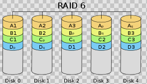

#### 2.8.2 常用raid 组合等级介绍

​	标准 RAID 等级各有优势和不足。自然地，我们想到把多个 RAID 等级组合起来，实现优势互补，弥补相互的不足，从而达到在性能、数据安全性等指标上更高的 RAID 系统。目前在业界和学术研究中提到的 RAID 组合等级主要有 RAID00 、 RAID01 、 RAID10 、 RAID100 、 RAID30 、 RAID50 、 RAID53 、 RAID60 ，但实际得到较为广泛应用的只有 RAID01 和 RAID10 两个等级。当然，组合等级的实现成本一般都非常昂贵，只是在 少数特定场合应用。

- 1) RAID00组合使用场景介绍

```
　　简单地说， RAID00 是由多个成员 RAID0 组成的高级 RAID0 。它与 RAID0 的区别在于， RAID0 阵列替换了原先的成员磁盘。可以把 RAID00 理解为两层条带化结构的磁盘阵列，即对条带再进行条带化。这种阵列可以提供更大的存储容量、更高的 I/O 性能和更好的 I/O 负均衡。
```

- 2)  RAID01 和 RAID10

```
　　一些文献把这两种 RAID 等级看作是等同的，本文认为是不同的。 RAID01 是先做条带化再作镜像，本质是对物理磁盘实现镜像；而 RAID10 是先做镜像再作条带化，是对虚拟磁盘实现镜像。相同的配置下，通常 RAID01 比 RAID10 具有更好的容错能力，原理如图 9 所示。
	RAID01 兼备了 RAID0 和 RAID1 的优点，它先用两块磁盘建立镜像，然后再在镜像内部做条带化。 RAID01 的数据将同时写入到两个磁盘阵列中，如果其中一个阵列损坏，仍可继续工作，保证数据安全性的同时又提高了性能。 RAID01 和 RAID10 内部都含有 RAID1 模式，因此整体磁盘利用率均仅为 50% 。
```


- 3) RAID100 组合场景介绍

```
	通常看作 RAID 1+0+0 ，有时也称为 RAID 10+0 ，即条带化的 RAID10 。原理如图 10 所示。 RAID100 的缺陷与 RAID10 相同，任意一个 RAID1 损坏一个磁盘不会发生数据丢失，但是剩下的磁盘存在单点故障的危险。最顶层的 RAID0 ，即条带化任务，通常由软件层来完成。
　　RAID100 突破了单个 RAID 控制器对物理磁盘数量的限制，可以获得更高的 I/O 负载均衡， I/O 压力分散到更多的磁盘上，进一步提高随机读性能，并有效降低热点盘故障风险。因此， RAID100 通常是大数据库的最佳选择。
```


- 4) RAID30 （ RAID53 ）、 RAID50 和 RAID60

```
	这三种 RAID 等级与 RAID00 原理基本相同，区别在于成员 “ 磁盘 ” 换成了 RAID3 、 RAID5 和 RAID6 ，分别如图 11 、 12 、 13 所示。其中， RAID30 通常又被称为 RAID53 。其实，可把这些等级 RAID 统称为 RAID X0 等级， X 可为标准 RAID 等级，甚至组合等级（如 RAID100 ）。利用多层 RAID 配置，充分利用 RAID X 与 RAID0 的优点，从而获得在存储容量、数据安全性和 I/O 负载均衡等方面的大幅性能提升。
```

## 3. 三台虚拟机创建并联网

### 3.1 第一种方式: iso文件

#### 3.1.1 创建一台虚拟机

- 1) 创建一台虚拟机出来


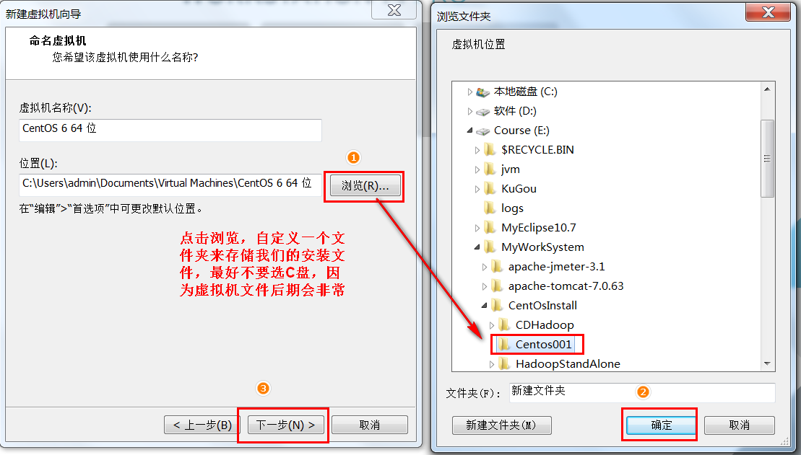


#### 3.1.2 虚拟机挂载操作系统


#### 3.1.3 开启虚拟机,安装系统


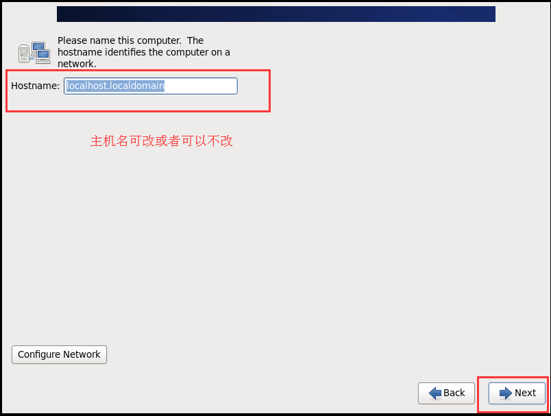


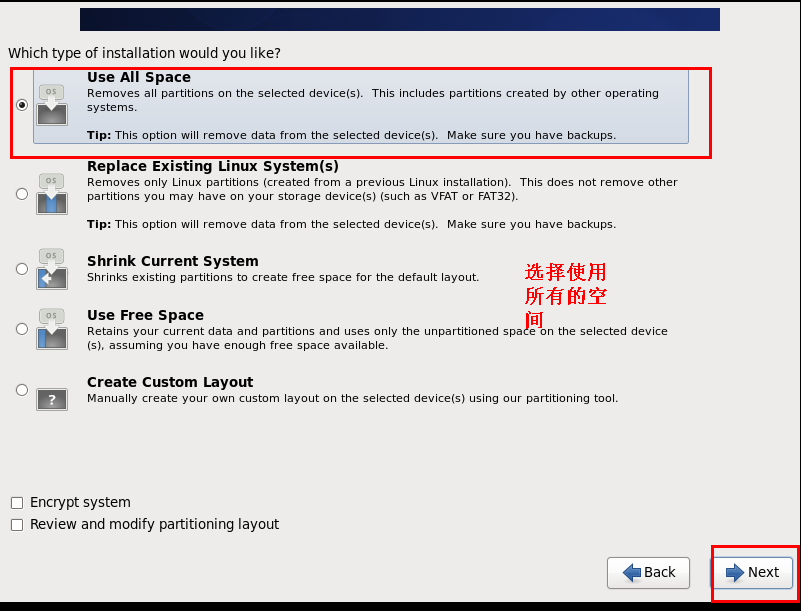


#### 3.1.4 配置虚拟机连接网络

- 1) 修改linux的mac地址


- 2) 修改mac地址配置文件

  需要启动我们的linux的虚拟机，然后更改mac地址的配置文件

```shell
vim /etc/udev/rules.d/70-persistent-net.rules
```


- 3) 修改网络配置

```shell
vim /etc/sysconfig/network-scripts/ifcfg-eth0
添加以下内容:
	IPADDR=192.168.52.100
	GATEWAY=192.168.52.1
	NETMASK=255.255.255.0
	DNS1=8.8.8.8
```

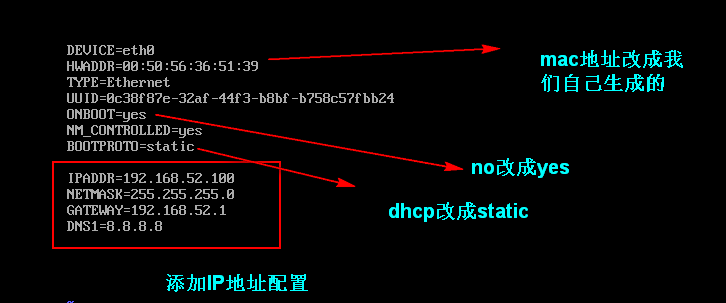

- 4) 重启服务器

  修改完成之后，重启服务器

```'reboot  -h   now
reboot  -h   now
```

​	【检测能够正常联网】


### 3.2 第二种方式: 直接复制

【三台虚拟机的规划】

|            | IP地址         | 主机名            |
| ---------- | -------------- | ----------------- |
| 第一台机器 | 192.168.52.100 | node01.hadoop.com |
| 第一台机器 | 192.168.52.110 | node02.hadoop.com |
| 第一台机器 | 192.168.52.120 | node03.hadoop.com |

通过直接复制安装后的安装文件，然后更改mac地址与ip地址也可以实现虚拟机的快速创建

注意事项：

​	1) windows系统确认所有的关于VmWare的服务都已经启动，

​	2) 确认好VmWare生成的网关地址，另外确认VmNet8网卡已经配置好了IP地址。

#### 3.2.1 将安装后的虚拟机直接复制一份出来

​	将我们的Centos6.9_001这个文件夹复制三份出来，分别命名CDH1，CDH2，CDH3

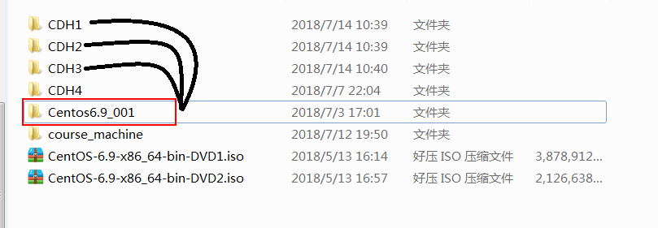

#### 3.2.2 让VmWare加载三台虚拟机

​	依次进入到三个文件夹当中，然后点击CentOS 6 64 位.vmx来让VmWare加载我们的linux操作系统


#### 3.2.3 VmWare当中改名并更改mac地址

​	我们可以在虚拟机当中更改我们的名称为CDH1,CDH2,CDH3，并为三台虚拟机更改mac地址


#### 3.2.4 开启linux系统更改设置

注意事项：

​	1) windows系统确认所有的关于VmWare的服务都已经启动，

​	2) 确认好VmWare生成的网关地址，另外确认VmNet8网卡已经配置好了IP地址。

启动我们的linux系统，并更改mac地址与IP地址

【更改mac地址】

```
更改mac地址：
vim /etc/udev/rules.d/70-persistent-net.rules
```


【更改IP地址】

```
更改ip地址
vim /etc/sysconfig/network-scripts/ifcfg-eth0
```


#### 3.2.5 linux系统重启

​	关机重启linux系统即可进行联网了

​	第二台第三台机器重复上述步骤，并设置IP网址为192.168.52.110，192.168.52.120

## 4. 大数据集群环境准备

### 4.1 三台虚拟机关闭防火墙

【三台机器执行以下命令（root用户来执行）】

```
service iptables stop
chkconfig iptables off
```

### 4.2 三台虚拟机关闭selinux

使用 :  vim /etc/selinux/config


### 4.3 三台机器更改主机名

使用:  vim /etc/sysconfig/network


### 4.4 三台机器做主机名与IP地址的映射

```
vim /etc/hosts

# 添加一下内容: 注意ip
192.168.52.100 node01.hadoop.com  node01
192.168.52.110 node02.hadoop.com  node02
192.168.52.120 node03.hadoop.com  node03
```


### 4.5 三台机器重启

使用 :  reboot  -h  now

### 4.6 三台机器机器免密码登录

- 1) 三台机器生成公钥与私钥

```
在三台机器执行以下命令，生成公钥与私钥 :
	ssh-keygen -t rsa
```

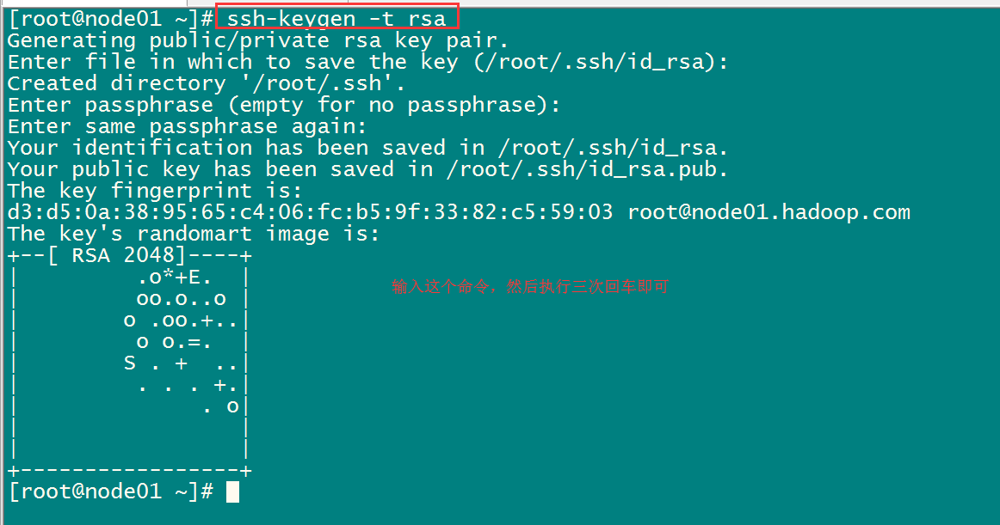

- 2) 将所有的公钥都拷贝到同一台机器

```
三台机器将拷贝公钥到第一台机器, 三台机器执行命令：
	ssh-copy-id node01.hadoop.com
```


- 3) 将第一台中收集过来所有公钥,分别拷贝给其他机子

```
将第一台机器的公钥拷贝到其他机器上,在第一台机器上面执行以下命令:
	scp /root/.ssh/authorized_keys node02.hadoop.com:/root/.ssh
	scp /root/.ssh/authorized_keys node03.hadoop.com:/root/.ssh
```


### 4.7 三台时钟同步

#### 4.7.1 同步方式一: 网络

​	通过网络连接外网进行时钟同步,必须保证虚拟机连上外网

```
使用 : ntpdate us.pool.ntp.org; 或者  ntpdate ntp4.aliyun.com
```

​	在三台机器设置定时任务

```
执行 : crontab  -e

添加一下内容: 两个二选一均可
	*/1 * * * * /usr/sbin/ntpdate us.pool.ntp.org;
	或者直接与阿里云服务器进行时钟同步
	*/1 * * * * /usr/sbin/ntpdate ntp4.aliyun.com;
```

#### 4.7.2 同步方式二: 

​	以某台服务器的时间为准进行时钟同步

- 1) 确定是否安装了ntpd服务:

```
rpm -qa  | grep  ntpd
```

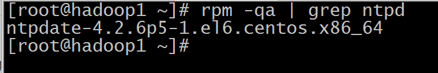

```
如果没有查询到任何的东西, 表示没有安装, 可以通过在线进行安装:
	yum -y install ntpd
启动ntpd的服务:
	service  ntpd  start
设置ntpd的服务开机启动:
	chkconfig ntpd on
```

- 2) 编辑/etc/ntp.conf

【编辑第一台机器的/etc/ntp.conf】

```
vim /etc/ntp.conf

# 在文件中添加如下内容
	restrict  192.168.52.0  mask  255.255.255.0  nomodify  notrap
# 注释一下四行内容
    #server  0.centos.pool.ntp.org
    #server  1.centos.pool.ntp.org
    #server  2.centos.pool.ntp.org
    #server  3.centos.pool.ntp.org
# 去掉以下内容的注释，如果没有这两行注释，那就自己添加上
    server   127.127.1.0  #  local  clock
    fudge    127.127.1.0  stratum  10
```

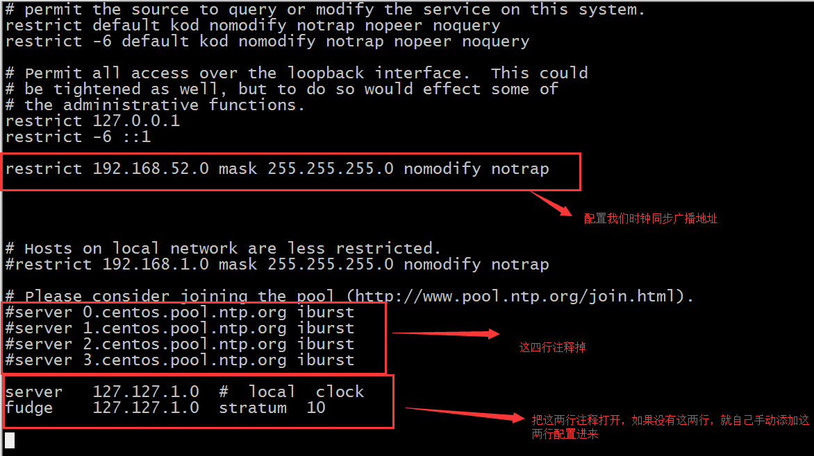

```
配置以下内容，保证BIOS与系统时间同步 :
	vim  /etc/sysconfig/ntpd
添加一行内容
	SYNC_HWLOCK=yes
```

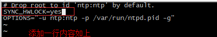

- 3) 另外两台机器与第一台机器时间同步

```
另二台执行 :  crontab  -e
添加一下内容: 
	*/1 * * * * /usr/sbin/ntpdate 192.168.52.100
```

### 4.8 三台服务器安装jdk1.8

- 1) 查看自带的openjdk

```
rpm -qa | grep java
```

- 2) 卸载系统自带的openjdk

```
rpm -e java-1.6.0-openjdk-1.6.0.41-1.13.13.1.el6_8.x86_64 tzdata-java-2016j-1.el6.noarch java-1.7.0-openjdk-1.7.0.131-2.6.9.0.el6_8.x86_64 --nodeps
```

- 3) 上传jdk并解压然后配置环境变量
  - 说明：为了保持我们的安装环境统一和一致，我们这里创建两个约定俗称的文件夹，来进行我们的软件包的存放和软件的安装
    - 所有软件的安装路径 :mkdir -p /export/servers
    - 所有软件压缩包的存放路径 : mkdir -p /export/softwares
  - 上传jdk到/export/softwares路径下去，并解压

```
tar -zxvf jdk-8u141-linux-x64.tar.gz -C ../servers/
```

- 4) 配置环境变量

```
vim /etc/profile
export JAVA_HOME=/export/servers/jdk1.8.0_141
export PATH=:JAVA_HOME/bin:PATH
```

修改完成之后记得  source /etc/profile生效