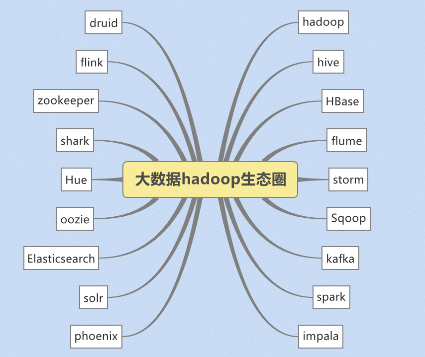
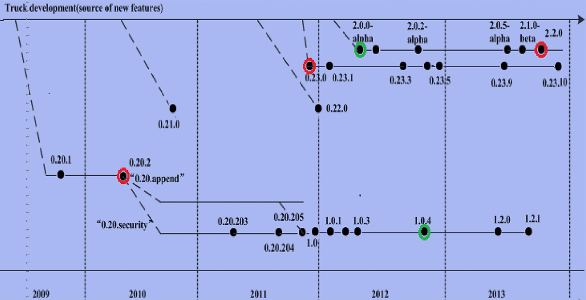
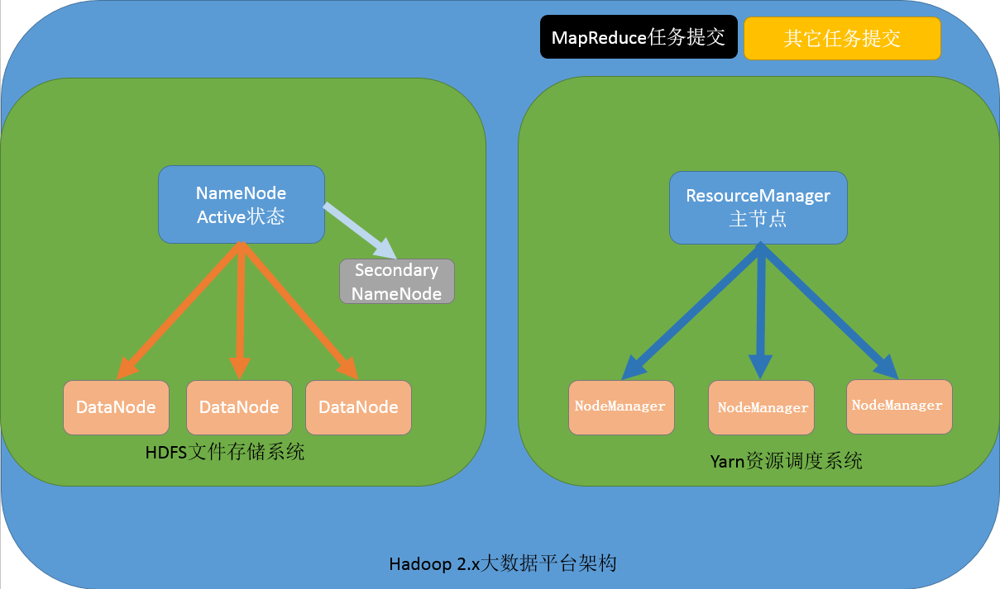
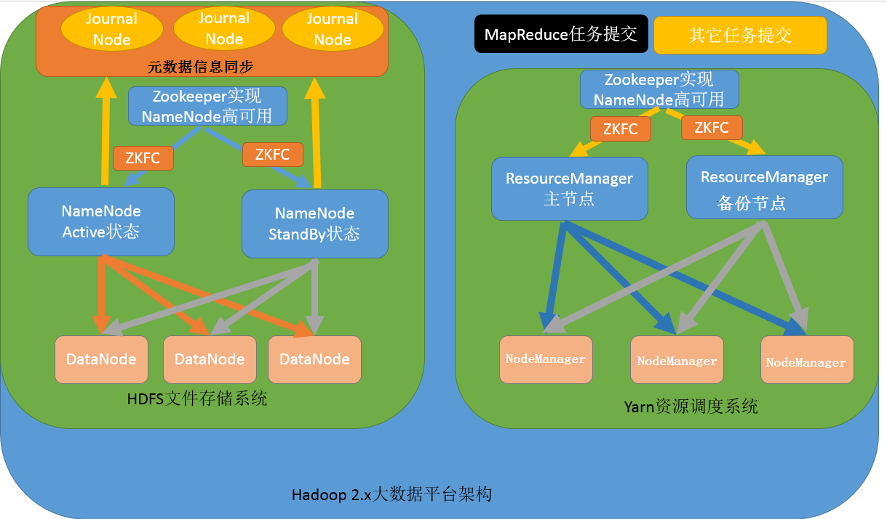
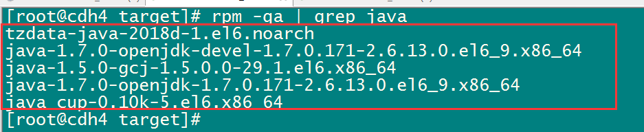
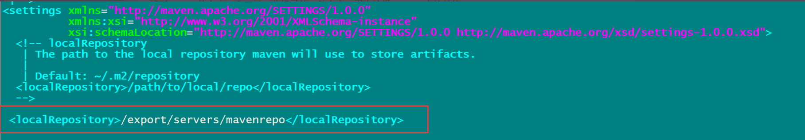
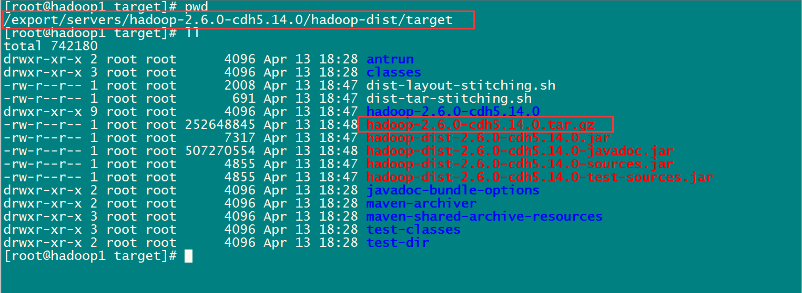

# hadoop集群搭建

## 1. hadoop概念及其发展

​	Hadoop最早起源于Nutch。Nutch的设计目标是构建一个大型的全网搜索引擎，包括网页抓取、索引、查询等功能，但随																																																																						着抓取网页数量的增加，遇到了严重的可扩展性问题——如何解决数十亿网页的存储和索引问题。

2003年、2004年谷歌发表的两篇论文为该问题提供了可行的解决方案。

* 分布式文件系统（GFS），可用于处理海量网页的存储
* 分布式计算框架MAPREDUCE，可用于处理海量网页的索引计算问题。

​	Nutch的开发人员完成了相应的开源实现HDFS和MAPREDUCE，并从Nutch中剥离成为独立项目HADOOP，到2008年1月，HADOOP成为Apache顶级项目(同年，cloudera公司成立)，迎来了它的快速发展期。

狭义上来说，hadoop就是单独指代hadoop这个软件，
广义上来说，hadoop指代大数据的一个生态圈，包括很多其他的软件



## 2. hadoop的历史版本介绍

0.x系列版本：hadoop当中最早的一个开源版本，在此基础上演变而来的1.x以及2.x的版本

1.x版本系列：hadoop版本当中的第二代开源版本，主要修复0.x版本的一些bug等,是0.20.x发行版的延续

2.x版本系列：架构产生重大变化，引入了yarn平台等许多新特性,是0.23.x发行版的延续



## 3. hadoop三大公司发型版本介绍

### 3.1 免费开源版本apache

<http://hadoop.apache.org/>

优点：拥有全世界的开源贡献者，代码更新迭代版本比较快，

缺点：版本的升级，版本的维护，版本的兼容性，版本的补丁都可能考虑不太周到，学习可以用，实际生产工作环境尽量不要使用

apache所有软件的下载地址（包括各种历史版本）：

http://archive.apache.org/dist/

### 3.2 免费开源hortonWorks

<https://hortonworks.com/>

​	hortonworks主要是雅虎主导Hadoop开发的副总裁，带领二十几个核心成员成立Hortonworks，核心产品软件HDP（ambari），HDF免费开源，并且提供一整套的web管理界面，供我们可以通过web界面管理我们的集群状态，web管理界面软件HDF网址（<http://ambari.apache.org/>）

### 3.3 软件收费版本ClouderaManager

<https://www.cloudera.com/>

​	cloudera主要是美国一家大数据公司在apache开源hadoop的版本上，通过自己公司内部的各种补丁，实现版本之间的稳定运行，大数据生态圈的各个版本的软件都提供了对应的版本，解决了版本的升级困难，版本兼容性等各种问题，**生产环境强烈推荐使用**

## 4. hadoop的模块组成


​	1）Hadoop HDFS：一个高可靠、高吞吐量的分布式文件系统。

​	2）Hadoop MapReduce：一个分布式的离线并行计算框架。

​	3）Hadoop YARN：作业调度与集群资源管理的框架。

​	4）Hadoop Common：支持其他模块的工具模块。


## 5. hadoop的架构模型

### 5.1 1.x的版本架构模型介绍


文件系统核心模块：

​	NameNode：集群当中的主节点，主要用于管理集群当中的各种数据

​	secondaryNameNode：主要能用于hadoop当中元数据信息的辅助管理

​	DataNode：集群当中的从节点，主要用于存储集群当中的各种数据

数据计算核心模块：

​	JobTracker：接收用户的计算请求任务，并分配任务给从节点

​	TaskTracker：负责执行主节点JobTracker分配的任务

### 5.2 2.x的版本架构模型

【NameNode与ResourceManager单节点架构模型】



文件系统核心模块：

​	NameNode：集群当中的主节点，主要用于管理集群当中的各种数据

​	secondaryNameNode：主要能用于hadoop当中元数据信息的辅助管理

​	DataNode：集群当中的从节点，主要用于存储集群当中的各种数据

数据计算核心模块：

​	ResourceManager：接收用户的计算请求任务，并负责集群的资源分配

​	NodeManager：主要用于接收applicationMaster分配的任务

​	applicationMaster: resourcemanager为每个计算任务启动一个appMaster, appMatser主要负责资源的申请, 任务的分配


​	【NameNode单节点与ResourceManager高可用架构模型】


文件系统核心模块：

​	NameNode：集群当中的主节点，主要用于管理集群当中的各种数据

​	secondaryNameNode：主要能用于hadoop当中元数据信息的辅助管理

​	DataNode：集群当中的从节点，主要用于存储集群当中的各种数据

数据计算核心模块：

​	ResourceManager：接收用户的计算请求任务，并负责集群的资源分配，以及计算任务的划分，通过zookeeper实现ResourceManager的高可用

​	NodeManager：负责执行主节点ResourceManager分配的任务


【NameNode高可用与ResourceManager单节点架构模型】


文件系统核心模块：

​	NameNode：集群当中的主节点，主要用于管理集群当中的各种数据，其中nameNode可以有两个，形成高可用状态

​	DataNode：集群当中的从节点，主要用于存储集群当中的各种数据

​	JournalNode：文件系统元数据信息管理

数据计算核心模块：

​	ResourceManager：接收用户的计算请求任务，并负责集群的资源分配，以及计算任务的划分

​	NodeManager：负责执行主节点ResourceManager分配的任务


【NameNode与ResourceManager高可用架构模型】



文件系统核心模块：

​	NameNode：集群当中的主节点，主要用于管理集群当中的各种数据，一般都是使用两个，实现HA高可用

​	JournalNode：元数据信息管理进程，一般都是奇数个

​	DataNode：从节点，用于数据的存储

数据计算核心模块：

​	ResourceManager：Yarn平台的主节点，主要用于接收各种任务，通过两个，构建成高可用

​	NodeManager：Yarn平台的从节点，主要用于处理ResourceManager分配的任务


## 6.standAlone，伪分布，分布式环境介绍

hadoop 文档

<http://hadoop.apache.org/>

Hadoop总共有三种运行方式。本地模式（Local (Standalone) Mode），伪分布式（Pseudo-Distributed Mode），分布式（Fully-Distributed Mode）

* 1) StandAlone（local mode）运行模式

```
	无需运行任何守护进程（daemon），所有程序都在单个JVM上执行。由于在本机模式下测试和调试MapReduce程序较为方便，因此，这种模式适宜用在开发阶段。	
```

* 2) 伪分布式环境运行模式

```
	如果Hadoop对应的Java进程都运行在一个物理机器上,称为伪分布运行模式，也就是说使用单台服务器来运行hadoop的所有进程，伪分布式环境通信过程与完全分布式通信过程完全相同。
```

* 3) 集群运行模式

```
	如果Hadoop对应的Java进程运行在多台物理机器上,称为集群模式.[集群就是有主有从]。这种模式适用于测试机集群，线上部署机集群等
```

## 7. CDH版本hadoop重新编译

### 7.1 为什么要重新编译

​	由于CDH的所有安装包版本都给出了对应的软件版本，一般情况下是不需要自己进行编译的，但是由于cdh给出的hadoop的安装包没有提供带C程序访问的接口，所以我们在使用本地库（本地库可以用来做压缩，以及支持C程序等等）的时候就会出问题

### 7.2 编译环境的准备

#### 7.2.1 准备linux环境

​	准备一台linux环境，内存4G或以上，硬盘40G或以上，我这里使用的是Centos6.9  64位的操作系统（注意：一定要使用64位的操作系统）

​	虚拟机联网，关闭防火墙，关闭selinux

【关闭防火墙命令】

```shell
service  iptables   stop
chkconfig   iptables  off 
```

【关闭selinux】

```shell
vim /etc/selinux/config
```


#### 7.2.2 安装jdk1.7

注意：亲测证明h[adoop-2.6.0-cdh5.14.0](http://archive.cloudera.com/cdh5/cdh/5/hadoop-2.6.0-cdh5.14.0-src.tar.gz) 这个版本的编译，只能使用jdk1.7，如果使用jdk1.8那么就会报错

* 1) 查看linux中是否自带jdk

```
rpm -qa | grep java 
```



* 2) 将查询到的jdk全部卸载掉

```
rpm -e xxxxxxx:  xxxxxx表示在上图中看到的内容
```

* 3) 上传jdk安装包(jdk1.7),并解压指定目录

```
cd /export/softwares
rz 上传
tar -zxvf jdk-7u71-linux-x64.tar.gz -C ../servers/
```

* 4) 配置环境变量

```
vim /etc/profile

export JAVA_HOME=/export/servers/jdk1.7.0_71
export PATH=:$JAVA_HOME/bin:$PATH
```

* 5) 重新加载环境变量, 生效最新的环境变量

```
source /etc/profile
```

#### 7.2.3 安装maven

​	这里使用maven3.x以上的版本应该都可以，不建议使用太高的版本，强烈建议使用3.0.5的版本即可

​	将maven的安装包上传到/export/softwares,然后解压maven的安装包到/export/servers

```
cd /export/softwares/
tar -zxvf apache-maven-3.0.5-bin.tar.gz -C ../servers/
```

【配置maven的环境变量】

```
vim /etc/profile

export MAVEN_HOME=/export/servers/apache-maven-3.0.5
#export MAVEN_OPTS="-Xms4096m –Xmx4096m"
export PATH=:$MAVEN_HOME/bin:$PATH
```


【让修改立即生效】

```
source /etc/profile
```

【解压maven的仓库，我已经下载好了的一份仓库，用来编译hadoop会比较快】

```
上传资料中 mvnrepository.tar.gz 
cd /export/softwares
rz 上传
tar -zxvf mvnrepository.tar.gz -C /export/servers/
```

【修改maven的配置文件】

```shell
cd  /export/servers/apache-maven-3.0.5/conf
vim settings.xml

1) 指定我们本地仓库存放的路径
```




```xml
2) 添加一个我们阿里云的镜像地址，会让我们下载jar包更快 
	<mirror>
      <id>alimaven</id>
      <name>aliyun maven</name>
      <url>http://maven.aliyun.com/nexus/content/groups/public/</url>
      <mirrorOf>central</mirrorOf>
    </mirror>
```


#### 7.2.4 安装findbugs

* 1) 下载 findbugs

```
cd  /export/softwares
wget --no-check-certificate https://sourceforge.net/projects/findbugs/files/findbugs/1.3.9/findbugs-1.3.9.tar.gz/download -O findbugs-1.3.9.tar.gz
```

* 2) 解压 解压findbugs

```
cd  /export/softwares
tar -zxvf findbugs-1.3.9.tar.gz -C ../servers/
```

* 3) 配置findbugs的环境变量

```
vim /etc/profile

export JAVA_HOME=/export/servers/jdk1.7.0_75
export PATH=:$JAVA_HOME/bin:$PATH

export MAVEN_HOME=/export/servers/apache-maven-3.0.5
export PATH=:$MAVEN_HOME/bin:$PATH
# 主要配置这个内容： 
export FINDBUGS_HOME=/export/servers/findbugs-1.3.9
export PATH=:$FINDBUGS_HOME/bin:$PATH
```

* 4) 让环境变量生效

```shell
source /etc/profile
```

#### 7.2.5 在线安装相关依赖

```
yum install -y autoconf automake libtool cmake
yum install -y ncurses-devel
yum install -y openssl-devel
yum install -y lzo-devel zlib-devel gcc gcc-c++
yum install -y  bzip2-devel
```

#### 7.2.6 安装protobuf

protobuf下载百度网盘地址 <https://pan.baidu.com/s/1pJlZubT>

下载之后上传到  /export/softwares 解压protobuf并进行编译

```shell
cd /export/softwares
rz 上传
tar -zxvf protobuf-2.5.0.tar.gz -C ../servers/
cd   /export/servers/protobuf-2.5.0
./configure
make && make install
```

#### 7.2.7 安装snappy

snappy下载地址： <http://code.google.com/p/snappy/>

```
cd /export/softwares/
rz 上传刚下载好的snappy
tar -zxf snappy-1.1.1.tar.gz  -C ../servers/
cd ../servers/snappy-1.1.1/
./configure
make && make install
```

#### 7.2.8 下载cdh源码准备编译

源码下载地址为： <http://archive.cloudera.com/cdh5/cdh/5/hadoop-2.6.0-cdh5.14.0-src.tar.gz>

```
下载源码进行编译
cd  /export/softwares
wget http://archive.cloudera.com/cdh5/cdh/5/hadoop-2.6.0-cdh5.14.0-src.tar.gz
tar -zxvf hadoop-2.6.0-cdh5.14.0-src.tar.gz -C ../servers/
cd  /export/servers/hadoop-2.6.0-cdh5.14.0
```

* 编译不支持snappy压缩:

```
mvn package -Pdist,native -DskipTests –Dtar   
```

* 编译支持snappy压缩:

```
mvn package -DskipTests -Pdist,native -Dtar -Drequire.snappy -e -X
```

​	编译完成之后我们需要的压缩包就在下面这个路径里面



#### 7.2.9 常见编译错误

如果编译时候出现这个错误：

An Ant BuildException has occured: exec returned: 2


这是因为tomcat的压缩包没有下载完成，需要自己下载一个对应版本的apache-tomcat-6.0.53.tar.gz的压缩包放到指定路径下面去即可

这两个路径下面需要放上这个tomcat的 压缩包


## 8 CDH的hadoop集群搭建

安装环境服务部署规划


* 第一步: 上传压缩包并解压

```shell
将我们重新编译之后支持snappy压缩的hadoop包上传到第一台服务器并解压
第一台机器执行以下命令

cd /export/softwares/
mv hadoop-2.6.0-cdh5.14.0-自己编译后的版本.tar.gz hadoop-2.6.0-cdh5.14.0.tar.gz
tar -zxvf hadoop-2.6.0-cdh5.14.0.tar.gz -C ../servers/
```

* 第二步: 查看hadoop支持的压缩方式以及本地库

```
cd /export/servers/hadoop-2.6.0-cdh5.14.0
bin/hadoop checknative
```


​	如果出现openssl为false，那么所有机器在线安装openssl即可，执行以下命令，虚拟机联网之后就可以在线进行安装了

```
yum -y install openssl-devel
```

* 第三步: 修改配置文件


【修改core-site.xml】

```xml
cd /export/servers/hadoop-2.6.0-cdh5.14.0/etc/hadoop
vim core-site.xml

<configuration>
    <!-- 指定HDFS访问的域名地址  -->
	<property>
		<name>fs.defaultFS</name>
		<value>hdfs://node01:8020</value>
	</property>
    <!-- 临时文件存储目录  -->
	<property>
		<name>hadoop.tmp.dir</name>
		<value>/export/servers/hadoop-2.6.0-cdh5.14.0/hadoopDatas/tempDatas</value>
	</property>
	<!--  缓冲区大小，实际工作中根据服务器性能动态调整 -->
	<property>
		<name>io.file.buffer.size</name>
		<value>4096</value>
	</property>

	<!--  开启hdfs的垃圾桶机制，删除掉的数据可以从垃圾桶中回收，单位分钟 -->
	<property>
		<name>fs.trash.interval</name>
		<value>10080</value>
	</property>
</configuration>
```

【修改hdfs-site.xml】

```xml
cd /export/servers/hadoop-2.6.0-cdh5.14.0/etc/hadoop
vim hdfs-site.xml

<configuration>
	<!-- NameNode存储元数据信息的路径，实际工作中，一般先确定磁盘的挂载目录，然后多个目录用，进行分割   --> 
	<!--   集群动态上下线 
	<property>
		<name>dfs.hosts</name>
		<value>/export/servers/hadoop-2.6.0-cdh5.14.0/etc/hadoop/accept_host</value>
	</property>
	
	<property>
		<name>dfs.hosts.exclude</name>
		<value>/export/servers/hadoop-2.6.0-cdh5.14.0/etc/hadoop/deny_host</value>
	</property>
	 -->
	 
	 <property>
			<name>dfs.namenode.secondary.http-address</name>
			<value>node01:50090</value>
	</property>
	<!--  hdfs的集群的web  访问地址  -->
	<property>
		<name>dfs.namenode.http-address</name>
		<value>node01:50070</value>
	</property>
	<property>
		<name>dfs.namenode.name.dir</name>
		<value>file:///export/servers/hadoop-2.6.0-cdh5.14.0/hadoopDatas/namenodeDatas</value>
	</property>
	<!--  定义dataNode数据存储的节点位置，实际工作中，一般先确定磁盘的挂载目录，然后多个目录用逗号进行分割  -->
	<property>
		<name>dfs.datanode.data.dir</name>
		<value>file:///export/servers/hadoop-2.6.0-cdh5.14.0/hadoopDatas/datanodeDatas</value>
	</property>
	  <!-- edits产生的文件存放路径 -->
	<property>
		<name>dfs.namenode.edits.dir</name>
		<value>file:///export/servers/hadoop-2.6.0-cdh5.14.0/hadoopDatas/dfs/nn/edits</value>
	</property>
    
	<property>
		<name>dfs.namenode.checkpoint.dir</name>
		<value>file:///export/servers/hadoop-2.6.0-cdh5.14.0/hadoopDatas/dfs/snn/name</value>
	</property>
	<property>
		<name>dfs.namenode.checkpoint.edits.dir</name>
		<value>file:///export/servers/hadoop-2.6.0-cdh5.14.0/hadoopDatas/dfs/nn/snn/edits</value>
	</property>
    <!-- 默认文件存储的副本数量 -->
	<property>
		<name>dfs.replication</name>
		<value>3</value>
	</property>
    <!-- 关闭hdfs的文件权限 -->
	<property>
		<name>dfs.permissions</name>
		<value>false</value>
	</property>
    <!-- 默认 文件的存储的块的大小 -->
	<property>
		<name>dfs.blocksize</name>
		<value>134217728</value>
	</property>
</configuration>
```

【修改hadoop-env.sh】

```
cd /export/servers/hadoop-2.6.0-cdh5.14.0/etc/hadoop
vim hadoop-env.sh

export JAVA_HOME=/export/servers/jdk1.8.0_141
```

【修改mapred-site.xml】

```xml
cd /export/servers/hadoop-2.6.0-cdh5.14.0/etc/hadoop
vim mapred-site.xml

<configuration>
    <!--指定运行mapreduce的环境是yarn -->
	<property>
		<name>mapreduce.framework.name</name>
		<value>yarn</value>
	</property>
	<!--开启job的小任务模式-->
	<property>
		<name>mapreduce.job.ubertask.enable</name>
		<value>true</value>
	</property>
	 <!-- MapReduce JobHistory Server IPC host:port -->
	<property>
		<name>mapreduce.jobhistory.address</name>
		<value>node01:10020</value>
	</property>
	<!-- MapReduce JobHistory Server Web UI host:port -->
	<property>
		<name>mapreduce.jobhistory.webapp.address</name>
		<value>node01:19888</value>
	</property>
</configuration>
```

【修改yarn-site.xml】

```xml
cd /export/servers/hadoop-2.6.0-cdh5.14.0/etc/hadoop
vim yarn-site.xml

<configuration>
    <!-- yarn resourcesmanager 的主机地址 -->
	<property>
		<name>yarn.resourcemanager.hostname</name>
		<value>node01</value>
	</property>
    <!-- 逗号隔开的服务列表，列表名称应该只包含a-zA-Z0-9_,不能以数字开始-->
	<property>
		<name>yarn.nodemanager.aux-services</name>
		<value>mapreduce_shuffle</value>
	</property>
	<!-- 启用日志聚合功能，应用程序完成后，收集各个节点的日志到一起便于查看 -->
	<property>
		<name>yarn.log-aggregation-enable</name>
		<value>true</value>
	</property>
    <property>
		 <name>yarn.log.server.url</name>
		 <value>http://node01:19888/jobhistory/logs</value>
</property>
    <!--多长时间将聚合删除一次日志 此处 30 day -->
	<property>
		<name>yarn.log-aggregation.retain-seconds</name>
		<value>2592000</value>
	</property>
    <!--时间在几秒钟内保留用户日志。只适用于如果日志聚合是禁用的-->
<property>
        <name>yarn.nodemanager.log.retain-seconds</name>
        <value>604800</value><!--7 day-->
</property>
    
    <!--指定文件压缩类型用于压缩汇总日志-->
    <property>
            <name>yarn.nodemanager.log-aggregation.compression-type</name>
            <value>gz</value>
    </property>
    <!-- nodemanager本地文件存储目录-->
    <property>
            <name>yarn.nodemanager.local-dirs</name>
            <value>/export/servers/hadoop-2.6.0-cdh5.14.0/hadoopDatas/yarn/local</value>
    </property>
    <!-- resourceManager  保存最大的任务完成个数 -->
    <property>
            <name>yarn.resourcemanager.max-completed-applications</name>
            <value>1000</value>
    </property>
</configuration>
```

【修改slaves文件 】

```
cd /export/servers/hadoop-2.6.0-cdh5.14.0/etc/hadoop
vim slaves

node01
node02
node03
```

* 第四步: 创建文件存放的目录

```shell
mkdir -p /export/servers/hadoop-2.6.0-cdh5.14.0/hadoopDatas/tempDatas
mkdir -p /export/servers/hadoop-2.6.0-cdh5.14.0/hadoopDatas/namenodeDatas
mkdir -p /export/servers/hadoop-2.6.0-cdh5.14.0/hadoopDatas/datanodeDatas 
mkdir -p /export/servers/hadoop-2.6.0-cdh5.14.0/hadoopDatas/dfs/nn/edits
mkdir -p /export/servers/hadoop-2.6.0-cdh5.14.0/hadoopDatas/dfs/snn/name
mkdir -p /export/servers/hadoop-2.6.0-cdh5.14.0/hadoopDatas/dfs/nn/snn/edits
```

* 第五步: 安装包的分发

```shell
cd /export/servers/
scp -r hadoop-2.6.0-cdh5.14.0/ node02:$PWD
scp -r hadoop-2.6.0-cdh5.14.0/ node03:$PWD
```

* 第六步: 配置hadoop的环境变量
  * 三台机器都要进行配置hadoop的环境变量

```
三台机器执行以下命令:

vim  /etc/profile

在文件中添加以下内容:
export HADOOP_HOME=/export/servers/hadoop-2.6.0-cdh5.14.0
export PATH=:$HADOOP_HOME/bin:$HADOOP_HOME/sbin:$PATH
```

* 第七步: 让环境变量立即生效

```
三台都需要执行:
source /etc/profile
```

* 第八步: 集群启动

```
要启动 Hadoop 集群，需要启动 HDFS 和 YARN 两个集群。 
注意：首次启动HDFS时，必须对其进行格式化操作。本质上是一些清理和准备工作，因为此时的 HDFS 在物理上还是不存在的

bin/hdfs namenode  -format或者bin/hadoop namenode –format

启动方式一: 单机节点依次启动

在主节点上使用以下命令启动 HDFS NameNode： 
	hadoop-daemon.sh start namenode 
在每个从节点上使用以下命令启动 HDFS DataNode： 
	hadoop-daemon.sh start datanode 
在主节点上使用以下命令启动 YARN ResourceManager： 
	yarn-daemon.sh  start resourcemanager 
在每个从节点上使用以下命令启动 YARN nodemanager： 
	yarn-daemon.sh start nodemanager 
	
以上脚本位于$HADOOP_PREFIX/sbin/目录下。如果想要停止某个节点上某个角色，只需要把命令中的start 改为stop 即可。

启动方式二: 脚本一键启动
	如果配置了 etc/hadoop/slaves 和 ssh 免密登录，则可以使用程序脚本启动所有Hadoop 两个集群的相关进程，在主节点所设定的机器上执行。
	
node01节点上执行以下命令:
第一台机器执行以下命令
cd /export/servers/hadoop-2.6.0-cdh5.14.0/
sbin/start-dfs.sh
sbin/start-yarn.sh
sbin/mr-jobhistory-daemon.sh start historyserver

停止集群: 一般没什么问题, 不要停止集群
sbin/stop-dfs.sh
sbin/stop-yarn.sh
sbin/mr-jobhistory-daemon.sh stop historyserver
```

* 第九步: 浏览器查看启动页面

```
hdfs集群访问地址
	http://192.168.52.100:50070/dfshealth.html#tab-overview  
yarn集群访问地址
	http://192.168.52.100:8088/cluster
jobhistory访问地址：
	http://192.168.52.100:19888/jobhistory
```

## 9. hadoop集群初体验

### 9.1 HDFS 使用初体验

需求: 从Linux 本地上传一个文本文件到 hdfs 的/test/input 目录下

```shell
hadoop fs -mkdir -p /test/input 
hadoop fs -put /root/install.log  /test/input 
```

### 9.2 mapreduce程序初体验

在 Hadoop 安装包的 

hadoop-2.6.0-cdh5.14.0/share/hadoop/mapreduce 下有官方自带的mapreduce 程序。我们可以使用如下的命令进行运行测试。 

示例程序jar: 

hadoop-mapreduce-examples-2.6.0-cdh5.14.0.jar

计算圆周率:

```shell
hadoop jar  /export/servers/hadoop-2.6.0-cdh5.14.0/share/hadoop/mapreduce/hadoop-mapreduce-examples-2.6.0-cdh5.14.0.jar  pi  2 5
```

​	关于圆周率的估算，感兴趣的可以查询资料 Monte Carlo 方法来计算 Pi 值。

## 10. MapReduce的jobHistory介绍

​	我们可以通过hadoop  jar的命令来实现我们的程序jar包的运行，关于运行的日志，我们一般都需要通过启动一个服务来进行查看，就是我们的JobHistoryServer，我们可以启动一个进程，专门用于查看我们的任务提交的日志

* 1) node01修改mapred-site.xml

  node01服务器修改mapred-site.xml，添加以下配置（之前已经添加过这两个配置，不用添加了）

```xml
cd /export/servers/hadoop-2.6.0-cdh5.14.0/etc/hadoop
vim mapred-site.xml

添加以下内容: 
	<!--MapReduce在执行过程中需要将日志发送到那个节点下-->
	<property>
		<name>mapreduce.jobhistory.address</name>
		<value>node01:10020</value>
	</property>
	<!-- 查看日志文件的ip和端口号  -->
	<property>
		<name>mapreduce.jobhistory.webapp.address</name>
		<value>node01:19888</value>
	</property>
```

* 2) node01修改yarn-site.xml

  node01服务器修改yarn-site.xml，添加以下配置（配置已经存在，不用修改了）

```xml
cd /export/servers/hadoop-2.6.0-cdh5.14.0/etc/hadoop
vim yarn-site.xml

<!--开启日志的聚合功能; 必须为true, 否则jobHistory无法使用-->
<property>
	<name>yarn.log-aggregation-enable</name>
	<value>true</value>
</property>
<!-- 单位为秒  30天-->
<property>
	<name>yarn.log-aggregation.retain-seconds</name>
	<value>2592000</value>
</property>

<!--指定文件压缩类型用于压缩汇总日志-->
<property>
        <name>yarn.nodemanager.log-aggregation.compression-type</name>
        <value>gz</value>
</property>
<!-- nodemanager本地文件存储目录-->
<property>
        <name>yarn.nodemanager.local-dirs</name>
        <value>/export/servers/hadoop-2.6.0-cdh5.14.0/hadoopDatas/yarn/local</value>
</property>
<!-- resourceManager  保存最大的任务完成个数 -->
<property>
        <name>yarn.resourcemanager.max-completed-applications</name>
        <value>1000</value>
</property>
```

* 3) 修改后的文件分发到其他机器上面去

  将node01修改后的mapred-site.xml和yarn-site.xml分发到其他机器上面去node01执行以下命令（三台机器都配置过了，不用发送了）

```shell
cd /export/servers/hadoop-2.6.0-cdh5.14.0/etc/hadoop
scp mapred-site.xml  yarn-site.xml node02:$PWD
scp mapred-site.xml  yarn-site.xml node03:$PWD
```

* 4) 重启yarn集群以及jobHistoryServer服务进程

  node01执行以下命令重启yarn集群（没有修改配置文件，就不用重启了）

```shell
重启yarn集群
cd /export/servers/hadoop-2.6.0-cdh5.14.0/
sbin/stop-yarn.sh
sbin/start-yarn.sh

重启jobhistoryserver

sbin/mr-jobhistory-daemon.sh start historyserver
```

* 5) 页面访问jobhistoryserver

  http://node01:19888/jobhistory


  【更多关于日志收集的配置项详解】

```properties
yarn.log-aggregation-enable      true        执行结束后收集各个container本地的日志
yarn.log-aggregation.retain-seconds  2592000    收集的日志的保留时间，以秒为单位，到时后被删除，保留30天后删除
yarn.log.server.url   http://hostname:19888/jobhistory/logs   log server的地址
yarn.nodemanager.local-dirs   /hadoop/yarn/local  存放application执行本地文件的根目录，执行完毕后删除，按用户名存储
yarn.nodemanager.log-dirs  /hadoop/yarn/log 存放application本地执行日志的根目录，执行完毕后删除，按用户名存储
yarn.nodemanager.log.retain-second 604800  日志的保留时间,log aggregation没有enable时，有效
yarn.nodemanager.remote-app-log-dir  /app-logs  聚合日志后在hdfs的存放地址
yarn.nodemanager.remote-app-log-dir-suffix  logs   集合日志后的存放地址由 ${remote-app-log-dir}/${user}/{thisParam}构成
yarn.nodemanager.delete.debug-delay-sec 600  application执行结束后延迟10min删除本地文件及日志
```

## 11. HDFS的垃圾桶机制

​	每一个文件系统都会有垃圾桶机制，便于我们将删除的数据回收到垃圾桶里面去，避免垃圾桶，避免我们某些误操作错误的删除一些重要文件，回收到垃圾桶里里面的资料数据，都可以进行恢复

### 11.1 垃圾桶机制配置的详解

​	三台服务器修改core-site.xml添加以下这两个配置

````xml
<property>
     <name>fs.trash.interval</name>
     <value>10080</value>
     <description>检查点被删除后的分钟数。 如果为零，垃圾桶功能将被禁用。 
     该选项可以在服务器和客户端上配置。 如果垃圾箱被禁用服务器端，则检查客户端配置。 
     如果在服务器端启用垃圾箱，则会使用服务器上配置的值，并忽略客户端配置值。</description>
</property>
<property>
     <name>fs.trash.checkpoint.interval</name>
     <value>0</value>
     <description>垃圾检查点之间的分钟数。 应该小于或等于fs.trash.interval。 
     如果为零，则将该值设置为fs.trash.interval的值。 每次检查指针运行时，
     它都会从当前创建一个新的检查点，并删除比fs.trash.interval更早创建的检查点。</description>
</property>
````

### 11.2 垃圾桶机制验证

​	如果启用垃圾箱配置，dfs命令删除的文件不会立即从HDFS中删除。相反，HDFS将其移动到垃圾目录（每个用户在/user/\<username>/.Trash下都有自己的垃圾目录）。只要文件保留在垃圾箱中，文件可以快速恢复。

​	最近删除的文件移动到当前的垃圾目录（/user/\<username>/.Trash/Current），并且在一个可配置的时间间隔内，HDFS创建检查点（在/ user / \<username> /.Trash / \<date>下）查找当前垃圾目录中的文件，并在旧的检查点过期时删除它们。查看关于垃圾检查点的FS shell的删除命令。

​	在垃圾桶里过期后，NameNode将从HDFS命名空间中删除该文件。删除文件会导致与文件关联的块被释放。请注意，用户删除文件的时间与HDFS中相应增加可用空间的时间之间可能存在明显的时间延迟。

********************

​	以下是一个将显示FS Shell如何从HDFS中删除文件的示例。我们在目录delete下创建了2个文件（test1＆test2）

* 1) 创建两个文件夹

```shell
[root@node01 bin]$ hdfs dfs  -mkdir -p delete/test1
[root@node01 bin]$ hdfs dfs  -mkdir -p delete/test2
[root@node01 bin]$ hdfs dfs  -ls delete
Found 2 items
drwxr-xr-x   - root supergroup          0 2018-03-03 13:45 delete/test1
drwxr-xr-x   - root supergroup          0 2018-03-03 13:45 delete/test2
```

* 2) 删除其中的一个文件夹

  我们将删除文件test1。下面的注释显示该文件已被移至垃圾箱目录

```shell
[root@node01 bin]$ hdfs dfs  -rm -r delete/test1
18/03/03 13:46:03 INFO fs.TrashPolicyDefault: Namenode trash configuration: Deletion interval = 10 minutes, Emptier interval = 0 minutes.
18/03/03 13:46:03 INFO fs.TrashPolicyDefault: Moved: 'hdfs://localhost:9000/user/root/delete/test1' to trash at: hdfs://localhost:9000/user/root/.Trash/Current/user/root/delete/test1
Moved: 'hdfs://localhost:9000/user/root/delete/test1' to trash at: hdfs://localhost:9000/user/root/.Trash/Current
```

* 3) 跳过垃圾桶选项 :慎用

  现在我们将使用skipTrash选项删除文件，该选项不会将文件发送到垃圾箱。它将从HDFS中完全删除。

```shell
[root@node01 bin]$ hdfs dfs  -rm -r -skipTrash delete/test2
Deleted delete/test2
```

​	我们现在可以看到垃圾目录仅包含文件test1。

```shell
[root@node01 bin]$ hdfs dfs  -ls .Trash/Current/user/root/delete/
Found 1 items
drwxr-xr-x   - root supergroup          0 2018-03-03 13:45 .Trash/Current/user/root/delete/test1
```

​	所以文件test1进入垃圾箱，文件test2被永久删除。

* 4) 恢复垃圾桶数据

  执行以下命令，重新恢复垃圾桶数据

```shell
hdfs dfs -mv /user/root/.Trash/Current/user/root/delete/test1 /user/root/delete/ 
```


 