# hadoop

## 1.自定义GroupingComparator求取topN

​	GroupingComparator是mapreduce当中reduce端的一个功能组件，主要的作用是决定哪些数据作为一组，调用一次reduce的逻辑，默认是每个不同的key，作为多个不同的组，每个组调用一次reduce逻辑，我们可以自定义GroupingComparator实现不同的key作为同一个组，调用一次reduce逻辑

### 1.1 需求分析

​	有如下订单数据

| 订单id        | 商品id | 成交金额 |
| ------------- | ------ | -------- |
| Order_0000001 | Pdt_01 | 222.8    |
| Order_0000001 | Pdt_05 | 25.8     |
| Order_0000002 | Pdt_03 | 522.8    |
| Order_0000002 | Pdt_04 | 122.4    |
| Order_0000002 | Pdt_05 | 722.4    |
| Order_0000003 | Pdt_01 | 222.8    |

​	现在需要求出每一个订单中成交金额最大的一笔交易

* 1)  利用“订单id和成交金额”作为key，可以将map阶段读取到的所有订单数据按照id分区，按照金额排序，发送到reduce

* 2) 在reduce端利用groupingcomparator将订单id相同的kv聚合成组，然后取第一个即是最大值

### 1.2 代码实现

* 1) 定义orderBean

  ​	定义一个OrderBean，里面定义两个字段，第一个字段是我们的orderId，第二个字段是我们的金额（注意金额一定要使用Double或者DoubleWritable类型，否则没法按照金额顺序排序）

```java
public class OrderBean implements WritableComparable<OrderBean> {
    private String orderId;
    private Double price;
    @Override
    public int compareTo(OrderBean o) {
        //比较订单id的排序顺序
        int i = this.orderId.compareTo(o.orderId);
        if(i==0){
          //如果订单id相同，则比较金额，金额大的排在前面
           i = - this.price.compareTo(o.price);
        }
        return i;
    }
    @Override
    public void write(DataOutput out) throws IOException {
            out.writeUTF(orderId);
            out.writeDouble(price);
    }
    @Override
    public void readFields(DataInput in) throws IOException {
        this.orderId =  in.readUTF();
        this.price = in.readDouble();
    }
    public OrderBean() {
    }
    public OrderBean(String orderId, Double price) {
        this.orderId = orderId;
        this.price = price;
    }
    public String getOrderId() {
        return orderId;
    }
    public void setOrderId(String orderId) {
        this.orderId = orderId;
    }
    public Double getPrice() {
        return price;
    }
    public void setPrice(Double price) {
        this.price = price;
    }
    @Override
    public String toString() {
        return  orderId +"\t"+price;
    }
}
```

* 2) 自定义分区:

  自定义分区，按照订单id进行分区，把所有订单id相同的数据，都发送到同一个reduce中去

```java
public class OrderPartition extends Partitioner<OrderBean,NullWritable> {
    @Override
    public int getPartition(OrderBean orderBean, NullWritable nullWritable, int i) {
        //自定义分区，将相同订单id的数据发送到同一个reduce里面去
        return  (orderBean.getOrderId().hashCode() & Integer.MAX_VALUE)%i;
    }
}
```

* 3) 自定义groupingComparator

  ​	按照我们自己的逻辑进行分组，通过比较相同的订单id，将相同的订单id放到一个组里面去，进过分组之后当中的数据，已经全部是排好序的数据，我们只需要取前topN即可

```java
public class MyGroupIngCompactor extends WritableComparator {
    //将我们自定义的OrderBean注册到我们自定义的MyGroupIngCompactor当中来
    //表示我们的分组器在分组的时候，对OrderBean这一种类型的数据进行分组
    //传入作为key的bean的class类型，以及制定需要让框架做反射获取实例对象
    public MyGroupIngCompactor() {
        super(OrderBean.class,true);
    }
    @Override
    public int compare(WritableComparable a, WritableComparable b) {
        OrderBean first = (OrderBean) a;
        OrderBean second = (OrderBean) b;
        return first.getOrderId().compareTo(second.getOrderId());
    }
}
```

* 4)  程序main函数入口

```java
public class GroupingCompactorMain extends Configured implements Tool {
    @Override
    public int run(String[] args) throws Exception {
        Job job = Job.getInstance(super.getConf(), GroupingCompactorMain.class.getSimpleName());
        job.setInputFormatClass(TextInputFormat.class);
        TextInputFormat.addInputPath(job,new Path("file:///F:\\传智播客大数据离线阶段课程资料\\5、大数据离线第五天\\自定义groupingComparator\\input"));
        job.setMapperClass(MyGroupingMapper.class);
        job.setMapOutputKeyClass(OrderBean.class);
        job.setMapOutputValueClass(NullWritable.class);
        job.setPartitionerClass(OrderPartition.class);
        job.setGroupingComparatorClass(MyGroupIngCompactor.class);
        job.setReducerClass(MyGroupingReducer.class);
        job.setOutputKeyClass(OrderBean.class);
        job.setOutputValueClass(NullWritable.class);
        job.setNumReduceTasks(2);
        job.setOutputFormatClass(TextOutputFormat.class);
        TextOutputFormat.setOutputPath(job,new Path("file:///F:\\传智播客大数据离线阶段课程资料\\5、大数据离线第五天\\自定义groupingComparator\\output"));
        boolean b = job.waitForCompletion(true);
        return b?0:1;
    }
    public static class MyGroupingMapper extends Mapper<LongWritable,Text,OrderBean,NullWritable>{

        @Override
        protected void map(LongWritable key, Text value, Context context) throws IOException, InterruptedException {
            String[] split = value.toString().split("\t");
            OrderBean orderBean = new OrderBean(split[0], Double.valueOf(split[2]));
            context.write(orderBean,NullWritable.get());
        }
    }
    public static class MyGroupingReducer extends Reducer<OrderBean,NullWritable,OrderBean,NullWritable>{
        @Override
        protected void reduce(OrderBean key, Iterable<NullWritable> values, Context context) throws IOException, InterruptedException {
            context.write(key,NullWritable.get());
        }
    }
    public static void main(String[] args) throws Exception {
        ToolRunner.run(new Configuration(),new GroupingCompactorMain(),args);
    }
}
```


## 2. MapReduce的多job串联

​	一个稍复杂点的处理逻辑往往需要多个mapreduce程序串联处理，多job的串联可以借助mapreduce框架的JobControl实现

【实例代码】

```java
    	ControlledJob cJob1 = new ControlledJob(job1.getConfiguration());
        ControlledJob cJob2 = new ControlledJob(job2.getConfiguration());
        ControlledJob cJob3 = new ControlledJob(job3.getConfiguration());
        cJob1.setJob(job1);
        cJob2.setJob(job2);
        cJob3.setJob(job3);
        // 设置作业依赖关系
        cJob2.addDependingJob(cJob1);
        cJob3.addDependingJob(cJob2);
        JobControl jobControl = new JobControl("RecommendationJob");
        jobControl.addJob(cJob1);
        jobControl.addJob(cJob2);
        jobControl.addJob(cJob3);
        // 新建一个线程来运行已加入JobControl中的作业，开始进程并等待结束
        Thread jobControlThread = new Thread(jobControl);
        jobControlThread.start();
        while (!jobControl.allFinished()) {
            Thread.sleep(500);
        }
        jobControl.stop();
 
        return 0;
```

​	azkaban  oozie   任务调度框架

## 3. MapReduce参数优化

​	MapReduce重要配置参数

### 3.1 资源相关的参数

以下调整参数都在mapred-site.xml这个配置文件当中有

​	注意:  以下参数是在用户自己的mr应用程序中配置就可以生效

```
1) mapreduce.map.memory.mb: 一个Map Task可使用的资源上限（单位:MB），默认为1024。如果Map Task实际使用的资源量超过该值，则会被强制杀死。

2) mapreduce.reduce.memory.mb: 一个Reduce Task可使用的资源上限（单位:MB），默认为1024。如果Reduce Task实际使用的资源量超过该值，则会被强制杀死。

3) mapred.child.java.opts  配置每个map或者reduce使用的内存的大小，默认是200M

4) mapreduce.map.cpu.vcores: 每个Map task可使用的最多cpu core数目, 默认值: 1

5) mapreduce.reduce.cpu.vcores: 每个Reduce task可使用的最多cpu core数目, 默认值: 1
```

shuffle性能优化的关键参数，应在yarn启动之前就配置好

```
1) mapreduce.task.io.sort.mb   100         //shuffle的环形缓冲区大小，默认100m

2) mapreduce.map.sort.spill.percent   0.8    //环形缓冲区溢出的阈值，默认80%
```

应该在yarn启动之前就配置在服务器的配置文件中才能生效

​	以下配置都在yarn-site.xml配置文件当中配置

```
1) yarn.scheduler.minimum-allocation-mb	  1024   给应用程序container分配的最小内存

2) yarn.scheduler.maximum-allocation-mb	  8192	给应用程序container分配的最大内存

3) yarn.scheduler.minimum-allocation-vcores	1	container最小的虚拟内核的个数

4) yarn.scheduler.maximum-allocation-vcores	32 container最大的虚拟内核的个数

5) yarn.nodemanager.resource.memory-mb   8192  每个nodemanager给多少内存
```

### 3.2 容错相关参数

* 1) mapreduce.map.maxattempts: 每个Map Task最大重试次数，一旦重试参数超过该值，则认为Map Task运行失败，默认值：4。

* 2) mapreduce.reduce.maxattempts: 每个Reduce Task最大重试次数，一旦重试参数超过该值，则认为Map Task运行失败，默认值：4。

* 3) mapreduce.job.maxtaskfailures.per.tracker: 当失败的Map Task失败比例超过该值为，整个作业则失败，默认值为0. 如果你的应用程序允许丢弃部分输入数据，则该该值设为一个大于0的值，比如5，表示如果有低于5%的Map Task失败（如果一个Map Task重试次数超过mapreduce.map.maxattempts，则认为这个Map Task失败，其对应的输入数据将不会产生任何结果），整个作业仍认为成功。

* 4) mapreduce.task.timeout: Task超时时间，默认值为600000毫秒，经常需要设置的一个参数，该参数表达的意思为：如果一个task在一定时间内没有任何进入，即不会读取新的数据，也没有输出数据，则认为该task处于block状态，可能是卡住了，也许永远会卡主，为了防止因为用户程序永远block住不退出，则强制设置了一个该超时时间（单位毫秒）。如果你的程序对每条输入数据的处理时间过长（比如会访问数据库，通过网络拉取数据等），建议将该参数调大，该参数过小常出现的错误提示是“AttemptID:attempt_14267829456721_123456_m_000224_0 Timed out after 300 secsContainer killed by the ApplicationMaster.”。

### 3.3 本地运行mapreduce 作业

设置以下几个参数: file:///

​	mapreduce.framework.name=local

​	mapreduce.jobtracker.address=local

​	fs.defaultFS=local

### 3.4 效率和稳定性相关参数

* 1) mapreduce.map.speculative: 是否为Map Task打开推测执行机制，默认为true，如果为true，如果Map执行时间比较长，那么集群就会推测这个Map已经卡住了，会重新启动同样的Map进行并行的执行，哪个先执行完了，就采取哪个的结果来作为最终结果，一般直接关闭推测执行

* 2) mapreduce.reduce.speculative: 是否为Reduce Task打开推测执行机制，默认为true，如果reduce执行时间比较长，那么集群就会推测这个reduce已经卡住了，会重新启动同样的reduce进行并行的执行，哪个先执行完了，就采取哪个的结果来作为最终结果，一般直接关闭推测执行

* 3) mapreduce.input.fileinputformat.split.minsize: FileInputFormat做切片时的最小切片大小，默认为0

* 4) mapreduce.input.fileinputformat.split.maxsize:  FileInputFormat做切片时的最大切片大小（已过时的配置，2.7.5当中直接把这个配置写死了，写成了Long.maxValue的值）

  (切片的默认大小就等于blocksize，即 134217728)

## 4. yarn的架构和原理

### 4.1 yarn的基本介绍和产生背景

​	YARN是Hadoop2引入的通用的资源管理和任务调度的平台，可以在YARN上运行MapReduce、Tez、Spark等多种计算框架，只要计算框架实现了YARN所定义的接口，都可以运行在这套通用的Hadoop资源管理和任务调度平台上。

​	Hadoop 1.0是由HDFS和MapReduce V1组成的，YARN出现之前是MapReduce V1来负责资源管理和任务调度，MapReduce V1由JobTracker和TaskTracker两部分组成。

* MapReduce V1有如下缺点

```
1) 扩展性差
	在MapReduce V1中，JobTracker同时负责资源管理和任务调度，而JobTracker只有一个节点，所以JobTracker成为了制约系统性能的一个瓶颈，制约了Hadoop平台的扩展性。
2) 可靠性低
	MapReduce V1中JobTracker存在单点故障问题，所以可靠性低。
3) 资源利用率低
	MapReduce V1采用了基于槽位的资源分配模型，槽位是一种粗粒度的资源划分单位。 
		一是通常情况下为一个job分配的槽位不会被全部利用。 
		二是一个MapReduce任务的Map阶段和Reduce阶段会划分了固定的槽位，并且不可以共用，很多时候一种类型的槽位资源很紧张而另外一种类型的槽位很空闲，导致资源利用率低。
4) 不支持多种计算框架
	MapReduce V1这种资源管理和任务调度方式只适合MapReduce这种计算框架，而MapReduce这种离线计算框架很多时候不能满足应用需求。
```

* yarn的优点

```
1) 支持多种计算框架
	YARN是通用的资源管理和任务调度平台，只要实现了YARN的接口的计算框架都可以运行在YARN上
2) 资源利用率高
	 多种计算框架可以共用一套集群资源，让资源充分利用起来，提高了利用率。
3) 运维成本低
	避免一个框架一个集群的模式，YARN降低了集群的运维成本。
4) 数据可共享 : 
	共享集群模式可以让多种框架共享数据和硬件资源，减少数据移动带来的成本
```

### 4.2 hadoop 1.0 和 hadoop 2.0 的区别

* 1) 组成部分

  Hadoop1.0由HDFS和MapReduce组成，Hadoop2.0由HDFS和YARN组成。

* 2) HDFS可扩展性

  Hadoop1.0中的HDFS只有一个NameNode，制约着集群文件个数的增长，Hadoop2.0增加了HDFS联盟的架构，可以将NameNode所管理的NameSpace水平划分，增加了HDFS的可扩展性。

* 3) HDFS的可靠性

  Hadoop1.0中的HDFS只有一个NameNode，存在着单点故障的问题，Hadoop2.0提供了HA的架构，可以实现NameNode的热备份和热故障转移，提高了HDFS的可靠性。

* 4) 可支持的计算框架

  Hadoop1.0中只支持MapReduce一种计算框架，Hadoop2.0因为引入的YARN这个通用的资源管理与任务调度平台，可以支持很多计算框架了。

* 5) 资源管理和任务调度

  Hadoop1.0中资源管理和任务调度依赖于MapReduce中的JobTracker，JobTracker工作很繁重，很多时候会制约集群的性能。 

  Hadoop2.0中将资源管理任务分给了YARN的ResourceManage，将任务调度分给了YARN的ApplicationMaster。

### 4.3 yarn 集群的架构和工作原理

​	YARN的基本设计思想是将MapReduce V1中的JobTracker拆分为两个独立的服务：ResourceManager和ApplicationMaster。ResourceManager负责整个系统的资源管理和分配，ApplicationMaster负责单个应用程序的的管理。


* 1) ResourceManager

```
	RM是一个全局的资源管理器，负责整个系统的资源管理和分配，它主要由两个部分组成：调度器（Scheduler）和应用程序管理器（Application Manager）。 
	调度器根据容量、队列等限制条件，将系统中的资源分配给正在运行的应用程序，在保证容量、公平性和服务等级的前提下，优化集群资源利用率，让所有的资源都被充分利用 
	应用程序管理器负责管理整个系统中的所有的应用程序，包括应用程序的提交、与调度器协商资源以启动ApplicationMaster、监控ApplicationMaster运行状态并在失败时重启它。
```

* 2) ApplicationMaster

```
用户提交的一个应用程序会对应于一个ApplicationMaster，它的主要功能有： 
	a.与RM调度器协商以获得资源，资源以Container表示。 
	b.将得到的任务进一步分配给内部的任务。 
	c.与NM通信以启动/停止任务。 
	d.监控所有的内部任务状态，并在任务运行失败的时候重新为任务申请资源以重启任务。
```

* 3) nodeManager

```
	NodeManager是每个节点上的资源和任务管理器，一方面，它会定期地向RM汇报本节点上的资源使用情况和各个Container的运行状态；另一方面，他接收并处理来自AM的Container启动和停止请求。
```

* 4) container

```
	Container是YARN中的资源抽象，封装了各种资源。一个应用程序会分配一个Container，这个应用程序只能使用这个Container中描述的资源。 
	不同于MapReduceV1中槽位slot的资源封装，Container是一个动态资源的划分单位，更能充分利用资源。
```

### 4.4 yarn 的任务提交流程

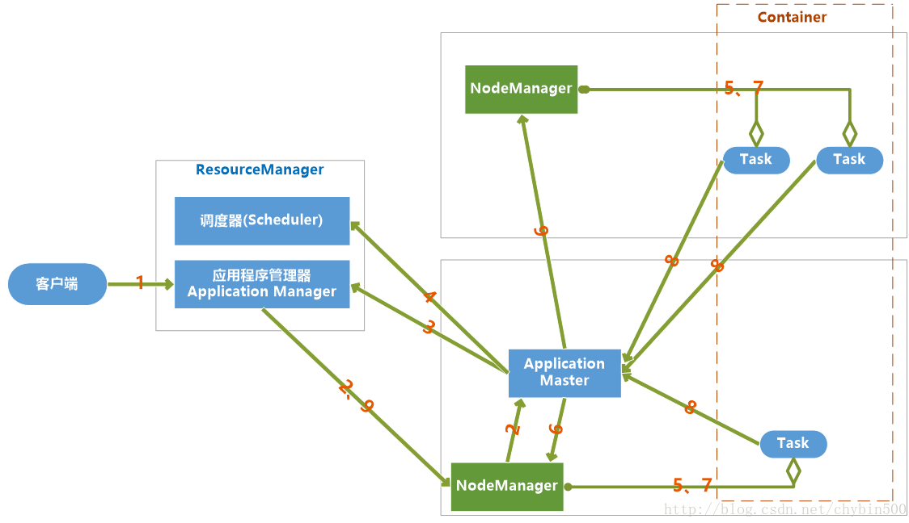


​	当jobclient向YARN提交一个应用程序后，YARN将分两个阶段运行这个应用程序：一是启动ApplicationMaster;第二个阶段是由ApplicationMaster创建应用程序，为它申请资源，监控运行直到结束。

具体步骤如下:

* 1) 用户向YARN提交一个应用程序，并指定ApplicationMaster程序、启动ApplicationMaster的命令、用户程序。

* 2) RM为这个应用程序分配第一个Container，并与之对应的NM通讯，要求它在这个Container中启动应用程序ApplicationMaster。

* 3) ApplicationMaster向RM注册，然后拆分为内部各个子任务，为各个内部任务申请资源，并监控这些任务的运行，直到结束。
* 4) AM采用轮询的方式向RM申请和领取资源。
* 5) RM为AM分配资源，以Container形式返回
* 6) AM申请到资源后，便与之对应的NM通讯，要求NM启动任务。

* 7) NodeManager为任务设置好运行环境，将任务启动命令写到一个脚本中，并通过运行这个脚本启动任务

* 8) 各个任务向AM汇报自己的状态和进度，以便当任务失败时可以重启任务。

* 9) 应用程序完成后，ApplicationMaster向ResourceManager注销并关闭自己

## 5. RM和NM的功能介绍

### 5.1 resourceManager基本介绍

​	ResourceManager负责集群中所有资源的统一管理和分配，它接收来自各个NodeManager的资源汇报信息，并把这些信息按照一定的策略分配给各个ApplicationMaster。

#### 5.1.1 RM的职能

* 1) 与客户端交互，处理客户端的请求。

* 2) 启动和管理AM，并在它运行失败时候重新启动它。

* 3) 管理NM，接收来自于NM的资源汇报信息，并向NM下达管理指令。

* 4) 资源管理和调度，接收来自于AM的资源请求，并为它分配资源。

#### 5.1.2 RM 的内部结构


* 用户交互模块:
  * 1) clientRMService : 为普通用户服务，处理请求，如：提交应用程序、终止程序、获取程序状态
  * 2) adminService : 给管理员提供的服务。普通用户交互模块是ClientRMService，管理员交互模块是AdminService，之所以要将两个模块分开，用不同的通信通道发送给ResourceManager，是因为要避免普通用户的请求过多导致管理员请求被阻塞
  * 3) WebApp :  更友好的展示集群资源和程序运行状态

* NM管理模块: 

  * 1) NMLivelinessMonitor : 监控NM是否活着，如果指定时间内未收到心跳，就从集群中移除。RM会通过心跳告诉AM某个NM上的Container失效，如果Am判断需要重新执行，则AM重新向RM申请资源。
  * 2) NodesListManager : 维护inlude（正常）和exlude（异常）的NM节点列表。默认情况下，两个列表都为空，可以由管理员添加节点。exlude列表里的NM不允许与RM进行通信。

  * 3) ResourceTrackerService : 处理来自NM的请求，包括注册和心跳。注册是NM启动时的操作，包括节点ID和可用资源上线等。心跳包括各个Container运行状态，运行Application列表、节点健康状态

* AM管理模块 : 

  * 1) AMLivelinessMonitor : 监控AM是否还活着，如果指定时间内没有接受到心跳，则将正在运行的Container置为失败状态，而AM会被重新分配到另一个节点上
  * 2) ApplicationMasterLauncher: 要求某一个NM启动ApplicationMaster，它处理创建AM的请求和kill AM的请求
  * 3) ApplicationMasterService : 处理来自AM的请求，包括注册、心跳、清理。注册是在AM启动时发送给ApplicationMasterService的；心跳是周期性的，包括请求资源的类型、待释放的Container列表；清理是程序结束后发送给RM，以回收资源清理内存空间；

* Application管理模块 : 

  * 1) ApplicationACLLsManager : 管理应用程序的访问权限，分为查看权限和修改权限。
  * 2) RMAppManager : 管理应用程序的启动和关闭
  * 3) ContainerAllocationExpirer : RM分配Container给AM后，不允许AM长时间不对Container使用，因为会降低集群的利用率，如果超时（时间可以设置）还没有在NM上启动Container，RM就强制回收Container。

* 状态机管理模块 :

  * 1) RMApp : RMApp维护一个应用程序的的整个运行周期，一个应用程序可能有多个实例，RMApp维护的是所有实例的
  * 2) RMAppAttempt : RMAppAttempt维护一个应用程序实例的一次尝试的整个生命周期
  * 3) RMContainer : RMContainer维护一个Container的整个运行周期（可能和任务的周期不一致）
  * 4) RMNode : RMNode维护一个NodeManager的生命周期，包括启动到运行结束的整个过程。

* 安全模块 :

  * RM自带了全面的权限管理机制。主要由ClientToAMSecretManager、ContainerTokenSecretManager、ApplicationTokenSecretManager等模块组成。

* 资源分配模块 ：

  * ResourceScheduler：ResourceScheduler是资源调度器，他按照一定的约束条件将资源分配给各个应用程序。RM自带了一个批处理资源调度器（FIFO）和两个多用户调度器Fair Scheduler 和Capacity Scheduler

#### 5.1.3 启动ApplicationMaster

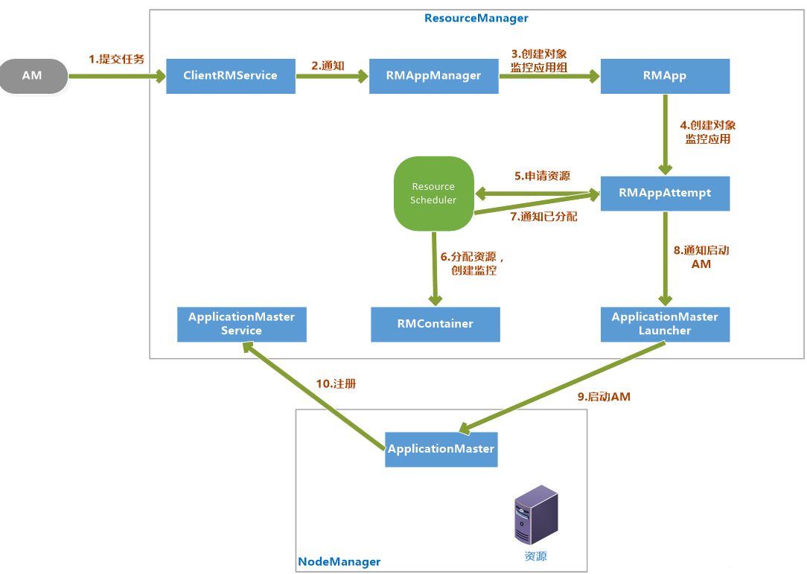

* 1) 客户端提交一个任务给RM，ClientRMService负责处理客户端请求

* 2) ClentRMService通知RMAppManager。

* 3) RMAppManager为应用程序创建一个RMApp对象来维护任务的状态。

* 4) RMApp启动任务，创建RMAppAttempt对象。

* 5) RMAppAttempt进行一些初始化工作，然后通知ResourceScheduler申请资源。

* 6) ResourceScheduler为任务分配资源后，创建一个RMContainer维护Container状态

* 7) 并通知RMAppAttempt，已经分配资源。

* 8) RMAppAttempt通知ApplicationMasterLauncher在资源上启动AM。

* 9) 在NodeManager的已分配资源上启动AM

* 10) AM启动后向ApplicationMasterService注册。

#### 5.1.4 申请和分配container

AM向RM请求资源和RM为AM分配资源是两个阶段的循环过程： 

​	阶段一：AM请求资源请求并领取资源的过程，这个过程是AM发送请求、RM记录请求。 

​	阶段二：NM向RM汇报各个Container运行状态，如果RM发现它上面有空闲的资源就分配给等待的AM。

具体过程如下：

阶段一：

* 1) AM通过RPC函数向RM发送资源需求信息，包括新的资源需求描述、待释放的Container列表、请求加入黑名单的节点列表、请求移除黑名单的节点列表等

* 2) RM的ApplicationMasterService负责处理AM的请求。一旦收到请求，就通知RMAppAttempt，更新应用程序执行进度，在AMLivenessMonitor中记录更新时间。

* 3) ApplicationMasterService调用ResourceScheduler，将AM的资源需求汇报给ResourceScheduler。

* 4) ResouceScheduler首先读取待释放的Container列表，通知RMContainer更改状态，杀死要释放的Container，然后将新的资源需求记录，如果资源足够就记录已经分配好资源。

阶段二：

* 1) NM通过RPC向RM汇报各自的各个Container的运行情况

* 2) RM的ResourceTrackerService负责处理来自NM的汇报，收到汇报后，就通知RMNode更改Container状态，并通知ResourceScheduler。

* 3) ResourceScheduler收到通知后，如果有可分配的空闲资源，就将资源分配给等待资源的AM，等待AM下次心跳将资源领取走。


#### 5.1.5 杀死 application

杀死Application流程

​	Kill Job通常是客户端发起的，RM的ClientRMService负责处理请求，接收到请求后，先检查权限，确保用户有权限Kill Job，然后通知维护这个Application的RMApp对象，根据Application当前状态调用相应的函数来处理。 

这个时候分为两种情况：Application没有在运行、Application正在运行。

* 1) Application没有在运行

  向已经运行过的NodeManger节点对应的状态维护对象RMNode发送通知，进行清理；向RMAppManager发送通知，将Application设置为已完成状态。

* 2) Application正在运行

  如果正在运行，也首先像情况一处理一遍，回收运行过的NodeManager资源，将Application设置为已完成。另外RMApp还要通知维护任务状态的RMAppAttempt对象，将已经申请和占用的资源回收，但是真正的回收是由资源调度器ResourceScheduler异步完成的。 

  异步完成的步骤是先由ApplicationMasterLauncher杀死AM，并回收它占用的资源，再由各个已经启动的RMContainer杀死Container并回收资源。

#### 5.1.6 Container超时

YARN里有两种Container：运行AM的Container和运行普通任务的Container。

* 1) RM为要启动的AM分配Container后，会监控Container的状态，如果指定时间内AM还没有在Container上启动的话，Container就会被回收，AM Container超时会导致Application执行失败。

* 2) 普通Container超时会进行资源回收，但是YARN不会自动在其他资源上重试，而是通知AM，由AM决定是否重试。

#### 5.1.7 安全管理

​	Hadoop的安全管理是为了更好地让多用户在共享Hadoop集群环境下安全高效地使用集群资源。系统安全机制由认证和授权两大部分构成，Hadoop2.0中的认证机制采用Kerberos和Token两种方案，而授权则是通过引入访问控制表（Access Control List，ACL）实现的。

* 1) 术语 

  Kerberos是一种基于第三方服务的认证协议，非常安全。特点是用户只需要输入一次身份验证信息就可以凭借此验证获得的票据访问多个服务。

  Token是一种基于共享密钥的双方身份认证机制。

  Principal是指集群中被认证或授权的主体，主要包括用户、Hadoop服务、Container、Application、Localizer、Shuffle Data等。

* 2) Hadoop认证机制

  Hadoop同时采用了Kerberos和Token两种技术，服务和服务之间的认证采用了Kerberos，用户和NameNode及用户和ResourceManager首次通讯也采用Kerberos认证，用户和服务之间一旦建立连接后，用户就可以从服务端获取一个Token，之后就可以使用Token认证通讯了。因为Token认证要比Kerberos要高效。 

  Hadoop里Kerberos认证默认是关闭的，可以通过参数hadoop.security.authentication设置为kerberos，这个配置模式是simple。

* 3) Hadoop授权机制

  Hadoop授权是通过访问控制列表（ACL）实现的，Hadoop的访问控制机制与UNIX的POSIX风格的访问控制机制是一致的，将权限授予对象分为：用户、同组用户、其他用户。默认情况下，Hadoop公用UNIX/Linux下的用户和用户组。

  队列访问控制列表

  应用程序访问控制列表

  服务访问控制列表

#### 5.1.8 RM HA 架构

​	通常来说Master/Slave架构中解决单点故障问题都采用热备份来实现HA，一个Active Master对外提供服务，若干个Standby Master实时同步Active Master，一旦Active Master故障，根据一定策略将Standby Master切换为Active Master对外提供服务。

​	ResourceManager负责整个集群的资源管理和调度，它的容错性直接导致YARN的可用性和可靠性。

​	Active Master和Standby Master之间数据同步一般采用中间共享的存储系统实现，RM HA采用Zookeeper共享存储方案。 

​	RM HA分为手动模式和自动模式，手动模式是指由管理员通过命令进行主备切换，通常用于服务升级；自动模式可以自动切换但是存在潜在危险。

RM HA 自动模式架构图如下：

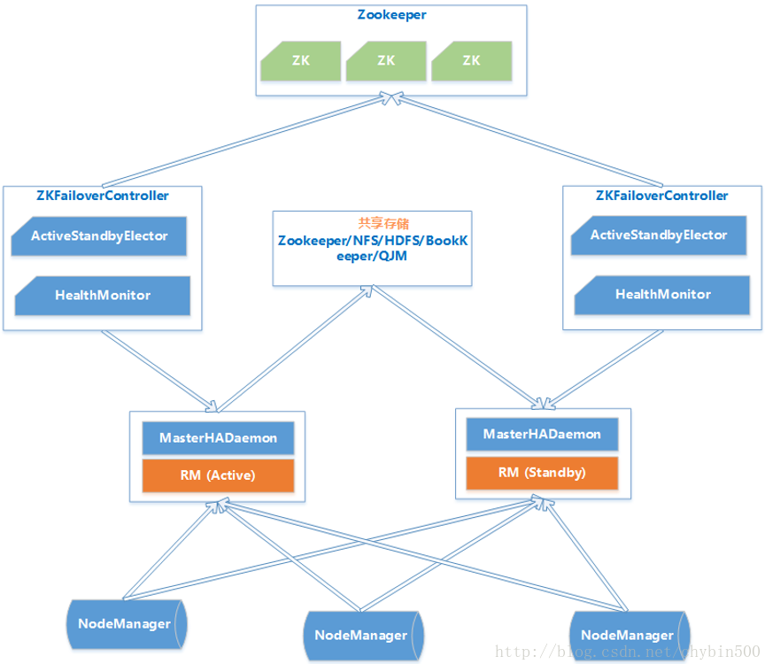

* 1) MasterHADaemon：控制RM的 Master的启动和停止，和RM运行在一个进程中，可以接收外部RPC命令。

* 2) 共享存储：Active Master将信息写入共享存储，Standby Master读取共享存储信息以保持和Active Master同步。

* 3) ZKFailoverController：基于Zookeeper实现的切换控制器，由ActiveStandbyElector和HealthMonitor组成，ActiveStandbyElector负责与Zookeeper交互，判断所管理的Master是进入Active还是Standby；HealthMonitor负责监控Master的活动健康情况，是个监视器。

* 4) Zookeeper：核心功能是维护一把全局锁控制整个集群上只有一个Active的ResourceManager。

### 5.2 nodeManager功能介绍

​	NM是单个节点上的代理，功能包括与ResourceManager保持通讯、管理Container的生命周期、监控Container的资源使用、追踪节点健康状态、管理日志。

#### 5.2.1 基本内部构造


| **模块**                                                     | 说明                                                         |
| ------------------------------------------------------------ | ------------------------------------------------------------ |
| NodeStatusUpdater                                            | NodeStatusUpdater是NM和RM通讯的唯一通道。NM启动时，该组件负责向RM注册、汇报节点总的可用资源。该组件周期性地汇报各个Container的状态，接收RM返回的待清理的Container列表等 |
| ContainerManager                                             | ContainerManager是NM最核心的模块。                           |
| RPC Server                                                   | 是AM和NM通讯的唯一通道，接收AM请求，启动或者停止Container    |
| ResourceLocalizationService                                  | 负责Container所需资源的本地化，下载文件资源，尽量分摊到各个磁盘。 |
| ContainersLauncher                                           | 维护一个线程池并行操作Container。                            |
| AuxServices                                                  | NM附属服务。                                                 |
| ContainersMonitor                                            | ContainersMonitor负责监控Container的资源使用量。             |
| LogHandler                                                   | 用户可以通过LogHandler控制Container日志保存方式。            |
| ContainerEventDispatcher                                     | Container事件调度器，负责将ContainerEvent类型的事件调度给对应的Container的状态机 |
| ApplicationEventDispatcher                                   | Application事件调度器，负责将ApplicationEvent类型的事件调度给对应 |
| ContainerExecutor                                            | ContainerExecutor可与底层操作系统交互，安全存放Container需要的文件和目录，启动和清除Container对应的进程。 |
| NodeHealthCheckerServiceNodeHealthCheckerService通过周期性运行一个脚本和写磁盘检测节点的健康状况，并通知RM。NodeHealthScriptRunner：运行脚本检测LocalDirsHandlerService：写磁盘文件检测 |                                                              |
| DeletionService                                              | NM将文件删除功能化，DeletionService异步删除文件，避免同步删除文件带来的性能开销。 |
| Security                                                     | 安全模块分为两部分：ApplicationACLManager确保访问NM的用户是合法的。ContainerTokenSecreManager确保用户请求的资源被RM授权过 |
| WebServer                                                    | Web UI向用户展示                                             |

#### 5.2.2 状态机管理

​	NodeManager维护着三类状态机，分别是Application、Container、LocalizedResource。

* 1) Application状态机

```
	RM上有一个整个集群上Application信息列表，而一个NM上也有一个处在它自己节点的Application的信息列表，NodeManager上的Application状态机维护着NodeManager上Application的状态。 
这有利于对一个NM节点上的同一个Application所有的Container进行统一管理。
```

* 2) Container状态机

```
	Container状态机维护NodeManager上所有Container的生命周期。
```

* 3) LocalizedResource状态机

```
	LocalizedResource状态是NodeManager上用于维护一个资源生命周期的数据结构。资源包括文件、JAR包等。
```

#### 5.2.3 container生命周期的管理

​	NodeManager中的ContainerManager负责接收AM发来的请求以启动Container，Container的启动过程分三个阶段：资源本地化、启动并运行Container、资源清理。

* 1) 资源本地化

  资源本地化主要是进行分布是缓存工作，分为应用程序初始化和Container本地化。

* 2) 运行Container

  Container运行是由ContainerLauncher服务完成启动后，调用ContainerExecutor来进行的。主要流程为：将待运行的Container所需要的环境变量和运行命令写到Shell脚本launch_container.sh中，并将启动该脚本的命令写入default_container_executor.sh中，然后通过运行该脚本启动container。

* 3) 资源清理

  container清理是资源本地化的逆过程，是指当container运行完成后，NodeManager来回收资源。

## 6. yarn的applicationMaster介绍

​	ApplicationMaster实际上是特定计算框架的一个实例，每种计算框架都有自己独特的ApplicationMaster，负责与ResourceManager协商资源，并和NodeManager协同来执行和监控Container。MapReduce只是可以运行在YARN上一种计算框架。

### 6.1 applicationMaster的职能

Application启动后，将负责以下任务：

* 1) 初始化向ResourceManager报告自己的活跃信息的进程  (注册)

* 2) 计算应用程序的的资源需求。 

* 3) 将需求转换为YARN调度器可以理解的ResourceRequest。 

* 4) 与调度器协商申请资源 

* 5) 与NodeManager协同合作使用分配的Container。 

* 6) 跟踪正在运行的Container状态，监控它的运行。 

* 7) 对Container或者节点失败的情况进行处理，在必要的情况下重新申请资源。

### 6.2 报告活跃

* 1) 注册

```
	ApplicationMaster执行的第一个操作就是向ResourceManager注册，注册时AM告诉RM它的IPC的地址和网页的URL。 
	IPC地址是面向客户端的服务地址；网页URL是AM的一个Web服务的地址，客户端可以通过Http获取应用程序的状态和信息。 
	注册后，RM返回AM可以使用的信息，包括：YARN接受的资源的大小范围、应用程序的ACL信息。
```

* 2) 心跳

```
	注册成功后，AM需要周期性地发送心跳到RM确认他还活着。参数yarn.am.liveness-monitor.expiry配置AM心跳最大周期，如果RM发现超过这个时间还没有收到AM的心跳，那么就判断AM已经死掉。
```

### 6.3 资源需求

​	AM所需要的资源分为静态资源和动态资源。

* 1) 静态资源

  在任务提交时就能确定，并且在AM运行时不再变化的资源是静态资源，比如MapReduce程序中的Map的数量。

* 2) 动态资源

  AM在运行时确定要请求数量的资源是动态资源。

### 6.4 调度任务

​	当AM的资源请求数量达到一定数量或者到了心跳时，AM才会发送心跳到RM，请求资源，心跳是以ResourceRequest形式发送的，包括的信息有：resourceAsks、ContainerID、containersToBeReleased。 

​	RM响应的信息包括：新分配的Container列表、已经完成了的Container状态、集群可用的资源上限。

### 6.5 启动container

* 1) AM从RM那里得到了Container后就可以启动Container了。

* 2) AM首先构造ContainerLaunchContext对象，包括分配资源的大小、安全令牌、启动Container执行的命令、进程环境、必要的文件等

* 3) AM与NM通讯，发送StartContainerRequest请求，逐一或者批量启动Container。

* 4) NM通过StartContainerResponse回应请求，包括：成功启动的Container列表、失败的Container信信息等。

* 5) 整个过程中，AM没有跟RM进行通信。

* 6) AM也可以发送StopContainerRequest请求来停止Container。

### 6.6 **完成的container**

​	当Container执行结束时，由RM通知AM Container的状态，AM解释Container状态并决定如何继续操作。所以YARN平台只是负责为计算框架提供Container信息。

### 6.7 AM的失败和恢复

​	当AM失效后，YARN只负责重新启动一个AM，任务恢复到失效前的状态是由AM自己完成的。AM为了能实现恢复任务的目标，可以采用以下方案：将任务的状态持久化到外部存储中。比如：MapReduce框架的ApplicationMaster会将已完成的任务持久化，失效后的恢复时可以将已完成的任务恢复，重新运行未完成的任务。

### 6.8 applicationMaster启动过程


## 7. yarn的资源调度

* 1) 资源调度器的职能

```
	资源调度器是YARN最核心的组件之一，是一个插拔式的服务组件，负责整个集群资源的管理和分配。YARN提供了三种可用的资源调度器：FIFO、Capacity Scheduler、Fair Scheduler。
```

* 2) 资源调度器的分类

```
	不同的任务类型对资源有着不同的负责质量要求，有的任务对时间要求不是很高(如Hive)，有的任务要求及时返还结果(如HBase)，有的任务是CPU密集型的(如过滤、统计类作业)，有的是I/O密集型的(如数据挖掘、机器学习)，所以简单的一种调度器并不能完全符合所有的任务类型。
	
有两种调度器的设计思路： 
	一是在一个物理Hadoop集群上虚拟多个Hadoop集群，这些集群各自有自己全套的Hadoop服务，典型的代表是HOD(Hadoop On Demand)调度器，Hadoop2.0中已经过时。 
	另一种是扩展YARN调度器。典型的是Capacity Scheduler、Fair Scheduler。
```

* 3) 基本架构

  【插拔式组件】

```
	YARN里的资源调度器是可插拔的，ResourceManager在初始化时根据配置创建一个调度器，可以通过参数yarn.resourcemanager.scheduler.class参数来设置调度器的主类是哪个，默认是CapacityScheduler，配置值为：org.apache.hadoop.yarn.server.resourcemanager.scheduler.capacity.CapacityScheduler。 
	所有的资源调度器都要实现接口org.apache.hadoop.yarn.server.resourcemanager.scheduler.ResourceScheduler。
```

​	【事件处理器】

```
	YARN的资源管理器实际上是一个事件处理器，它处理6个SchedulerEventType类型的事件。 
事件说明:
	Node_Removed 集群中移除一个计算节点，资源调度器需要收到该事件后从可分配的资源总量中移除相应的资源量。 
	Node_Added 集群增加一个节点 
	Application_added RM收到一个新的Application。 
	Application_Remove 表示一个Application运行结束 
	Container_expired 当一个Container分配给AM后，如果在一段时间内AM没有启动Container，就触发这个事件。调度器会对该Container进行回收。 
	Node_Update RM收到NM的心跳后，就会触发Node_Update事件。
```

### 7.1 资源调度三种模型介绍

​	究竟使用哪种调度模型，取决于这个配置项，apache版本的hadoop默认使用的是capacity  scheduler调度方式。CDH版本的默认使用的是fair scheduler调度方式 : yarn-site.xml

```
yarn.resourcemanager.scheduler.class
```

* 1) 双层资源调度模型

```
YARN使用了双层资源调度模型。 

	第一层：ResourceManager中的调度器将资源分配给各个ApplicationMaster。这一层调度由YARN的资源调度器来实现。 

	第二层：ApplicationMaster再进一步将资源分配给它内部的各个任务。这一层的调度由用户程序这个计算框架来实现。 

	YARN的资源分配过程是异步的，YARN的调度器分配给AM资源后，先将资源存入一个缓冲区内，当AM下次心跳时来领取资源。 

资源分配过程如下7个步骤：

	步骤1：NodeManager通过周期性的心跳汇报节点信息 : 告诉resourceManager当前剩余的资源信息

	步骤2：RM为NM返回一个应答，包括要释放的Container列表。 

	步骤3：RM收到NM汇报的信息后，会出发资源调度器的Node_Update事件。 

	步骤4：资源调度器收到Node_Update事件后，会按照一定的策略将该节点上资源分配给各个应用程序，并将分配结果存入一个内存数据结构中。 

	步骤5：应用程序的ApplicationMaster周期性地向RM发送心跳，以领取最新分配的Container。 

	步骤6：RM收到AM的心跳后，将分配给它的Container以心跳应答的方式返回给ApplicationMaster 

	步骤7：AM收到新分配的Container后，会将这些Container进一步分配给他的内部子任务。

```

* 2) 资源保证机制

```
	YARN采用增量资源分配机制来保证资源的分配。 
	增量资源分配机制是指当YARN暂时不能满足应用程序的资源要求时，将现有的一个节点上的资源预留，等到这个节点上累计释放的资源满足了要求，再分配给ApplicationMaster。 
	这种增量资源分配机制虽然会造成资源的浪费，但是能保证AM肯定会得到资源，不会被饿死。
```

* 3) 资源分配算法

```
	YARN的资源调度器采用了主资源公平调度算法（DRF）来支持多维度资源调度。
```

* 4) 资源抢占模型

```
	资源调度器中，每个队列可以设置一个最小资源量和最大资源量。为了提高集群使用效率，资源调度器会将负载较轻的队列资源分配给负载较重的队列使用，当负载较轻的队列突然接到了新的任务时，调度器才会将本属于该队列的资源分配给它，但是此时资源有可能正被其他队列使用，因此调度器必须等待其他队列释放资源，如果一段时间后发现资源还未得到释放，则进行资源抢占。
	
关于资源抢占的实现，涉及到一下两个问题： 
	a.如何决定是否抢占某个队列的资源 
	b. 如何使得资源抢占代价最小
	
	资源抢占是通过杀死正在使用的Container实现的，由于Container已经处于运行状态，直接杀死Container会造成已经完成的计算白白浪费，为了尽可能地避免资源浪费，YARN优先选择优先级低的Container做为资源抢占的对象，并且不会立刻杀死Container，而是将释放资源的任务留给ApplicationMaster中的应用程序，以期望他能采取一定的措施来执行释放这些Container，比如保存一些状态后退出，如果一段时间后，ApplicationMaster仍未主动杀死Container，则RM再强制杀死这些Container。
```

#### 7.1.1 层级队列管理机制FIFO调度策略

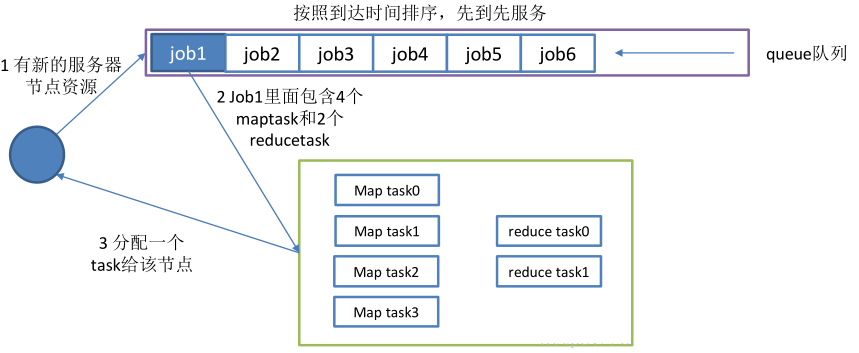

​	Hadoop1.0中使用了平级队列的组织方式，而后来采用了层级队列的组织方式。

层级队列的特点：

* 子队列

```
	队列可以嵌套，每个队列都可以包含子队列；用户只能将应用程序提交到叶子队列中。
```

* 最小容量

```
	每个子队列均有一个最小容量比属性，表示可以使用的父队列容量的百分比。 
	调度器总是优先选择当前资源使用率最低的队列，并为之分配资源。 
	指定了最小容量，但是不会保证会保持最小容量，同样会被分配给其他队列。
```

* 最大容量

```
	队列指定了最大容量，任何时候队列使用的资源都不会超过最大容量。 
	默认情况下队列的最大容量是无限大。
```

* 用户权限管理

```
	管理员可以配置每个叶子节点队列对应的操作系统的用户和用户组。
```

* 系统资源管理

```
	管理员设置了每个队列的容量，每个用户可以用资源的量，调度器根据这些配置来进行资源调度
```


队列命名规则:

​	为了防止队列名称的冲突和便于识别队列，YARN采用了自顶向下的路径命名规则，父队列和子队列名称采用.拼接。

#### 7.1.2 Capacity Scheduler

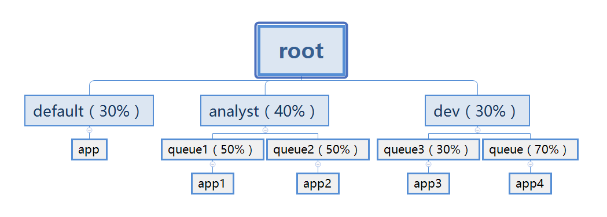

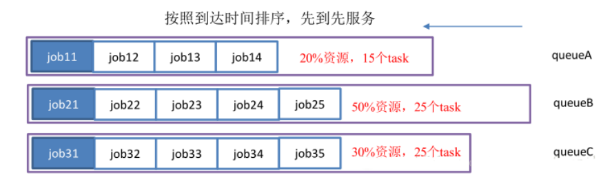

Capacity Scheduler是Yahoo!开发的多用户调度器。主要有以下几个特点：

* 容量保证

```
	管理员可以为队列设置最低保证和资源使用上限，同一个队列里的应用程序可以共享使用队列资源。
```

* 灵活性:

```
	一个队列里的资源有剩余，可以暂时共享给其他队列，一旦该队列有的新的任务，其他队列会归还资源，这样尽量地提高了集群的利用率。
```

* 多重租赁

```
	支持多用户共享集群和多应用程序同时运行
```

* 安全保证

```
	每个队列有严格的ACL列表，限制了用户的权限
```

* 动态更新配置文件

```
	管理员对参数的配置是动态的。
```


配置方案:

​	Capacity Scheduler的所有配置都在capactiy-scheduler.xml里，管理员修改后，要通过命令来刷写队列：yarn mradmin –refreshQueues 

​	Capacity Scheduler不允许管理员动态地减少队列数目，且更新的配置参数值应该是合法值。

以下以队列tongyong为例来说明参数配置：

​	【资源分配相关参数】

```xml
 <property>
    <name>yarn.scheduler.capacity.root.tongyong.capacity</name>
    <value>10</value>
    <description>队列资源容量百分比</description>
  </property>

  <property>
    <name>yarn.scheduler.capacity.root.tongyong.user-limit-factor</name>
    <value>3</value>
    <description>
     每个用户最多可以使用的资源量百分比
    </description>
  </property>

  <property>
    <name>yarn.scheduler.capacity.root.tongyong.maximum-capacity</name>
    <value>30</value>
    <description>
      队列资源的使用的最高上限，由于存在资源共享，所以队列使用的资源可能会超过capacity设置的量，但是不会超过maximum-capacity设置的量
    </description>
  </property>

  <property>                                                                         
    <name>yarn.scheduler.capacity.root.tongyong.minimum-user-limit-percent</name>   
    <value>30</value>
    <description>用户资源限制的百分比，当值为30时，如果有两个用户，每个用户不能超过50%，当有3个用户时，每个用户不能超过33%，当超过三个用户时，每个用户不能超过30%
    </description>                                                                   
 </property>
```

​	【限制应用程序数目相关参数】

```xml
<property>
        <name>yarn.scheduler.capacity.root.tongyong.maximum-applications</name>
        <value>200</value>
         <description>
           队列中同时处于等待和运行状态的应用程序的数量，如果多于这个数量的应用程序将被拒绝。
        </description>
 </property>
 <property>
        <name>yarn.scheduler.capacity.root.tongyong.maximum-am-resource-percent</name>
        <value>0.1</value>
        <description>
          集群中用于运行应用程序ApplicationMaster的资源比例上限，该参数通常用于限制处于活动状态的应用程序的数目。
       </description>
 </property>
```

​	【队列的访问和权限控制参数】

```xml
<property>
    <name>yarn.scheduler.capacity.root.tongyong.state</name>
    <value>RUNNING</value>
    <description>
      队列状态，可以为STOPPED或者为RUNNING。如果改为STOPPED，用户将不能向集群中提交作业，但是正在运行的将正常结束。
    </description>
</property>
<property>
    <name>yarn.scheduler.capacity.root.tongyong.acl_submit_applications</name>
    <value>root,tongyong,user1,user2</value>
    <description>
      限定哪些用户可以向队列里提交应用程序，该属性有继承性，子队列默认和父队列的配置是一样的。
    </description>
</property>
<property>
    <name>yarn.scheduler.capacity.root.tongyong.acl_administer_queue</name>
    <value>root,tongyong</value>
    <description>
      限定哪些用户可以管理当前队列里的应用程序。
    </description>
</property>
```

#### 7.1.3 Fair Scheduler


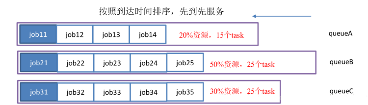

基本特点:

* 1) 资源公平共享

```
默认是Fair策略分配资源，Fair 策略是一种基于最大最小公平算法实现的，所有应用程序平分资源。
```

* 2) 支持资源抢占

```
	某个队列中有剩余资源时，调度器会将这些资源共享给其他队列，当该队列有了新的应用程序提交过来后，调度器会回收资源，调度器采用先等待再强制回收的策略。
```

* 3) 负载均衡

```
Fair Scheduler提供了一个基于任务数目的负载均衡机制，尽可能将系统中的任务均匀分布到各个节点上。
```

* 4) 调度策略配置灵活

```
可以每个队列选用不同的调度策略：FIFO、Fair、DRF
```

* 5) 提高小应用程序的响应时间

```
小作业也可以分配大资源，可以快速地运行完成
```

## 8. yarn的多租户配置实现资源隔离

​	资源隔离目前有2种，静态隔离和动态隔离。

静态隔离:

```
	所谓静态隔离是以服务隔离，是通过cgroups（LINUX control groups) 功能来支持的。比如HADOOP服务包含HDFS, HBASE, YARN等等，那么我们固定的设置比例，HDFS:20%, HBASE:40%, YARN：40%， 系统会帮我们根据整个集群的CPU，内存，IO数量来分割资源，先提一下，IO是无法分割的，所以只能说当遇到IO问题时根据比例由谁先拿到资源，CPU和内存是预先分配好的。
	上面这种按照比例固定分割就是静态分割了，仔细想想，这种做法弊端太多，假设我按照一定的比例预先分割好了，但是如果我晚上主要跑mapreduce, 白天主要是HBASE工作，这种情况怎么办？ 静态分割无法很好的支持，缺陷太大，这种模型可能不太合适。
```

动态隔离:

```
	动态隔离只要是针对 YARN以及impala, 所谓动态只是相对静态来说，其实也不是动态。 先说YARN， 在HADOOP整个环境，主要服务有哪些？ mapreduce（这里再提一下，mapreduce是应用，YARN是框架，搞清楚这个概念），HBASE, HIVE，SPARK，HDFS，IMPALA， 实际上主要的大概这些，很多人估计会表示不赞同，oozie, ES, storm , kylin，flink等等这些和YARN离的太远了，不依赖YARN的资源服务，而且这些服务都是单独部署就OK，关联性不大。 所以主要和YARN有关也就是HIVE, SPARK，Mapreduce。这几个服务也正式目前用的最多的（HBASE用的也很多，但是和YARN没啥关系）。
	根据上面的描述，大家应该能理解为什么所谓的动态隔离主要是针对YARN。好了，既然YARN占的比重这么多，那么如果能很好的对YARN进行资源隔离，那也是不错的。如果我有3个部分都需要使用HADOOP，那么我希望能根据不同部门设置资源的优先级别，实际上也是根据比例来设置，建立3个queue name, 开发部们30%，数据分析部分50%，运营部门20%。 
	设置了比例之后，再提交JOB的时候设置mapreduce.queue.name，那么JOB就会进入指定的队列里面。 非常可惜的是，如果你指定了一个不存在的队列，JOB仍然可以执行，这个是目前无解的，默认提交JOB到YARN的时候，规则是root.users.username ， 队列不存在，会自动以这种格式生成队列名称。 队列设置好之后，再通过ACL来控制谁能提交或者KIll job。
```

​	从上面2种资源隔离来看，没有哪一种做的很好，如果非要选一种，建议选取后者，隔离YARN资源， 第一种固定分割服务的方式实在支持不了现在的业务

​	需求：现在一个集群当中，可能有多个用户都需要使用，例如开发人员需要提交任务，测试人员需要提交任务，以及其他部门工作同事也需要提交任务到集群上面去，对于我们多个用户同时提交任务，我们可以通过配置yarn的多用户资源隔离来进行实现

* 1) node01编辑yarn-site.xml

```xml
<!--  指定我们的任务调度使用fairScheduler的调度方式  -->
<property>
	<name>yarn.resourcemanager.scheduler.class</name>
	<value>org.apache.hadoop.yarn.server.resourcemanager.scheduler.fair.FairScheduler</value>
</property>

<!--  指定我们的任务调度的配置文件路径  -->
<property>
	<name>yarn.scheduler.fair.allocation.file</name>
	<value>/export/servers/hadoop-2.6.0-cdh5.14.0/etc/hadoop/fair-scheduler.xml</value>
</property>

<!-- 是否启用资源抢占，如果启用，那么当该队列资源使用
yarn.scheduler.fair.preemption.cluster-utilization-threshold 这么多比例的时候，就从其他空闲队列抢占资源
  -->
<property>
	<name>yarn.scheduler.fair.preemption</name>
	<value>true</value>
</property>
<property>
	<name>yarn.scheduler.fair.preemption.cluster-utilization-threshold</name>
	<value>0.8f</value>
</property>


<!-- 默认提交到default队列  -->
<property>
	<name>yarn.scheduler.fair.user-as-default-queue</name>
	<value>true</value>
	<description>default is True</description>
</property>

<!-- 如果提交一个任务没有到任何的队列，是否允许创建一个新的队列，设置false不允许  -->
<property>
	<name>yarn.scheduler.fair.allow-undeclared-pools</name>
	<value>false</value>
	<description>default is True</description>
</property>
```

* 2) node01添加fair-scheduler.xml配置文件

```xml
<?xml version="1.0"?>
<allocations>
<!-- users max running apps  -->
<userMaxAppsDefault>30</userMaxAppsDefault>
<!-- 定义我们的队列  -->
<queue name="root">
	<minResources>512mb,4vcores</minResources>
	<maxResources>102400mb,100vcores</maxResources>
	<maxRunningApps>100</maxRunningApps>
	<weight>1.0</weight>
	<schedulingMode>fair</schedulingMode>
	<aclSubmitApps> </aclSubmitApps>
	<aclAdministerApps> </aclAdministerApps>

	<queue name="default">
		<minResources>512mb,4vcores</minResources>
		<maxResources>30720mb,30vcores</maxResources>
		<maxRunningApps>100</maxRunningApps>
		<schedulingMode>fair</schedulingMode>
		<weight>1.0</weight>
		<!--  所有的任务如果不指定任务队列，都提交到default队列里面来 -->
		<aclSubmitApps>*</aclSubmitApps>
	</queue>

<!-- 

weight
资源池权重

aclSubmitApps
允许提交任务的用户名和组；
格式为： 用户名 用户组

当有多个用户时候，格式为：用户名1,用户名2 用户名1所属组,用户名2所属组

aclAdministerApps
允许管理任务的用户名和组；

格式同上。
 -->
	<queue name="hadoop">
		<minResources>512mb,4vcores</minResources>
		<maxResources>20480mb,20vcores</maxResources>
		<maxRunningApps>100</maxRunningApps>
		<schedulingMode>fair</schedulingMode>
		<weight>2.0</weight>
		<aclSubmitApps>hadoop hadoop</aclSubmitApps>
		<aclAdministerApps>hadoop hadoop</aclAdministerApps>
	</queue>

	<queue name="develop">
		<minResources>512mb,4vcores</minResources>
		<maxResources>20480mb,20vcores</maxResources>
		<maxRunningApps>100</maxRunningApps>
		<schedulingMode>fair</schedulingMode>
		<weight>1</weight>
		<aclSubmitApps>develop develop</aclSubmitApps>
		<aclAdministerApps>develop develop</aclAdministerApps>
	</queue>

	<queue name="test1">
		<minResources>512mb,4vcores</minResources>
		<maxResources>20480mb,20vcores</maxResources>
		<maxRunningApps>100</maxRunningApps>
		<schedulingMode>fair</schedulingMode>
		<weight>1.5</weight>
		<aclSubmitApps>test1,hadoop,develop test1</aclSubmitApps>
		<aclAdministerApps>test1 group_businessC,supergroup</aclAdministerApps>
	</queue>
</queue>
</allocations>
```

* 3) 将修改后的配置文件拷贝到其他机器上

```shell
cd /export/servers/hadoop-2.6.0-cdh5.14.0/etc/hadoop
[root@node01 hadoop]# scp yarn-site.xml  fair-scheduler.xml node02:$PWD
[root@node01 hadoop]# scp yarn-site.xml  fair-scheduler.xml node03:$PWD
```

* 4) 重启yarn集群

```shell
[root@node01 hadoop]# cd /export/servers/hadoop-2.6.0-cdh5.14.0/
[root@node01 hadoop-2.6.0-cdh5.14.0]# sbin/stop-yarn.sh
[root@node01 hadoop-2.6.0-cdh5.14.0]# sbin/start-yarn.sh
```

* 5) 创建普通用户hadoop

```
useradd hadoop
passwd hadoop
```

* 6) 修改文件夹权限

  node01执行以下命令，修改hdfs上面tmp文件夹的权限，不然普通用户执行任务的时候会抛出权限不足的异常

```
groupadd supergroup
usermod -a -G supergroup hadoop
su - root -s /bin/bash -c "hdfs dfsadmin -refreshUserToGroupsMappings"
```

* 7) 使用hadoop用户提交mr任务
  * node01执行以下命令，切换到普通用户hadoop，然后使用hadoop来提交mr的任务

```shell
[root@node01 hadoop-2.6.0-cdh5.14.0]# su hadoop
[hadoop@node01 hadoop-2.6.0-cdh5.14.0]$ yarn jar /export/servers/hadoop-2.6.0-cdh5.14.0/share/hadoop/mapreduce/hadoop-mapreduce-examples-2.6.0-cdh5.14.0.jar pi 10 20
```

* 8) 浏览器界面查看任务调度队列

  <http://node01:8088/cluster/scheduler>

  浏览器界面访问，查看Scheduler，可以清晰的看到我们的任务提交到了hadoop队列里面去了

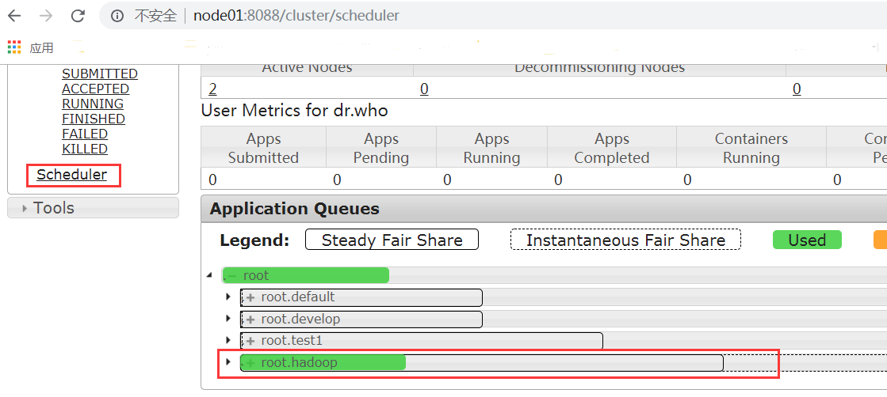

## 9. hdfs的HA以及Yarn的HA高可用

​	HA(High Available), 高可用，是保证业务连续性的有效解决方案，一般有两个或两个以上的节点，分为活动节点（Active）及备用节点（Standby）。通常把正在执行业务的称为活动节点，而作为活动节点的一个备份的则称为备用节点。当活动节点出现问题，导致正在运行的业务（任务）不能正常运行时，备用节点此时就会侦测到，并立即接续活动节点来执行业务。从而实现业务的不中断或短暂中断。

​	Hadoop1.X版本，NN是HDFS集群的单点故障点，每一个集群只有一个NN,如果这个机器或进程不可用，整个集群就无法使用。为了解决这个问题，出现了一堆针对HDFS HA的解决方案（如：Linux HA, VMware FT, shared NAS+NFS, BookKeeper, **QJM/Quorum Journal Manager**, BackupNode等）。

​	在HA具体实现方法不同情况下，HA框架的流程是一致的, 不一致的就是如何存储、管理、同步edits编辑日志文件。

​	在Active NN和Standby NN之间要有个共享的存储日志的地方，Active NN把edit Log写到这个共享的存储日志的地方，Standby NN去读取日志然后执行，这样Active和Standby NN内存中的HDFS元数据保持着同步。一旦发生主从切换Standby NN可以尽快接管Active NN的工作。

### 9.1 Namenode HA介绍

​	hadoop2.x之后，Clouera提出了QJM/Qurom Journal Manager，这是一个基于Paxos算法（分布式一致性算法）实现的HDFS HA方案，它给出了一种较好的解决思路和方案,QJM主要优势如下：

​	不需要配置额外的高共享存储，降低了复杂度和维护成本。

​	消除spof(单点故障)。

​	系统鲁棒性(Robust)的程度可配置、可扩展。


​	基本原理就是用2N+1台 JournalNode 存储EditLog，每次写数据操作有>=N+1返回成功时即认为该次写成功，数据不会丢失了。当然这个算法所能容忍的是最多有N台机器挂掉，如果多于N台挂掉，这个算法就失效了。这个原理是基于Paxos算法。

​	在HA架构里面SecondaryNameNode已经不存在了，为了保持standby NN时时的与Active NN的元数据保持一致，他们之间交互通过JournalNode进行操作同步。

​	任何修改操作在 Active NN上执行时，JournalNode进程同时也会记录修改log到至少半数以上的JN中，这时 Standby NN 监测到JN 里面的同步log发生变化了会读取 JN 里面的修改log，然后同步到自己的目录镜像树里面，如下图：

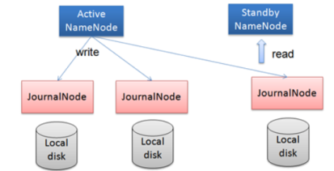

​	当发生故障时，Active的 NN 挂掉后，Standby NN 会在它成为Active NN 前，读取所有的JN里面的修改日志，这样就能高可靠的保证与挂掉的NN的目录镜像树一致，然后无缝的接替它的职责，维护来自客户端请求，从而达到一个高可用的目的。

​	在HA模式下，datanode需要确保同一时间有且只有一个NN能命令DN。为此：

​	每个NN改变状态的时候，向DN发送自己的状态和一个序列号。

​	DN在运行过程中维护此序列号，当failover时，新的NN在返回DN心跳时会返回自己的active状态和一个更大的序列号。DN接收到这个返回则认为该NN为新的active。

​	如果这时原来的active NN恢复，返回给DN的心跳信息包含active状态和原来的序列号，这时DN就会拒绝这个NN的命令。


Failover Controller :

​	HA模式下，会将FailoverController部署在每个NameNode的节点上，作为一个单独的进程用来监视NN的健康状态。**FailoverController主要包括三个组件:**

​	HealthMonitor: 监控NameNode是否处于unavailable或unhealthy状态。当前通过RPC调用NN相应的方法完成。

​	ActiveStandbyElector: 监控NN在ZK中的状态。

​	ZKFailoverController: 订阅HealthMonitor 和ActiveStandbyElector 的事件，并管理NN的状态,另外zkfc还负责解决fencing（也就是脑裂问题）。

​	上述三个组件都在跑在一个JVM中，这个JVM与NN的JVM在同一个机器上。但是两个独立的进程。一个典型的HA集群，有两个NN组成，每个NN都有自己的ZKFC进程。

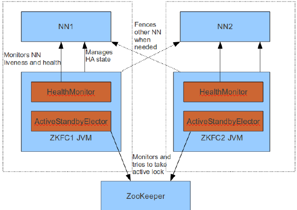

ZKFailoverController主要职责：

* **健康监测：** 

```
	周期性的向它监控的NN发送健康探测命令，从而来确定某个NameNode是否处于健康状态，如果机器宕机，心跳失败，那么zkfc就会标记它处于一个不健康的状态
```

* **会话管理：**

```
	如果NN是健康的，zkfc就会在zookeeper中保持一个打开的会话，如果NameNode同时还是Active状态的，那么zkfc还会在Zookeeper中占有一个类型为短暂类型的znode，当这个NN挂掉时，这个znode将会被删除，然后备用的NN将会得到这把锁，升级为主NN，同时标记状态为Active
```

* 当宕机的NN新启动时，它会再次注册zookeper，发现已经有znode锁了，便会自动变为Standby状态，如此往复循环，保证高可靠，需要注意，目前仅仅支持最多配置2个NN
* **master选举：**

```
	通过在zookeeper中维持一个短暂类型的znode，来实现抢占式的锁机制，从而判断那个NameNode为Active状态
```

### 9.2 Yarn HA介绍

​	Yarn作为资源管理系统，是上层计算框架（如MapReduce,Spark）的基础。在Hadoop 2.4.0版本之前，Yarn存在单点故障（即ResourceManager存在单点故障），一旦发生故障，恢复时间较长，且会导致正在运行的Application丢失，影响范围较大。从Hadoop 2.4.0版本开始，Yarn实现了ResourceManager HA，在发生故障时自动failover，大大提高了服务的可靠性。

​	ResourceManager（简写为RM）作为Yarn系统中的主控节点，负责整个系统的资源管理和调度，内部维护了各个应用程序的ApplictionMaster信息、NodeManager（简写为NM）信息、资源使用等。由于资源使用情况和NodeManager信息都可以通过NodeManager的心跳机制重新构建出来，因此只需要对ApplicationMaster相关的信息进行持久化存储即可。

​	在一个典型的HA集群中，两台独立的机器被配置成ResourceManger。在任意时间，有且只允许一个活动的ResourceManger,另外一个备用。切换分为两种方式：

​	**手动切换**：在自动恢复不可用时，管理员可用手动切换状态，或是从Active到Standby,或是从Standby到Active。

​	**自动切换**：基于Zookeeper，但是区别于HDFS的HA，2个节点间无需配置额外的ZFKC守护进程来同步数据。

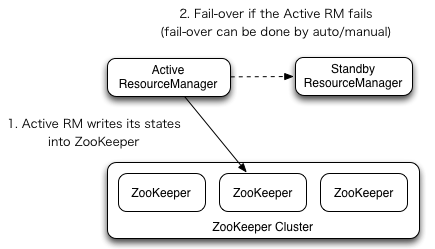

### 9.3 基于已有的集群环境构建HA环境

​	如何在已有的伪分布式的基础上面搭建HA高可用集群

​	集群服务规划：

| 机器ip          | 192.168.52.100    | 192.168.52.110    | 192.168.52.120    |
| --------------- | ----------------- | ----------------- | ----------------- |
| 主机名称        | node01.hadoop.com | node02.hadoop.com | node03.hadoop.com |
| NameNode        | 是(active)        | 是(standBy)       | 否                |
| DataNode        | 是                | 是                | 是                |
| journalNode     | 是                | 是                | 是                |
| ZKFC            | 是                | 是                | 否                |
| ResourceManager | 否                | 是（standBy）     | 是(active)        |
| NodeManager     | 是                | 是                | 是                |
| zookeeper       | 是                | 是                | 是                |
| jobHistory      |                   |                   | 是                |

* 1) 停止服务

  停止hadoop集群的所有服务，包括HDFS的服务，以及yarn集群的服务

  ```
  node01机器执行以下命令停止hadoop服务
  cd /export/servers/hadoop-2.6.0-cdh5.14.0
  sbin/stop-dfs.sh
  sbin/stop-yarn.sh
  sbin/mr-jobhistory-daemon.sh stop historyserver
  ```

* 2) 启动所有节点的zookeeper服务

  三台服务器执行以下命令启动zookeeper服务

```
cd /export/servers/zookeeper-3.4.5-cdh5.14.0
bin/zkServer.sh start
```

* 3) 更改配置文件

  所有节点修改配置文件，注意yarn-site.xml当中的

  yarn.resourcemanager.ha.id 这个属性值，node03机器与node02机器的配置值不太一样

  【node01服务器修改core-site.xml】

```xml
<property>
		<name>ha.zookeeper.quorum</name>
		<value>node01.hadoop.com:2181,node02.hadoop.com:2181,node03.hadoop.com:2181</value>
	</property>
	<!--配置namenode的命名空间-->
	<property>
		<name>fs.defaultFS</name>
		<value>hdfs://hann</value>
	</property>
	<!--  缓冲区大小，实际工作中根据服务器性能动态调整 -->
	<property>
		<name>io.file.buffer.size</name>
		<value>4096</value>
	</property>
	<!--临时文件存储的路径-->
	<property>
	<name>hadoop.tmp.dir</name>
	<value>/export/servers/hadoop-2.6.0-cdh5.14.0/hadoopDatas/tempDatas</value>
	</property>
	
	<property>
     <name>fs.trash.interval</name>
     <value>10080</value>
     <description>检查点被删除后的分钟数。 如果为零，垃圾桶功能将被禁用。 
     该选项可以在服务器和客户端上配置。 如果垃圾箱被禁用服务器端，则检查客户端配置。 
     如果在服务器端启用垃圾箱，则会使用服务器上配置的值，并忽略客户端配置值。</description>
</property>

<property>
     <name>fs.trash.checkpoint.interval</name>
     <value>0</value>
     <description>垃圾检查点之间的分钟数。 应该小于或等于fs.trash.interval。 
     如果为零，则将该值设置为fs.trash.interval的值。 每次检查指针运行时，
     它都会从当前创建一个新的检查点，并删除比fs.trash.interval更早创建的检查点。</description>
</property>
	 
	<property>
		<name>hadoop.proxyuser.root.hosts</name>
		<value>*</value>
	</property>
	<property>
		<name>hadoop.proxyuser.root.groups</name>
		<value>*</value>
	</property>
```

​	【node01服务器修改hdfs-site.xml】

​	  三台服务器首先创建文件夹  mkdir  -p  /var/run/hdfs-sockets

```xml
<!-- NameNode存储元数据信息的路径，实际工作中，一般先确定磁盘的挂载目录，然后多个目录用，进行分割   --> 
	<!--   集群动态上下线 
	<property>
		<name>dfs.hosts</name>
		<value>/export/servers/hadoop-2.7.4/etc/hadoop/accept_host</value>
	</property>
	
	<property>
		<name>dfs.hosts.exclude</name>
		<value>/export/servers/hadoop-2.7.4/etc/hadoop/deny_host</value>
	</property>
	 -->
	 
	 <!-- 
	 <property>
			<name>dfs.namenode.secondary.http-address</name>
			<value>node01:50090</value>
	</property>

	<property>
		<name>dfs.namenode.http-address</name>
		<value>node01:50070</value>
	</property>
	<property>
		<name>dfs.namenode.name.dir</name>
		<value>file:///export/servers/hadoop-2.6.0-cdh5.14.0/hadoopDatas/namenodeDatas</value>
	</property>

	<property>
		<name>dfs.datanode.data.dir</name>
		<value>file:///export/servers/hadoop-2.6.0-cdh5.14.0/hadoopDatas/datanodeDatas</value>
	</property>
	
	<property>
		<name>dfs.namenode.edits.dir</name>
		<value>file:///export/servers/hadoop-2.6.0-cdh5.14.0/hadoopDatas/dfs/nn/edits</value>
	</property>
	

	<property>
		<name>dfs.namenode.checkpoint.dir</name>
		<value>file:///export/servers/hadoop-2.6.0-cdh5.14.0/hadoopDatas/dfs/snn/name</value>
	</property>
	<property>
		<name>dfs.namenode.checkpoint.edits.dir</name>
		<value>file:///export/servers/hadoop-2.6.0-cdh5.14.0/hadoopDatas/dfs/nn/snn/edits</value>
	</property>

	<property>
		<name>dfs.replication</name>
		<value>1</value>
	</property>

	<property>
		<name>dfs.permissions</name>
		<value>false</value>
	</property>

	<property>
		<name>dfs.blocksize</name>
		<value>134217728</value>
	</property>
	
	<property>
	  <name>dfs.webhdfs.enabled</name>
	  <value>true</value>
	</property>

	<property>
		<name>dfs.client.read.shortcircuit</name>
		<value>true</value>
	</property>
	<property>
		<name>dfs.domain.socket.path</name>
		<value>/var/run/hdfs-sockets/dn</value>
	</property>
	<property>
		<name>dfs.client.file-block-storage-locations.timeout.millis</name>
		<value>10000</value>
	</property>
	<property>
		<name>dfs.datanode.hdfs-blocks-metadata.enabled</name>
		<value>true</value>
	</property>

	<property>
	  <name>dfs.webhdfs.enabled</name>
	  <value>true</value>
	</property>
	
	-->	
	<!-- 设置namenodeservice的命名空间, 此位置需要和core中FS.default中配置是一样的 -->
	<property>
		<name>dfs.nameservices</name>
		<value>hann</value>
	</property>
	<!--配置两个namennode的别名 -->
	<property>
		<name>dfs.ha.namenodes.hann</name>
		<value>nn1,nn2</value>
	</property>
	<property>
		<name>dfs.namenode.rpc-address.hann.nn1</name>
		<value>node01.hadoop.com:8020</value>
	</property>
	<property>
		<name>dfs.namenode.rpc-address.hann.nn2</name>
		<value>node02.hadoop.com:8020</value>
	</property>
	
	<property>
		<name>dfs.namenode.servicerpc-address.hann.nn1</name>
		<value>node01.hadoop.com:8022</value>
	</property>
	<property>
		<name>dfs.namenode.servicerpc-address.hann.nn2</name>
		<value>node02.hadoop.com:8022</value>
	</property>
	
	
	<property>
		<name>dfs.namenode.http-address.hann.nn1</name>
		<value>node01.hadoop.com:50070</value>
	</property>
	<property>
		<name>dfs.namenode.http-address.hann.nn2</name>
		<value>node02.hadoop.com:50070</value>
	</property>

	
	<property>
		<name>dfs.namenode.shared.edits.dir</name>
		<value>qjournal://node01.hadoop.com:8485;node02.hadoop.com:8485;node03.hadoop.com:8485/hann</value>
	</property>
	
	<property>
		<name>dfs.journalnode.edits.dir</name>
		<value>/export/servers/hadoop-2.6.0-cdh5.14.0/hadoopDatas/dfs/jn</value>
	</property>
	
	<property>
		<name>dfs.client.failover.proxy.provider.hann</name>
		<value>org.apache.hadoop.hdfs.server.namenode.ha.ConfiguredFailoverProxyProvider</value>
	</property>
	
	
	<!--多个namenode服务器要配置免密 : 使用ssh协议-->
	<property>
		<name>dfs.ha.fencing.methods</name>
		<value>sshfence</value>
	</property>
	<!--配置密钥-->
	<property>
		<name>dfs.ha.fencing.ssh.private-key-files</name>
		<value>/root/.ssh/id_rsa</value>
	</property>
	<!--失败后, 是否自动切换namenode-->
	<property>
		<name>dfs.ha.automatic-failover.enabled</name>
		<value>true</value>
	</property>
	<property>
		<name>dfs.namenode.name.dir</name>
		<value>file:///export/servers/hadoop-2.6.0-cdh5.14.0/hadoopDatas/namenodeDatas</value>
		
	</property>
	<property>
		<name>dfs.namenode.edits.dir</name>
		<value>file:///export/servers/hadoop-2.6.0-cdh5.14.0/hadoopDatas/dfs/nn/edits</value>
	</property>
	
	<property>
		<name>dfs.datanode.data.dir</name>
		<value>file:///export/servers/hadoop-2.6.0-cdh5.14.0/hadoopDatas/datanodeDatas</value>
	</property>


	<property>
		<name>dfs.replication</name>
		<value>3</value>
	</property>
	<!--权限设置-->
	<property>
		<name>dfs.permissions</name>
		<value>false</value>
	</property>

	<property>
		<name>dfs.blocksize</name>
		<value>134217728</value>
	</property>
	
	<property>
	  <name>dfs.webhdfs.enabled</name>
	  <value>true</value>
	</property>
	<!--是否开启这个短路读取-->
	<property>
		<name>dfs.client.read.shortcircuit</name>
		<value>true</value>
	</property>
	<property>
		<name>dfs.domain.socket.path</name>
		<value>/var/run/hdfs-sockets/dn</value>
	</property>

	<property>
		<name>dfs.client.file-block-storage-locations.timeout.millis</name>
		<value>10000</value>
	</property>
	<property>
		<name>dfs.datanode.hdfs-blocks-metadata.enabled</name>
		<value>true</value>
	</property>
```

​	【node01服务器修改mapred-site.xml】

```xml
<!--
	<property>
		<name>mapreduce.framework.name</name>
		<value>yarn</value>
	</property>
	<property>
		<name>mapreduce.job.ubertask.enable</name>
		<value>true</value>
	</property>

	<property>
		<name>mapreduce.jobhistory.address</name>
		<value>node01:10020</value>
	</property>

	<property>
		<name>mapreduce.jobhistory.webapp.address</name>
		<value>node01:19888</value>
	</property>
	-->
<!--
	<property>
		<name>mapreduce.map.output.compress</name>
		<value>true</value>
	</property>
	<property>
		<name>mapreduce.map.output.compress.codec</name>
		<value>org.apache.hadoop.io.compress.SnappyCodec</value>
	</property>


	 <property>
                <name>mapreduce.output.fileoutputformat.compress</name>
                <value>true</value>
        </property>


	 <property>
                <name>mapreduce.output.fileoutputformat.compress.type</name>
                <value>RECORD</value>
        </property>

	 <property>
                <name>mapreduce.output.fileoutputformat.compress.codec</name>
                <value>org.apache.hadoop.io.compress.SnappyCodec</value>
        </property>
-->
<!--指定运行mapreduce的环境是yarn -->
<property>
        <name>mapreduce.framework.name</name>
        <value>yarn</value>
</property>
<!-- MapReduce JobHistory Server IPC host:port -->
<property>
        <name>mapreduce.jobhistory.address</name>
        <value>node03:10020</value>
</property>
<!-- MapReduce JobHistory Server Web UI host:port -->
<property>
        <name>mapreduce.jobhistory.webapp.address</name>
        <value>node03:19888</value>
</property>
<!-- The directory where MapReduce stores control files.默认 ${hadoop.tmp.dir}/mapred/system -->
<property>
        <name>mapreduce.jobtracker.system.dir</name>
        <value>/export/servers/hadoop-2.6.0-cdh5.14.0/hadoopDatas/jobtracker</value>
</property>
<!-- The amount of memory to request from the scheduler for each map task. 默认 1024-->
<property>
        <name>mapreduce.map.memory.mb</name>
        <value>1024</value>
</property>
<!-- <property>
                <name>mapreduce.map.java.opts</name>
                <value>-Xmx1024m</value>
        </property> -->
<!-- The amount of memory to request from the scheduler for each reduce task. 默认 1024-->
<property>
        <name>mapreduce.reduce.memory.mb</name>
        <value>1024</value>
</property>
<!-- <property>
               <name>mapreduce.reduce.java.opts</name>
               <value>-Xmx2048m</value>
        </property> -->
<!-- 用于存储文件的缓存内存的总数量，以兆字节为单位。默认情况下，分配给每个合并流1MB，给个合并流应该寻求最小化。默认值100-->
<property>
        <name>mapreduce.task.io.sort.mb</name>
        <value>100</value>
</property>
 
<!-- <property>
        <name>mapreduce.jobtracker.handler.count</name>
        <value>25</value>
        </property>-->
<!-- 整理文件时用于合并的流的数量。这决定了打开的文件句柄的数量。默认值10-->
<property>
        <name>mapreduce.task.io.sort.factor</name>
        <value>10</value>
</property>
<!-- 默认的并行传输量由reduce在copy(shuffle)阶段。默认值5-->
<property>
        <name>mapreduce.reduce.shuffle.parallelcopies</name>
        <value>25</value>
</property>
<property>
        <name>yarn.app.mapreduce.am.command-opts</name>
        <value>-Xmx1024m</value>
</property>
<!-- MR AppMaster所需的内存总量。默认值1536-->
<property>
        <name>yarn.app.mapreduce.am.resource.mb</name>
        <value>1536</value>
</property>
<!-- MapReduce存储中间数据文件的本地目录。目录不存在则被忽略。默认值${hadoop.tmp.dir}/mapred/local-->
<property>
        <name>mapreduce.cluster.local.dir</name>
        <value>/export/servers/hadoop-2.6.0-cdh5.14.0/hadoopDatas/mapreduce/local</value>
</property>
```

​	【node01服务器修改yarn-site.xml】

​	注意：yarn.resourcemanager.ha.id 这个属性的配置，node03的这个属性值与node02的这个属性值内容不同

```xml
<!-- Site specific YARN configuration properties -->
<!-- 是否启用日志聚合.应用程序完成后,日志汇总收集每个容器的日志,这些日志移动到文件系统,例如HDFS. -->
<!-- 用户可以通过配置"yarn.nodemanager.remote-app-log-dir"、"yarn.nodemanager.remote-app-log-dir-suffix"来确定日志移动到的位置 -->
<!-- 用户可以通过应用程序时间服务器访问日志 -->

<!-- 启用日志聚合功能，应用程序完成后，收集各个节点的日志到一起便于查看 -->
	<property>
			<name>yarn.log-aggregation-enable</name>
			<value>true</value>
	</property>
 

<!--开启resource manager HA,默认为false--> 
<property>
        <name>yarn.resourcemanager.ha.enabled</name>
        <value>true</value>
</property>
<!-- 集群的Id，使用该值确保RM不会做为其它集群的active -->
<property>
        <name>yarn.resourcemanager.cluster-id</name>
        <value>mycluster</value>
</property>
<!--配置resource manager  命名-->
<property>
        <name>yarn.resourcemanager.ha.rm-ids</name>
        <value>rm1,rm2</value>
</property>
<!-- 配置第一台机器的resourceManager -->
<property>
        <name>yarn.resourcemanager.hostname.rm1</name>
        <value>node03.hadoop.com</value>
</property>
<!-- 配置第二台机器的resourceManager -->
<property>
        <name>yarn.resourcemanager.hostname.rm2</name>
        <value>node02.hadoop.com</value>
</property>

<!-- 配置第一台机器的resourceManager通信地址 -->
<property>
        <name>yarn.resourcemanager.address.rm1</name>
        <value>node03.hadoop.com:8032</value>
</property>
<property>
        <name>yarn.resourcemanager.scheduler.address.rm1</name>
        <value>node03.hadoop.com:8030</value>
</property>
<property>
        <name>yarn.resourcemanager.resource-tracker.address.rm1</name>
        <value>node03.hadoop.com:8031</value>
</property>
<property>
        <name>yarn.resourcemanager.admin.address.rm1</name>
        <value>node03.hadoop.com:8033</value>
</property>
<property>
        <name>yarn.resourcemanager.webapp.address.rm1</name>
        <value>node03.hadoop.com:8088</value>
</property>

<!-- 配置第二台机器的resourceManager通信地址 -->
<property>
        <name>yarn.resourcemanager.address.rm2</name>
        <value>node02.hadoop.com:8032</value>
</property>
<property>
        <name>yarn.resourcemanager.scheduler.address.rm2</name>
        <value>node02.hadoop.com:8030</value>
</property>
<property>
        <name>yarn.resourcemanager.resource-tracker.address.rm2</name>
        <value>node02.hadoop.com:8031</value>
</property>
<property>
        <name>yarn.resourcemanager.admin.address.rm2</name>
        <value>node02.hadoop.com:8033</value>
</property>
<property>
        <name>yarn.resourcemanager.webapp.address.rm2</name>
        <value>node02.hadoop.com:8088</value>
</property>
<!--开启resourcemanager自动恢复功能-->
<property>
        <name>yarn.resourcemanager.recovery.enabled</name>
        <value>true</value>
</property>
<!--在node3上配置rm1,在node2上配置rm2,注意：一般都喜欢把配置好的文件远程复制到其它机器上，但这个在YARN的另一个机器上一定要修改，其他机器上不配置此项-->
	<property>       
		<name>yarn.resourcemanager.ha.id</name>
		<value>rm1</value>
       <description>If we want to launch more than one RM in single node, we need this configuration</description>
	</property>
	   
	   <!--用于持久存储的类。尝试开启-->
<property>
        <name>yarn.resourcemanager.store.class</name>
        <value>org.apache.hadoop.yarn.server.resourcemanager.recovery.ZKRMStateStore</value>
</property>
<property>
        <name>yarn.resourcemanager.zk-address</name>
        <value>node01.hadoop.com:2181,node02.hadoop.com:2181,node03.hadoop.com:2181</value>
        <description>For multiple zk services, separate them with comma</description>
</property>
<!--开启resourcemanager故障自动切换，指定机器--> 
<property>
        <name>yarn.resourcemanager.ha.automatic-failover.enabled</name>
        <value>true</value>
        <description>Enable automatic failover; By default, it is enabled only when HA is enabled.</description>
</property>
<property>
        <name>yarn.client.failover-proxy-provider</name>
        <value>org.apache.hadoop.yarn.client.ConfiguredRMFailoverProxyProvider</value>
</property>
<!-- 允许分配给一个任务最大的CPU核数，默认是8 -->
<property>
        <name>yarn.nodemanager.resource.cpu-vcores</name>
        <value>4</value>
</property>
<!-- 每个节点可用内存,单位MB -->
<property>
        <name>yarn.nodemanager.resource.memory-mb</name>
        <value>4096</value>
</property>
<!-- 单个任务可申请最少内存，默认1024MB -->
<property>
        <name>yarn.scheduler.minimum-allocation-mb</name>
        <value>2048</value>
</property>
<!-- 单个任务可申请最大内存，该值不能小于1536，否则mr程序执行报错  -->
<property>
        <name>yarn.scheduler.maximum-allocation-mb</name>
        <value>2048</value>
</property>

<property>
		 <name>yarn.log.server.url</name>
		 <value>http://node03:19888/jobhistory/logs</value>
</property>

<!--多长时间聚合删除一次日志 此处-->
<property>
        <name>yarn.log-aggregation.retain-seconds</name>
        <value>2592000</value><!--30 day-->
</property>
<!--时间在几秒钟内保留用户日志。只适用于如果日志聚合是禁用的-->
<property>
        <name>yarn.nodemanager.log.retain-seconds</name>
        <value>604800</value><!--7 day-->
</property>
<!--指定文件压缩类型用于压缩汇总日志-->
<property>
        <name>yarn.nodemanager.log-aggregation.compression-type</name>
        <value>gz</value>
</property>
<!-- nodemanager本地文件存储目录-->
<property>
        <name>yarn.nodemanager.local-dirs</name>
        <value>/export/servers/hadoop-2.6.0-cdh5.14.0/hadoopDatas/yarn/local</value>
</property>
<!-- resourceManager  保存最大的任务完成个数 -->
<property>
        <name>yarn.resourcemanager.max-completed-applications</name>
        <value>1000</value>
</property>
<!-- 逗号隔开的服务列表，列表名称应该只包含a-zA-Z0-9_,不能以数字开始-->
<property>
        <name>yarn.nodemanager.aux-services</name>
        <value>mapreduce_shuffle</value>
</property>

<!--rm失联后重新链接的时间--> 
<property>
        <name>yarn.resourcemanager.connect.retry-interval.ms</name>
        <value>2000</value>
</property>
```

* 4) 配置文件分发

  node01服务器执行以下命令，将修改之后的配置文件分发到其他服务器上面去

```
cd /export/servers/hadoop-2.6.0-cdh5.14.0/etc/hadoop
scp core-site.xml  hdfs-site.xml  yarn-site.xml  mapred-site.xml  node02:$PWD
scp core-site.xml  hdfs-site.xml  yarn-site.xml  mapred-site.xml  node03:$PWD
```

* 5) 修改node02服务器的yarn-site.xml配置

  修改node02服务器的yarn-site.xml的yarn.resourcemanager.ha.id 这个配置

```
	<property>       
		<name>yarn.resourcemanager.ha.id</name>
		<value>rm2</value>
       <description>If we want to launch more than one RM in single node, we need this configuration</description>
	</property>
```

* 6) 服务的启动

  【初始化zookeeper】

   在node01机器上进行zookeeper的初始化，其本质工作是创建对应的zookeeper节点

```
cd /export/servers/hadoop-2.6.0-cdh5.14.0
bin/hdfs zkfc -formatZK
```

​	【启动journalNode】

```
cd /export/servers/hadoop-2.6.0-cdh5.14.0
sbin/hadoop-daemon.sh start journalnode
```

​	【初始化journalNode】

```
cd /export/servers/hadoop-2.6.0-cdh5.14.0
bin/hdfs namenode -initializeSharedEdits -force
```

​	【启动namenode】

```
node01机器上启动namenode
    cd /export/servers/hadoop-2.6.0-cdh5.14.0
    sbin/hadoop-daemon.sh start namenode
node02机器上启动namenode
    cd /export/servers/hadoop-2.6.0-cdh5.14.0
    bin/hdfs namenode -bootstrapStandby
    sbin/hadoop-daemon.sh start namenode
```

​	【启动所有节点的datanode进程】

```
在node01机器上启动所有节点的datanode进程
	cd /export/servers/hadoop-2.6.0-cdh5.14.0
	sbin/hadoop-daemons.sh start datanode
```

​	【启动zkfc】

```
在node01机器上面启动zkfc进程
	cd /export/servers/hadoop-2.6.0-cdh5.14.0
	sbin/hadoop-daemon.sh start zkfc

在node02机器上面启动zkfc进程
	cd /export/servers/hadoop-2.6.0-cdh5.14.0
	sbin/hadoop-daemon.sh start zkfc
```

​	【启动yarn进程】

```
node03机器上启动yarn集群
    cd /export/servers/hadoop-2.6.0-cdh5.14.0
    sbin/start-yarn.sh
node02机器上启动yarn集群
    cd /export/servers/hadoop-2.6.0-cdh5.14.0
    sbin/start-yarn.sh
    
查看resourceManager的状态
node03上面执行
	cd   /export/servers/hadoop-2.7.5
	bin/yarn rmadmin -getServiceState rm1
node02上面执行
	cd   /export/servers/hadoop-2.7.5
	bin/yarn rmadmin -getServiceState rm2 
   
```

​	【启动jobhsitory】

```
node03节点启动jobhistoryserver
    cd /export/servers/hadoop-2.6.0-cdh5.14.0
    sbin/mr-jobhistory-daemon.sh start historyserver
```

* 7) 浏览器界面访问

  node01机器查看hdfs状态

  [http://192.168.52.100:50070/dfshealth.html#tab-overview](#tab-overview)

  node02机器查看hdfs状态

  http://192.168.52.110:50070/dfshealth.html#tab-overview

  yarn集群访问查看

  <http://node03:8088/cluster>

  历史任务浏览界面

  页面访问：

  http://192.168.52.120:19888/jobhistory

### 9.4 Hadoop Federation介绍

​	单NameNode的架构使得HDFS在集群扩展性和性能上都有潜在的问题，当集群大到一定程度后，NameNode进程使用的内存可能会达到上百G，NameNode成为了性能的瓶颈。因而提出了namenode水平扩展方案-- Federation。

​	Federation中文意思为联邦,联盟，是NameNode的Federation,也就是会有多个NameNode。多个NameNode的情况意味着有多个namespace(命名空间)，区别于HA模式下的多NameNode，它们是拥有着同一个namespace。既然说到了NameNode的命名空间的概念,这里就看一下现有的HDFS数据管理架构,如下图所示:


​	从上图中,我们可以很明显地看出现有的HDFS数据管理,数据存储2层分层的结构.也就是说,所有关于存储数据的信息和管理是放在NameNode这边,而真实数据的存储则是在各个DataNode下.而这些隶属于同一个NameNode所管理的数据都是在同一个命名空间下的.而一个namespace对应一个block pool。Block Pool是同一个namespace下的block的集合.当然这是我们最常见的单个namespace的情况,也就是一个NameNode管理集群中所有元数据信息的时候.如果我们遇到了之前提到的NameNode内存使用过高的问题,这时候怎么办?元数据空间依然还是在不断增大,一味调高NameNode的jvm大小绝对不是一个持久的办法.这时候就诞生了HDFS Federation的机制.


Federation架构设计 :

​	HDFS Federation是解决namenode内存瓶颈问题的水平横向扩展方案。

​	Federation意味着在集群中将会有多个namenode/namespace。这些namenode之间是联合的，也就是说，他们之间相互独立且不需要互相协调，各自分工，管理自己的区域。分布式的datanode被用作通用的数据块存储存储设备。每个datanode要向集群中所有的namenode注册，且周期性地向所有namenode发送心跳和块报告，并执行来自所有namenode的命令。

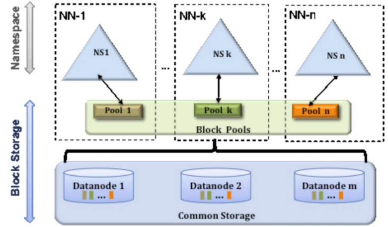


Federation示例配置 :

​	这是一个包含两个Namenode的Federation示例配置：

```xml
<configuration>
  <property>
    <name>dfs.nameservices</name>
    <value>ns1,ns2</value>
  </property>
  <property>
    <name>dfs.namenode.rpc-address.ns1</name>
    <value>nn-host1:rpc-port</value>
  </property>
  <property>
    <name>dfs.namenode.http-address.ns1</name>
    <value>nn-host1:http-port</value>
  </property>
  <property>
    <name>dfs.namenode.secondaryhttp-address.ns1</name>
    <value>snn-host1:http-port</value>
  </property>
  <property>
    <name>dfs.namenode.rpc-address.ns2</name>
    <value>nn-host2:rpc-port</value>
  </property>
  <property>
    <name>dfs.namenode.http-address.ns2</name>
    <value>nn-host2:http-port</value>
  </property>
  <property>
    <name>dfs.namenode.secondaryhttp-address.ns2</name>
    <value>snn-host2:http-port</value>
  </property>

  .... Other common configuration ...
</configuration>
```

