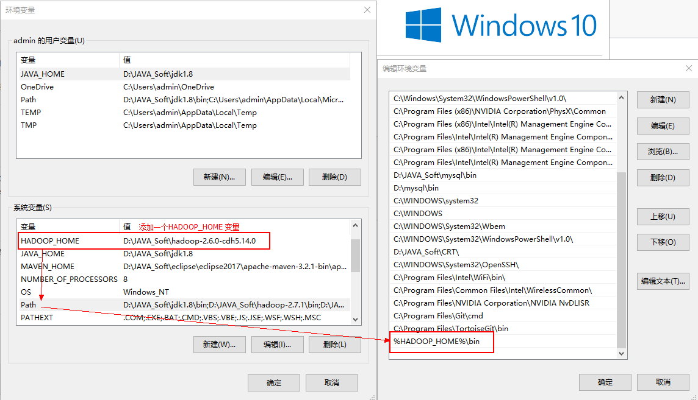
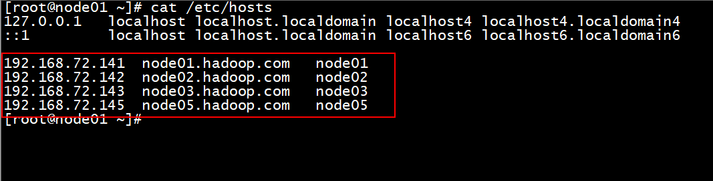
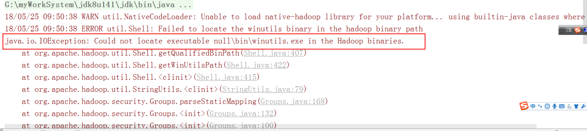
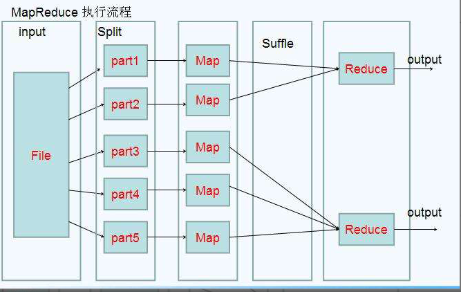
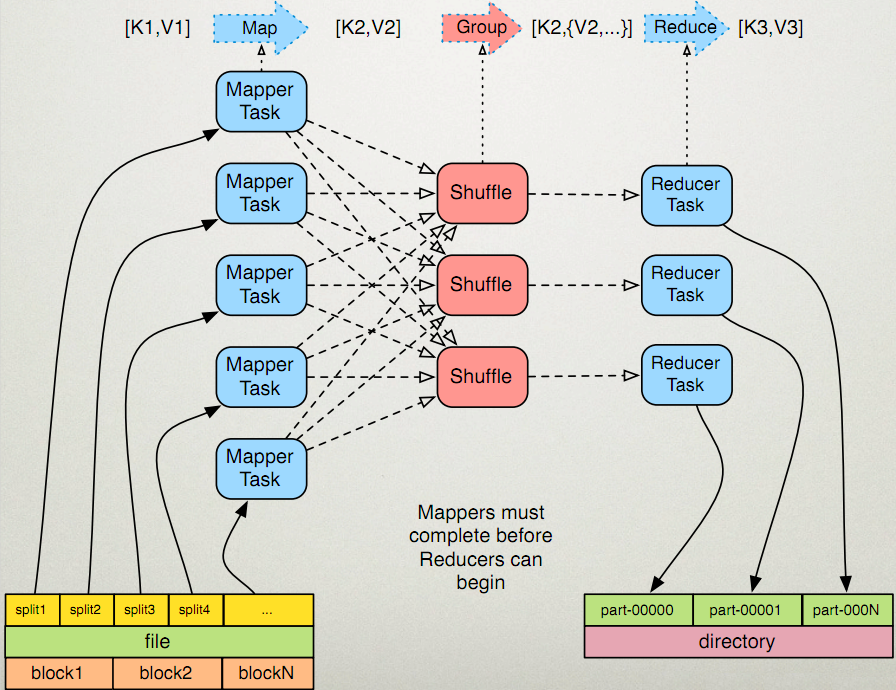
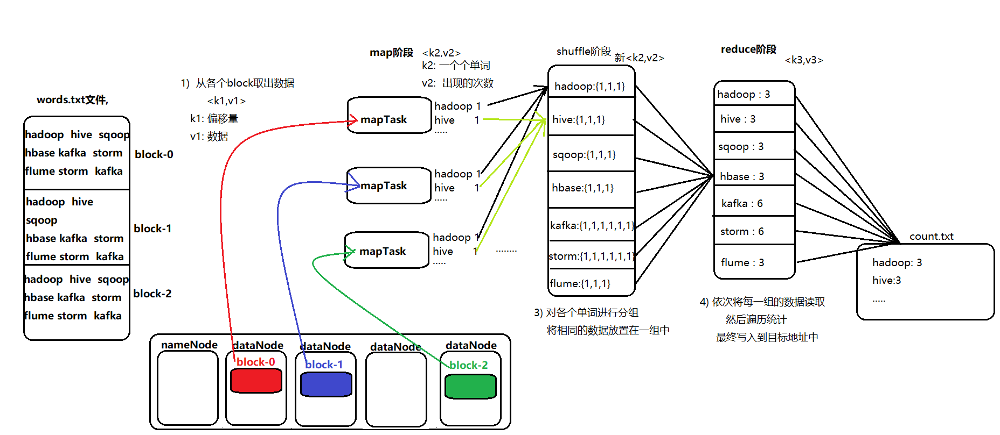

# Hadoop 核心-HDFS

## 1. HDFS 的 API 操作

### 1.1 配置Windows下Hadoop环境

在windows系统需要配置hadoop运行环境，否则直接运行代码会出现以下问题:

缺少winutils.exe

~~~shell
Could not locate executable null \bin\winutils.exe in the hadoop binaries 
~~~

缺少hadoop.dll

~~~shell
Unable to load native-hadoop library for your platform… using builtin-Java classes where applicable  
~~~

步骤:

第一步：将hadoop-2.6.0-cdh5.14.0文件夹拷贝到一个没有中文没有空格的路径下面

第二步：在windows上面配置hadoop的环境变量： HADOOP_HOME，并将%HADOOP_HOME%\bin添加到path中 



第三步：把hadoop2.7.5文件夹中bin目录下的hadoop.dll文件放到系统盘:  C:\Windows\System32 目录

第四步：关闭windows重启


无法通过浏览器下载hdfs中文件:

主要的原因: window的hosts文件没有配置映射关系

​	windows的hosts文件: C:\Windows\System32\drivers\etc

```
在这个文件下, 需要将linux的hosts文件中配置的映射关系, 添加到window的hosts文件中
```



如果window的hosts文件, 不允许修改, 拉出去, 改完以后, 在拖回来

如果打开这个路径, 发现如果没有hosts文件, 找别人借一个过来

打开 CMD  检测 hosts文件配置是否OK: ping 别名

### 1.2 导入 Maven 依赖

​	由于cdh版本的所有的软件涉及版权的问题，所以并没有将所有的jar包托管到maven仓库当中去，而是托管在了CDH自己的服务器上面，所以我们默认去maven的仓库下载不到，需要自己手动的添加repository去CDH仓库进行下载，以下两个地址是官方文档说明，请仔细查阅

<https://www.cloudera.com/documentation/enterprise/release-notes/topics/cdh_vd_cdh5_maven_repo.html>

<https://www.cloudera.com/documentation/enterprise/release-notes/topics/cdh_vd_cdh5_maven_repo_514x.html>

```xml
<repositories>
    <repository>
        <id>cloudera</id>
        <url>https://repository.cloudera.com/artifactory/cloudera-repos/</url>
    </repository>
</repositories>
<dependencies>
    <dependency>
        <groupId>org.apache.hadoop</groupId>
        <artifactId>hadoop-client</artifactId>
        <version>2.6.0-mr1-cdh5.14.0</version>
    </dependency>
    <dependency>
        <groupId>org.apache.hadoop</groupId>
        <artifactId>hadoop-common</artifactId>
        <version>2.6.0-cdh5.14.0</version>
    </dependency>
    <dependency>
        <groupId>org.apache.hadoop</groupId>
        <artifactId>hadoop-hdfs</artifactId>
        <version>2.6.0-cdh5.14.0</version>
    </dependency>

    <dependency>
        <groupId>org.apache.hadoop</groupId>
        <artifactId>hadoop-mapreduce-client-core</artifactId>
        <version>2.6.0-cdh5.14.0</version>
    </dependency>
    <!-- https://mvnrepository.com/artifact/junit/junit -->
    <dependency>
        <groupId>junit</groupId>
        <artifactId>junit</artifactId>
        <version>4.11</version>
        <scope>test</scope>
    </dependency>
    <dependency>
        <groupId>org.testng</groupId>
        <artifactId>testng</artifactId>
        <version>RELEASE</version>
    </dependency>
</dependencies>
<build>
    <plugins>
        <plugin>
            <groupId>org.apache.maven.plugins</groupId>
            <artifactId>maven-compiler-plugin</artifactId>
            <version>3.0</version>
            <configuration>
                <source>1.8</source>
                <target>1.8</target>
                <encoding>UTF-8</encoding>
                <!--    <verbal>true</verbal>-->
            </configuration>
        </plugin>

        <plugin>
            <groupId>org.apache.maven.plugins</groupId>
            <artifactId>maven-shade-plugin</artifactId>
            <version>2.4.3</version>
            <executions>
                <execution>
                    <phase>package</phase>
                    <goals>
                        <goal>shade</goal>
                    </goals>
                    <configuration>
                        <minimizeJar>true</minimizeJar>
                    </configuration>
                </execution>
            </executions>
        </plugin>
      <!--  <plugin>
            <artifactId>maven-assembly-plugin </artifactId>
            <configuration>
                <descriptorRefs>
                    <descriptorRef>jar-with-dependencies</descriptorRef>
                </descriptorRefs>
                <archive>
                    <manifest>
                        <mainClass>cn.itcast.hadoop.db.DBToHdfs2</mainClass>
                    </manifest>
                </archive>
            </configuration>
            <executions>
                <execution>
                    <id>make-assembly</id>
                    <phase>package</phase>
                    <goals>
                        <goal>single</goal>
                    </goals>
                </execution>
            </executions>
        </plugin>-->
    </plugins>
</build>
```


### 1.3 使用url方式访问数据（了解）

~~~java
// 将HDFS中一个文件拷贝到本地目录下
    @Test
    public void urlConnect() throws Exception{

        //1. 注册HDFS
        URL.setURLStreamHandlerFactory(new FsUrlStreamHandlerFactory());

        //2. 获取输入流 : HDFS  socket流
        InputStream in = new URL("hdfs://node01:8020/a/b/test.txt").openStream();

        //3. 获取输出流
        FileOutputStream out = new FileOutputStream(new File("E:\\HDFS\\a.txt"));

        //3. 获取输出流
        IOUtils.copy(in,out);

        //4. 释放资源
        IOUtils.closeQuietly(out);
        IOUtils.closeQuietly(in);
    }
~~~

​	如果执行出现以下错误，可以参见1.1如何解决，也可以不用理会，不会影响程序的执行。记得配置完成环境变量之后重启开发工具



### 1.4 **使用**文件系统方式访问数据（掌握）

#### 1.4.1 涉及的主要类

在 Java 中操作 HDFS, 主要涉及以下 Class:

* Configuration

  * 该类的对象封转了客户端或者服务器的配置
* FileSystem
  * 该类的对象是一个文件系统对象, 可以用该对象的一些方法来对文件进行操作, 通过 FileSystem 的静态方法 get 获得该对象
    ```java
    FileSystem fs = FileSystem.get(conf)
    ```
    * `get` 方法从 `conf` 中的一个参数 `fs.defaultFS` 的配置值判断具体是什么类型的文件系统
    * 如果我们的代码中没有指定 `fs.defaultFS`, 并且工程 ClassPath 下也没有给定相应的配置, `conf` 中的默认值就来自于 Hadoop 的 Jar 包中的 `core-default.xml`
    * 默认值为 `file:/// `, 则获取的不是一个 DistributedFileSystem 的实例, 而是一个本地文件系统的客户端对象

#### 1.4.2  获取 FileSystem 的几种方式

* 第一种方式
```java
@Test
    public void getFileSystem1() throws Exception{

        //1. 获取FileSystem
        Configuration conf = new Configuration();
        conf.set("fs.defaultFS","hdfs://node01:8020");
        FileSystem fileSystem = FileSystem.get(conf);
        System.out.println(fileSystem.toString());
    }
```

* 第二种方式
```java
 @Test
    public void getFileSystem2() throws Exception{

        //1. 获取FileSystem
        FileSystem fileSystem = FileSystem.get(new URI("hdfs://node01:8020"), new Configuration());
        System.out.println(fileSystem);
    }
```

* 第三种方式
```java
@Test
    public void getFileSystem3() throws Exception{

        //1. 获取FileSystem
        Configuration conf = new Configuration();
        conf.set("fs.defaultFS","hdfs://node01:8020");
        FileSystem fileSystem = FileSystem.newInstance(conf);
        System.out.println(fileSystem);
    }
```

* 第四种方式
```java
@Test
    public void getFileSystem4() throws Exception{

        //1. 获取FileSystem
        FileSystem fileSystem = FileSystem.newInstance(new URI("hdfs://node01:8020"), new Configuration());
        System.out.println(fileSystem);
    }
```

#### 1.4.3  遍历 HDFS 中所有文件

* 使用 API 遍历
```java
  // 需求1: 遍历hdfs中所有文件
    @Test
    public void listFilesHDFS() throws Exception{
        //1.  获取 fileSystem对象
        FileSystem fs = FileSystem.newInstance(new URI("hdfs://node01:8020"), new Configuration());

        //2. 执行获取所有的文件
        RemoteIterator<LocatedFileStatus> listFiles = fs.listFiles(new Path("/"), true);

        //3 遍历获取所有的文件
        while(listFiles.hasNext()){
            LocatedFileStatus fileStatus = listFiles.next();
            String path = fileStatus.getPath().toString();
            System.out.println(path);
        }

        //4. 释放资源
        fs.close();
    }
```

#### 1.4.4  HDFS 上创建文件夹

```java
   //需求2: 在hdfs中创建一个文件夹
    @Test
    public void mkdirHDFS() throws Exception{
        //1. 获取FileSystem对象
        Configuration conf = new Configuration();
        conf.set("fs.defaultFS","hdfs://node01:8020");
        FileSystem fs = FileSystem.newInstance(conf);

        //2. 执行操作: 创建文件夹
        fs.mkdirs(new Path("/mkdir/test"));

        //3. 释放资源
        fs.close();

    }
```

#### 1.4.4 下载文件

```java
   //需求3: 下载文件:  jdk
    @Test
    public void downLoadHDFS() throws Exception {
        //1. 获取FileSystem对象
        FileSystem fs = FileSystem.get(new URI("hdfs://node01:8020"), new Configuration());

        //2. 执行下载操作: jdk
        fs.copyToLocalFile(new Path("/jdk-8u144-linux-x64.tar.gz"),new Path("E:\\HDFS"));

        //3. 释放资源
        fs.close();

    }
```

#### 1.4.5 HDFS 文件上传

```java
 //需求4: 上传文件HDFS中
    @Test
    public void uploadHDFS() throws Exception{

        //1. 获取FileSystem对象
        Configuration conf = new Configuration();
        conf.set("fs.defaultFS","hdfs://node01:8020");
        FileSystem fs = FileSystem.get(conf);

        //2. 执行上传 :
        fs.copyFromLocalFile(new Path("E:\\HDFS\\jdk-8u144-linux-x64.tar.gz"),new Path("/mkdir/test/"));

        //3. 释放资源
        fs.close();
    }
```


#### 1.4.6 hdfs访问权限控制

1. 停止hdfs集群，在node01机器上执行以下命令
```shell
cd /export/servers/hadoop-2.7.5
sbin/stop-dfs.sh
```
2. 修改node01机器上的hdfs-site.xml当中的配置文件
```shell
cd /export/servers/hadoop-2.7.5/etc/hadoop
vim hdfs-site.xml
```
```xml
<property>
	<name>dfs.permissions.enabled</name>
	<value>true</value>
</property>
```
3. 修改完成之后配置文件发送到其他机器上面去
```shell
scp hdfs-site.xml node02:$PWD
scp hdfs-site.xml node03:$PWD
```
4. 重启hdfs集群
```shell
cd /export/servers/hadoop-2.7.5
sbin/start-dfs.sh
```
5. 随意上传一些文件到我们hadoop集群当中准备测试使用
```shell
cd /export/servers/hadoop-2.7.5/etc/hadoop
hdfs dfs -mkdir /config
hdfs dfs -put *.xml /config
hdfs dfs -chmod 600 /config/core-site.xml
```
6. 使用代码准备下载文件
```java
@Test
public void getConfig()throws  Exception{
    FileSystem fileSystem = FileSystem.get(new URI("hdfs://node01:8020"), new Configuration(),"hadoop");
    fileSystem.copyToLocalFile(new Path("/config/core-site.xml"),new Path("file:///c:/core-site.xml"));
    fileSystem.close();
}
```

伪装用户后:

```java
// 权限的操作: 下载 /mkdir/core-site.xml

    @Test
    public void downloadFile() throws Exception{
        //1. 获取FileSystem对象
        Configuration conf = new Configuration();
        FileSystem fs = FileSystem.get(new URI("hdfs://node01:8020"),conf,"root");

        //2. 执行下载
        fs.copyToLocalFile( new Path("/mkdir/core-site.xml") ,new Path("E:\\HDFS") );
        //3. 释放资源
        fs.close();

    }
```


#### 1.4.7 小文件合并

​	由于 Hadoop 擅长存储大文件，因为大文件的元数据信息比较少，如果 Hadoop 集群当中有大量的小文件，那么每个小文件都需要维护一份元数据信息，会大大的增加集群管理元数据的内存压力，所以在实际工作当中，如果有必要一定要将小文件合并成大文件进行一起处理

在我们的 HDFS 的 Shell 命令模式下，可以通过命令行将很多的 hdfs 文件合并成一个大文件下载到本地

```shell
cd /export/servers
hdfs dfs -getmerge /config/*.xml ./hello.xml
```

既然可以在下载的时候将这些小文件合并成一个大文件一起下载，那么肯定就可以在上传的时候将小文件合并到一个大文件里面去


```java
    // 小文件合并:
    @Test
    public void mergeFile() throws Exception{
        //1. 获取 FileSystem:  一个 hdfs的文件系统, 一个本地文件系统

        FileSystem hdfsFs = FileSystem.get(new URI("hdfs://node01:8020"), new Configuration(), "root");

        LocalFileSystem localFs = FileSystem.getLocal(new Configuration());

        //2. 在hdfs中创建一个合并的文件
        FSDataOutputStream out = hdfsFs.create(new Path("/merge.xml"));

        //3. 通过本地文件系统, 读取小文件,
        RemoteIterator<LocatedFileStatus> listFiles = localFs.listFiles(new Path("E:\\HDFS\\merge"), false);

        //4. 遍历小文件
        while(listFiles.hasNext()){
            //4.1 获取本地文件输入流
            LocatedFileStatus fileStatus = listFiles.next();
            Path path = fileStatus.getPath();
            FSDataInputStream in = localFs.open(path);

           //4.2 两个流对接
            IOUtils.copy(in,out);

            //4.3 关闭 输入流
            IOUtils.closeQuietly(in);
        }

        //5. 释放资源
        IOUtils.closeQuietly(out);
        hdfsFs.close();
        localFs.close();

    }
```

## 2 hdfs其他功能介绍

### 2.1 多个集群之间的数据拷贝

​	在我们实际工作当中，极有可能会遇到将测试集群的数据拷贝到生产环境集群，或者将生产环境集群的数据拷贝到测试集群，那么就需要我们在多个集群之间进行数据的远程拷贝，hadoop自带也有命令可以帮我们实现这个功能

* 1） 本地文件拷贝scp

```
cd /export/softwares/

scp -r jdk-8u141-linux-x64.tar.gz root@node02:/export/
```

* 2) 集群之间的数据拷贝distcp

```
cd /export/servers/hadoop-2.6.0-cdh5.14.0/

bin/hadoop distcp hdfs://node01:8020/jdk-8u141-linux-x64.tar.gz  hdfs://cluster2:8020/
```

### 2.2 hadoop归档文件archive

​	每个文件均按块存储，每个块的元数据存储在namenode的内存中，因此hadoop存储小文件会非常低效。因为大量的小文件会耗尽namenode中的大部分内存。但注意，存储小文件所需要的磁盘容量和存储这些文件原始内容所需要的磁盘空间相比也不会增多。例如，一个1MB的文件以大小为128MB的块存储，使用的是1MB的磁盘空间，而不是128MB。

​	Hadoop存档文件或HAR文件，是一个更高效的文件存档工具，它将文件存入HDFS块，在减少namenode内存使用的同时，允许对文件进行透明的访问。具体说来，Hadoop存档文件可以用作MapReduce的输入。

创建归档文件

* 第一步：创建归档文件

  注意：归档文件一定要保证yarn集群启动

```
cd /export/servers/hadoop-2.6.0-cdh5.14.0

bin/hadoop archive -archiveName myhar.har -p /user/root /user

```

* 第二步：查看归档文件内容

```
hdfs dfs -lsr /user/myhar.har

hdfs dfs -lsr har:///user/myhar.har
```

* 第三步：解压归档文件

```
hdfs dfs -mkdir -p /user/har
hdfs dfs -cp har:///user/myhar.har/* /user/har/
```

### 2.3 hdfs快照snapShot管理

​	快照顾名思义，就是相当于对我们的hdfs文件系统做一个备份，我们可以通过快照对我们指定的文件夹设置备份，但是添加快照之后，并不会立即复制所有文件，而是指向同一个文件。当写入发生时，才会产生新文件

* 1)  快照使用基本语法

```
1、 开启指定目录的快照功能
	hdfs dfsadmin  -allowSnapshot  路径 
2、禁用指定目录的快照功能（默认就是禁用状态）
	hdfs dfsadmin  -disallowSnapshot  路径
3、给某个路径创建快照snapshot
	hdfs dfs -createSnapshot  路径
4、指定快照名称进行创建快照snapshot
	hdfs dfs  -createSanpshot 路径 名称    
5、给快照重新命名
	hdfs dfs  -renameSnapshot  路径 旧名称  新名称
6、列出当前用户所有可快照目录
	hdfs lsSnapshottableDir  
7、比较两个快照的目录不同之处
	hdfs snapshotDiff  路径1  路径2
8、删除快照snapshot
	hdfs dfs -deleteSnapshot <path> <snapshotName> 

```

* 2) 快照操作实际案例

```
1、开启与禁用指定目录的快照

    [root@node01 hadoop-2.6.0-cdh5.14.0]# hdfs dfsadmin -allowSnapshot /user

    Allowing snaphot on /user succeeded

    [root@node01 hadoop-2.6.0-cdh5.14.0]# hdfs dfsadmin -disallowSnapshot /user

    Disallowing snaphot on /user succeeded

2、对指定目录创建快照

	注意：创建快照之前，先要允许该目录创建快照

    [root@node01 hadoop-2.6.0-cdh5.14.0]# hdfs dfsadmin -allowSnapshot /user

    Allowing snaphot on /user succeeded

    [root@node01 hadoop-2.6.0-cdh5.14.0]# hdfs dfs -createSnapshot /user    

    Created snapshot /user/.snapshot/s20190317-210906.549

	通过web浏览器访问快照

	http://node01:50070/explorer.html#/user/.snapshot/s20190317-210906.549

3、指定名称创建快照

    [root@node01 hadoop-2.6.0-cdh5.14.0]# hdfs dfs -createSnapshot /user mysnap1

    Created snapshot /user/.snapshot/mysnap1

4、重命名快照

	hdfs dfs -renameSnapshot /user mysnap1 mysnap2
 
5、列出当前用户所有可以快照的目录

	hdfs lsSnapshottableDir

6、比较两个快照不同之处

    hdfs dfs -createSnapshot /user snap1

    hdfs dfs -createSnapshot /user snap2

    hdfs snapshotDiff  snap1 snap2

7、删除快照

	hdfs dfs -deleteSnapshot /user snap1

```

### 2.4 hdfs回收站

​	任何一个文件系统，基本上都会有垃圾桶机制，也就是删除的文件，不会直接彻底清掉，我们一把都是将文件放置到垃圾桶当中去，过一段时间之后，自动清空垃圾桶当中的文件，这样对于文件的安全删除比较有保证，避免我们一些误操作，导致误删除文件或者数据

* 1) 回收站配置两个参数

  默认值fs.trash.interval=0，0表示禁用回收站，可以设置删除文件的存活时间。

  默认值fs.trash.checkpoint.interval=0，检查回收站的间隔时间。

  要求fs.trash.checkpoint.interval<=fs.trash.interval。

* 2) 启用回收站

  修改所有服务器的core-site.xml配置文件

```xml
<!--  开启hdfs的垃圾桶机制，删除掉的数据可以从垃圾桶中回收，单位分钟 -->
        <property>
                <name>fs.trash.interval</name>
                <value>10080</value>
        </property>
```

* 3) 查看回收站

  回收站在集群的 /user/root/.Trash/  这个路径下

* 4) 通过javaAPI删除的数据，不会进入回收站，需要调用moveToTrash()才会进入回收站

```java
//使用回收站的方式: 删除数据
    @Test
    public void  deleteFile() throws Exception{
        //1. 获取FileSystem对象
        Configuration configuration = new Configuration();
        FileSystem fileSystem = FileSystem.get(new URI("hdfs://node01:8020"), configuration, "root");
        //2. 执行删除操作
        // fileSystem.delete();  这种操作会直接将数据删除, 不会进入垃圾桶
        Trash trash = new Trash(fileSystem,configuration);
        boolean flag = trash.isEnabled(); // 是否已经开启了垃圾桶机制
        System.out.println(flag);

        trash.moveToTrash(new Path("/quota"));

        //3. 释放资源
        fileSystem.close();

    }
```

5、恢复回收站数据

hdfs  dfs  -mv  trashFileDir   hdfsdir

trashFileDir  ：回收站的文件路径

hdfsdir   ：将文件移动到hdfs的哪个路径下

6、清空回收站

hdfs dfs -expunge

## 3. MapReduce 介绍

​	MapReduce思想在生活中处处可见。或多或少都曾接触过这种思想。MapReduce的思想核心是“分而治之”，适用于大量复杂的任务处理场景（大规模数据处理场景）。即使是发布过论文实现分布式计算的谷歌也只是实现了这种思想，而不是自己原创

- Map负责“分”，即把复杂的任务分解为若干个“简单的任务”来并行处理。可以进行拆分的前提是这些小任务可以并行计算，彼此间几乎没有依赖关系。
- Reduce负责“合”，即对map阶段的结果进行全局汇总。
- MapReduce运行在yarn集群
  1. ResourceManager
  2. NodeManager

这两个阶段合起来正是MapReduce思想的体现。



​	还有一个比较形象的语言解释MapReduce: 

​		我们要数图书馆中的所有书。你数1号书架，我数2号书架。这就是“Map”。我们人越多，数书就更快。

​		现在我们到一起，把所有人的统计数加在一起。这就是“Reduce”。


### 3.1. MapReduce 设计构思

​	MapReduce是一个分布式运算程序的编程框架，核心功能是将用户编写的业务逻辑代码和自带默认组件整合成一个完整的分布式运算程序，并发运行在Hadoop集群上。

​	既然是做计算的框架，那么表现形式就是有个输入（input），MapReduce操作这个输入（input），通过本身定义好的计算模型，得到一个输出（output）。

​	对许多开发者来说，自己完完全全实现一个并行计算程序难度太大，而MapReduce就是一种简化并行计算的编程模型，降低了开发并行应用的入门门槛。

​	Hadoop MapReduce构思体现在如下的三个方面：

* 1) 如何对付大数据处理：分而治之

```
	对相互间不具有计算依赖关系的大数据，实现并行最自然的办法就是采取分而治之的策略。并行计算的第一个重要问题是如何划分计算任务或者计算数据以便对划分的子任务或数据块同时进行计算。不可分拆的计算任务或相互间有依赖关系的数据无法进行并行计算！
```

* 2) 构建抽象模型：Map和Reduce

```
MapReduce借鉴了函数式语言中的思想，用Map和Reduce两个函数提供了高层的并行编程抽象模型。
	Map: 对一组数据元素进行某种重复式的处理；
	Reduce: 对Map的中间结果进行某种进一步的结果整理。
	MapReduce中定义了如下的Map和Reduce两个抽象的编程接口，由用户去编程实现:
		map: (k1; v1) → [(k2; v2)]
		reduce: (k2; [v2]) → [(k3; v3)]
	Map和Reduce为程序员提供了一个清晰的操作接口抽象描述。通过以上两个编程接口，大家可以看出MapReduce处理的数据类型是<key,value>键值对。
```

* 3) MapReduce框架结构

```
一个完整的mapreduce程序在分布式运行时有三类实例进程：
	1、MR AppMaster：负责整个程序的过程调度及状态协调
	2、MapTask：负责map阶段的整个数据处理流程
	3、ReduceTask：负责reduce阶段的整个数据处理流程
```




## 4. MapReduce 编程规范

> MapReduce 的开发一共有八个步骤, 其中 Map 阶段分为 2 个步骤，Shuffle 阶段 4 个步骤，Reduce 阶段分为 2 个步骤

- 1) Map 阶段 2 个步骤
  - 1.1) 设置 InputFormat 类, 将数据切分为 Key-Value**(K1和V1)** 对, 输入到第二步
  - 1.2) 自定义 Map 逻辑, 将第一步的结果转换成另外的 Key-Value（**K2和V2**） 对, 输出结果
- 2) Shuffle 阶段 4 个步骤
  - 2.1) 对输出的 Key-Value 对进行**分区**
  - 2.2) 对不同分区的数据按照相同的 Key **排序**
  - 2.3) (可选) 对分组过的数据初步**规约**, 降低数据的网络拷贝
  - 2.4) 对数据进行**分组**, 相同 Key 的 Value 放入一个集合中
- 3) Reduce 阶段 2 个步骤
  - 3.1) 对多个 Map 任务的结果进行排序以及合并, 编写 Reduce 函数实现自己的逻辑, 对输入的 Key-Value 进行处理, 转为新的 Key-Value（**K3和V3**）输出
  - 3.2) 设置 OutputFormat 处理并保存 Reduce 输出的 Key-Value 数据



## 5. Mapper以及Reducer抽象类介绍

​	为了开发我们的MapReduce程序，一共可以分为以上八个步骤，其中每个步骤都是一个class类，我们通过job对象将我们的程序组装成一个任务提交即可。为了简化我们的MapReduce程序的开发，每一个步骤的class类，都有一个既定的父类，让我们直接继承即可，因此可以大大简化我们的MapReduce程序的开发难度，也可以让我们快速的实现功能开发。

​	MapReduce编程当中，其中最重要的两个步骤就是我们的Mapper类和Reducer类

* 1) Mapper抽象类的基本介绍

```
	在hadoop2.x当中Mapper类是一个抽象类，我们只需要覆写一个java类，继承自Mapper类即可，然后重写里面的一些方法，就可以实现我们特定的功能，接下来我们来介绍一下Mapper类当中比较重要的四个方法
1、setup方法：
	我们Mapper类当中的初始化方法，我们一些对象的初始化工作都可以放到这个方法里面来实现

2、map方法：
	读取的每一行数据，都会来调用一次map方法，这个方法也是我们最重要的方法，可以通过这个方法来实现我们每一条数据的处理

3、cleanup方法：
	在我们整个maptask执行完成之后，会马上调用cleanup方法，这个方法主要是用于做我们的一些清理工作，例如连接的断开，资源的关闭等等


4、run方法：
	如果我们需要更精细的控制我们的整个MapTask的执行，那么我们可以覆写这个方法，实现对我们所有的MapTask更精确的操作控制
```

* 2) Reducer抽象类基本介绍

```
	同样的道理，在我们的hadoop2.x当中，reducer类也是一个抽象类，抽象类允许我们可以继承这个抽象类之后，重新覆写抽象类当中的方法，实现我们的逻辑的自定义控制。接下来我们也来介绍一下Reducer抽象类当中的四个抽象方法
1、setup方法：
	在我们的ReduceTask初始化之后马上调用，我们的一些对象的初始化工作，都可以在这个类当中实现
2、reduce方法：
	所有从MapTask发送过来的数据，都会调用reduce方法，这个方法也是我们reduce当中最重要的方法，可以通过这个方法实现我们的数据的处理
3、cleanup方法：
	在我们整个ReduceTask执行完成之后，会马上调用cleanup方法，这个方法主要就是在我们reduce阶段处理做我们一些清理工作，例如连接的断开，资源的关闭等等
4、run方法：
	如果我们需要更精细的控制我们的整个ReduceTask的执行，那么我们可以覆写这个方法，实现对我们所有的ReduceTask更精确的操作控制
```

## 6. WordCount示例编写

需求：在一堆给定的文本文件中统计输出每一个单词出现的总次数

​	node01服务器执行以下命令，准备数，数据格式准备如下：

```
cd /export/servers
vim wordcount.txt

#添加以下内容:
hello hello
world world
hadoop hadoop
hello world
hello flume
hadoop hive
hive kafka
flume storm
hive oozie
```

​	将数据文件上传到hdfs上面去

```
hdfs dfs -mkdir /wordcount/
hdfs dfs -put wordcount.txt /wordcount/
```

* 定义一个mapper类

```java

import org.apache.hadoop.io.LongWritable;
import org.apache.hadoop.io.Text;
import org.apache.hadoop.mapreduce.Mapper;

import java.io.IOException;

// mapper程序:  需要继承 mapper类, 需要传入 四个类型:
/*  在hadoop中, 对java的类型都进行包装, 以提高传输的效率  writable
    keyin :  k1   Long     ---- LongWritable
    valin :  v1   String   ------ Text
    keyout : k2   String   ------- Text
    valout : v2   Long     -------LongWritable

 */

public class MapTask extends Mapper<LongWritable,Text,Text,LongWritable> {

    /**
     *
     * @param key  : k1
     * @param value   v1
     * @param context  上下文对象   承上启下功能
     * @throws IOException
     * @throws InterruptedException
     */
    @Override
    protected void map(LongWritable key, Text value, Context context) throws IOException, InterruptedException {
        //1. 获取 v1 中数据
        String val = value.toString();

        //2. 切割数据
        String[] words = val.split(" ");

        Text text = new Text();
        LongWritable longWritable = new LongWritable(1);
        //3. 遍历循环, 发给 reduce
        for (String word : words) {
            text.set(word);
            context.write(text,longWritable);
        }


    }
}

```

* 定义一个reducer类

```java

import org.apache.hadoop.io.LongWritable;
import org.apache.hadoop.io.Text;
import org.apache.hadoop.mapreduce.Reducer;

import java.io.IOException;

/**
 * KEYIN  :  k2    -----Text
 * VALUEIN :  v2   ------LongWritable
 * KEYOUT  : k3    ------  Text
 * VALUEOUT : v3   ------ LongWritable
 */
public class ReducerTask extends Reducer<Text, LongWritable, Text, LongWritable> {


    @Override
    protected void reduce(Text key, Iterable<LongWritable> values, Context context) throws IOException, InterruptedException {

        //1. 遍历 values 获取每一个值
        long  v3 = 0;
        for (LongWritable longWritable : values) {

            v3 += longWritable.get();  //1
        }

        //2. 输出
        context.write(key,new LongWritable(v3));

    }
}

```

* 定义一个主类，用来描述job并提交job

```java

import com.sun.org.apache.bcel.internal.generic.NEW;
import org.apache.hadoop.conf.Configuration;
import org.apache.hadoop.conf.Configured;
import org.apache.hadoop.fs.Path;
import org.apache.hadoop.io.LongWritable;
import org.apache.hadoop.io.Text;
import org.apache.hadoop.io.nativeio.NativeIO;
import org.apache.hadoop.mapreduce.Job;
import org.apache.hadoop.mapreduce.lib.input.TextInputFormat;
import org.apache.hadoop.mapreduce.lib.output.TextOutputFormat;
import org.apache.hadoop.util.Tool;
import org.apache.hadoop.util.ToolRunner;

// 任务的执行入口: 将天龙八部组合在一起
public class JobMain extends Configured implements Tool {
    // 在run方法中编写组装八部
    @Override
    public int run(String[] args) throws Exception {

        Job job = Job.getInstance(super.getConf(), "JobMain");
        //如果提交到集群操作. 需要添加一步 : 指定入口类
        job.setJarByClass(JobMain.class);


        //1. 封装第一步:  读取数据
        job.setInputFormatClass(TextInputFormat.class);
        TextInputFormat.addInputPath(job,new Path("hdfs://node01:8020/wordcount.txt"));

        //2. 封装第二步:  自定义 map程序
        job.setMapperClass(MapTask.class);
        job.setMapOutputKeyClass(Text.class);
        job.setMapOutputValueClass(LongWritable.class);

        //3. 第三步 第四步 第五步 第六步 省略

        //4. 第七步:  自定义reduce程序
        job.setReducerClass(ReducerTask.class);
        job.setOutputKeyClass(Text.class);
        job.setOutputValueClass(LongWritable.class);

        //5) 第八步  : 输出路径是一个目录, 而且这个目录必须不存在的
        job.setOutputFormatClass(TextOutputFormat.class);
        TextOutputFormat.setOutputPath(job,new Path("hdfs://node01:8020/output"));

        //6) 提交任务:
        boolean flag = job.waitForCompletion(true); // 成功  true  不成功 false

        return flag ? 0 : 1;
    }

    public static void main(String[] args) throws Exception {
        Configuration configuration = new Configuration();
        JobMain jobMain = new JobMain();
        int i = ToolRunner.run(configuration, jobMain, args); //返回值 退出码

        System.exit(i); // 退出程序  0 表示正常  其他值表示有异常 1
    }
}

```

​	提醒：代码开发完成之后，就可以打成jar包放到服务器上面去运行了，实际工作当中，都是将代码打成jar包，开发main方法作为程序的入口，然后放到集群上面去运行

## 7. MapReduce程序运行模式

* 本地运行模式

```
1) mapreduce程序是被提交给LocalJobRunner在本地以单进程的形式运行
2）而处理的数据及输出结果可以在本地文件系统，也可以在hdfs上
3）怎样实现本地运行？写一个程序，不要带集群的配置文件本质是程序的conf中是否有mapreduce.framework.name=local以及yarn.resourcemanager.hostname=local参数
4）本地模式非常便于进行业务逻辑的debug，只要在idea中打断点即可
```

【本地模式运行代码设置】 

```
configuration.set("mapreduce.framework.name","local");
configuration.set("yarn.resourcemanager.hostname","local");
-----------以上两个是不需要修改的,如果要在本地目录测试, 可有修改hdfs的路径-----------------
TextInputFormat.addInputPath(job,new Path("file:///F:\\传智播客大数据离线阶段课程资料\\3、大数据离线第三天\\wordcount\\input"));
TextOutputFormat.setOutputPath(job,new Path("file:///F:\\传智播客大数据离线阶段课程资料\\3、大数据离线第三天\\wordcount\\output"));
```

* 集群运行模式

```
（1）将mapreduce程序提交给yarn集群，分发到很多的节点上并发执行
（2）处理的数据和输出结果应该位于hdfs文件系统
（3）提交集群的实现步骤：
	将程序打成JAR包，然后在集群的任意一个节点上用hadoop命令启动 
		yarn jar hadoop_hdfs_operate-1.0-SNAPSHOT.jar cn.itcast.hdfs.demo1.JobMain
```

