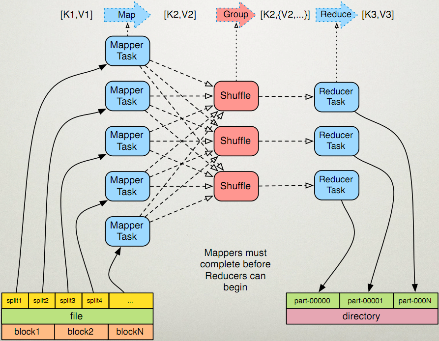
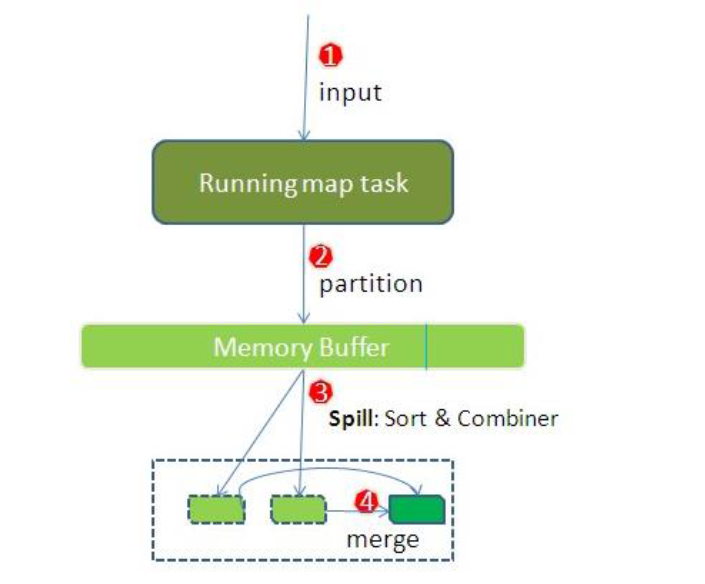
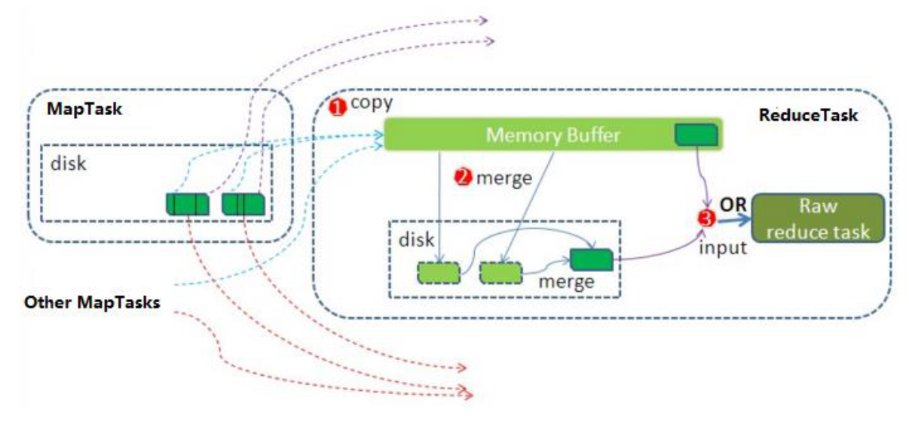
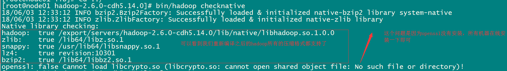

## 1 .MapReduce的运行机制详解

### 1.1 MapTask 工作机制





整个Map阶段流程大体如上图所示。

​	简单概述：inputFile通过split被逻辑切分为多个split文件，通过Record按行读取内容给map（用户自己实现的）进行处理，数据被map处理结束之后交给OutputCollector收集器，对其结果key进行分区（默认使用hash分区），然后写入buffer，每个map task都有一个内存缓冲区，存储着map的输出结果，当缓冲区快满的时候需要将缓冲区的数据以一个临时文件的方式存放到磁盘，当整个map task结束后再对磁盘中这个map task产生的所有临时文件做合并，生成最终的正式输出文件，然后等待reduce task来拉数据

* 详细步骤

  * 1) 读取数据组件 **InputFormat** (默认 TextInputFormat) 会通过 `getSplits` 方法对输入目录中文件进行逻辑切片规划得到 `block`, 有多少个 `block`就对应启动多少个 `MapTask`. 
  * 2) 将输入文件切分为 `block` 之后, 由 `RecordReader` 对象 (默认是LineRecordReader) 进行**读取**, 以 `\n` 作为分隔符, 读取一行数据, 返回 `<key，value>`. Key 表示每行首字符偏移值, Value 表示这一行文本内容
  * 3) 读取 `block` 返回 `<key,value>`, **进入用户自己继承的 Mapper 类中**，执行用户重写的 map 函数, RecordReader 读取一行这里调用一次
  * 4) Mapper 逻辑结束之后, 将 Mapper 的每条结果通过 `context.write` 进行collect数据收集. 在 collect 中, 会先对其进行分区处理，默认使用 **HashPartitioner**

  ```
  	MapReduce 提供 Partitioner 接口, 它的作用就是根据 Key 或 Value 及 Reducer 的数量来决定当前的这对输出数据最终应该交由哪个 Reduce task 处理, 默认对 Key Hash 后再以 Reducer 数量取模. 默认的取模方式只是为了平均 Reducer 的处理能力, 如果用户自己对 Partitioner 有需求, 可以订制并设置到 Job 上
  ```

  * 5) 接下来, 会将数据写入内存, 内存中这片区域叫做环形缓冲区, 缓冲区的作用是批量收集 Mapper 结果, 减少磁盘 IO 的影响. 我们的 **Key/Value 对以及 Partition 的结果都会被写入缓冲区**. 当然, 写入之前，Key 与 Value 值都会被序列化成字节数组

  ```
  	环形缓冲区其实是一个数组, 数组中存放着 Key, Value 的序列化数据和 Key, Value 的元数据信息, 包括 Partition, Key 的起始位置, Value 的起始位置以及 Value 的长度. 环形结构是一个抽象概念
  	
  	缓冲区是有大小限制, 默认是 100MB. 当 Mapper 的输出结果很多时, 就可能会撑爆内存, 所以需要在一定条件下将缓冲区中的数据临时写入磁盘, 然后重新利用这块缓冲区. 这个从内存往磁盘写数据的过程被称为 Spill, 中文可译为溢写. 这个溢写是由单独线程来完成, 不影响往缓冲区写 Mapper 结果的线程. 溢写线程启动时不应该阻止 Mapper 的结果输出, 所以整个缓冲区有个溢写的比例 spill.percent. 这个比例默认是 0.8, 也就是当缓冲区的数据已经达到阈值 buffer size * spill percent = 100MB * 0.8 = 80MB, 溢写线程启动, 锁定这 80MB 的内存, 执行溢写过程. Mapper 的输出结果还可以往剩下的 20MB 内存中写, 互不影响
  
  ```

  * 6) 当溢写线程启动后, 需要**对这 80MB 空间内的 Key 做排序 (Sort)**. 排序是 MapReduce 模型默认的行为, 这里的排序也是对序列化的字节做的排序

  ```
  	如果 Job 设置过 Combiner, 那么现在就是使用 Combiner 的时候了. 将有相同 Key 的 Key/Value 对的 Value 合并在起来, 减少溢写到磁盘的数据量. Combiner 会优化 MapReduce 的中间结果, 所以它在整个模型中会多次使用
  	
  	那哪些场景才能使用 Combiner 呢? 从这里分析, Combiner 的输出是 Reducer 的输入, Combiner 绝不能改变最终的计算结果. Combiner 只应该用于那种 Reduce 的输入 Key/Value 与输出 Key/Value 类型完全一致, 且不影响最终结果的场景. 比如累加, 最大值等. Combiner 的使用一定得慎重, 如果用好, 它对 Job 执行效率有帮助, 反之会影响 Reducer 的最终结果
  
  ```

  * 7) **合并溢写文件**, 每次溢写会在磁盘上生成一个临时文件 (写之前判断是否有 Combiner), 如果 Mapper 的输出结果真的很大, 有多次这样的溢写发生, 磁盘上相应的就会有多个临时文件存在. 当整个数据处理结束之后开始对磁盘中的临时文件进行 Merge 合并, 因为最终的文件只有一个, 写入磁盘, 并且为这个文件提供了一个索引文件, 以记录每个reduce对应数据的偏移量

【mapTask的一些基础设置配置】

| 配置                               | 默认值                           | 解释                       |
| ---------------------------------- | -------------------------------- | -------------------------- |
| `mapreduce.task.io.sort.mb`        | 100                              | 设置环型缓冲区的内存值大小 |
| `mapreduce.map.sort.spill.percent` | 0.8                              | 设置溢写的比例             |
| `mapreduce.cluster.local.dir`      | `${hadoop.tmp.dir}/mapred/local` | 溢写数据目录               |
| `mapreduce.task.io.sort.factor`    | 10                               | 设置一次合并多少个溢写文件 |

###  1.2 ReduceTask 工作机制



​	Reduce 大致分为 copy、sort、reduce 三个阶段，重点在前两个阶段。copy 阶段包含一个 eventFetcher 来获取已完成的 map 列表，由 Fetcher 线程去 copy 数据，在此过程中会启动两个 merge 线程，分别为 inMemoryMerger 和 onDiskMerger，分别将内存中的数据 merge 到磁盘和将磁盘中的数据进行 merge。待数据 copy 完成之后，copy 阶段就完成了，开始进行 sort 阶段，sort 阶段主要是执行 finalMerge 操作，纯粹的 sort 阶段，完成之后就是 reduce 阶段，调用用户定义的 reduce 函数进行处理

* 详细步骤

  * 1）**Copy阶段**，简单地拉取数据。Reduce进程启动一些数据copy线程(Fetcher)，通过HTTP方式请求maptask获取属于自己的文件。

  * 2）**Merge阶段**。这里的merge如map端的merge动作，只是数组中存放的是不同map端copy来的数值。Copy过来的数据会先放入内存缓冲区中，这里的缓冲区大小要比map端的更为灵活。merge有三种形式：内存到内存；内存到磁盘；磁盘到磁盘。默认情况下第一种形式不启用。当内存中的数据量到达一定阈值，就启动内存到磁盘的merge。与map 端类似，这也是溢写的过程，这个过程中如果你设置有Combiner，也是会启用的，然后在磁盘中生成了众多的溢写文件。第二种merge方式一直在运行，直到没有map端的数据时才结束，然后启动第三种磁盘到磁盘的merge方式生成最终的文件。
  * 3）**合并排序**。把分散的数据合并成一个大的数据后，还会再对合并后的数据排序。
  * 4）**对排序后的键值对调用reduce方法**，键相等的键值对调用一次reduce方法，每次调用会产生零个或者多个键值对，最后把这些输出的键值对写入到HDFS文件中。

### 1.3 Shuffle 过程

​	map 阶段处理的数据如何传递给 reduce 阶段，是 MapReduce 框架中最关键的一个流程，这个流程就叫 shuffle
​	shuffle: 洗牌、发牌 ——（核心机制：数据分区，排序，分组，规约，合并等过程）


​	shuffle 是 Mapreduce 的核心，它分布在 Mapreduce 的 map 阶段和 reduce 阶段。一般把从 Map 产生输出开始到 Reduce 取得数据作为输入之前的过程称作 shuffle。

1. **`Collect阶段`**：将 MapTask 的结果输出到默认大小为 100M 的环形缓冲区，保存的是 key/value，Partition 分区信息等。
2. **`Spill阶段`**：当内存中的数据量达到一定的阀值的时候，就会将数据写入本地磁盘，在将数据写入磁盘之前需要对数据进行一次排序的操作，如果配置了 combiner，还会将有相同分区号和 key 的数据进行排序。
3. **`Merge阶段`**：把所有溢出的临时文件进行一次合并操作，以确保一个 MapTask 最终只产生一个中间数据文件。
4. **`Copy阶段`**：ReduceTask 启动 Fetcher 线程到已经完成 MapTask 的节点上复制一份属于自己的数据，这些数据默认会保存在内存的缓冲区中，当内存的缓冲区达到一定的阀值的时候，就会将数据写到磁盘之上。
5. **`Merge阶段`**：在 ReduceTask 远程复制数据的同时，会在后台开启两个线程对内存到本地的数据文件进行合并操作。
6. **`Sort阶段`**：在对数据进行合并的同时，会进行排序操作，由于 MapTask 阶段已经对数据进行了局部的排序，ReduceTask 只需保证 Copy 的数据的最终整体有效性即可。
   Shuffle 中的缓冲区大小会影响到 mapreduce 程序的执行效率，原则上说，缓冲区越大，磁盘io的次数越少，执行速度就越快
   缓冲区的大小可以通过参数调整,  参数：mapreduce.task.io.sort.mb  默认100M


## 2. shuffle阶段的数据压缩机制

​	在shuffle阶段，可以看到数据通过大量的拷贝，从map阶段输出的数据，都要通过网络拷贝，发送到reduce阶段，这一过程中，涉及到大量的网络IO，如果数据能够进行压缩，那么数据的发送量就会少得多，那么如何了解hadoop当中支持文件的那些压缩算法, 已经如何配置hadoop的文件压缩.

### 2.1 hadoop当中支持的压缩算法

​	文件压缩有两大好处，节约磁盘空间，加速数据在网络和磁盘上的传输

​	前面我们的hadoop的版本经过我们重新编译之后，我们可以看到我们的hadoop已经支持所有的压缩格式了，剩下的问题就是我们该如何选择使用这些压缩格式来对我们的MapReduce程序进行压缩

​	我们可以使用bin/hadoop checknative  来查看我们编译之后的hadoop支持的各种压缩，如果出现openssl为false，那么就在线安装一下依赖包

```shell
bin/hadoop checknative
yum install openssl-devel
```



* hadoop支持的压缩算法:


* 各种压缩算法对应使用的java类:

| 压缩格式 | 对应使用的java类                           |
| -------- | ------------------------------------------ |
| DEFLATE  | org.apache.hadoop.io.compress.DeFaultCodec |
| gzip     | org.apache.hadoop.io.compress.GZipCodec    |
| bzip2    | org.apache.hadoop.io.compress.BZip2Codec   |
| LZO      | com.hadoop.compression.lzo.LzopCodec       |
| LZ4      | org.apache.hadoop.io.compress.Lz4Codec     |
| Snappy   | org.apache.hadoop.io.compress.SnappyCodec  |

* 常见的压缩速率比较:

| 压缩格式 | 压缩比 | 压缩速率 | 解压速率 |
| -------- | ------ | -------- | -------- |
| gzip     | 13.4%  | 21 MB/s  | 118 MB/s |
| lzo      | 20.5%  | 135 MB/s | 410 MB/s |
| snappy   | 22.2%  | 172 MB/s | 409 MB/s |
| bzip2    | 13.2%  | 2.4MB/s  | 9.5MB/s  |

最终才使用的压缩格式:  snappy 谷歌

​	谷歌出品, 必属精品

### 2.2 如何开启hadoop压缩 

  注意: hadoop默认是不开启压缩模式的, 需要进行手动的配置, 才可以开启

* 开启的第一种方式:  在代码中进行相关的设置
  * 统一都会在job的main方法中:  configuration对象中进行设置

```
对 map 阶段的数据进行压缩:
Configuration configuration = new Configuration();
configuration.set("mapreduce.map.output.compress","true");
configuration.set("mapreduce.map.output.compress.codec","org.apache.hadoop.io.compress.SnappyCodec");

对 reduce 阶段的数据进行压缩:
configuration.set("mapreduce.output.fileoutputformat.compress","true");
configuration.set("mapreduce.output.fileoutputformat.compress.type","RECORD");
configuration.set("mapreduce.output.fileoutputformat.compress.codec","org.apache.hadoop.io.compress.SnappyCodec");
```

* 开启的第二种方式 :  配置全局的MapReduce压缩

```xml
需要修改mapred-site.xml 配置文件, 然后重启集群, 配置后, 所有的MapReduce任务都将会进行压缩:

对 map 阶段的数据进行压缩:
	<!--开启压缩格式-->
    <property>
         <name>mapreduce.map.output.compress</name>
         <value>true</value>
    </property>
    <!--启动那种压缩格式-->
    <property>
         <name>mapreduce.map.output.compress.codec</name>
         <value>org.apache.hadoop.io.compress.SnappyCodec</value>
    </property>

对 reduce 阶段的数据进行压缩:
	<!--开启压缩格式-->
    <property>       
        <name>mapreduce.output.fileoutputformat.compress</name>
        <value>true</value>
    </property>
<!--控制限制使用压缩格式 : 如果使用的是SequenceFileOutputFormat 进行输出, 建议使用 BLOCK 对一组数据进行压缩, 如果使用的其他的输出类, 建议使用 RECORD(对每一条数据进行压缩)-->
    <property>
        <name>mapreduce.output.fileoutputformat.compress.type</name>
        <value>RECORD</value>
    </property>
  	<!--启动那种压缩格式-->
    <property>
        <name>mapreduce.output.fileoutputformat.compress.codec</name>
        <value>org.apache.hadoop.io.compress.SnappyCodec</value>
    </property>
```

注意:  所有节点都要修改mapred-site.xml，修改完成之后记得重启集群

### 2.3 开发中选择的压缩的原则

在实际生产中, 是否压缩数据以及使用何种压缩格式对性能具有重要的影响, 一般采用的原则为:

- 需要平衡压缩和解压缩数据所需的能力、读写数据所需的磁盘 IO，以及在网络中发送数据所需的网络带宽。正确平衡这些因素有赖于集群和数据的特征，以及您的
  使用模式。
- 如果数据已压缩（例如 JPEG 格式的图像），则不建议进行压缩。事实上，结果文件实际上可能大于原文件。
- GZIP 压缩使用的 CPU 资源比 Snappy 或 LZO 更多，但可提供更高的压缩比。GZIP 通常是不常访问的冷数据的不错选择。而 Snappy 或 LZO 则更加适合经常访问的热数据。
- BZip2 还可以为某些文件类型生成比 GZip 更多的压缩，但是压缩和解压缩时会在一定程度上影响速度。HBase 不支持 BZip2 压缩。
- Snappy 的表现通常比 LZO 好。应该运行测试以查看您是否检测到明显区别。
- 对于 MapReduce，如果您需要已压缩数据可拆分，BZip2、LZO 和 Snappy 格式都可拆分，但是 GZip 不可以。可拆分性与 HBase 数据无关。
- 对于 MapReduce，可以压缩中间数据、输出或二者。相应地调整您为 MapReduce 作业提供的参数。

## 3. 案例: Reduce 端实现 JOIN

### 3.1. 需求

> 假如数据量巨大，两表的数据是以文件的形式存储在 HDFS 中, 需要用 MapReduce 程序来实现以下 SQL 查询运算

```sql
select  a.id,a.date,b.name,b.category_id,b.price from t_order a left join t_product b on a.pid = b.id
```

* 商品表

| id    | pname  | category_id | price |
| ----- | ------ | ----------- | ----- |
| P0001 | 小米5  | 1000        | 2000  |
| P0002 | 锤子T1 | 1000        | 3000  |

* 订单数据表

| id   | date     | pid   | amount |
| ---- | -------- | ----- | ------ |
| 1001 | 20150710 | P0001 | 2      |
| 1002 | 20150710 | P0002 | 3      |

### 3.2 实现步骤

​	通过将关联的条件作为map输出的key，将两表满足join条件的数据并携带数据所来源的文件信息，发往同一个reduce task，在reduce中进行数据的串联

* 1) 定义orderBean

```java
package com.itheima.join.reduce;

import org.apache.hadoop.io.Writable;

import java.io.DataInput;
import java.io.DataOutput;
import java.io.IOException;

public class OrderJoinBean implements Writable {

    private String id="";  // 订单id
    private String date="";  //订单时间
    private String pid="";  // 商品的id
    private String amount="";  // 订单的数量
    private String name="";   //商品的名称
    private String categoryId=""; // 商品的分类id
    private String price="";  //商品的价格


    public String getId() {
        return id;
    }

    public void setId(String id) {
        this.id = id;
    }

    public String getDate() {
        return date;
    }

    public void setDate(String date) {
        this.date = date;
    }

    public String getPid() {
        return pid;
    }

    public void setPid(String pid) {
        this.pid = pid;
    }

    public String getAmount() {
        return amount;
    }

    public void setAmount(String amount) {
        this.amount = amount;
    }

    public String getName() {
        return name;
    }

    public void setName(String name) {
        this.name = name;
    }

    public String getCategoryId() {
        return categoryId;
    }

    public void setCategoryId(String categoryId) {
        this.categoryId = categoryId;
    }

    public String getPrice() {
        return price;
    }

    public void setPrice(String price) {
        this.price = price;
    }

    @Override
    public String toString() {
        return id + "\t" + date + "\t" + pid + "\t" + amount + "\t" + name + "\t" + categoryId + "\t" + price;
    }

    @Override
    public void write(DataOutput out) throws IOException {
        out.writeUTF(id);
        out.writeUTF(date);
        out.writeUTF(pid);
        out.writeUTF(amount);
        out.writeUTF(name);
        out.writeUTF(categoryId);
        out.writeUTF(price);
    }

    @Override
    public void readFields(DataInput in) throws IOException {
        id = in.readUTF();
        date = in.readUTF();
        pid = in.readUTF();
        amount = in.readUTF();
        name = in.readUTF();
        categoryId = in.readUTF();
        price = in.readUTF();
    }
}

```

* 2) 定义 Mapper

```java
package com.itheima.join.reduce;

import org.apache.hadoop.io.LongWritable;
import org.apache.hadoop.io.Text;
import org.apache.hadoop.mapreduce.InputSplit;
import org.apache.hadoop.mapreduce.Mapper;
import org.apache.hadoop.mapreduce.lib.input.FileSplit;

import java.io.IOException;

public class MapperJoinTask extends Mapper<LongWritable,Text,Text,OrderJoinBean> {

    @Override
    protected void map(LongWritable key, Text value, Context context) throws IOException, InterruptedException {
        // 通过文件片的方式获取文件的名称
        FileSplit fileSplit = (FileSplit) context.getInputSplit();

        String fileName = fileSplit.getPath().getName();

        //1. 获取每一行的数据
        String line = value.toString();

        //2. 切割处理
        String[] split = line.split(",");
        OrderJoinBean orderJoinBean = new OrderJoinBean();
        if(fileName.equals("orders.txt")){
            // 订单的数据
            orderJoinBean.setId(split[0]);
            orderJoinBean.setDate(split[1]);
            orderJoinBean.setPid(split[2]);
            orderJoinBean.setAmount(split[3]);
        }else{
            // 商品的数据
            orderJoinBean.setPid(split[0]);
            orderJoinBean.setName(split[1]);
            orderJoinBean.setCategoryId(split[2]);
            orderJoinBean.setPrice(split[3]);
        }


        //3. 发送给reduceTask
        context.write(new Text(orderJoinBean.getPid()),orderJoinBean);

    }
}

```

* 3)  定义 Reducer

```java
package com.itheima.join.reduce;

import org.apache.hadoop.io.Text;
import org.apache.hadoop.mapreduce.Reducer;

import java.io.IOException;

public class ReducerJoinTask extends Reducer<Text,OrderJoinBean,Text,OrderJoinBean> {

    @Override
    protected void reduce(Text key, Iterable<OrderJoinBean> values, Context context) throws IOException, InterruptedException {

        //1. 遍历 :  相同的key会发给同一个reduce, 相同key的value的值形成一个集合
        OrderJoinBean orderJoinBean  = new OrderJoinBean();
        for (OrderJoinBean value : values) {
            String id = value.getId();
            if(id.equals("")){
                // 商品的数据
                orderJoinBean.setPid(value.getPid());
                orderJoinBean.setName(value.getName());
                orderJoinBean.setCategoryId(value.getCategoryId());
                orderJoinBean.setPrice(value.getPrice());

            }else {
                // 订单数据
                orderJoinBean.setId(value.getId());
                orderJoinBean.setDate(value.getDate());
                orderJoinBean.setPid(value.getPid());
                orderJoinBean.setAmount(value.getAmount());

            }
        }

        //2. 输出即可

        context.write(key,orderJoinBean);

    }
}

```

* 4) : 定义主类

```java
package com.itheima.join.reduce;

import org.apache.hadoop.conf.Configuration;
import org.apache.hadoop.conf.Configured;
import org.apache.hadoop.fs.Path;
import org.apache.hadoop.io.Text;
import org.apache.hadoop.mapreduce.Job;
import org.apache.hadoop.mapreduce.lib.input.TextInputFormat;
import org.apache.hadoop.mapreduce.lib.output.TextOutputFormat;
import org.apache.hadoop.util.Tool;
import org.apache.hadoop.util.ToolRunner;

public class JobReduceJoinMain extends Configured implements Tool {
    @Override
    public int run(String[] args) throws Exception {

        //1. 获取job对象
        Job job = Job.getInstance(super.getConf(), "jobReduceJoinMain");

        //2. 拼装八大步骤
        job.setInputFormatClass(TextInputFormat.class);
        TextInputFormat.addInputPath(job,new Path("file:///E:\\传智工作\\上课\\北京大数据30期\\大数据第六天\\资料\\reduce端join\\input"));

        job.setMapperClass(MapperJoinTask.class);
        job.setMapOutputKeyClass(Text.class);
        job.setMapOutputValueClass(OrderJoinBean.class);


        job.setReducerClass(ReducerJoinTask.class);
        job.setOutputKeyClass(Text.class);
        job.setOutputValueClass(OrderJoinBean.class);


        job.setOutputFormatClass(TextOutputFormat.class);
        TextOutputFormat.setOutputPath(job,new Path("E:\\传智工作\\上课\\北京大数据30期\\大数据第六天\\资料\\reduce端join\\out_put"));

        boolean b = job.waitForCompletion(true);


        return b?0:1;
    }

    public static void main(String[] args) throws Exception {
        Configuration conf = new Configuration();
        JobReduceJoinMain jobReduceJoinMain = new JobReduceJoinMain();
        int i = ToolRunner.run(conf, jobReduceJoinMain, args);

        System.exit(i);

    }
}

```

​	缺点：这种方式中，join的操作是在reduce阶段完成，reduce端的处理压力太大，map节点的运算负载则很低，资源利用率不高，且在reduce阶段极易产生数据倾斜

​	解决方案： map端join实现方式

## 4. 案例: Map端实现 JOIN

#### 4.1 概述

​	适用于关联表中有小表的情形.

​	使用分布式缓存,可以将小表分发到所有的map节点，这样，map节点就可以在本地对自己所读到的大表数据进行join并输出最终结果，可以大大提高join操作的并发度，加快处理速度

####4.2 实现步骤

​	先在mapper类中预先定义好小表，进行join

​	引入实际场景中的解决方案：一次加载数据库

* 1)：定义Mapper

~~~java
package com.itheima.join.map;

import org.apache.hadoop.filecache.DistributedCache;
import org.apache.hadoop.fs.FSDataInputStream;
import org.apache.hadoop.fs.FileSystem;
import org.apache.hadoop.fs.Path;
import org.apache.hadoop.io.LongWritable;
import org.apache.hadoop.io.Text;
import org.apache.hadoop.mapreduce.Mapper;

import java.io.BufferedReader;
import java.io.IOException;
import java.io.InputStreamReader;
import java.net.URI;
import java.util.HashMap;
import java.util.Map;

public class MapperTask extends Mapper<LongWritable, Text, Text, Text> {
    private Map<String,String> map = new HashMap<>();

    // 初始化的方法, 只会被初始化一次
    @Override
    protected void setup(Context context) throws IOException, InterruptedException {

        URI[] cacheFiles = DistributedCache.getCacheFiles(context.getConfiguration());
        URI fileURI = cacheFiles[0];

        FileSystem fs = FileSystem.get(fileURI, context.getConfiguration());

        FSDataInputStream inputStream = fs.open(new Path(fileURI));

        BufferedReader bufferedReader = new BufferedReader(new InputStreamReader(inputStream));
        String readLine  ="";
        while ((readLine = bufferedReader.readLine() ) != null  ) {
            // readlLine:  product一行数据
            String[] split = readLine.split(",");

            String pid = split[0];

            map.put(pid,split[1]+"\t"+split[2]+"\t"+split[3]);

        }
    }

    @Override
    protected void map(LongWritable key, Text value, Context context) throws IOException, InterruptedException {

        //1. 读取一行数据: orders数据
        String line = value.toString();

        //2. 切割
        String[] split = line.split(",");

        String pid = split[2];

        //3. 到map中获取商品信息:
        String product = map.get(pid);

        //4. 发送给reduce: 输出
        context.write(new Text(pid),new Text(split[0]+"\t"+split[1]+"\t"+product +"\t"+split[3]));

    }
}


~~~

* 2) ：定义主类

~~~java
package com.itheima.join.map;

import com.itheima.join.reduce.JobReduceJoinMain;
import org.apache.hadoop.conf.Configuration;
import org.apache.hadoop.conf.Configured;
import org.apache.hadoop.filecache.DistributedCache;
import org.apache.hadoop.fs.Path;
import org.apache.hadoop.io.Text;
import org.apache.hadoop.mapreduce.Job;
import org.apache.hadoop.mapreduce.lib.input.TextInputFormat;
import org.apache.hadoop.mapreduce.lib.output.TextOutputFormat;
import org.apache.hadoop.util.Tool;
import org.apache.hadoop.util.ToolRunner;

import java.net.URI;

public class JobMapperJoinMain extends Configured implements Tool{
    @Override
    public int run(String[] args) throws Exception {
        //设置缓存的位置, 必须在run的方法的最前, 如果放置在job任务创建后, 将无效
        // 缓存文件的路径, 必须存储在hdfs上, 否则也是无效的
        DistributedCache.addCacheFile(new URI("hdfs://node01:8020/cache/pdts.txt"),super.getConf());

        //1. 获取job 任务
        Job job = Job.getInstance(super.getConf(), "jobMapperJoinMain");

        job.setInputFormatClass(TextInputFormat.class);
        TextInputFormat.addInputPath(job,new Path("E:\\传智工作\\上课\\北京大数据30期\\大数据第六天\\资料\\map端join\\map_join_iput"));

        job.setMapperClass(MapperTask.class);
        job.setMapOutputKeyClass(Text.class);
        job.setMapOutputValueClass(Text.class);

        job.setOutputFormatClass(TextOutputFormat.class);
        TextOutputFormat.setOutputPath(job,new Path("E:\\传智工作\\上课\\北京大数据30期\\大数据第六天\\资料\\map端join\\out_put_map"));

        boolean b = job.waitForCompletion(true);

        return b?0:1;
    }

    public static void main(String[] args) throws Exception {
        Configuration conf = new Configuration();
        JobMapperJoinMain jobMapperJoinMain = new JobMapperJoinMain();
        int i = ToolRunner.run(conf, jobMapperJoinMain, args);

        System.exit(i);

    }
}

~~~


## 5. 社交粉丝数据分析

### 5.1 需求分析

​	以下是qq的好友列表数据，冒号前是一个用户，冒号后是该用户的所有好友（数据中的好友关系是单向的）

~~~java
A:B,C,D,F,E,O
B:A,C,E,K
C:A,B,D,E,I 
D:A,E,F,L
E:B,C,D,M,L
F:A,B,C,D,E,O,M
G:A,C,D,E,F
H:A,C,D,E,O
I:A,O
J:B,O
K:A,C,D
L:D,E,F
M:E,F,G
O:A,H,I,J
~~~

​	求出哪些人两两之间有共同好友，及他俩的共同好友都有谁？

​	【解题思路】

```
第一步  
map
读一行   A:B,C,D,F,E,O
输出    <B,A><C,A><D,A><F,A><E,A><O,A>
在读一行   B:A,C,E,K
输出   <A,B><C,B><E,B><K,B>


REDUCE
拿到的数据比如<C,A><C,B><C,E><C,F><C,G>......
输出：  
<A-B,C>
<A-E,C>
<A-F,C>
<A-G,C>
<B-E,C>
<B-F,C>.....


第二步
map
读入一行<A-B,C>
直接输出<A-B,C>

reduce
读入数据  <A-B,C><A-B,F><A-B,G>.......
输出： A-B  C,F,G,.....
```

### 5.2 实现步骤

* 第一个MapReduce代码实现

  【Mapper类】

~~~java
public class Step1Mapper extends Mapper<LongWritable,Text,Text,Text> {
    @Override
    protected void map(LongWritable key, Text value, Context context) throws IOException, InterruptedException {
         //1:以冒号拆分行文本数据: 冒号左边就是V2
        String[] split = value.toString().split(":");
        String userStr = split[0];

        //2:将冒号右边的字符串以逗号拆分,每个成员就是K2
        String[] split1 = split[1].split(",");
        for (String s : split1) {
            //3:将K2和v2写入上下文中
            context.write(new Text(s), new Text(userStr));
        }
    }
}
~~~

​	【Reducer类】

~~~java
public class Step1Reducer extends Reducer<Text,Text,Text,Text> {
    @Override
    protected void reduce(Text key, Iterable<Text> values, Context context) throws IOException, InterruptedException {
        //1:遍历集合,并将每一个元素拼接,得到K3
        StringBuffer buffer = new StringBuffer();

        for (Text value : values) {
            buffer.append(value.toString()).append("-");
        }
        //2:K2就是V3
        //3:将K3和V3写入上下文中
        context.write(new Text(buffer.toString()), key);
    }
}
~~~

​	**JobMain:**

~~~java
public class JobMain extends Configured implements Tool {
    @Override
    public int run(String[] args) throws Exception {
        //1:获取Job对象
        Job job = Job.getInstance(super.getConf(), "common_friends_step1_job");

        //2:设置job任务
            //第一步:设置输入类和输入路径
            job.setInputFormatClass(TextInputFormat.class);
            TextInputFormat.addInputPath(job, new Path("file:///D:\\input\\common_friends_step1_input"));

            //第二步:设置Mapper类和数据类型
            job.setMapperClass(Step1Mapper.class);
            job.setMapOutputKeyClass(Text.class);
            job.setMapOutputValueClass(Text.class);

            //第三,四,五,六

            //第七步:设置Reducer类和数据类型
            job.setReducerClass(Step1Reducer.class);
            job.setOutputKeyClass(Text.class);
            job.setOutputValueClass(Text.class);

            //第八步:设置输出类和输出的路径
            job.setOutputFormatClass(TextOutputFormat.class);
            TextOutputFormat.setOutputPath(job, new Path("file:///D:\\out\\common_friends_step1_out"));

        //3:等待job任务结束
        boolean bl = job.waitForCompletion(true);


        return bl ? 0: 1;
    }

    public static void main(String[] args) throws Exception {
        Configuration configuration = new Configuration();

        //启动job任务
        int run = ToolRunner.run(configuration, new JobMain(), args);

        System.exit(run);
    }
}
~~~

* 第二个MapReduce代码实现

  【Mapper类】

```java
public class Step2Mapper extends Mapper<LongWritable,Text,Text,Text> {
    /*
     K1           V1

     0            A-F-C-J-E-	B
    ----------------------------------

     K2             V2
     A-C            B
     A-E            B
     A-F            B
     C-E            B

     */
    @Override
    protected void map(LongWritable key, Text value, Context context) throws IOException, InterruptedException {
        //1:拆分行文本数据,结果的第二部分可以得到V2
        String[] split = value.toString().split("\t");
        String   friendStr =split[1];

        //2:继续以'-'为分隔符拆分行文本数据第一部分,得到数组
        String[] userArray = split[0].split("-");

        //3:对数组做一个排序
        Arrays.sort(userArray);

        //4:对数组中的元素进行两两组合,得到K2
        /*
          A-E-C ----->  A  C  E

          A  C  E
            A  C  E

         */
        for (int i = 0; i <userArray.length -1 ; i++) {
            for (int j = i+1; j  < userArray.length ; j++) {
                //5:将K2和V2写入上下文中
                context.write(new Text(userArray[i] +"-"+userArray[j]), new Text(friendStr));
            }

        }

    }
}

```

​	【Reducer类】

```java
public class Step2Reducer extends Reducer<Text,Text,Text,Text> {
    @Override
    protected void reduce(Text key, Iterable<Text> values, Context context) throws IOException, InterruptedException {
        //1:原来的K2就是K3
        //2:将集合进行遍历,将集合中的元素拼接,得到V3
        StringBuffer buffer = new StringBuffer();
        for (Text value : values) {
            buffer.append(value.toString()).append("-");
            
        }
        //3:将K3和V3写入上下文中
        context.write(key, new Text(buffer.toString()));
    }
}
```

​	【JobMain】

```java
public class JobMain extends Configured implements Tool {
    @Override
    public int run(String[] args) throws Exception {
        //1:获取Job对象
        Job job = Job.getInstance(super.getConf(), "common_friends_step2_job");

        //2:设置job任务
            //第一步:设置输入类和输入路径
            job.setInputFormatClass(TextInputFormat.class);
            TextInputFormat.addInputPath(job, new Path("file:///D:\\out\\common_friends_step1_out"));

            //第二步:设置Mapper类和数据类型
            job.setMapperClass(Step2Mapper.class);
            job.setMapOutputKeyClass(Text.class);
            job.setMapOutputValueClass(Text.class);

            //第三,四,五,六

            //第七步:设置Reducer类和数据类型
            job.setReducerClass(Step2Reducer.class);
            job.setOutputKeyClass(Text.class);
            job.setOutputValueClass(Text.class);

            //第八步:设置输出类和输出的路径
            job.setOutputFormatClass(TextOutputFormat.class);
            TextOutputFormat.setOutputPath(job, new Path("file:///D:\\out\\common_friends_step2_out"));

        //3:等待job任务结束
        boolean bl = job.waitForCompletion(true);
        return bl ? 0: 1;
    }

    public static void main(String[] args) throws Exception {
        Configuration configuration = new Configuration();
        //启动job任务
        int run = ToolRunner.run(configuration, new JobMain(), args);
        System.exit(run);
    }
}
```

## 6. 倒排索引建立

### 6.1 需求分析

需求：有大量的文本（文档、网页），需要建立搜索索引

思路分析：

​	首选将文档的内容全部读取出来，加上文档的名字作为key，文档的value为1，组织成这样的一种形式的数据

​	map端数据输出

​		hello-a.txt  1

​		hello-a.txt 1

​		hello-a.txt 1

​	reduce端数据输出

​		hello-a.txt 3

### 6.2 代码实现

```java
public class IndexCreate extends Configured implements Tool {
    public static void main(String[] args) throws Exception {
        ToolRunner.run(new Configuration(),new IndexCreate(),args);
    }
    @Override
    public int run(String[] args) throws Exception {
        Job job = Job.getInstance(super.getConf(), IndexCreate.class.getSimpleName());
        job.setInputFormatClass(TextInputFormat.class);
        TextInputFormat.addInputPath(job,new Path("file:///F:\\传智播客大数据离线阶段课程资料\\5、大数据离线第五天\\倒排索引\\input"));
        job.setMapperClass(IndexCreateMapper.class);
        job.setMapOutputKeyClass(Text.class);
        job.setMapOutputValueClass(IntWritable.class);
        job.setReducerClass(IndexCreateReducer.class);
        job.setOutputKeyClass(Text.class);
        job.setOutputValueClass(IntWritable.class);
        job.setOutputFormatClass(TextOutputFormat.class);
        TextOutputFormat.setOutputPath(job,new Path("file:///F:\\传智播客大数据离线阶段课程资料\\5、大数据离线第五天\\倒排索引\\outindex"));
        boolean bool = job.waitForCompletion(true);
        return bool?0:1;
    }
    public static class IndexCreateMapper extends Mapper<LongWritable,Text,Text,IntWritable>{
        Text text = new Text();
        IntWritable v = new IntWritable(1);
        @Override
        protected void map(LongWritable key, Text value, Context context) throws IOException, InterruptedException {
            //获取文件切片
            FileSplit fileSplit  = (FileSplit) context.getInputSplit();
            //通过文件切片获取文件名
            String name = fileSplit.getPath().getName();
            String line = value.toString();
            String[] split = line.split(" ");
            //输出 单词--文件名作为key  value是1
            for (String word : split) {
               text.set(word+"--"+name);
                context.write(text,v);
            }
        }
    }
    public static class IndexCreateReducer extends Reducer<Text,IntWritable,Text,IntWritable>{
        IntWritable value = new IntWritable();
        @Override
        protected void reduce(Text key, Iterable<IntWritable> values, Context context) throws IOException, InterruptedException {
            int count = 0;
            for (IntWritable value : values) {
                count += value.get();
            }
            value.set(count);
            context.write(key,value);
        }
    }
}
```

## 7. 自定义inputFormat合并小文件

### 7.1 需求分析

需求: 

​	无论hdfs还是mapreduce，对于小文件都有损效率，实践中，又难免面临处理大量小文件的场景，此时，就需要有相应解决方案

分析: 

​	小文件的优化无非以下几种方式：

​		1) 在数据采集的时候，就将小文件或小批数据合成大文件再上传HDFS

​		2) 在业务处理之前，在HDFS上使用mapreduce程序对小文件进行合并

​		3) 在mapreduce处理时，可采用combineInputFormat提高效率

### 7.2 代码实现

本节实现的是上述第二种方式

程序的核心机制：

​	自定义一个InputFormat

​	改写RecordReader，实现一次读取一个完整文件封装为KV

​	在输出时使用SequenceFileOutPutFormat输出合并文件

* 1) 自定义inputFormat

```java
public class WholeFileInputFormat extends FileInputFormat<NullWritable, BytesWritable>{
   /*
   直接返回文件不可切割,保证一个文件是一个完整的一行
    */
   @Override
   protected boolean isSplitable(JobContext context, Path file) {
      return false;
   }
   @Override
   public RecordReader<NullWritable, BytesWritable> createRecordReader(InputSplit split, TaskAttemptContext context) throws IOException,InterruptedException {
      WholeFileRecordReader reader = new WholeFileRecordReader();
      reader.initialize(split, context);
      return reader;
   }
}
```

* 2) 自定义RecordReader

```java
/**
 * 
 * RecordReader的核心工作逻辑：
 * 通过nextKeyValue()方法去读取数据构造将返回的key   value
 * 通过getCurrentKey 和 getCurrentValue来返回上面构造好的key和value
 * 
 * 
 * @author
 *
 */
public class WholeFileRecordReader extends RecordReader<NullWritable, BytesWritable> {
   private FileSplit fileSplit;
   private Configuration conf;
   private BytesWritable value = new BytesWritable();
   private boolean processed = false;
   @Override
   public void initialize(InputSplit split, TaskAttemptContext context)
         throws IOException, InterruptedException {
      this.fileSplit = (FileSplit) split;
      this.conf = context.getConfiguration();
   }
   @Override
   public boolean nextKeyValue() throws IOException, InterruptedException {
      if (!processed) {
         byte[] contents = new byte[(int) fileSplit.getLength()];
         Path file = fileSplit.getPath();
         FileSystem fs = file.getFileSystem(conf);
         FSDataInputStream in = null;
         try {
            in = fs.open(file);
            IOUtils.readFully(in, contents, 0, contents.length);
            value.set(contents, 0, contents.length);
         } finally {
            IOUtils.closeStream(in);
         }
         processed = true;
         return true;
      }
      return false;
   }
   @Override
   public NullWritable getCurrentKey() throws IOException,
         InterruptedException {
      return NullWritable.get();
   }
   @Override
   public BytesWritable getCurrentValue() throws IOException,
         InterruptedException {
      return value;
   }
   @Override
   public float getProgress() throws IOException {
      return processed ? 1.0f : 0.0f;
   }
   @Override
   public void close() throws IOException {
   }
}
```

* 3) 定义mapreduce处理流程

```java
public class SmallFilesToSequenceFileConverter extends Configured implements Tool {
   static class SequenceFileMapper extends
         Mapper<NullWritable, BytesWritable, Text, BytesWritable> {
      private Text filenameKey;
      @Override
      protected void setup(Context context) throws IOException,
            InterruptedException {
         InputSplit split = context.getInputSplit();
         Path path = ((FileSplit) split).getPath();
         filenameKey = new Text(path.toString());
      }
      @Override
      protected void map(NullWritable key, BytesWritable value,
            Context context) throws IOException, InterruptedException {
         context.write(filenameKey, value);
      }
   }
   @Override
   public int run(String[] args) throws Exception {
      Configuration conf = new Configuration();
      Job job = Job.getInstance(conf,"combine small files to sequencefile");
      job.setJarByClass(SmallFilesToSequenceFileConverter.class);
      job.setInputFormatClass(WholeFileInputFormat.class);
      WholeFileInputFormat.addInputPath(job,new Path("file:///F:\\传智播客大数据离线阶段课程资料\\5、大数据离线第五天\\自定义inputformat_小文件合并\\input"));
      job.setOutputFormatClass(SequenceFileOutputFormat.class);
      SequenceFileOutputFormat.setOutputPath(job,new Path("file:///F:\\传智播客大数据离线阶段课程资料\\5、大数据离线第五天\\自定义inputformat_小文件合并\\output"));
      job.setOutputKeyClass(Text.class);
      job.setOutputValueClass(BytesWritable.class);
      job.setMapperClass(SequenceFileMapper.class);
      return job.waitForCompletion(true) ? 0 : 1;
   }
   public static void main(String[] args) throws Exception {
      int exitCode = ToolRunner.run(new SmallFilesToSequenceFileConverter(),
            args);
      System.exit(exitCode);
      
   }
}
```

## 8. 自定义outputFormat

### 8.1 需求分析

**需求**:

​	现在有一些订单的评论数据，需求，将订单的好评与差评进行区分开来，将最终的数据分开到不同的文件夹下面去，数据内容参见资料文件夹，其中数据第九个字段表示好评，中评，差评。0：好评，1：中评，2：差评

**分析**:

​	程序的关键点是要在一个mapreduce程序中根据数据的不同输出两类结果到不同目录，这类灵活的输出需求可以通过自定义outputformat来实现

### 8.2 代码实现

实现要点：

​	1) 在mapreduce中访问外部资源

​	2) 自定义outputformat，改写其中的recordwriter，改写具体输出数据的方法write()

实现步骤:

* 1) 自定义一个outputFormat

```JAVA
public class MyOutPutFormat extends FileOutputFormat<Text,NullWritable> {
    @Override
    public RecordWriter<Text, NullWritable> getRecordWriter(TaskAttemptContext context) throws IOException, InterruptedException {
        FileSystem fs = FileSystem.get(context.getConfiguration());
        Path enhancePath = new Path("file:///F:\\传智播客大数据离线阶段课程资料\\5、大数据离线第五天\\自定义outputformat\\out1\\1.txt");
        Path toCrawlPath = new Path("file:///F:\\传智播客大数据离线阶段课程资料\\5、大数据离线第五天\\自定义outputformat\\out2\\2.txt");
        FSDataOutputStream enhanceOut = fs.create(enhancePath);
        FSDataOutputStream toCrawlOut = fs.create(toCrawlPath);
        return new MyRecordWriter(enhanceOut,toCrawlOut);
    }
    static class MyRecordWriter extends RecordWriter<Text, NullWritable>{

        FSDataOutputStream enhanceOut = null;
        FSDataOutputStream toCrawlOut = null;

        public MyRecordWriter(FSDataOutputStream enhanceOut, FSDataOutputStream toCrawlOut) {
            this.enhanceOut = enhanceOut;
            this.toCrawlOut = toCrawlOut;
        }

        @Override
        public void write(Text key, NullWritable value) throws IOException, InterruptedException {
            if (key.toString().split("\t")[9].equals("0")){
                toCrawlOut.write(key.toString().getBytes());
                toCrawlOut.write("\r\n".getBytes());
            }else{
                enhanceOut.write(key.toString().getBytes());
                enhanceOut.write("\r\n".getBytes());
            }
        }
        @Override
        public void close(TaskAttemptContext context) throws IOException, InterruptedException {
            if(toCrawlOut!=null){
                toCrawlOut.close();
            }
            if(enhanceOut!=null){
                enhanceOut.close();
            }
        }
    }
}
```

* 2) 开发mapreduce处理流程

```JAVA
public class MyOwnOutputFormatMain extends Configured implements Tool {
    @Override
    public int run(String[] args) throws Exception {
        Configuration conf = super.getConf();
        Job job = Job.getInstance(conf, MyOwnOutputFormatMain.class.getSimpleName());
        job.setJarByClass(MyOwnOutputFormatMain.class);
        job.setInputFormatClass(TextInputFormat.class);
        TextInputFormat.addInputPath(job,new Path("file:///F:\\传智播客大数据离线阶段课程资料\\5、大数据离线第五天\\自定义outputformat\\input"));
        job.setMapperClass(MyOwnMapper.class);
        job.setMapOutputKeyClass(Text.class);
        job.setOutputValueClass(NullWritable.class); 
        job.setOutputKeyClass(Text.class);
        job.setOutputValueClass(NullWritable.class);
         job.setOutputFormatClass(MyOutPutFormat.class);
        //设置一个输出目录，这个目录会输出一个success的成功标志的文件
        MyOutPutFormat.setOutputPath(job,new Path("file:///F:\\传智播客大数据离线阶段课程资料\\5、大数据离线第五天\\自定义outputformat\\out2"));
        boolean b = job.waitForCompletion(true);
        return b?0:1;
    }
        public static class MyOwnMapper extends Mapper<LongWritable,Text,Text,NullWritable>{
            @Override
            protected void map(LongWritable key, Text value, Context context) throws IOException, InterruptedException {
                String[] split = value.toString().split("\t");
                String commentStatus = split[9];
               context.write(value,NullWritable.get());
            }
        }
    public static void main(String[] args) throws Exception {
        Configuration configuration = new Configuration();
        ToolRunner.run(configuration,new MyOwnOutputFormatMain(),args);
    }
}
```
