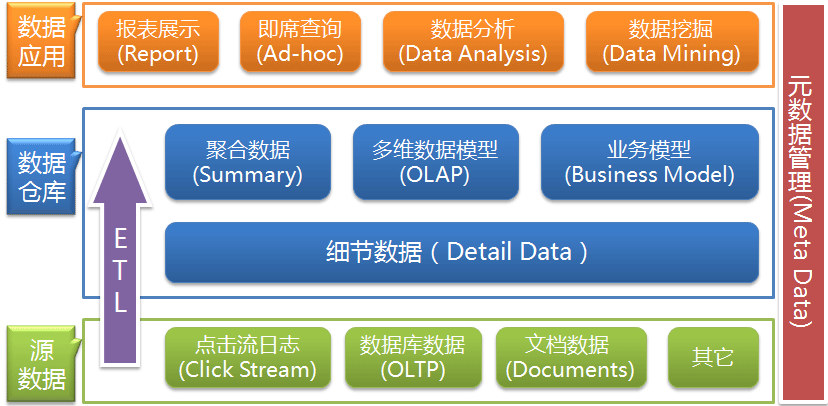
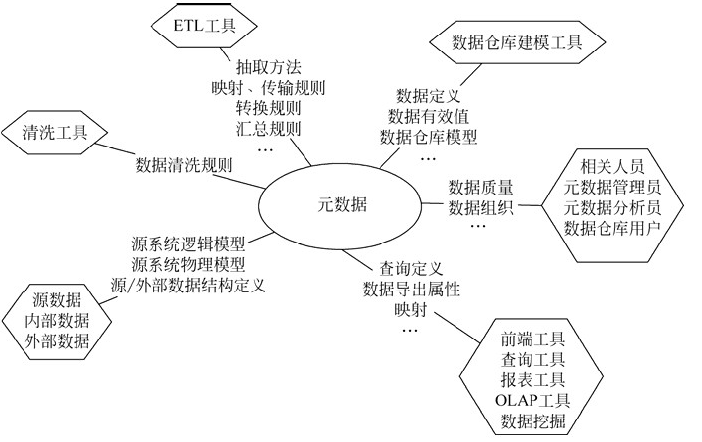
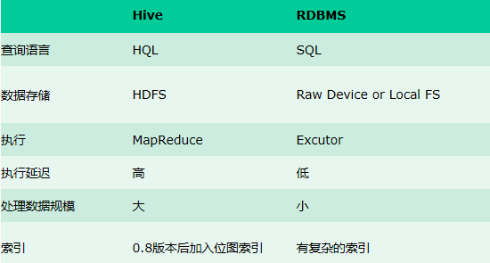
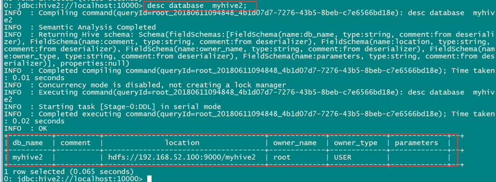
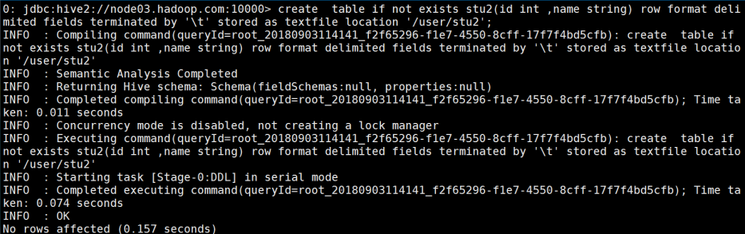
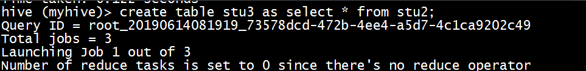

# 	hive01

## 1. 数据仓库的基本概念

数据仓库概念:

​	英文名称为Data Warehouse，可简写为DW或DWH。数据仓库的目的是构建面向分析的集成化数据环境，为企业提供决策支持（Decision Support）。它出于分析性报告和决策支持目的而创建。

​	数据仓库本身并不“生产”任何数据，同时自身也不需要“消费”任何的数据，数据来源于外部，并且开放给外部应用，这也是为什么叫“仓库”，而不叫“工厂”的原因。

基本特征: 

​	数据仓库是面向主题的（Subject-Oriented ）、集成的（Integrated）、非易失的（Non-Volatile）和时变的（Time-Variant ）数据集合，用以支持管理决策。

* 1) 面向主题:

```
	传统数据库中，最大的特点是面向应用进行数据的组织，各个业务系统可能是相互分离的。而数据仓库则是面向主题的。主题是一个抽象的概念，是较高层次上企业信息系统中的数据综合、归类并进行分析利用的抽象。在逻辑意义上，它是对应企业中某一宏观分析领域所涉及的分析对象。
	操作型处理（传统数据）对数据的划分并不适用于决策分析。而基于主题组织的数据则不同，它们被划分为各自独立的领域，每个领域有各自的逻辑内涵但互不交叉，在抽象层次上对数据进行完整、一致和准确的描述。一些主题相关的数据通常分布在多个操作型系统中。
```

* 2) 集成性:

```
	通过对分散、独立、异构的数据库数据进行抽取、清理、转换和汇总便得到了数据仓库的数据，这样保证了数据仓库内的数据关于整个企业的一致性。 
	数据仓库中的综合数据不能从原有的数据库系统直接得到。因此在数据进入数据仓库之前，必然要经过统一与综合，这一步是数据仓库建设中最关键、最复杂的一步，所要完成的工作有： 
（1）要统一源数据中所有矛盾之处，如字段的同名异义、异名同义、单位不统一、字长不一致，等等。 
（2）进行数据综合和计算。数据仓库中的数据综合工作可以在从原有数据库抽取数据时生成，但许多是在数据仓库内部生成的，即进入数据仓库以后进行综合生成的。 
下图说明一个保险公司综合数据的简单处理过程，其中数据仓库中与“保险” 主题有关的数据来自于多个不同的操作型系统。这些系统内部数据的命名可能不同，数据格式也可能不同。把不同来源的数据存储到数据仓库之前，需要去除这些不一致。
```


* 3) 非易失性（不可更新性）

```
	操作型数据库主要服务于日常的业务操作，使得数据库需要不断地对数据实时更新，以便迅速获得当前最新数据，不至于影响正常的业务运作。在数据仓库中只要保存过去的业务数据，不需要每一笔业务都实时更新数据仓库，而是根据商业需要每隔一段时间把一批较新的数据导入数据仓库。 
	数据仓库的数据反映的是一段相当长的时间内历史数据的内容，是不同时点的数据库快照的集合，以及基于这些快照进行统计、综合和重组的导出数据。 
	数据非易失性主要是针对应用而言。数据仓库的用户对数据的操作大多是数据查询或比较复杂的挖掘，一旦数据进入数据仓库以后，一般情况下被较长时间保留。数据仓库中一般有大量的查询操作，但修改和删除操作很少。因此，数据经加工和集成进入数据仓库后是极少更新的，通常只需要定期的加载和更新。
```

* 4) 时变性

```
	数据仓库包含各种粒度的历史数据。数据仓库中的数据可能与某个特定日期、星期、月份、季度或者年份有关。数据仓库的目的是通过分析企业过去一段时间业务的经营状况，挖掘其中隐藏的模式。虽然数据仓库的用户不能修改数据，但并不是说数据仓库的数据是永远不变的。分析的结果只能反映过去的情况，当业务变化后，挖掘出的模式会失去时效性。因此数据仓库的数据需要更新，以适应决策的需要。从这个角度讲，数据仓库建设是一个项目，更是一个过程 。数据仓库的数据随时间的变化表现在以下几个方面。
（1）	数据仓库的数据时限一般要远远长于操作型数据的数据时限。
（2）	操作型系统存储的是当前数据，而数据仓库中的数据是历史数据。
（3）	数据仓库中的数据是按照时间顺序追加的，它们都带有时间属性。
```

### 1.1 数据仓库与数据库的区别

​	数据库与数据仓库的区别实际讲的是 OLTP 与 OLAP 的区别。 

​	操作型处理，叫联机事务处理 OLTP（On-Line Transaction Processing，），也可以称面向交易的处理系统，它是针对具体业务在数据库联机的日常操作，通常对少数记录进行查询、修改。用户较为关心操作的响应时间、数据的安全性、完整性和并发支持的用户数等问题。传统的数据库系统作为数据管理的主要手段，主要用于操作型处理。 

​	分析型处理，叫联机分析处理 OLAP（On-Line Analytical Processing）一般针对某些主题的历史数据进行分析，支持管理决策。

​	首先要明白，数据仓库的出现，并不是要取代数据库。数据库是面向事务的设计，数据仓库是面向主题设计的。数据库一般存储业务数据，数据仓库存储的一般是历史数据。

​	数据库设计是尽量避免冗余，一般针对某一业务应用进行设计，比如一张简单的User表，记录用户名、密码等简单数据即可，符合业务应用，但是不符合分析。数据仓库在设计是有意引入冗余，依照分析需求，分析维度、分析指标进行设计。

​	数据库是为捕获数据而设计，数据仓库是为分析数据而设计。

​	以银行业务为例。数据库是事务系统的数据平台，客户在银行做的每笔交易都会写入数据库，被记录下来，这里，可以简单地理解为用数据库记账。数据仓库是分析系统的数据平台，它从事务系统获取数据，并做汇总、加工，为决策者提供决策的依据。比如，某银行某分行一个月发生多少交易，该分行当前存款余额是多少。如果存款又多，消费交易又多，那么该地区就有必要设立ATM了。 

​	显然，银行的交易量是巨大的，通常以百万甚至千万次来计算。事务系统是实时的，这就要求时效性，客户存一笔钱需要几十秒是无法忍受的，这就要求数据库只能存储很短一段时间的数据。而分析系统是事后的，它要提供关注时间段内所有的有效数据。这些数据是海量的，汇总计算起来也要慢一些，但是，只要能够提供有效的分析数据就达到目的了。 

​	数据仓库，是在数据库已经大量存在的情况下，为了进一步挖掘数据资源、为了决策需要而产生的，它决不是所谓的“大型数据库”。

### 1.2 数据仓库分层架构

​	按照数据流入流出的过程，数据仓库架构可分为三层——**源数据**、**数据仓库**、**数据应用。**



​	数据仓库的数据来源于不同的源数据，并提供多样的数据应用，数据自下而上流入数据仓库后向上层开放应用，而数据仓库只是中间集成化数据管理的一个平台。

​	**源数据层（ODS）**：此层数据无任何更改，直接沿用外围系统数据结构和数据，不对外开放；为临时存储层，是接口数据的临时存储区域，为后一步的数据处理做准备。

​	**数据仓库层（DW）**：也称为细节层，DW层的数据应该是一致的、准确的、干净的数据，即对源系统数据进行了清洗（去除了杂质）后的数据。

​	**数据应用层（DA或APP）**：前端应用直接读取的数据源；根据报表、专题分析需求而计算生成的数据。

​	数据仓库从各数据源获取数据及在数据仓库内的数据转换和流动都可以认为是ETL（**抽取Extra, 转化Transfer, 装载Load**）的过程，ETL是数据仓库的流水线，也可以认为是数据仓库的血液，它维系着数据仓库中数据的新陈代谢，而数据仓库日常的管理和维护工作的大部分精力就是保持ETL的正常和稳定。


那么为什么要数据仓库进行分层呢?

​	用空间换时间，通过大量的预处理来提升应用系统的用户体验（效率），因此数据仓库会存在大量冗余的数据；不分层的话，如果源业务系统的业务规则发生变化将会影响整个数据清洗过程，工作量巨大。

​	通过数据分层管理可以简化数据清洗的过程，因为把原来一步的工作分到了多个步骤去完成，相当于把一个复杂的工作拆成了多个简单的工作，把一个大的黑盒变成了一个白盒，每一层的处理逻辑都相对简单和容易理解，这样我们比较容易保证每一个步骤的正确性，当数据发生错误的时候，往往我们只需要局部调整某个步骤即可。

### 1.3 数据仓库元数据的管理

​	元数据（Meta Date），主要记录数据仓库中模型的定义、各层级间的映射关系、监控数据仓库的数据状态及ETL的任务运行状态。一般会通过元数据资料库（Metadata Repository）来统一地存储和管理元数据，其主要目的是使数据仓库的设计、部署、操作和管理能达成协同和一致。

​	元数据是数据仓库管理系统的重要组成部分，元数据管理是企业级数据仓库中的关键组件，贯穿数据仓库构建的整个过程，直接影响着数据仓库的构建、使用和维护。

* 构建数据仓库的主要步骤之一是ETL。这时元数据将发挥重要的作用，它定义了源数据系统到数据仓库的映射、数据转换的规则、数据仓库的逻辑结构、数据更新的规则、数据导入历史记录以及装载周期等相关内容。数据抽取和转换的专家以及数据仓库管理员正是通过元数据高效地构建数据仓库。

*  用户在使用数据仓库时，通过元数据访问数据，明确数据项的含义以及定制报表。
* 数据仓库的规模及其复杂性离不开正确的元数据管理，包括增加或移除外部数据源，改变数据清洗方法，控制出错的查询以及安排备份等



​	元数据可分为技术元数据和业务元数据。技术元数据为开发和管理数据仓库的IT 人员使用，它描述了与数据仓库开发、管理和维护相关的数据，包括数据源信息、数据转换描述、数据仓库模型、数据清洗与更新规则、数据映射和访问权限等。而业务元数据为管理层和业务分析人员服务，从业务角度描述数据，包括商务术语、数据仓库中有什么数据、数据的位置和数据的可用性等，帮助业务人员更好地理解数据仓库中哪些数据是可用的以及如何使用。

​	由上可见，元数据不仅定义了数据仓库中数据的模式、来源、抽取和转换规则等，而且是整个数据仓库系统运行的基础，元数据把数据仓库系统中各个松散的组件联系起来，组成了一个有机的整体。

## 2. hive基本概念

### 2.1 hive的简介

​	Hive是基于Hadoop的一个数据仓库工具，可以将结构化的数据文件映射为一张数据库表，并提供类SQL查询功能。

​	其本质是将SQL转换为MapReduce的任务进行运算，底层由HDFS来提供数据的存储，说白了hive可以理解为一个将SQL转换为MapReduce的任务的工具，甚至更进一步可以说hive就是一个MapReduce的客户端

为什么要使用hive ???

​	主要的原因有以下几点: 

 		学习MapReduce的成本比较高, 项目周期要求太短, MapReduce如果要实现复杂的查询逻辑开发的难度是比较大的

​		而如果使用hive, hive采用操作接口类似SQL语法, 提高快速开发的能力. 避免去书写MapReduce,减少学习成本, 而且提供了功能的扩展


hive的特点:

* 1) 可扩展 :  Hive可以自由的扩展集群的规模，一般情况下不需要重启服务。
* 2) 延展性 :  Hive支持用户自定义函数，用户可以根据自己的需求来实现自己的函数。
* 3) 容错 :  良好的容错性，节点出现问题SQL仍可完成执行。

### 2.2 hive的架构


基本组成:

​	**用户接口**：包括CLI、JDBC/ODBC、WebGUI。其中，CLI(command line interface)为shell命令行；JDBC/ODBC是Hive的JAVA实现，与传统数据库JDBC类似；WebGUI是通过浏览器访问Hive。

​	**元数据存储**：通常是存储在关系数据库如mysql/derby中。Hive 将元数据存储在数据库中。Hive 中的元数据包括表的名字，表的列和分区及其属性，表的属性（是否为外部表等），表的数据所在目录等。

​	**解释器、编译器、优化器、执行器**:完成HQL 查询语句从词法分析、语法分析、编译、优化以及查询计划的生成。生成的查询计划存储在HDFS 中，并在随后有MapReduce 调用执行。

### 2.3 hive与hadoop的关系

​	Hive利用HDFS存储数据，利用MapReduce查询分析数据


### 2.4 hive与传统数据库对比

​	hive主要是用于海量数据的离线数据分析



```
	1.查询语言。由于 SQL 被广泛的应用在数据仓库中，因此，专门针对 Hive 的特性设计了类 SQL 的查询语言 HQL。熟悉 SQL 开发的开发者可以很方便的使用 Hive 进行开发。 
	2.数据存储位置。Hive 是建立在 Hadoop 之上的，所有 Hive 的数据都是存储在 HDFS 中的。而数据库则可以将数据保存在块设备或者本地文件系统中。 
	3.数据格式。Hive 中没有定义专门的数据格式，数据格式可以由用户指定，用户定义数据格式需要指定三个属性：列分隔符（通常为空格、”\t”、”\x001″）、行分隔符（”\n”）以及读取文件数据的方法（Hive 中默认有三个文件格式 TextFile，SequenceFile 以及 RCFile）。由于在加载数据的过程中，不需要从用户数据格式到 Hive 定义的数据格式的转换，因此，Hive 在加载的过程中不会对数据本身进行任何修改，而只是将数据内容复制或者移动到相应的 HDFS 目录中。而在数据库中，不同的数据库有不同的存储引擎，定义了自己的数据格式。所有数据都会按照一定的组织存储，因此，数据库加载数据的过程会比较耗时。 
	4.数据更新。由于 Hive 是针对数据仓库应用设计的，而数据仓库的内容是读多写少的。因此，Hive 中不支持对数据的改写和添加，所有的数据都是在加载的时候中确定好的。而数据库中的数据通常是需要经常进行修改的，因此可以使用 INSERT INTO ...  VALUES 添加数据，使用 UPDATE ... SET 修改数据。 
	5.索引。之前已经说过，Hive 在加载数据的过程中不会对数据进行任何处理，甚至不会对数据进行扫描，因此也没有对数据中的某些 Key 建立索引。Hive 要访问数据中满足条件的特定值时，需要暴力扫描整个数据，因此访问延迟较高。由于 MapReduce 的引入， Hive 可以并行访问数据，因此即使没有索引，对于大数据量的访问，Hive 仍然可以体现出优势。数据库中，通常会针对一个或者几个列建立索引，因此对于少量的特定条件的数据的访问，数据库可以有很高的效率，较低的延迟。由于数据的访问延迟较高，决定了 Hive 不适合在线数据查询。 
	6.执行。Hive 中大多数查询的执行是通过 Hadoop 提供的 MapReduce 来实现的，而数据库通常有自己的执行引擎。 
	7.执行延迟。之前提到，Hive 在查询数据的时候，由于没有索引，需要扫描整个表，因此延迟较高。另外一个导致 Hive 执行延迟高的因素是 MapReduce 框架。由于 MapReduce 本身具有较高的延迟，因此在利用 MapReduce 执行 Hive 查询时，也会有较高的延迟。相对的，数据库的执行延迟较低。当然，这个低是有条件的，即数据规模较小，当数据规模大到超过数据库的处理能力的时候，Hive 的并行计算显然能体现出优势。 
	8.可扩展性。由于 Hive 是建立在 Hadoop 之上的，因此 Hive 的可扩展性是和 Hadoop 的可扩展性是一致的（世界上最大的 Hadoop 集群在 Yahoo!，2009年的规模在 4000 台节点左右）。而数据库由于 ACID 语义的严格限制，扩展行非常有限。目前最先进的并行数据库 Oracle 在理论上的扩展能力也只有 100 台左右。 
	9.数据规模。由于 Hive 建立在集群上并可以利用 MapReduce 进行并行计算，因此可以支持很大规模的数据；对应的，数据库可以支持的数据规模较小。
```

总结：hive具有sql数据库的外表，但应用场景完全不同，hive只适合用来做批量数据统计分析

### 2.5 hive的数据存储

* 1) Hive中所有的数据都存储在 HDFS 中，没有专门的数据存储格式（可支持Text，SequenceFile，ParquetFile，ORC格式RCFILE等）

  SequenceFile是hadoop中的一种文件格式： 文件内容是以序列化的kv对象来组织的

* 2) 只需要在创建表的时候告诉 Hive 数据中的列分隔符和行分隔符，Hive 就可以解析数据。

* 3) Hive 中包含以下数据模型：DB、Table，External Table，Partition，Bucket。

  * db：在hdfs中表现为${hive.metastore.warehouse.dir}目录下一个文件夹

  * table：在hdfs中表现所属db目录下一个文件夹

  * external table：与table类似，不过其数据存放位置可以在任意指定路径

  * partition：在hdfs中表现为table目录下的子目录

  * bucket：在hdfs中表现为同一个表目录下根据hash散列之后的多个文件

## 3. hive的安装部署

​	我们在此处选择第三台机器作为我们hive的安装机器

### 3.1 使用derby版本的hive使用

* 1) 解压hive

```
cd /export/softwares
tar -zxvf hive-1.1.0-cdh5.14.0.tar.gz -C ../servers/
```

* 2) 直接启动  bin/hive

```
cd ../servers/
cd hive-1.1.0-cdh5.14.0/
bin/hive
hive> create database mytest;
```

​	缺点：多个地方安装hive后，每一个hive是拥有一套自己的元数据，大家的库、表就不统一；

### 3.2 使用mysql共享hive元数据

​	需要保证服务器中, 有一台是有mysql, 并且以及开启了远程连接

​	

* 1) 解压hive

```
cd /export/softwares
tar -zxvf hive-1.1.0-cdh5.14.0.tar.gz -C ../servers/
```

* 2) 修改hive的配置文件 : hive-env.sh

```shell
cd  /export/servers/hive-1.1.0-cdh5.14.0/conf
cp hive-env.sh.template hive-env.sh
vim hive-env.sh

#修改以下内容: 
export HADOOP_HOME=/export/servers/hadoop-2.6.0-cdh5.14.0
# Hive Configuration Directory can be controlled by:
export HIVE_CONF_DIR=/export/servers/hive-1.1.0-cdh5.14.0/conf
```

* 3) 修改hive的配置文件: hive-site.xml

```xml
cd /export/servers/hive-1.1.0-cdh5.14.0/conf
vim hive-site.xml

<?xml-stylesheet type="text/xsl" href="configuration.xsl"?>
<configuration>
        <property>
                <name>javax.jdo.option.ConnectionURL</name>
                <value>jdbc:mysql://node03.hadoop.com:3306/hive?createDatabaseIfNotExist=true</value>
        </property>

        <property>
                <name>javax.jdo.option.ConnectionDriverName</name>
                <value>com.mysql.jdbc.Driver</value>
        </property>
        <property>
                <name>javax.jdo.option.ConnectionUserName</name>
                <value>root</value>
        </property>
        <property>
                <name>javax.jdo.option.ConnectionPassword</name>
                <value>123456</value>
        </property>
        <property>
                <name>hive.cli.print.current.db</name>
                <value>true</value>
        </property>
        <property>
                <name>hive.cli.print.header</name>
                <value>true</value>
        </property>
        <property>
                <name>hive.server2.thrift.bind.host</name>
                <value>node03.hadoop.com</value>
        </property>
<!--
        <property>
                <name>hive.metastore.uris</name>
                <value>thrift://node03.hadoop.com:9083</value>
        </property>
-->
</configuration>
```

* 4) 上传mysql的lib驱动包

```
将mysql的lib驱动包上传到hive的lib目录下
	cd /export/servers/hive-1.1.0-cdh5.14.0/lib
将mysql-connector-java-5.1.38.jar 上传到这个目录下
```

## 4. hive的交互窗口

### 4.1 第一种:Hive交互shell

```
cd /export/servers/hive-1.1.0-cdh5.14.0
bin/hive

#查看所有的数据库
	hive (default)> show databases;
#创建一个数据库
	hive (default)> create database myhive;
#使用该数据库并创建数据库表
	hive (default)> use myhive;
	hive (myhive)> create table test(id int,name string);
```

​	以上命令操作完成之后，一定要确认mysql里面出来一个数据库hive

### 4.2 第二种: hive jdbc服务

使用hive的jdbc服务, 需要先启动一个hiveserver2服务. 启动的方式有前台启动和后台启动

​	前台启动:

```
cd  /export/servers/hive-1.1.0-cdh5.14.0
bin/hive --service hiveserver2
```

​	后台启动 : 一般推荐都是后台启动

```
cd  /export/servers/hive-1.1.0-cdh5.14.0
nohup bin/hive --service hiveserver2  &
```

使用beeline连接hiveserver2

```
cd  /export/servers/hive-1.1.0-cdh5.14.0
bin/beeline
beeline> !connect jdbc:hive2://node03.hadoop.com:10000
```


​	注意：如果使用beeline方式连接hiveserver2，一定要保证hive在mysql当中的元数据库已经创建成功，不然就会拒绝连接

### 4.3 第三种: hive命令

```
使用 –e  参数来直接执行hql的语句
bin/hive -e "use myhive;select * from test;"

使用 –f  参数通过指定文本文件来执行hql的语句
编辑一个文件 : vim hive.sql
放入以下内容:
	use myhive;select * from test;
执行命令: 
	bin/hive -f hive.sql
```

​	hive的一些其他的参数:


## 5. hive的DDL语法基本操作

### 5.1 创建数据库操作

* 1) 创建数据库:

```sql
hive (myhive)> create database if not exists myhive;
hive (myhive)> use  myhive;
	说明：hive的表存放位置模式是由hive-site.xml当中的一个属性指定的 :hive.metastore.warehouse.dir


创建数据库并指定hdfs存储位置 :
	hive (myhive)> create database myhive2 location '/myhive2';
```

* 2) 修改数据库:

  可以使用alter  database  命令来修改数据库的一些属性。但是数据库的元数据信息是不可更改的，包括数据库的名称以及数据库所在的位置

```
hive (myhive)> alter  database  myhive2  set  dbproperties('createtime'='20180611');
```

* 3) 查看数据库详细信息

```
查看数据库基本信息
	hive (myhive)> desc  database  myhive2;
查看数据库更多详细信息
	hive (myhive)> desc database extended  myhive2;
```




* 4) 删除数据库

```
删除一个空数据库，如果数据库下面有数据表，那么就会报错
drop  database  myhive2;

强制删除数据库，包含数据库下面的表一起删除
drop  database  myhive  cascade; 这个数据库留着后面还要用，就不要执行给删除掉了。
```

### 5.2 创建数据库表的操作

* 创建数据库表语法

```
CREATE [EXTERNAL] TABLE [IF NOT EXISTS] table_name  
   [(col_name data_type [COMMENT col_comment], ...)] 
   [COMMENT table_comment] 
   [PARTITIONED BY (col_name data_type [COMMENT col_comment], ...)] 
   [CLUSTERED BY (col_name, col_name, ...) 
   [SORTED BY (col_name [ASC|DESC], ...)] INTO num_buckets BUCKETS] 
   [ROW FORMAT row_format] 
   [STORED AS file_format] 
   [LOCATION hdfs_path]
```

说明：

​	1、CREATE TABLE 创建一个指定名字的表。如果相同名字的表已经存在，则抛出异常；用户可以用 IF NOT EXISTS 选项来忽略这个异常。

​	2、EXTERNAL关键字可以让用户创建一个外部表，在建表的同时指定一个指向实际数据的路径（LOCATION），Hive 创建内部表时，会将数据移动到数据仓库指向的路径；若创建外部表，仅记录数据所在的路径，不对数据的位置做任何改变。在删除表的时候，内部表的元数据和数据会被一起删除，而外部表只删除元数据，不删除数据。

​	3、 LIKE 允许用户复制现有的表结构，但是不复制数据。

​	4、 ROW FORMAT DELIMITED [FIELDS TERMINATED BY char][COLLECTION ITEMS TERMINATED BY char]  [MAP KEYS TERMINATED BY char][LINES TERMINATED BY char] **|** SERDE serde_name [WITH SERDEPROPERTIES (property_name=property_value, property_name=property_value, ...)]

​	用户在建表的时候可以自定义 SerDe 或者使用自带的 SerDe。如果没有指定 ROW FORMAT 或者 ROW FORMAT DELIMITED，将会使用自带的 SerDe。在建表的时候，用户还需要为表指定列，用户在指定表的列的同时也会指定自定义的 SerDe，Hive通过 SerDe 确定表的具体的列的数据。

​	5、 STORED AS SEQUENCEFILE|TEXTFILE|RCFILE

​	如果文件数据是纯文本，可以使用 STORED AS TEXTFILE。如果数据需要压缩，使用 STORED AS SEQUENCEFILE。

 

​	6、CLUSTERED BY

​	对于每一个表（table）或者分区， Hive可以进一步组织成桶，也就是说桶是更为细粒度的数据范围划分。Hive也是 针对某一列进行桶的组织。Hive采用对列值哈希，然后除以桶的个数求余的方式决定该条记录存放在哪个桶当中。 

​	把表（或者分区）组织成桶（Bucket）有两个理由：

​		（1）获得更高的查询处理效率。桶为表加上了额外的结构，Hive 在处理有些查询时能利用这个结构。具体而言，连接两个在（包含连接列的）相同列上划分了桶的表，可以使用 Map 端连接 （Map-side join）高效的实现。比如JOIN操作。对于JOIN操作两个表有一个相同的列，如果对这两个表都进行了桶操作。那么将保存相同列值的桶进行JOIN操作就可以，可以大大较少JOIN的数据量。

​		（2）使取样（sampling）更高效。在处理大规模数据集时，在开发和修改查询的阶段，如果能在数据集的一小部分数据上试运行查询，会带来很多方便。


#### 5.2.1 对管理表(内部表)的操作:

* hive建表的初体验:

```sql
hive (myhive)> use myhive;
hive (myhive)> create table stu(id int,name string);
hive (myhive)> insert into stu values (1,"zhangsan");
hive (myhive)> select * from stu;
```

* hive建表时候的字段类型:

| **分类** | **类型**                                   | **描述**                                       | **字面量示例**                                               |
| -------- | ------------------------------------------ | ---------------------------------------------- | ------------------------------------------------------------ |
| 原始类型 | BOOLEAN                                    | true/false                                     | TRUE                                                         |
|          | TINYINT                                    | 1字节的有符号整数 -128~127                     | 1Y                                                           |
|          | SMALLINT                                   | 2个字节的有符号整数，-32768~32767              | 1S                                                           |
|          | **INT**                                    | 4个字节的带符号整数                            | 1                                                            |
|          | BIGINT                                     | 8字节带符号整数                                | 1L                                                           |
|          | FLOAT                                      | 4字节单精度浮点数1.0                           |                                                              |
|          | DOUBLE                                     | 8字节双精度浮点数                              | 1.0                                                          |
|          | DEICIMAL                                   | 任意精度的带符号小数                           | 1.0                                                          |
|          | **STRING**                                 | 字符串，变长                                   | “a”,’b’                                                      |
|          | VARCHAR                                    | 变长字符串                                     | “a”,’b’                                                      |
|          | CHAR                                       | 固定长度字符串                                 | “a”,’b’                                                      |
|          | BINARY                                     | 字节数组                                       | 无法表示                                                     |
|          | TIMESTAMP                                  | 时间戳，毫秒值精度                             | 122327493795                                                 |
|          | **DATE**                                   | 日期                                           | ‘2016-03-29’                                                 |
|          | [INTERVAL](#LanguageManualTypes-Intervals) | 时间频率间隔                                   |                                                              |
| 复杂类型 | ARRAY                                      | 有序的的同类型的集合                           | array(1,2)                                                   |
|          | MAP                                        | key-value,key必须为原始类型，value可以任意类型 | map(‘a’,1,’b’,2)                                             |
|          | STRUCT                                     | 字段集合,类型可以不同                          | struct(‘1’,1,1.0), named_stract(‘col1’,’1’,’col2’,1,’clo3’,1.0) |
|          | UNION                                      | 在有限取值范围内的一个值                       | create_union(1,’a’,63)                                       |

* 创建表并指定字段之间的分隔符

```sql
hive (myhive)> create  table if not exists stu2(id int ,name string) row format delimited fields terminated by '\t' stored as textfile location '/user/stu2';
```



* 根据查询结果创建表

```
hive (myhive)> create table stu3 as select * from stu2;
```



* 根据已经存在的表结构创建表

```
hive (myhive)> create table stu4 like stu2;
```


* 查询表的结构

```
hive (myhive)> desc formatted  stu2;
```


*******************

#### 5.2.2 对外部表操作

​	外部表因为是指定其他的hdfs路径的数据加载到表当中来，所以hive表会认为自己不完全独占这份数据，所以删除hive表的时候，数据仍然存放在hdfs当中，不会删掉

管理(内部)表和外部表的使用场景:

​	每天将收集到的网站日志定期流入HDFS文本文件。在外部表（原始日志表）的基础上做大量的统计分析，用到的中间表、结果表使用内部表存储，数据通过SELECT+INSERT进入内部表。

对外部表的操作:

​	构建两张外部表, 一张老师表, 一张学生表, 并向表中添加一些数据

* 1) 构建老师表

```sql
hive (myhive)> create external table teacher (t_id string,t_name string) row format delimited fields terminated by '\t';
```

* 2) 创建学生表

```sql
hive (myhive)> create external table student (s_id string,s_name string,s_birth string , s_sex string ) row format delimited fields terminated by '\t';
```

* 3) 从本地文件系统向表中加载数据

```
hive (myhive)> load data local inpath '/export/servers/hivedatas/student.csv' into table student;

加载数据并覆盖已有数据 :
hive (myhive)> load data local inpath '/export/servers/hivedatas/student.csv' overwrite  into table student;
```

* 4) 从hdfs文件系统向表中加载数据:

```sql
cd /export/servers/hivedatas
hdfs dfs -mkdir -p /hivedatas
hdfs dfs -put techer.csv /hivedatas/
hive (myhive)> load data inpath '/hivedatas/techer.csv' into table techer;

如果删掉student表，hdfs的数据仍然存在，并且重新创建表之后，表中就直接存在数据了,因为我们的student表使用的是外部表，drop table之后，表当中的数据依然保留在hdfs上面了
```

#### 5.2.3 对分区表的操作

​	在大数据中，最常用的一种思想就是分治，我们可以把大的文件切割划分成一个个的小的文件，这样每次操作一个小的文件就会很容易了，同样的道理，在hive当中也是支持这种思想的，就是我们可以把大的数据，按照每天，或者每小时进行切分成一个个的小的文件，这样去操作小的文件就会容易得多了

* 创建分区表的语法:

```
hive (myhive)> create table score(s_id string,c_id string, s_score int) partitioned by (month string) row format delimited fields terminated by '\t';
```

* 创建一个表带多个分区

```
hive (myhive)> create table score2 (s_id string,c_id string, s_score int) partitioned by (year string,month string,day string) row format delimited fields terminated by '\t';
```

* 加载数据到分区表中

```
hive (myhive)> load data local inpath '/export/servers/hivedatas/score.csv' into table score partition (month='201806');
```

* 加载数据到一个多分区的表中去

 ```
hive (myhive)> load data local inpath '/export/servers/hivedatas/score.csv' into table score2 partition(year='2018',month='06',day='01');
 ```

* 查看分区:

```
hive (myhive)> show  partitions  score;
```

* 添加一个分区

```
hive (myhive)> alter table score add partition(month='201805');
```

* 同时添加多个分区

```
hive (myhive)> alter table score add partition(month='201804') partition(month = '201803');
```

​	注意：添加分区之后就可以在hdfs文件系统当中看到表下面多了一个文件夹

* 删除分区:

```
hive (myhive)> alter table score drop partition(month = '201806');
```


********************

关于外部分区表综合练习: 

​	需求描述：现在有一个文件score.csv文件，存放在集群的这个目录下/scoredatas/day=20180607，这个文件每天都会生成，存放到对应的日期文件夹下面去，文件别人也需要公用，不能移动。需求，创建hive对应的表，并将数据加载到表中，进行数据统计分析，且删除表之后，数据不能删除

​	数据准备:

```
hdfs dfs -mkdir -p /scoredatas/day=20180607
hdfs dfs -mkdir -p /scoredatas/day=20180608
hdfs dfs -put score.csv /scoredatas/day=20180607/
hdfs dfs -put score.csv /scoredatas/day=20180608/
```

实现步骤: 

* 1) 创建外部分区表, 并指定文件数据存储目录

```
hive (myhive)> create external table score4(s_id string, c_id string,s_score int) partitioned by (day string) row format delimited fields terminated by '\t' location '/scoredatas';
```

* 2) 进行表的修复,说白了就是建立我们表与我们数据文件之间的一个关系映射

```
hive (myhive)> msck  repair   table  score4; 
	修复成功之后即可看到数据已经全部加载到表当中去了
	
除了通过修复来建立关系映射, 也可以手动添加分区实现
	alter table score4 add partition(day='20180607');
```


#### 5.2.4 对分桶表操作

​	将数据按照指定的字段进行分成多个桶中去，说白了就是将数据按照字段进行划分，可以将数据按照字段划分到多个文件当中去

* 开启hive的捅表功能

```
hive (myhive)> set hive.enforce.bucketing=true;
```

* 设置reduce的个数

```
hive (myhive)> set mapreduce.job.reduces=3;
```

* 创建桶表

```
hive (myhive)> create table course (c_id string,c_name string,t_id string) clustered by(c_id) into 3 buckets row format delimited fields terminated by '\t';
```

​	桶表的数据加载，由于桶表的数据加载通过hdfs  dfs  -put文件或者通过load  data均不好使，只能通过insert  overwrite

​	创建普通表，并通过insert  overwrite的方式将普通表的数据通过查询的方式加载到桶表当中去

* 创建普通表

```
hive (myhive)> create table course_common (c_id string,c_name string,t_id string) row format delimited fields terminated by '\t';
```

* 普通表中加载数据

```
hive (myhive)> load data local inpath '/export/servers/hivedatas/course.csv' into table course_common;
```

* 通过insert  overwrite给桶表中加载数据

```
hive (myhive)> insert overwrite table course select * from course_common cluster by(c_id);
```

#### 5.2.5 修改表和删除表

修改表的操作:

* 表的重命名

```
语法: alter  table  old_table_name  rename  to  new_table_name;

例如: 把表score4修改成score5
	hive (myhive)> alter table score4 rename to score5;
```

* 增加/修改列信息

```
1）查询表结构
	hive (myhive)> desc score5;
2）添加列
	hive (myhive)> alter table score5 add columns (mycol string, mysco string);
3）查询表结构
	hive (myhive)> desc score5;
4）更新列
	hive (myhive)> alter table score5 change column mysco mysconew int;
5）查询表结构
	hive (myhive)> desc score5;
```

删除表操作:

```
hive (myhive)> drop table score5;
```

#### 5.2.6 往hive表中加载数据

向hive表中添加数据, 有多种方式, 重点掌握其中的几种方式即可

* 1) 直接向分区表中插入数据（强烈不推荐使用）

```sql
hive (myhive)> create table score3 like score;
hive (myhive)> insert into table score3 partition(month ='201807') values ('001','002','100');
```

* 2) 通过load方式加载数据（必须掌握）

```
hive (myhive)> load data local inpath '/export/servers/hivedatas/score.csv' overwrite into table score partition(month='201806');
```

* 3) 通过查询方式加载数据（必须掌握）

```
hive (myhive)> create table score4 like score;
hive (myhive)> insert overwrite table score4 partition(month = '201806') select s_id,c_id,s_score from score;
```

* 4) 多插入模式

  常用于实际生产环境当中，将一张表拆开成两部分或者多部分

```
给score表加载数据: 
	hive (myhive)> load data local inpath '/export/servers/hivedatas/score.csv' overwrite into table score partition(month='201806');

创建第一部分表：
	hive (myhive)> create table score_first( s_id string,c_id  string) partitioned by (month string) row format delimited fields terminated by '\t' ;

创建第二部分表：
	hive (myhive)> create table score_second(c_id string,s_score int) partitioned by (month string) row format delimited fields terminated by '\t';

分别给第一部分与第二部分表加载数据: 
	hive (myhive)> from score insert overwrite table score_first partition(month='201806') select s_id,c_id insert overwrite table score_second partition(month = '201806')  select c_id,s_score;
```

* 5) 查询语句中创建表并加载数据（as select）

```
hive (myhive)> create table score5 as select * from score;
```

* 6) 在创建表是通过location指定加载数据的路径

```
1）创建表，并指定在hdfs上的位置
	hive (myhive)> create external table score6 (s_id string,c_id string,s_score int) row format delimited fields terminated by '\t' location '/myscore6';

2）上传数据到hdfs上，我们也可以直接在hive客户端下面通过dfs命令来进行操作hdfs的数据
	hive (myhive)>  dfs -mkdir -p /myscore7;
	hive (myhive)> dfs -put /export/servers/hivedatas/score.csv /myscore7;

3）查询数据
	hive (myhive)> select * from score6;
```

* 7) export导出与import 导入 hive表数据（内部表操作）

```
 hive (myhive)> create table techer2 like techer;
hive (myhive)> export table techer to  '/export/techer';
hive (myhive)> import table techer2 from '/export/techer';
```

#### 5.2.7 hive表中数据导出

​	将hive表中的数据导出到其他任意目录，例如linux本地磁盘，例如hdfs，例如mysql等等

* insert导出

```
1）将查询的结果导出到本地
	hive (myhive)> insert overwrite local directory '/export/servers/exporthive' select * from score;

2）将查询的结果格式化导出到本地
	hive (myhive)> insert overwrite local directory '/export/servers/exporthive' row format delimited fields terminated by '\t' collection items terminated by '#' select * from student;

3）将查询的结果导出到HDFS上(没有local)
	hive (myhive)> insert overwrite directory '/export/servers/exporthive' row format delimited fields terminated by '\t' collection items terminated by '#' select * from score;
```

* Hadoop命令导出到本地

```
hive (myhive)> dfs -get /export/servers/exporthive/000000_0 /export/servers/exporthive/local.txt;
```

* hive shell 命令导出

  基本语法：（hive -f/-e 执行语句或者脚本 > file）

```
[root@node03 hivedatas]# cd /export/servers/hive-1.1.0-cdh5.14.0/
[root@node03 hive-1.1.0-cdh5.14.0]# bin/hive -e "select * from myhive.score;" > /export/servers/exporthive/score.txt
```

* export导出到HDFS上

```
hive (myhive)> export table score to '/export/exporthive/score';
```

* sqoop导出 : 后续说

#### 5.2.8 清空表数据

​	只能清空管理表，也就是内部表

​	清空外部表score6，会产生错误

```
hive (myhive)> truncate table score6;
FAILED: SemanticException [Error 10146]: Cannot truncate non-managed table score6.
```

## 6. hive的DQL查询语法

### 6.1 单表查询

语法格式:

```
SELECT [ALL | DISTINCT] select_expr, select_expr, ... 
FROM table_reference
[WHERE where_condition] 
[GROUP BY col_list [HAVING condition]] 
[CLUSTER BY col_list 
  | [DISTRIBUTE BY col_list] [SORT BY| ORDER BY col_list] 
] 
[LIMIT number]
```

注：

​	1、order by 会对输入做全局排序，因此只有一个reducer，会导致当输入规模较大时，需要较长的计算时间。

​	2、sort by不是全局排序，其在数据进入reducer前完成排序。因此，如果用sort by进行排序，并且设置mapred.reduce.tasks>1，则sort by只保证每个reducer的输出有序，不保证全局有序。

​	3、distribute by(字段)根据指定的字段将数据分到不同的reducer，且分发算法是hash散列。

​	4、Cluster by(字段) 除了具有Distribute by的功能外，还会对该字段进行排序。

​	因此，如果分桶和sort字段是同一个时，此时，cluster by = distribute by + sort by

分桶表的作用：最大的作用是用来提高join操作的效率；

（思考这个问题：select a.id,a.name,b.addr from a join b on a.id = b.id;如果a表和b表已经是分桶表，而且分桶的字段是id字段做这个join操作时，还需要全表做笛卡尔积吗？）

* 全表查询:

```
hive (myhive)> select * from score;
```

* 选择特定列查询

```
hive (myhive)> select s_id ,c_id from score;
```

* 列别名

```
hive (myhive)> select s_id as myid ,c_id from score;
```

* 常用聚合函数使用: 

```
1）求总行数（count）
	hive (myhive)> select count(1) from score;
2）求分数的最大值（max）
	hive (myhive)> select max(s_score) from score;
3）求分数的最小值（min）
	hive (myhive)> select min(s_score) from score;
4）求分数的总和（sum）
	hive (myhive)> select sum(s_score) from score;
5）求分数的平均值（avg）
	hive (myhive)> select avg(s_score) from score;
```

* LIMIT语句

```
hive (myhive)> select * from score limit 3;
```

* WHERE语句

```
hive (myhive)> select * from score where s_score > 60;
```

* 比较运算符使用

| 操作符                  | 支持的数据类型 | 描述                                                         |
| ----------------------- | -------------- | ------------------------------------------------------------ |
| A=B                     | 基本数据类型   | 如果A等于B则返回TRUE，反之返回FALSE                          |
| A<=>B                   | 基本数据类型   | 如果A和B都为NULL，则返回TRUE，其他的和等号（=）操作符的结果一致，如果任一为NULL则结果为NULL |
| A<>B, A!=B              | 基本数据类型   | A或者B为NULL则返回NULL；如果A不等于B，则返回TRUE，反之返回FALSE |
| A<B                     | 基本数据类型   | A或者B为NULL，则返回NULL；如果A小于B，则返回TRUE，反之返回FALSE |
| A<=B                    | 基本数据类型   | A或者B为NULL，则返回NULL；如果A小于等于B，则返回TRUE，反之返回FALSE |
| A>B                     | 基本数据类型   | A或者B为NULL，则返回NULL；如果A大于B，则返回TRUE，反之返回FALSE |
| A>=B                    | 基本数据类型   | A或者B为NULL，则返回NULL；如果A大于等于B，则返回TRUE，反之返回FALSE |
| A [NOT] BETWEEN B AND C | 基本数据类型   | 如果A，B或者C任一为NULL，则结果为NULL。如果A的值大于等于B而且小于或等于C，则结果为TRUE，反之为FALSE。如果使用NOT关键字则可达到相反的效果。 |
| A IS NULL               | 所有数据类型   | 如果A等于NULL，则返回TRUE，反之返回FALSE                     |
| A IS NOT NULL           | 所有数据类型   | 如果A不等于NULL，则返回TRUE，反之返回FALSE                   |
| IN(数值1, 数值2)        | 所有数据类型   | 使用 IN运算显示列表中的值                                    |
| A [NOT] LIKE B          | STRING 类型    | B是一个SQL下的简单正则表达式，如果A与其匹配的话，则返回TRUE；反之返回FALSE。B的表达式说明如下：‘x%’表示A必须以字母‘x’开头，‘%x’表示A必须以字母’x’结尾，而‘%x%’表示A包含有字母’x’,可以位于开头，结尾或者字符串中间。如果使用NOT关键字则可达到相反的效果。 |
| A RLIKE B, A REGEXP B   | STRING 类型    | B是一个正则表达式，如果A与其匹配，则返回TRUE；反之返回FALSE。匹配使用的是JDK中的正则表达式接口实现的，因为正则也依据其中的规则。例如，正则表达式必须和整个字符串A相匹配，而不是只需与其字符串匹配。 |

```
1）查询分数等于80的所有的数据
	hive (myhive)> select * from score where s_score = 80;
2）查询分数在80到100的所有数据
	hive (myhive)> select * from score where s_score between 80 and 100;
3）查询成绩为空的所有数据
	hive (myhive)> select * from score where s_score is null;
4）查询成绩是80和90的数据
	hive (myhive)> select * from score where s_score in(80,90);
```

* LIKE和RLIKE

  使用LIKE运算选择类似的值

  选择条件可以包含字符或数字:

  ​	% 代表零个或多个字符(任意个字符)。

  ​	_ 代表一个字符。

  RLIKE子句是Hive中这个功能的一个扩展，其可以通过Java的正则表达式这个更强大的语言来指定匹配条件。

```
1）查找以8开头的所有成绩
	hive (myhive)> select * from score where s_score like '8%';
2）查找第二个数值为9的所有成绩数据
	hive (myhive)> select * from score where s_score like '_9%';
3）查找成绩中含9的所有成绩数据
	hive (myhive)> select * from score where s_score rlike '[9]';	
```

* 逻辑运算符（AND/OR/NOT）

| 操作符 | 含义   |
| ------ | ------ |
| AND    | 逻辑并 |
| OR     | 逻辑或 |
| NOT    | 逻辑否 |

```
1）查询成绩大于80，并且s_id是01的数据
	hive (myhive)> select * from score where s_score >80 and s_id = '01';
2）查询成绩大于80，或者s_id  是01的数
	hive (myhive)> select * from score where s_score > 80 or s_id = '01';
3）查询s_id  不是 01和02的学生
	hive (myhive)> select * from score where s_id not in ('01','02');
```

* GROUP BY分组

  GROUP BY语句通常会和聚合函数一起使用，按照一个或者多个列队结果进行分组，然后对每个组执行聚合操作。

```
1）计算每个学生的平均分数
	hive (myhive)> select s_id ,avg(s_score) from score group by s_id;
2）计算每个学生最高成绩
	hive (myhive)> select s_id ,max(s_score) from score group by s_id;
```

​	如果分组后, 对数据进行再次的筛选, 后面需要跟 HAVING语句, 而不能跟where

​	where 和having的区别:

​		1）where针对表中的列发挥作用，查询数据；having针对查询结果中的列发挥作用，筛选数据。

​		2）where后面不能写分组函数，而having后面可以使用分组函数。

​		3）having只用于group by分组统计语句。

```
求每个学生的平均分数
	hive (myhive)> select s_id ,avg(s_score) from score group by s_id;
求每个学生平均分数大于85的人
	hive (myhive)> select s_id ,avg(s_score) avgscore from score group by s_id having avgscore > 85;
```

### 6.2 多表join查询

* 1) 等值join查询

  Hive支持通常的SQL JOIN语句，但是只支持等值连接，不支持非等值连接。

```
查询分数对应的姓名
	hive (myhive)> SELECT s.s_id,s.s_score,stu.s_name,stu.s_birth  FROM score s LEFT JOIN student stu ON s.s_id = stu.s_id;

同时也可以为表起别名
	hive (myhive)> select * from techer t join course c on t.t_id = c.t_id;
```

* 2) 内连接 (INNER JOIN)

  内连接：只有进行连接的两个表中都存在与连接条件相匹配的数据才会被保留下来。

```
hive (myhive)> select * from techer t [inner] join course c on t.t_id = c.t_id;
```

* 3) 左外连接（LEFT OUTER JOIN）

  JOIN操作符左边表中符合WHERE子句的所有记录将会被返回

```
hive (myhive)> select * from techer t left join course c on t.t_id = c.t_id;
```

* 4) 右外连接 （RIGHT OUTER JOIN）

  JOIN操作符右边表中符合WHERE子句的所有记录将会被返回

```
hive (myhive)> select * from techer t right join course c on t.t_id = c.t_id;
```

* 5) 满外(全外)连接: （FULL OUTER JOIN）

  将会返回所有表中符合WHERE语句条件的所有记录。如果任一表的指定字段没有符合条件的值的话，那么就使用NULL值替代。

```
hive (myhive)> SELECT * FROM techer t FULL JOIN course c ON t.t_id = c.t_id ;
```

* 6) 多表连接

  注意：连接 n个表，至少需要n-1个连接条件。例如：连接三个表，至少需要两个连接条件。

```
多表连接查询，查询老师对应的课程，以及对应的分数，对应的学生
hive (myhive)> select * from techer t 
             > left join course c 
             > on t.t_id = c.t_id
             > left join score s 
             > on s.c_id = c.c_id
             > left join student stu 
             > on s.s_id = stu.s_id;
```

​	大多数情况下，Hive会对每对JOIN连接对象启动一个MapReduce任务。本例中会首先启动一个MapReduce job对表techer和表course进行连接操作，然后会再启动一个MapReduce job将第一个MapReduce job的输出和表score;进行连接操作

### 6.3 排序操作 Order By

* 1) 全局排序 ：全局排序，只会有一个reduce

  ASC（ascend）: 升序（默认） DESC（descend）: 降序

```
查询学生的成绩，并按照分数降序排列
	hive (myhive)> SELECT * FROM student s LEFT JOIN score sco ON s.s_id = sco.s_id ORDER BY sco.s_score DESC;

查询学生的成绩，并按照分数升序排列
	hive (myhive)> SELECT * FROM student s LEFT JOIN score sco ON s.s_id = sco.s_id ORDER BY sco.s_score asc;
```

* 2) 使用别名 排序

```
hive (myhive)> select s_id ,avg(s_score) avg from score group by s_id order by avg;
```

* 3) 多个列排序

```
按照学生id和平均成绩进行排序
	hive (myhive)> select s_id ,avg(s_score) avg from score group by s_id order by s_id,avg;
```

* 4) 每个MapReduce内部排序（Sort By）局部排序

  Sort By：每个MapReduce内部进行排序，对全局结果集来说不是排序。

```
设置reduce个数
	hive (myhive)> set mapreduce.job.reduces=3;
查看设置reduce个数
	hive (myhive)> set mapreduce.job.reduces;
查询成绩按照成绩降序排列
	hive (myhive)> select * from score sort by s_score;
将查询结果导入到文件中（按照成绩降序排列）
	hive (myhive)> insert overwrite local directory '/export/servers/hivedatas/sort' select * from score sort by s_score;
```

* 5) 分区排序（DISTRIBUTE BY）

  Distribute By：类似MR中partition，进行分区，结合sort by使用。

  ​	注意，Hive要求DISTRIBUTE BY语句要写在SORT BY语句之前。

  对于distribute by进行测试，一定要分配多reduce进行处理，否则无法看到distribute by的效果。

```
先按照学生id进行分区，再按照学生成绩进行排序。

设置reduce的个数，将我们对应的s_id划分到对应的reduce当中去
	hive (myhive)> set mapreduce.job.reduces=7;
通过distribute by  进行数据的分区
	hive (myhive)> insert overwrite local directory '/export/servers/hivedatas/sort' select * from score distribute by s_id sort by s_score;
```

* 6) CLUSTER BY

  当distribute by和sort by字段相同时，可以使用cluster by方式。

  cluster by除了具有distribute by的功能外还兼具sort by的功能。但是排序只能是正序排序，不能指定排序规则为ASC或者DESC。

```
以下两种写法等价
	hive (myhive)> select * from score cluster by s_id;
	hive (myhive)> select * from score distribute by s_id sort by s_id;
```

