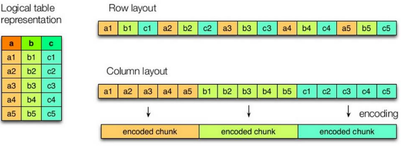
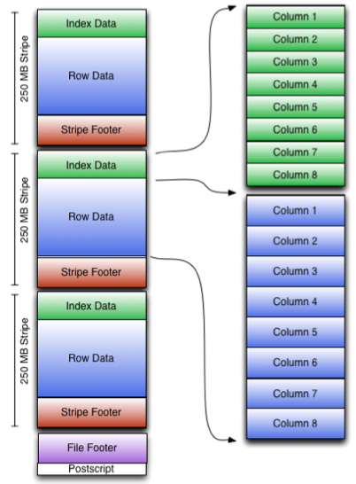

## hive03

## 1. hive的数据压缩

​	在实际工作当中，hive当中处理的数据，一般都需要经过压缩，前期我们在学习hadoop的时候，已经配置过hadoop的压缩，我们这里的hive也是一样的可以使用压缩来节省我们的MR处理的网络带宽

mr支持的压缩格式:

| 压缩格式 | 工具  | 算法    | 文件扩展名 | 是否可切分 |
| -------- | ----- | ------- | ---------- | ---------- |
| DEFAULT  | 无    | DEFAULT | .deflate   | 否         |
| Gzip     | gzip  | DEFAULT | .gz        | 否         |
| bzip2    | bzip2 | bzip2   | .bz2       | 是         |
| LZO      | lzop  | LZO     | .lzo       | 否         |
| LZ4      | 无    | LZ4     | .lz4       | 否         |
| Snappy   | 无    | Snappy  | .snappy    | 否         |

hadoop支持的解压缩的类

| 压缩格式 | 对应的编码/解码器                          |
| -------- | ------------------------------------------ |
| DEFLATE  | org.apache.hadoop.io.compress.DefaultCodec |
| gzip     | org.apache.hadoop.io.compress.GzipCodec    |
| bzip2    | org.apache.hadoop.io.compress.BZip2Codec   |
| LZO      | com.hadoop.compression.lzo.LzopCodec       |
| LZ4      | org.apache.hadoop.io.compress.Lz4Codec     |
| Snappy   | org.apache.hadoop.io.compress.SnappyCodec  |

压缩性能的比较

| 压缩算法 | 原始文件大小 | 压缩文件大小 | 压缩速度 | 解压速度 |
| -------- | ------------ | ------------ | -------- | -------- |
| gzip     | 8.3GB        | 1.8GB        | 17.5MB/s | 58MB/s   |
| bzip2    | 8.3GB        | 1.1GB        | 2.4MB/s  | 9.5MB/s  |
| LZO      | 8.3GB        | 2.9GB        | 49.3MB/s | 74.6MB/s |

​	<http://google.github.io/snappy/>

​	Snappy生成的压缩文件要大20%到100%。在64位模式下的core i7处理器的单内核上，Snappy以250 MB/秒或更多的速度压缩，并以500 MB/秒或更多的速度解压。

实现压缩hadoop需要配置的压缩参数:


****************

hive配置压缩的方式:

* 1) 开启map端的压缩方式:

```
1.1）开启hive中间传输数据压缩功能
	hive (default)>set hive.exec.compress.intermediate=true;
1.2）开启mapreduce中map输出压缩功能
	hive (default)>set mapreduce.map.output.compress=true;
1.3）设置mapreduce中map输出数据的压缩方式
	hive (default)>set mapreduce.map.output.compress.codec= org.apache.hadoop.io.compress.SnappyCodec;
1.4）执行查询语句
	select count(1) from score;
```

* 2) 开启reduce端的压缩方式

```
1）开启hive最终输出数据压缩功能
	hive (default)>set hive.exec.compress.output=true;
2）开启mapreduce最终输出数据压缩
	hive (default)>set mapreduce.output.fileoutputformat.compress=true;
3）设置mapreduce最终数据输出压缩方式
	hive (default)> set mapreduce.output.fileoutputformat.compress.codec = org.apache.hadoop.io.compress.SnappyCodec;
4）设置mapreduce最终数据输出压缩为块压缩
	hive (default)>set mapreduce.output.fileoutputformat.compress.type=BLOCK;
5）测试一下输出结果是否是压缩文件
	insert overwrite local directory '/export/servers/snappy' select * from score distribute by s_id sort by s_id desc;
```

## 2. hive的数据存储格式

​	Hive支持的存储数的格式主要有：TEXTFILE（行式存储） 、SEQUENCEFILE(行式存储)、ORC（列式存储）、PARQUET（列式存储）。

### 2.1 行式存储和列式存储



上图左边为逻辑表，右边第一个为行式存储，第二个为列式存储。

* **行存储的特点：** 查询满足条件的一整行数据的时候，列存储则需要去每个聚集的字段找到对应的每个列的值，行存储只需要找到其中一个值，其余的值都在相邻地方，所以此时行存储查询的速度更快。select  *  

* **列存储的特点：** 因为每个字段的数据聚集存储，在查询只需要少数几个字段的时候，能大大减少读取的数据量；每个字段的数据类型一定是相同的，列式存储可以针对性的设计更好的设计压缩算法。  select   某些字段效率更高

### 2.2 TEXTFILE

​	默认格式，数据不做压缩，磁盘开销大，数据解析开销大。可结合Gzip、Bzip2使用(系统自动检查，执行查询时自动解压)，但使用这种方式，hive不会对数据进行切分，从而无法对数据进行并行操作。

### 2.3 ORC格式

​	Orc (Optimized Row Columnar)是hive 0.11版里引入的新的存储格式。

​	可以看到每个Orc文件由1个或多个stripe组成，每个stripe250MB大小，这个Stripe实际相当于RowGroup概念，不过大小由4MB->250MB，这样能提升顺序读的吞吐率。每个Stripe里有三部分组成，分别是Index Data,Row Data,Stripe Footer：



​	1）Index Data：一个轻量级的index，默认是每隔1W行做一个索引。这里做的索引只是记录某行的各字段在Row Data中的offset。

​	2）Row Data：存的是具体的数据，先取部分行，然后对这些行按列进行存储。对每个列进行了编码，分成多个Stream来存储。

​	3）Stripe Footer：存的是各个stripe的元数据信息

​	每个文件有一个File Footer，这里面存的是每个Stripe的行数，每个Column的数据类型信息等；每个文件的尾部是一个PostScript，这里面记录了整个文件的压缩类型以及FileFooter的长度信息等。在读取文件时，会seek到文件尾部读PostScript，从里面解析到File Footer长度，再读FileFooter，从里面解析到各个Stripe信息，再读各个Stripe，即从后往前读。

### 2.4 PARQUET格式

​	Parquet是面向分析型业务的列式存储格式，由Twitter和Cloudera合作开发，2015年5月从Apache的孵化器里毕业成为Apache顶级项目。

​	Parquet文件是以二进制方式存储的，所以是不可以直接读取的，文件中包括该文件的数据和元数据，因此Parquet格式文件是自解析的。

​	通常情况下，在存储Parquet数据的时候会按照Block大小设置行组的大小，由于一般情况下每一个Mapper任务处理数据的最小单位是一个Block，这样可以把每一个行组由一个Mapper任务处理，增大任务执行并行度。Parquet文件的格式如下图所示。


​	上图展示了一个Parquet文件的内容，一个文件中可以存储多个行组，文件的首位都是该文件的Magic Code，用于校验它是否是一个Parquet文件，Footer length记录了文件元数据的大小，通过该值和文件长度可以计算出元数据的偏移量，文件的元数据中包括每一个行组的元数据信息和该文件存储数据的Schema信息。除了文件中每一个行组的元数据，每一页的开始都会存储该页的元数据，在Parquet中，有三种类型的页：数据页、字典页和索引页。数据页用于存储当前行组中该列的值，字典页存储该列值的编码字典，每一个列块中最多包含一个字典页，索引页用来存储当前行组下该列的索引，目前Parquet中还不支持索引页。

### 2.5 主流文件存储格式对比实验

​	从存储文件的压缩比和查询速度两个角度对比。

​	实验数据: 资料中  log.data

#### 2.5.1 压缩比比较

* 1) TextFile

```
（1）创建表，存储数据格式为TEXTFILE
    create table log_text (
    track_time string,
    url string,
    session_id string,
    referer string,
    ip string,
    end_user_id string,
    city_id string
    )ROW FORMAT DELIMITED FIELDS TERMINATED BY '\t' STORED AS TEXTFILE ;

（2）向表中加载数据
	load data local inpath '/export/servers/hivedatas/log.data' into table log_text ;

（3）查看表中数据大小，大小为18.1M
	dfs -du -h /user/hive/warehouse/myhive.db/log_text;
	结果显示: 
	18.1 M  /user/hive/warehouse/log_text/log.data
```

* ORC

```
（1）创建表，存储数据格式为ORC
    create table log_orc(
    track_time string,
    url string,
    session_id string,
    referer string,
    ip string,
    end_user_id string,
    city_id string
    )ROW FORMAT DELIMITED FIELDS TERMINATED BY '\t' STORED AS orc ;

（2）向表中加载数据
	insert into table log_orc select * from log_text ;

（3）查看表中数据大小
	dfs -du -h /user/hive/warehouse/myhive.db/log_orc;
	结果显示:
	2.8 M  /user/hive/warehouse/log_orc/123456_0
```

* Parquet

```
1）创建表，存储数据格式为parquet
    create table log_parquet(
    track_time string,
    url string,
    session_id string,
    referer string,
    ip string,
    end_user_id string,
    city_id string
    )ROW FORMAT DELIMITED FIELDS TERMINATED BY '\t' STORED AS PARQUET ;	

2）向表中加载数据
	insert into table log_parquet select * from log_text ;

3）查看表中数据大小
	dfs -du -h /user/hive/warehouse/myhive.db/log_parquet;
	结果显示:
	13.1 M  /user/hive/warehouse/log_parquet/123456_0
```

数据压缩比结论:

​	ORC >  Parquet >  textFile

#### 2.5.2 存储文件的查询效率测试

* textFile

```
hive (default)> select count(*) from log_text;
_c0
100000
Time taken: 21.54 seconds, Fetched: 1 row(s)  
```

* ORC

```
hive (default)> select count(*) from log_orc;
_c0
100000
Time taken: 20.867 seconds, Fetched: 1 row(s) 
```

* Parquet

```
hive (default)> select count(*) from log_parquet; 
_c0
100000
Time taken: 22.922 seconds, Fetched: 1 row(s)
```

存储文件的查询效率比较:

​	ORC > TextFile > Parquet

## 3. 存储和压缩相结合

官网：<https://cwiki.apache.org/confluence/display/Hive/LanguageManual+ORC>

ORC存储方式的压缩：

| Key                      | Default    | Notes                                       |
| ------------------------ | ---------- | ------------------------------------------- |
| orc.compress             | ZLIB       | 高级压缩(可选: NONE, ZLIB, SNAPPY)          |
| orc.compress.size        | 262,144    | 每个压缩块中的字节数                        |
| orc.stripe.size          | 67,108,864 | 每条stripe中的字节数                        |
| orc.row.index.stride     | 10,000     | 索引条目之间的行数(必须是>= 1000)           |
| orc.create.index         | true       | 是否创建行索引                              |
| orc.bloom.filter.columns | ""         | 逗号分隔的列名列表，应该为其创建bloom过滤器 |
| orc.bloom.filter.fpp     | 0.05       | bloom过滤器的假阳性概率(必须是>0.0和<1.0)   |

*  创建一个非压缩的ORC存储方式

```
1）建表语句
    create table log_orc_none(
    track_time string,
    url string,
    session_id string,
    referer string,
    ip string,
    end_user_id string,
    city_id string
    )ROW FORMAT DELIMITED FIELDS TERMINATED BY '\t' STORED AS orc tblproperties ("orc.compress"="NONE");
2）插入数据
	insert into table log_orc_none select * from log_text ;
3）查看插入后数据
	dfs -du -h /user/hive/warehouse/myhive.db/log_orc_none;
	结果显示:
	7.7 M  /user/hive/warehouse/log_orc_none/123456_0
```

* 创建一个SNAPPY压缩的ORC存储方式

```
1）建表语句
    create table log_orc_snappy(
    track_time string,
    url string,
    session_id string,
    referer string,
    ip string,
    end_user_id string,
    city_id string
    )ROW FORMAT DELIMITED FIELDS TERMINATED BY '\t' STORED AS orc tblproperties ("orc.compress"="SNAPPY");
2）插入数据
	insert into table log_orc_snappy select * from log_text ;
3）查看插入后数据
	dfs -du -h /user/hive/warehouse/myhive.db/log_orc_snappy ;
	结果显示: 
	3.8 M  /user/hive/warehouse/log_orc_snappy/123456_0
4）上一节中默认创建的ORC存储方式，导入数据后的大小为
	2.8 M  /user/hive/warehouse/log_orc/123456_0
	比Snappy压缩的还小。原因是orc存储文件默认采用ZLIB压缩。比snappy压缩的小。
5）存储方式和压缩总结：
	在实际的项目开发当中，hive表的数据存储格式一般选择：orc或parquet。压缩方式一般选择snappy。
```

## 4. 调优

### 4.1 fetch抓取(避免执行mr)

​	Hive中对某些情况的查询可以不必使用MapReduce计算。例如：SELECT * FROM employees;在这种情况下，Hive可以简单地读取employee对应的存储目录下的文件，然后输出查询结果到控制台。

​	在hive-default.xml.template文件中hive.fetch.task.conversion默认是more，老版本hive默认是minimal，该属性修改为more以后，在全局查找、字段查找、limit查找等都不走mapreduce。

```xml
<property>
    <name>hive.fetch.task.conversion</name>
    <value>more</value>
    <description>
      可选值 :  [none, minimal, more].
      一些select查询可以转换为单个获取任务，从而最小化延迟。
      目前，查询应该是单一来源的，没有任何子查询，也不应该有任何聚合或区别(引起RS)、横向视图和连接。
       0. none : 禁用 hive.fetch.task.conversion 所有的都要走mr程序
       1. minimal : 只在select * 分区过滤,已经limit 不走mr, 其余所有的都要走MR
       2. more    : 在全局查找、字段查找、过滤查询,limit查找等都不走mapreduce
    </description>
  </property>
```

案例实操:

```sql
1）把hive.fetch.task.conversion设置成none，然后执行查询语句，都会执行mapreduce程序。
    hive (default)> set hive.fetch.task.conversion=none;
    hive (default)> select * from score;
    hive (default)> select s_score from score;
    hive (default)> select s_score from score limit 3;
2）把hive.fetch.task.conversion设置成more，然后执行查询语句，如下查询方式都不会执行mapreduce程序。
    hive (default)> set hive.fetch.task.conversion=more;
    hive (default)> select * from score;
    hive (default)> select s_score from score;
    hive (default)> select s_score from score limit 3;
```

### 4.2 本地模式

​	大多数的Hadoop Job是需要Hadoop提供的完整的可扩展性来处理大数据集的。不过，有时Hive的输入数据量是非常小的。在这种情况下，为查询触发执行任务时消耗可能会比实际job的执行时间要多的多。对于大多数这种情况，Hive可以通过本地模式在单台机器上处理所有的任务。对于小数据集，执行时间可以明显被缩短。

​	用户可以通过设置hive.exec.mode.local.auto的值为true，来让Hive在适当的时候自动启动这个优化。

设置方式:

```
开启本地mr:
	set hive.exec.mode.local.auto=true;  
设置local mr的最大输入数据量，当输入数据量小于这个值时采用local  mr的方式，默认为134217728，即128M
	set hive.exec.mode.local.auto.inputbytes.max=51234560;
设置local mr的最大输入文件个数，当输入文件个数小于这个值时采用local mr的方式，默认为4
	set hive.exec.mode.local.auto.input.files.max=10;
```

案例实操：

```
1）开启本地模式，并执行查询语句
    hive (default)> set hive.exec.mode.local.auto=true; 
    hive (default)> select * from score cluster by s_id;
    
	18 rows selected (1.568 seconds)
2）关闭本地模式，并执行查询语句
    hive (default)> set hive.exec.mode.local.auto=false; 
    hive (default)> select * from score cluster by s_id;
    
    18 rows selected (11.865 seconds)
```

### 4.3 表的优化

#### 4.3.1 join优化

* 1) join的原则: 

  * 1.1)小表join大表

  ```
  将key相对分散，并且数据量小的表放在join的左边，这样可以有效减少内存溢出错误发生的几率；再进一步，可以使用Group让小的维度表（1000条以下的记录条数）先进内存。在map端完成reduce。
  	select  count(distinct s_id)  from score;
  	select count(s_id) from score group by s_id; 在map端进行聚合，效率更高
  ```

  * 1.2) 多个表关联时，最好分拆成小段，避免大sql（无法控制中间Job）

  * 1.3) 大表Join大表: 尽量多的过滤一些无用的数据

    * 空KEY过滤

    ```
    	有时join超时是因为某些key对应的数据太多，而相同key对应的数据都会发送到相同的reducer上，从而导致内存不够。此时我们应该仔细分析这些异常的key，很多情况下，这些key对应的数据是异常数据，我们需要在SQL语句中进行过滤。
    ```

    * 空key转换

    ```
    	有时虽然某个key为空对应的数据很多，但是相应的数据不是异常数据，必须要包含在join的结果中，此时我们可以表a中key为空的字段赋一个随机的值，使得数据随机均匀地分不到不同的reducer上。
    ```

* 2) 实操案例: 小表join 大表案例

  * 测试大表JOIN小表和小表JOIN大表的效率 （新的版本当中已经没有区别了，旧的版本当中需要使用小表）

  ```
  1）建大表、小表和JOIN后表的语句
  	create table bigtable(id bigint, time bigint, uid string, keyword string, url_rank int, click_num int, click_url string) row format delimited fields terminated by '\t';
  
  	create table smalltable(id bigint, time bigint, uid string, keyword string, url_rank int, click_num int, click_url string) row format delimited fields terminated by '\t';
  
  	create table jointable2(id bigint, time bigint, uid string, keyword string, url_rank int, click_num int, click_url string) row format delimited fields terminated by '\t';
  	
  2）分别向大表和小表中导入数据
  	hive (default)> load data local inpath '/export/servers/hivedatas/big_data' into table bigtable;
  	hive (default)>load data local inpath '/export/servers/hivedatas/small_data' into table smalltable;
  3）关闭mapjoin功能（默认是打开的）
  	set hive.auto.convert.join = false;
  4）执行小表JOIN大表语句
      INSERT OVERWRITE TABLE jointable2
      SELECT b.id, b.time, b.uid, b.keyword, b.url_rank, b.click_num, b.click_url
      FROM smalltable s
      left JOIN bigtable  b
      ON b.id = s.id;
      
  	Time taken: 67.411 seconds  
  
  5）执行大表JOIN小表语句
      INSERT OVERWRITE TABLE jointable2
      SELECT b.id, b.time, b.uid, b.keyword, b.url_rank, b.click_num, b.click_url
      FROM bigtable  b
      left JOIN smalltable  s
      ON s.id = b.id;
  
  	Time taken: 69.376seconds
  ```

  结论: 可以看出大表join小表或者小表join大表，就算是关闭map端join的情况下，在新的版本当中基本上没有区别了（hive为了解决数据倾斜的问题，会自动进行过滤）

* 3) 大表join大表如何过滤: 空KEY过滤

```
3.1) 创建表结构:
	create table ori(id bigint, time bigint, uid string, keyword string, url_rank int, click_num int, click_url string) row format delimited fields terminated by '\t';

	create table nullidtable(id bigint, time bigint, uid string, keyword string, url_rank int, click_num int, click_url string) row format delimited fields terminated by '\t';

	create table jointable(id bigint, time bigint, uid string, keyword string, url_rank int, click_num int, click_url string) row format delimited fields terminated by '\t';

3.2) 加载表数据: 
	load data local inpath '/export/servers/hivedatas/hive_big_table/*' into table ori; 
	load data local inpath '/export/servers/hivedatas/hive_have_null_id/*' into table nullidtable;

3.3) 不过滤查询方式:
	INSERT OVERWRITE TABLE jointable
	SELECT a.* FROM nullidtable a JOIN ori b ON a.id = b.id;
	
	结果：
	No rows affected (152.135 seconds)
3.4) 过滤查询方式:
	INSERT OVERWRITE TABLE jointable
	SELECT a.* FROM (SELECT * FROM nullidtable WHERE id IS NOT NULL ) a JOIN ori b ON a.id = b.id;
	
	结果：
No rows affected (141.585 seconds)
```

* 3) 大表join大表如何过滤: 空key转换
  * 基于上面的表结构

```
将id在查询的时候如果为null, 全部转换为hive后 : 
	set hive.exec.reducers.bytes.per.reducer=32123456;
	set mapreduce.job.reduces=7;
	INSERT OVERWRITE TABLE jointable
	SELECT a.* FROM nullidtable a
	LEFT JOIN ori b ON CASE WHEN a.id IS NULL THEN 'hive' ELSE a.id END = b.id;
	结果: 
No rows affected (41.668 seconds)   52.477
	这样的后果就是所有为null值的id全部都变成了相同的字符串，及其容易造成数据的倾斜（所有的key相同，相同key的数据会到同一个reduce当中去）
	
解决上述出现的问题: 可以使用hive 的rand函数, 随机给每一个为空的id赋上一个随机的值 , 这样就不会出现数据倾斜的风险

	set hive.exec.reducers.bytes.per.reducer=32123456;
	set mapreduce.job.reduces=7;
	INSERT OVERWRITE TABLE jointable
	SELECT a.*
	FROM nullidtable a
	LEFT JOIN ori b ON CASE WHEN a.id IS NULL THEN concat('hive', rand()) ELSE a.id END = b.id;
	
No rows affected (42.594 seconds)

```

#### 4.3.2 mapJoin

​	如果不指定MapJoin或者不符合MapJoin的条件，那么Hive解析器会将Join操作转换成Common Join，即：在Reduce阶段完成join。容易发生数据倾斜。可以用MapJoin把小表全部加载到内存在map端进行join，避免reducer处理。

设置方式:

* 1) 设置自动选择mapJoin:

```
set hive.auto.convert.join = true; 默认为true
```

* 2) 大表小表的阈值设置（默认25M以下认为是小表）:

```
set hive.mapjoin.smalltable.filesize=25123456;
```

MapJoin工作机制:


​	首先是Task A，它是一个Local Task（在客户端本地执行的Task），负责扫描小表b的数据，将其转换成一个HashTable的数据结构，并写入本地的文件中，之后将该文件加载到DistributeCache中。

​	接下来是Task B，该任务是一个没有Reduce的MR，启动MapTasks扫描大表a,在Map阶段，根据a的每一条记录去和DistributeCache中b表对应的HashTable关联，并直接输出结果。

​	由于MapJoin没有Reduce，所以由Map直接输出结果文件，有多少个Map Task，就有多少个结果文件。

实操案例:

* 1) 开启Mapjoin功能

```
set hive.auto.convert.join = true; 默认为true
```

* 2) 执行小表JOIN大表语句

```sql
INSERT OVERWRITE TABLE jointable2
SELECT b.id, b.time, b.uid, b.keyword, b.url_rank, b.click_num, b.click_url
FROM smalltable s
JOIN bigtable  b
ON s.id = b.id;

Time taken: 31.814 seconds
```

* 3) 执行大表JOIN小表语句

```sql
INSERT OVERWRITE TABLE jointable2
SELECT b.id, b.time, b.uid, b.keyword, b.url_rank, b.click_num, b.click_url
FROM bigtable  b
JOIN smalltable  s
ON s.id = b.id;

Time taken: 28.46 seconds
```

#### 4.3.3 group by

​	默认情况下，Map阶段同一Key数据分发给一个reduce，当一个key数据过大时就倾斜了。

​	并不是所有的聚合操作都需要在Reduce端完成，很多聚合操作都可以先在Map端进行部分聚合，最后在Reduce端得出最终结果。

* 1)是否开启map的进行聚合, 默认为true

```
set hive.map.aggr = true;
```

* 2) 在Map端进行聚合操作的条目数目

```
set hive.groupby.mapaggr.checkinterval = 100000;
```

* 3) 有数据倾斜的时候进行负载均衡（默认是false）

```
set hive.groupby.skewindata = true;

	当选项设定为 true，生成的查询计划会有两个MR Job。第一个MR Job中，Map的输出结果会随机分布到Reduce中，每个Reduce做部分聚合操作，并输出结果，这样处理的结果是相同的Group By Key有可能被分发到不同的Reduce中，从而达到负载均衡的目的；第二个MR Job再根据预处理的数据结果按照Group By Key分布到Reduce中（这个过程可以保证相同的Group By Key被分布到同一个Reduce中），最后完成最终的聚合操作。
```

#### 4.3.4 count(distinct)

​	数据量小的时候无所谓，数据量大的情况下，由于COUNT DISTINCT操作需要用一个Reduce Task来完成，这一个Reduce需要处理的数据量太大，就会导致整个Job很难完成，一般COUNT DISTINCT使用先GROUP BY再COUNT的方式替换

操作案例:

```
1) 创建表
	create table bigtable(id bigint, time bigint, uid string, keyword string, url_rank int, click_num int, click_url string) row format delimited fields terminated by '\t';

2) 加载数据
	load data local inpath '/home/admin/softwares/data/100万条大表数据（id除以10取整）/bigtable' into table bigtable;

3) 执行查询: 
set hive.exec.reducers.bytes.per.reducer=32123456;
SELECT count(DISTINCT id) FROM bigtable;
结果：
c0
10000
Time taken: 35.49 seconds, Fetched: 1 row(s)

4) 可以将第三步的SQL转换为一下SQL:

	set hive.exec.reducers.bytes.per.reducer=32123456;
	SELECT count(id) FROM (SELECT id FROM bigtable GROUP BY id) a;
	结果：
	Stage-Stage-1: Map: 1  Reduce: 4   Cumulative CPU: 13.07 sec   HDFS Read: 120749896 HDFS Write: 464 SUCCESS
	Stage-Stage-2: Map: 3  Reduce: 1   Cumulative CPU: 5.14 sec   HDFS Read: 8987 HDFS Write: 7 SUCCESS
    _c0
    10000
    
Time taken: 51.202 seconds, Fetched: 1 row(s)

虽然会多用一个Job来完成，但在数据量大的情况下，这个绝对是值得的。
```

#### 4.4.5 笛卡尔积

​	尽量避免笛卡尔积，即避免join的时候不加on条件，或者无效的on条件，Hive只能使用1个reducer来完成笛卡尔积。

#### 4.4.6 使用分区剪裁、列剪裁

​	在SELECT中，只拿需要的列，如果有，尽量使用分区过滤，少用SELECT *。

​	在分区剪裁中，当使用外关联时，如果将副表的过滤条件写在Where后面，那么就会先全表关联，之后再过滤

环境准备:

```
	create table ori(id bigint, time bigint, uid string, keyword string, url_rank int, click_num int, click_url string) row format delimited fields terminated by '\t';

	create table bigtable(id bigint, time bigint, uid string, keyword string, url_rank int, click_num int, click_url string) row format delimited fields terminated by '\t';

	load data local inpath '/home/admin/softwares/data/加递增id的原始数据/ori' into table ori;

	load data local inpath '/home/admin/softwares/data/100万条大表数据（id除以10取整）/bigtable' into table bigtable;
```

实操步骤:

```
先关联再Where：
	SELECT a.id
	FROM bigtable a
	LEFT JOIN ori b ON a.id = b.id
	WHERE b.id <= 10;
正确的写法是写在ON后面：先Where再关联
	SELECT a.id
	FROM ori a
	LEFT JOIN bigtable b ON (a.id <= 10 AND a.id = b.id);
或者直接写成子查询：
	SELECT a.id
	FROM bigtable a
	RIGHT JOIN (SELECT id
	FROM ori
	WHERE id <= 10
	) b ON a.id = b.id;
```

#### 4.4.7 动态分区调整

​	关系型数据库中，对分区表Insert数据时候，数据库自动会根据分区字段的值，将数据插入到相应的分区中，Hive中也提供了类似的机制，即动态分区(Dynamic Partition)，只不过，使用Hive的动态分区，需要进行相应的配置。

​	说白了就是以第一个表的分区规则，来对应第二个表的分区规则，将第一个表的所有分区，全部拷贝到第二个表中来，第二个表在加载数据的时候，不需要指定分区了，直接用第一个表的分区即可

设置步骤:

* 1) 开启动态分区功能（默认true，开启）

```
set hive.exec.dynamic.partition=true;
```

* 2) 设置为非严格模式（动态分区的模式，默认strict，表示必须指定至少一个分区为静态分区，nonstrict模式表示允许所有的分区字段都可以使用动态分区。）

```
set hive.exec.dynamic.partition.mode=nonstrict;
```

* 3) 在所有执行MR的节点上，最大一共可以创建多少个动态分区

```
set  hive.exec.max.dynamic.partitions=1000;
```

* 4) 在每个执行MR的节点上，最大可以创建多少个动态分区。该参数需要根据实际的数据来设定。比如：源数据中包含了一年的数据，即day字段有365个值，那么该参数就需要设置成大于365，如果使用默认值100，则会报错

```
set hive.exec.max.dynamic.partitions.pernode=100
```

* 5) 整个MR Job中，最大可以创建多少个HDFS文件

```
	在linux系统当中，每个linux用户最多可以开启1024个进程，每一个进程最多可以打开2048个文件，即持有2048个文件句柄，下面这个值越大，就可以打开文件句柄越大
	
set hive.exec.max.created.files=100000;
```

* 6) 当有空分区生成时，是否抛出异常。一般不需要设置。

```
set hive.error.on.empty.partition=false;
```

实操案例:

​	需求：将ori中的数据按照时间(如：20111231234568)，插入到目标表ori_partitioned的相应分区中。

* 1) 创建表, 准备数据,

```
create table ori_partitioned(id bigint, time bigint, uid string, keyword string, url_rank int, click_num int, click_url string) 
PARTITIONED BY (p_time bigint) 
row format delimited fields terminated by '\t';

	load data local inpath '/export/servers/hivedatas/small_data' into  table ori_partitioned partition (p_time='20111230000010');

	load data local inpath '/export/servers/hivedatas/small_data' into  table ori_partitioned partition (p_time='20111230000011');
```

* 2) 创建分区表

```sql
	create table ori_partitioned_target(id bigint, time bigint, uid string, keyword string, url_rank int, click_num int, click_url string) PARTITIONED BY (p_time STRING) row format delimited fields terminated by '\t';
```

* 3) 分析

  如果按照之前介绍的往指定一个分区中Insert数据，那么这个需求很不容易实现。这时候就需要使用动态分区来实现

```sql
set hive.exec.dynamic.partition = true;
set hive.exec.dynamic.partition.mode = nonstrict;
set hive.exec.max.dynamic.partitions = 1000;
set hive.exec.max.dynamic.partitions.pernode = 100;
set hive.exec.max.created.files = 100000;
set hive.error.on.empty.partition = false;

INSERT overwrite TABLE ori_partitioned_target PARTITION (p_time)
SELECT id, time, uid, keyword, url_rank, click_num, click_url, p_time
FROM ori_partitioned;


注意：在PARTITION (month,day)中指定分区字段名即可；
在SELECT子句的最后几个字段，必须对应前面PARTITION (month,day)中指定的分区字段，包括顺序。

查看分区
hive> show partitions ori_partitioned_target; 
OK
p_time=20111230000010 
p_time=20111230000011
```

### 4.4 数据倾斜

#### 4.4.1 从map的数量角度

* 1）通常情况下，作业会通过input的目录产生一个或者多个map任务。

```
	主要的决定因素有：input的文件总个数，input的文件大小，集群设置的文件块大小(目前为128M，可在hive中通过set dfs.block.size;命令查看到，该参数不能自定义修改)；
```

* 2）举例：

```
	a)  假设input目录下有1个文件a，大小为780M，那么hadoop会将该文件a分隔成7个块（6个128m的块和1个12m的块），从而产生7个map数。
	b) 假设input目录下有3个文件a，b，c大小分别为10m，20m，150m，那么hadoop会分隔成4个块（10m，20m，128m，22m），从而产生4个map数。即，如果文件大于块大小(128m)，那么会拆分，如果小于块大小，则把该文件当成一个块。
```

* 3）是不是map数越多越好？

```
	答案是否定的。如果一个任务有很多小文件（远远小于块大小128m），则每个小文件也会被当做一个块，用一个map任务来完成，而一个map任务启动和初始化的时间远远大于逻辑处理的时间，就会造成很大的资源浪费。而且，同时可执行的map数是受限的。
```

* 4）是不是保证每个map处理接近128m的文件块，就高枕无忧了？

```
	答案也是不一定。比如有一个127m的文件，正常会用一个map去完成，但这个文件只有一个或者两个小字段，却有几千万的记录，如果map处理的逻辑比较复杂，用一个map任务去做，肯定也比较耗时。
针对上面的问题3和4，我们需要采取两种方式来解决：即减少map数和增加map数；
```

#### 4.4.2 小文件的合并

​	在map执行前合并小文件，减少map数：

1） 参数设置（下面的API属于hadoop低版本的API）

```properties
set mapred.max.split.size=112345600;

set mapred.min.split.size.per.node=112345600;

set mapred.min.split.size.per.rack=112345600;

set hive.input.format= org.apache.hadoop.hive.ql.io.CombineHiveInputFormat;
	这个参数表示执行前进行小文件合并，前面三个参数确定合并文件块的大小，大于文件块大小128m的，按照128m来分隔，小于128m，大于100m的，按照100m来分隔，把那些小于100m的（包括小文件和分隔大文件剩下的），进行合并
```

#### 4.4.3 如何适当的增加map数

​	当input的文件都很大，任务逻辑复杂，map执行非常慢的时候，可以考虑增加Map数，来使得每个map处理的数据量减少，从而提高任务的执行效率。

假设有这样一个任务：

```sql
Select data_desc,
count(1),
count(distinct id),
sum(case when …),
sum(case when …),
sum(…)
from a group by data_desc
```

​	如果表a只有一个文件，大小为120M，但包含几千万的记录，如果用1个map去完成这个任务，肯定是比较耗时的，这种情况下，我们要考虑将这一个文件合理的拆分成多个，这样就可以用多个map任务去完成。

```
set mapreduce.job.reduces =10;
create table a_1 as select * from a distribute by rand(123);
```

​	这样会将a表的记录，随机的分散到包含10个文件的a_1表中，再用a_1代替上面sql中的a表，则会用10个map任务去完成。

​	每个map任务处理大于12M（几百万记录）的数据，效率肯定会好很多。

​	看上去，貌似这两种有些矛盾，一个是要合并小文件，一个是要把大文件拆成小文件，这点正是重点需要关注的地方，根据实际情况，控制map数量需要遵循两个原则：使大数据量利用合适的map数；使单个map任务处理合适的数据量；

#### 4.4.4 reduce数量

* 1）调整reduce个数方法一

```
每个Reduce处理的数据量默认是256MB
	hive.exec.reducers.bytes.per.reducer=256123456
每个任务最大的reduce数，默认为1009
	hive.exec.reducers.max=1009
计算reducer数的公式
	N=min(参数2，总输入数据量/参数1)
```

* 2）调整reduce个数方法二

```
在hadoop的mapred-default.xml文件中修改
设置每个job的Reduce个数
set mapreduce.job.reduces = 15;
```

* 3）reduce个数并不是越多越好

```
1）过多的启动和初始化reduce也会消耗时间和资源；
2）另外，有多少个reduce，就会有多少个输出文件，如果生成了很多个小文件，那么如果这些小文件作为下一个任务的输入，则也会出现小文件过多的问题；
在设置reduce个数的时候也需要考虑这两个原则：处理大数据量利用合适的reduce数；使单个reduce任务处理数据量大小要合适；
```

### 4.5 使用 EXPLAIN

```
1）基本语法
	EXPLAIN [EXTENDED | DEPENDENCY | AUTHORIZATION] query
2）案例实操
	1）查看下面这条语句的执行计划
		explain select * from course;
		explain select s_id ,avg(s_score) avgscore from score group by s_id;
	2）查看详细执行计划
		explain extended select * from course;
		explain extended select s_id ,avg(s_score) avgscore from score group by s_id;
```

### 4.6 并行执行

​	Hive会将一个查询转化成一个或者多个阶段。这样的阶段可以是MapReduce阶段、抽样阶段、合并阶段、limit阶段。或者Hive执行过程中可能需要的其他阶段。默认情况下，Hive一次只会执行一个阶段。不过，某个特定的job可能包含众多的阶段，而这些阶段可能并非完全互相依赖的，也就是说有些阶段是可以并行执行的，这样可能使得整个job的执行时间缩短。不过，如果有更多的阶段可以并行执行，那么job可能就越快完成。

​	通过设置参数hive.exec.parallel值为true，就可以开启并发执行。不过，在共享集群中，需要注意下，如果job中并行阶段增多，那么集群利用率就会增加。

```
set hive.exec.parallel=true;              //打开任务并行执行
set hive.exec.parallel.thread.number=16;  //同一个sql允许最大并行度，默认为8。
```

​	当然，得是在系统资源比较空闲的时候才有优势，否则，没资源，并行也起不来。

### 4.7 严格模式

​	Hive提供了一个严格模式，可以防止用户执行那些可能意向不到的不好的影响的查询。

​	通过设置属性hive.mapred.mode值为默认是非严格模式nonstrict 。开启严格模式需要修改hive.mapred.mode值为strict，开启严格模式可以禁止3种类型的查询。

```xml
<property>
    <name>hive.mapred.mode</name>
    <value>strict</value>
    <description>
      The mode in which the Hive operations are being performed. 
      In strict mode, some risky queries are not allowed to run. They include:
        Cartesian Product.
        No partition being picked up for a query.
        Comparing bigints and strings.
        Comparing bigints and doubles.
        Orderby without limit.
    </description>
  </property>
```

​	1）对于分区表，除非where语句中含有分区字段过滤条件来限制范围，否则不允许执行。换句话说，就是用户不允许扫描所有分区。进行这个限制的原因是，通常分区表都拥有非常大的数据集，而且数据增加迅速。没有进行分区限制的查询可能会消耗令人不可接受的巨大资源来处理这个表。

​	2）对于使用了order by语句的查询，要求必须使用limit语句。因为order by为了执行排序过程会将所有的结果数据分发到同一个Reducer中进行处理，强制要求用户增加这个LIMIT语句可以防止Reducer额外执行很长一段时间。

​	3）限制笛卡尔积的查询。对关系型数据库非常了解的用户可能期望在执行JOIN查询的时候不使用ON语句而是使用where语句，这样关系数据库的执行优化器就可以高效地将WHERE语句转化成那个ON语句。不幸的是，Hive并不会执行这种优化，因此，如果表足够大，那么这个查询就会出现不可控的情况。

### 4.8 jvm重用

​	JVM重用是Hadoop调优参数的内容，其对Hive的性能具有非常大的影响，特别是对于很难避免小文件的场景或task特别多的场景，这类场景大多数执行时间都很短。

​	Hadoop的默认配置通常是使用派生JVM来执行map和Reduce任务的。这时JVM的启动过程可能会造成相当大的开销，尤其是执行的job包含有成百上千task任务的情况。JVM重用可以使得JVM实例在同一个job中重新使用N次。N的值可以在Hadoop的mapred-site.xml文件中进行配置。通常在10-20之间，具体多少需要根据具体业务场景测试得出。

```xml
<property>
  <name>mapreduce.job.jvm.numtasks</name>
  <value>10</value>
  <description>How many tasks to run per jvm. If set to -1, there is
  no limit. 
  </description>
</property>
```

我们也可以在hive当中通过

```
  set  mapred.job.reuse.jvm.num.tasks=10; //这个设置来设置我们的jvm重用
  
	这个功能的缺点是，开启JVM重用将一直占用使用到的task插槽，以便进行重用，直到任务完成后才能释放。如果某个“不平衡的”job中有某几个reduce task执行的时间要比其他Reduce task消耗的时间多的多的话，那么保留的插槽就会一直空闲着却无法被其他的job使用，直到所有的task都结束了才会释放
```

### 4.9 推测执行

​	在分布式集群环境下，因为程序Bug（包括Hadoop本身的bug），负载不均衡或者资源分布不均等原因，会造成同一个作业的多个任务之间运行速度不一致，有些任务的运行速度可能明显慢于其他任务（比如一个作业的某个任务进度只有50%，而其他所有任务已经运行完毕），则这些任务会拖慢作业的整体执行进度。为了避免这种情况发生，Hadoop采用了推测执行（Speculative Execution）机制，它根据一定的法则推测出“拖后腿”的任务，并为这样的任务启动一个备份任务，让该任务与原始任务同时处理同一份数据，并最终选用最先成功运行完成任务的计算结果作为最终结果。

设置开启推测执行参数：Hadoop的mapred-site.xml文件中进行配置

```xml
<property>
  <name>mapreduce.map.speculative</name>
  <value>true</value>
  <description>If true, then multiple instances of some map tasks 
               may be executed in parallel.</description>
</property>

<property>
  <name>mapreduce.reduce.speculative</name>
  <value>true</value>
  <description>If true, then multiple instances of some reduce tasks 
               may be executed in parallel.</description>
</property>
```

不过hive本身也提供了配置项来控制reduce-side的推测执行

```xml
 <property>
    <name>hive.mapred.reduce.tasks.speculative.execution</name>
    <value>true</value>
    <description>Whether speculative execution for reducers should be turned on. </description>
  </property>
```

​	关于调优这些推测执行变量，还很难给一个具体的建议。如果用户对于运行时的偏差非常敏感的话，那么可以将这些功能关闭掉。如果用户因为输入数据量很大而需要执行长时间的map或者Reduce task的话，那么启动推测执行造成的浪费是非常巨大大。

### 4.10 压缩方案

参考前面的即可

## 5 窗口函数与分析函数

​	在sql中有一类函数叫做聚合函数,例如sum()、avg()、max()等等,这类函数可以将多行数据按照规则聚集为一行,一般来讲聚集后的行数是要少于聚集前的行数的。但是有时我们想要既显示聚集前的数据,又要显示聚集后的数据,这时我们便引入了窗口函数。窗口函数又叫OLAP函数/分析函数，窗口函数兼具分组和排序功能。

​	窗口函数最重要的关键字是 **partition by** 和 **order by。**

​	具体语法如下：**over (partition by xxx order by xxx)**

#### 5.1.1 SUM、AVG、MIN、MAX

准备数据

```
建表语句:
create table itcast_t1(
cookieid string,
createtime string,   --day 
pv int
) row format delimited 
fields terminated by ',';

加载数据：
load data local inpath '/root/hivedata/itcast_t1.dat' into table itcast_t1;

cookie1,2018-04-10,1
cookie1,2018-04-11,5
cookie1,2018-04-12,7
cookie1,2018-04-13,3
cookie1,2018-04-14,2
cookie1,2018-04-15,4
cookie1,2018-04-16,4

开启智能本地模式
SET hive.exec.mode.local.auto=true;
```

​	SUM函数和窗口函数的配合使用：结果和ORDER BY相关,默认为升序。

```
select cookieid,createtime,pv,
sum(pv) over(partition by cookieid order by createtime) as pv1 
from itcast_t1;

select cookieid,createtime,pv,
sum(pv) over(partition by cookieid order by createtime rows between unbounded preceding and current row) as pv2
from itcast_t1;

select cookieid,createtime,pv,
sum(pv) over(partition by cookieid) as pv3
from itcast_t1;

select cookieid,createtime,pv,
sum(pv) over(partition by cookieid order by createtime rows between 3 preceding and current row) as pv4
from itcast_t1;

select cookieid,createtime,pv,
sum(pv) over(partition by cookieid order by createtime rows between 3 preceding and 1 following) as pv5
from itcast_t1;

select cookieid,createtime,pv,
sum(pv) over(partition by cookieid order by createtime rows between current row and unbounded following) as pv6
from itcast_t1;


pv1: 分组内从起点到当前行的pv累积，如，11号的pv1=10号的pv+11号的pv, 12号=10号+11号+12号
pv2: 同pv1
pv3: 分组内(cookie1)所有的pv累加
pv4: 分组内当前行+往前3行，如，11号=10号+11号， 12号=10号+11号+12号，
	                       13号=10号+11号+12号+13号， 14号=11号+12号+13号+14号
pv5: 分组内当前行+往前3行+往后1行，如，14号=11号+12号+13号+14号+15号=5+7+3+2+4=21
pv6: 分组内当前行+往后所有行，如，13号=13号+14号+15号+16号=3+2+4+4=13，
							 14号=14号+15号+16号=2+4+4=10

```

​	如果不指定rows between,默认为从起点到当前行;

​	如果不指定order by，则将分组内所有值累加;

​	关键是理解rows between含义,也叫做window子句：

​		preceding：往前

​		following：往后

​		current row：当前行

​		unbounded：起点

​		unbounded preceding 表示从前面的起点

​		unbounded following：表示到后面的终点

​	AVG，MIN，MAX，和SUM用法一样。

#### 5.1.2 ROW_NUMBER、RANK、DENSE_RANK、NTILE

准备数据

```
cookie1,2018-04-10,1
cookie1,2018-04-11,5
cookie1,2018-04-12,7
cookie1,2018-04-13,3
cookie1,2018-04-14,2
cookie1,2018-04-15,4
cookie1,2018-04-16,4
cookie2,2018-04-10,2
cookie2,2018-04-11,3
cookie2,2018-04-12,5
cookie2,2018-04-13,6
cookie2,2018-04-14,3
cookie2,2018-04-15,9
cookie2,2018-04-16,7
 
CREATE TABLE itcast_t2 (
cookieid string,
createtime string,   --day 
pv INT
) ROW FORMAT DELIMITED 
FIELDS TERMINATED BY ',' 
stored as textfile;
  
加载数据：
load data local inpath '/root/hivedata/itcast_t2.dat' into table itcast_t2;

```

- ROW_NUMBER()使用

  ROW_NUMBER()从1开始，按照顺序，生成分组内记录的序列。

```
SELECT 
cookieid,
createtime,
pv,
ROW_NUMBER() OVER(PARTITION BY cookieid ORDER BY pv desc) AS rn 
FROM itcast_t2;

```

- RANK 和 DENSE_RANK使用

  RANK() 生成数据项在分组中的排名，排名相等会在名次中留下空位 。

  DENSE_RANK()生成数据项在分组中的排名，排名相等会在名次中不会留下空位。

```
SELECT 
cookieid,
createtime,
pv,
RANK() OVER(PARTITION BY cookieid ORDER BY pv desc) AS rn1,
DENSE_RANK() OVER(PARTITION BY cookieid ORDER BY pv desc) AS rn2,
ROW_NUMBER() OVER(PARTITION BY cookieid ORDER BY pv DESC) AS rn3 
FROM itcast_t2 
WHERE cookieid = 'cookie1';

```

- NTILE

  有时会有这样的需求:如果数据排序后分为三部分，业务人员只关心其中的一部分，如何将这中间的三分之一数据拿出来呢?NTILE函数即可以满足。

  ntile可以看成是：把有序的数据集合平均分配到指定的数量（num）个桶中, 将桶号分配给每一行。如果不能平均分配，则优先分配较小编号的桶，并且各个桶中能放的行数最多相差1。

  然后可以根据桶号，选取前或后 n分之几的数据。数据会完整展示出来，只是给相应的数据打标签；具体要取几分之几的数据，需要再嵌套一层根据标签取出。

```
SELECT 
cookieid,
createtime,
pv,
NTILE(2) OVER(PARTITION BY cookieid ORDER BY createtime) AS rn1,
NTILE(3) OVER(PARTITION BY cookieid ORDER BY createtime) AS rn2,
NTILE(4) OVER(ORDER BY createtime) AS rn3
FROM itcast_t2 
ORDER BY cookieid,createtime;

```

#### 5.1.3 其他一些窗口函数

​	hive中还内置了一些其他窗口函数，比如lag、lead、first_value等，可以参考附件资料使用。


## 6. hive练习综合实战

* 需求描述

```
统计youtube影音视频网站的常规指标，各种TopN指标：
--统计视频观看数Top10
--统计视频类别热度Top10

以下需求为作业
--统计视频观看数Top20所属类别
--统计视频观看数Top50所关联视频的所属类别Rank
--统计每个类别中的视频热度Top10
--统计每个类别中视频流量Top10
--统计上传视频最多的用户Top10以及他们上传的视频
--统计每个类别视频观看数Top10
```

* 项目表的字段

  视频表

  | 字段        | 备注       | 详细描述               |
  | ----------- | ---------- | ---------------------- |
  | video id    | 视频唯一id | 11位字符串             |
  | uploader    | 视频上传者 | 上传视频的用户名String |
  | age         | 视频年龄   | 视频在平台上的整数天   |
  | category    | 视频类别   | 上传视频指定的视频分类 |
  | length      | 视频长度   | 整形数字标识的视频长度 |
  | views       | 观看次数   | 视频被浏览的次数       |
  | rate        | 视频评分   | 满分5分                |
  | ratings     | 流量       | 视频的流量，整型数字   |
  | conments    | 评论数     | 一个视频的整数评论数   |
  | related ids | 相关视频id | 相关视频的id，最多20个 |

  用户表

  | 字段     | 备注         | 字段类型 |
  | -------- | ------------ | -------- |
  | uploader | 上传者用户名 | string   |
  | videos   | 上传视频数   | int      |
  | friends  | 朋友数量     | int      |

* ETL原始数据

  ​	通过观察原始数据形式，可以发现，视频可以有多个所属分类，每个所属分类用&符号分割，且分割的两边有空格字符，同时相关视频也是可以有多个元素，多个相关视频又用“\t”进行分割。为了分析数据时方便对存在多个子元素的数据进行操作，我们首先进行数据重组清洗操作。即：将所有的类别用“&”分割，同时去掉两边空格，多个相关视频id也使用“&”进行分割。

  ```
  核心要做三件事情
  	1.长度不够9的删掉
  	2.视频类别删掉空格
  	3.该相关视频的分割符
  ```

### 6.1 进行数据的清洗工作

* ETL之ETLUtil : 清理工具类

```java
public class YoutubeUtil {
    /**
     * 这个工具类方法，主要是用于清洗数据
     * @param line
     * @return
     */
    public static String checkLine(String line ){
        StringBuilder builder = new StringBuilder();
      //  Video video = new Video();
        if(StringUtils.isBlank(line)){
            return null;
        }
        //判断数据切割之后，长度小于9，直接丢弃
        String[] split = line.split("\t");

        if(split.length <9){
            return null;
        }
        //将第三个字段，也就是视频列表，当中的空格去掉
        split[3] = split[3].replace(" ", "");

        //去掉相关视频当中的\t

        for(int i =0;i<split.length;i++){
            if(i< 9){
                builder.append(split[i]).append("\t");
            }else if(i >=9 && i < split.length-1){
                builder.append(split[i]).append("&");

            }else if(i == split.length -1){
                builder.append(split[i]);
            }
        }
        return builder.toString();
    }
    public static void main(String[] args) {
        String video = checkLine("sV0E-cRjVSQ\tYuki869\t504\tPeople & Blogs\t406\t33738\t4.7\t43\t18\tmcASJTduDlw\t78ODc7joJhg\tk2c8w5tjsWc\tFZp6nyqMGUM\tQNPZ0N04-og\tqXAaERns9FM\tcIcYeBigR2Y\tx0jz-vIjHfo\tJqG3xz5JVF0\ts75IPvXJ3h0\t84xLLsaPZ_Y\tDOo-piTHYic\t04tubbLqABw\totPIYLhOszg\tWUGhrCaRyrM\tMky19Fa2mGg\tkAZlqE_wsnM\t-GOaECf3MrM\tgyaC2ZKkCZA\ty3fTPXDH6NA");
        System.out.println(video);
    }
}
```

* ETL之Mapper

```java
public class YoutubeMapper extends Mapper<LongWritable,Text,Text,NullWritable> {
    @Override
    protected void map(LongWritable key, Text value, Context context) throws IOException, InterruptedException {
        String video = YoutubeUtil.checkLine(value.toString());
        if(null != video) {
            context.write(new Text(video),NullWritable.get());
        }
    }
}
```

* ETL之Runner

```java
public class YoutubeMain extends Configured implements Tool {
    @Override
    public int run(String[] args) throws Exception {
        Job job = Job.getInstance(super.getConf(), "youtube");
        job.setInputFormatClass(TextInputFormat.class);
        TextInputFormat.addInputPath(job,new Path("file:///D:\\传智播客课程\\离线阶段课程教案\\2、hive3天课\\3、hive第三天\\youtube_viedo\\video"));

        job.setMapperClass(YoutubeMapper.class);
        job.setMapOutputKeyClass(Text.class);
        job.setMapOutputValueClass(NullWritable.class);
        job.setOutputFormatClass(TextOutputFormat.class);
        TextOutputFormat.setOutputPath(job,new Path("file:///D:\\传智播客课程\\离线阶段课程教案\\2、hive3天课\\3、hive第三天\\youtube_viedo\\video_out"));
        boolean b = job.waitForCompletion(true);
        return b?0:1;
    }

    public static void main(String[] args) throws Exception {
        int run = ToolRunner.run(new Configuration(), new YoutubeMain(), args);
        System.exit(run);
    }
}
```

### 6.2 准备工作

* 1) 创建 hive 表

  创建表：youtubevideo_ori，youtubevideo_user_ori

  创建表：youtubevideo_orc，youtubevideo_user_orc

```
开启分桶表功能 :
set hive.enforce.bucketing=true;
set mapreduce.job.reduces=-1;

创建: youtubevideo_ori表
create table youtubevideo_ori(
    videoId string, 
    uploader string, 
    age int, 
    category array<string>, 
    length int, 
    views int, 
    rate float, 
    ratings int, 
    comments int,
    relatedId array<string>)
row format delimited 
fields terminated by "\t"
collection items terminated by "&"
stored as textfile;

创建 youtubevideo_user_ori表:
create table youtubevideo_user_ori(
    uploader string,
    videos int,
    friends int)
clustered by (uploader) into 24 buckets
row format delimited 
fields terminated by "\t" 
stored as textfile;

创建 youtubevideo_orc表:
create table youtubevideo_orc(
    videoId string, 
    uploader string, 
    age int, 
    category array<string>, 
    length int, 
    views int, 
    rate float, 
    ratings int, 
    comments int,
    relatedId array<string>)
clustered by (uploader) into 8 buckets 
row format delimited fields terminated by "\t" 
collection items terminated by "&" 
stored as orc;

创建 youtubevideo_user_orc表:
create table youtubevideo_user_orc(
    uploader string,
    videos int,
    friends int)
clustered by (uploader) into 24 buckets 
row format delimited 
fields terminated by "\t" 
stored as orc;
```

* 2) 导入 ETL后的数据

```
youtubevideo_ori：
	load data inpath "/youtubevideo/output/video/2008/0222" into table youtubevideo_ori;

youtubevideo_user_ori：
	load data inpath "/youtubevideo/user/2008/0903" into table youtubevideo_user_ori;
```

* 3) 向ORC表插入数据

```
youtubevideo_orc：
	insert overwrite table youtubevideo_orc select * from youtubevideo_ori;

youtubevideo_user_orc：
	insert into table youtubevideo_user_orc select * from youtubevideo_user_ori;
```

### 6.3 业务分析

* 1) 统计视频观看数 top10

  思路：使用order by按照views字段做一个全局排序即可，同时我们设置只显示前10条。

```
select 
    videoId, 
    uploader, 
    age, 
    category, 
    length, 
    views, 
    rate, 
    ratings, 
    comments 
from 
    youtubevideo_orc 
order by 
    views 
desc limit 
    10;
```

* 2) 统计视频类别热度Top10

  思路：即统计每个类别有多少个视频，显示出包含视频最多的前10个类别。

  ​	1) 我们需要按照类别group by聚合，然后count组内的videoId个数即可。

  ​	2) 因为当前表结构为：一个视频对应一个或多个类别。所以如果要group by类别，需要先将类别进行列转行(展开)，然后再进行count即可。

  ​	3) 最后按照热度排序，显示前10条。

```
select 
    category_name as category, 
    count(t1.videoId) as hot 
from (
    select 
        videoId,
        category_name 
    from 
        youtubevideo_orc lateral view explode(category) t_catetory as category_name) t1 
group by 
    t1.category_name 
order by 
    hot 
desc limit 
    10;
```


- 3) 统计出视频观看数最高的20个视频的所属类别以及类别包含Top20视频的个数

  思路:

  ​	1) 先找到观看数最高的20个视频所属条目的所有信息，降序排列

  ​	2) 把这20条信息中的category分裂出来(列转行)

  ​	3) 最后查询视频分类名称和该分类下有多少个Top20的视频

```
select 
    category_name as category, 
    count(t2.videoId) as hot_with_views 
from (
    select 
        videoId, 
        category_name 
    from (
        select 
            * 
        from 
            youtubevideo_orc 
        order by 
            views 
        desc limit 
            20) t1 lateral view explode(category) t_catetory as category_name) t2 
group by 
    category_name 
order by 
    hot_with_views 
desc;

```

- 4) 统计视频观看数Top50所关联视频的所属类别一同有多少个视频按照倒序排列

  思路:

  ​	1) 查询出观看数最多的前50个视频的所有信息(当然包含了每个视频对应的关联视频)，记为临时表t1

```
select 
    * 
from 
    youtubevideo_orc 
order by 
    views 
desc limit 
    50

```

​		2)  将找到的50条视频信息的相关视频relatedId列转行，记为临时表t2

```
select 
    explode(relatedId) as videoId 
from 
	t1;

```

​		3)  将相关视频的id和youtubevideo_orc表进行inner join操作

```
select 
    distinct(t2.videoId), 
    t3.category 
from 
    t2
inner join 
    youtubevideo_orc t3 on t2.videoId = t3.videoId) t4 lateral view explode(category) t_catetory as category_name;
    
得到两列数据，一列是category，一列是之前查询出来的相关视频id

```

​		4) 按照视频类别进行分组，统计每组视频个数，然后排行

```sql
select 
    category_name as category, 
    count(t5.videoId) as hot 
from (
    select 
        videoId, 
        category_name 
    from (
        select 
            distinct(t2.videoId), 
            t3.category 
        from (
            select 
                explode(relatedId) as videoId 
            from (
                select 
                    * 
                from 
                    youtubevideo_orc 
                order by 
                    views 
                desc limit 
                    50) t1) t2 
        inner join 
            youtubevideo_orc t3 on t2.videoId = t3.videoId) t4 lateral view explode(category) t_catetory as category_name) t5
group by 
    category_name 
order by 
    hot 
desc;
```

- 5) 统计每个类别中的视频热度Top10，以Music为例

  思路：

  ​	1) 要想统计Music类别中的视频热度Top10，需要先找到Music类别，那么就需要将category展开，所以可以创建一张表用于存放categoryId展开的数据。

  ​	2) 向category展开的表中插入数据。

  ​	3) 统计对应类别（Music）中的视频热度。

```
创建表类别表：
create table youtubevideo_category(
    videoId string, 
    uploader string, 
    age int, 
    categoryId string, 
    length int, 
    views int, 
    rate float, 
    ratings int, 
    comments int, 
    relatedId array<string>)
row format delimited 
fields terminated by "\t" 
collection items terminated by "&" 
stored as orc;


向类别表中插入数据：
insert into table youtubevideo_category  
    select 
        videoId,
        uploader,
        age,
        categoryId,
        length,
        views,
        rate,
        ratings,
        comments,
        relatedId 
    from 
        youtubevideo_orc lateral view explode(category) catetory as categoryId;
        
统计Music类别的Top10（也可以统计其他）
select 
    videoId, 
    views
from 
    youtubevideo_category 
where 
    categoryId = "Music" 
order by 
    views 
desc limit
    10;

```

- 6) 统计每个类别中视频流量Top10，以Music为例

  思路：

  1) 创建视频类别展开表（categoryId列转行后的表）

  2) 按照ratings排序即可

```
select videoid,views,ratings 
from youtubevideo_category 
where categoryid = "Music" order by ratings desc limit 10;

```

- 7) 统计上传视频最多的用户Top10以及他们上传的观看次数在前20的视频

  思路:

  ​	1) 先找到上传视频最多的10个用户的用户信息

  ​	2) 通过uploader字段与youtubevideo_orc表进行join，得到的信息按照views观看次数进行排序即可。

```
第一步:
select 
    * 
from 
    youtubevideo_user_orc 
order by 
    videos 
desc limit 
    10;
    
第二步:
select 
    t2.videoId, 
    t2.views,
    t2.ratings,
    t1.videos,
    t1.friends 
from (
    select 
        * 
    from 
        youtubevideo_user_orc 
    order by 
        videos desc 
    limit 
        10) t1 
join 
    youtubevideo_orc t2
on 
    t1.uploader = t2.uploader 
order by 
    views desc 
limit 
    20;

```

- 8) 统计每个类别视频观看数Top10

  思路：

  ​	1) 先得到categoryId展开的表数据

  ​	2) 子查询按照categoryId进行分区，然后分区内排序，并生成递增数字，该递增数字这一列起名为rank列

  ​	3) 通过子查询产生的临时表，查询rank值小于等于10的数据行即可。

```
select 
    t1.* 
from (
    select 
        videoId,
        categoryId,
        views,
        row_number() over(partition by categoryId order by views desc) rank from youtubevideo_category) t1 
where 
    rank <= 10;
```


