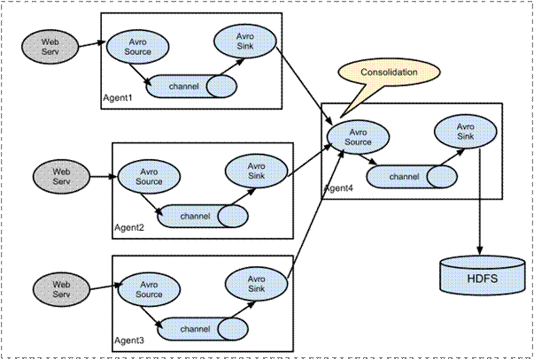

# 一、 Apache Flume

## 1． 概述

Flume是Cloudera提供的一个高可用的，高可靠的，分布式的海量日志采集、聚合和传输的软件。

Flume的核心是把数据从数据源(source)收集过来，再将收集到的数据送到指定的目的地(sink)。为了保证输送的过程一定成功，在送到目的地(sink)之前，会先缓存数据(channel),待数据真正到达目的地(sink)后，flume在删除自己缓存的数据。

Flume支持定制各类数据发送方，用于收集各类型数据；同时，Flume支持定制各种数据接收方，用于最终存储数据。一般的采集需求，通过对flume的简单配置即可实现。针对特殊场景也具备良好的自定义扩展能力。因此，flume可以适用于大部分的日常数据采集场景。

当前Flume有两个版本。Flume 0.9X版本的统称Flume OG（original generation），Flume1.X版本的统称Flume NG（next generation）。由于Flume NG经过核心组件、核心配置以及代码架构重构，与Flume OG有很大不同，使用时请注意区分。改动的另一原因是将Flume纳入 apache 旗下，Cloudera Flume 改名为 Apache Flume。

## 2． 运行机制

Flume系统中核心的角色是**agent**，agent本身是一个Java进程，一般运行在日志收集节点。


每一个agent相当于一个数据传递员，内部有三个组件：

**Source**：采集源，用于跟数据源对接，以获取数据；

**Sink**：下沉地，采集数据的传送目的，用于往下一级agent传递数据或者往

​      最终存储系统传递数据；

**Channel**：agent内部的数据传输通道，用于从source将数据传递到sink；

在整个数据的传输的过程中，流动的是**event**，它是Flume内部数据传输的最基本单元。event将传输的数据进行封装。如果是文本文件，通常是一行记录，event也是事务的基本单位。event从source，流向channel，再到sink，本身为一个字节数组，并可携带headers(头信息)信息。event代表着一个数据的最小完整单元，从外部数据源来，向外部的目的地去。

一个完整的event包括：event headers、event body、event信息，其中event信息就是flume收集到的日记记录。

## 3． Flume采集系统结构图

### 3.1． 简单结构

单个agent采集数据


### 3.2． 复杂结构

多级agent之间串联



 


 

 

# 二、 Flume安装部署

- Flume的安装非常简单

上传安装包到数据源所在节点上

然后解压  tar -zxvf apache-flume-1.6.0-bin.tar.gz

然后进入flume的目录，修改conf下的flume-env.sh，在里面配置JAVA_HOME

- 根据数据采集需求**配置采集方案**，描述在配置文件中(文件名可任意自定义)

- **指定采集方案配置文件**，在相应的节点上启动flume agent

 

先用一个最简单的例子来测试一下程序环境是否正常

使用flume监听所在节点的44444端口，使用nc命令向指定端口发送数据，看flume能否接收到数据并打印到控制台上。

**1、 先在flume的conf目录下新建一个文件**

vi   netcat-logger.conf

```shell
# 定义这个agent中各组件的名字 
a1.sources = r1  
a1.sinks = k1   
a1.channels = c1    

# 描述和配置source组件：r1   
a1.sources.r1.type = netcat 
a1.sources.r1.bind = localhost  
a1.sources.r1.port = 44444  

# 描述和配置sink组件：k1   
a1.sinks.k1.type = logger       

# 描述和配置channel组件，此处使用是内存缓存的方式  
a1.channels.c1.type = memory  
a1.channels.c1.capacity = 1000  
a1.channels.c1.transactionCapacity = 100     

# 描述和配置source  channel   sink之间的连接关系   
a1.sources.r1.channels = c1   
a1.sinks.k1.channel   = c1   
```


**2、启动agent去采集数据**

```shell
 bin/flume-ng   agent -c conf -f conf/netcat-logger.conf -n a1  -Dflume.root.logger=INFO,console   
```

-c conf   指定flume自身的配置文件所在目录

-f conf/netcat-logger.con  指定我们所描述的采集方案

-n a1  指定我们这个agent的名字

**3、测试**

先要往agent采集监听的端口上发送数据，让agent有数据可采。

随便在一个能跟agent节点联网的机器上：

telnet 命令如果不存在使用：yum -y install telnet进行联网安装

telnet anget-hostname  port   （telnet localhost 44444）


 

 

# 三、 Flume简单案例

## 1． 采集目录到HDFS

采集需求：**服务器的某特定目录下，会不断产生新的文件，每当有新文件出现，就需要把文件采集到HDFS中去**

根据需求，首先定义以下3大要素

- 采集源，即source——监控文件目录 :  **spooldir**

- 下沉目标，即sink——HDFS文件系统  :  **hdfs sink**

- source和sink之间的传递通道——channel，可用file channel 也可以用内存channel

配置文件编写：

```shell
# Name the components on this agent   
a1.sources = r1  
a1.sinks = k1  
a1.channels = c1       

# Describe/configure the source  
##注意：不能往监控目中重复丢同名文件  
a1.sources.r1.type = spooldir  
a1.sources.r1.spoolDir = /root/logs  
a1.sources.r1.fileHeader = true     

# Describe the sink 
a1.sinks.k1.type = hdfs  
a1.sinks.k1.hdfs.path =/flume/events/%y-%m-%d/%H%M/   
a1.sinks.k1.hdfs.filePrefix = events-   
a1.sinks.k1.hdfs.round = true  
a1.sinks.k1.hdfs.roundValue = 10  
a1.sinks.k1.hdfs.roundUnit = minute 
a1.sinks.k1.hdfs.rollInterval = 3  
a1.sinks.k1.hdfs.rollSize = 1024  
a1.sinks.k1.hdfs.rollCount = 5  
a1.sinks.k1.hdfs.batchSize = 1  
a1.sinks.k1.hdfs.useLocalTimeStamp = true  

#生成的文件类型，默认是Sequencefile，可用DataStream，则为普通文本  
a1.sinks.k1.hdfs.fileType = DataStream      

# Use a channel which buffers events in   memory   
a1.channels.c1.type = memory  
a1.channels.c1.capacity = 1000 
a1.channels.c1.transactionCapacity = 100    

# Bind the source and sink to the channel  
a1.sources.r1.channels = c1 
a1.sinks.k1.channel = c1   
```


Channel参数解释：

capacity：默认该通道中最大的可以存储的event数量

trasactionCapacity：每次最大可以从source中拿到或者送到sink中的event数量

 

## 2． 采集文件到HDFS

采集需求：**比如业务系统使用log4j生成的日志，日志内容不断增加，需要把追加到日志文件中的数据实时采集到hdfs**

 

根据需求，首先定义以下3大要素

- 采集源，即source——监控文件内容更新 :  exec  ‘tail -F file’

- 下沉目标，即sink——HDFS文件系统  :  hdfs sink

- Source和sink之间的传递通道——channel，可用file channel 也可以用 内存channel


 

 

配置文件编写：

```shell
# Name the components on this agent  
a1.sources = r1   
a1.sinks = k1  
a1.channels = c1       

# Describe/configure the source  
a1.sources.r1.type = exec   
a1.sources.r1.command = tail -F /root/logs/test.log 
a1.sources.r1.channels = c1      

# Describe the sink  
a1.sinks.k1.type = hdfs  
a1.sinks.k1.hdfs.path = /flume/tailout/%y-%m-%d/%H%M/  
a1.sinks.k1.hdfs.filePrefix = events-  
a1.sinks.k1.hdfs.round = true  
a1.sinks.k1.hdfs.roundValue = 10  
a1.sinks.k1.hdfs.roundUnit = minute 
a1.sinks.k1.hdfs.rollInterval = 3  
a1.sinks.k1.hdfs.rollSize = 20
a1.sinks.k1.hdfs.rollCount = 5 
a1.sinks.k1.hdfs.batchSize = 1  
a1.sinks.k1.hdfs.useLocalTimeStamp = true  
#生成的文件类型，默认是Sequencefile，可用DataStream，则为普通文本  
a1.sinks.k1.hdfs.fileType = DataStream     

# Use a channel which buffers events in   memory   
a1.channels.c1.type = memory  
a1.channels.c1.capacity = 1000  
a1.channels.c1.transactionCapacity = 100      

# Bind the source and sink to the channel 
a1.sources.r1.channels = c1 
a1.sinks.k1.channel = c1   
```


**参数解析：**

- **rollInterval**

默认值：30

hdfs sink间隔多长将临时文件滚动成最终目标文件，单位：秒；

如果设置成0，则表示不根据时间来滚动文件；

注：滚动（roll）指的是，hdfs sink将临时文件重命名成最终目标文件，并新打开一个临时文件来写入数据；

- **rollSize**

默认值：1024

当临时文件达到该大小（单位：bytes）时，滚动成目标文件；

如果设置成0，则表示不根据临时文件大小来滚动文件；

- **rollCount**

默认值：10

当events数据达到该数量时候，将临时文件滚动成目标文件；

如果设置成0，则表示不根据events数据来滚动文件；

- **round**

默认值：false

是否启用时间上的“舍弃”，这里的“舍弃”，类似于“四舍五入”。

- **roundValue**

默认值：1

时间上进行“舍弃”的值；

- **roundUnit**

默认值：seconds

时间上进行“舍弃”的单位，包含：second,minute,hour

示例：

a1.sinks.k1.hdfs.path = /flume/events/%y-%m-%d/%H%M/%S

a1.sinks.k1.hdfs.round = true

a1.sinks.k1.hdfs.roundValue = 10

a1.sinks.k1.hdfs.roundUnit = minute

当时间为2015-10-16 17:38:59时候，hdfs.path依然会被解析为：

/flume/events/20151016/17:30/00

因为设置的是舍弃10分钟内的时间，因此，该目录每10分钟新生成一个。


 

 

# 四、 Flume的load-balance、failover

负载均衡是用于解决一台机器(一个进程)无法解决所有请求而产生的一种算法。**Load balancing Sink Processor**能够实现load balance功能，如下图Agent1是一个路由节点，负责将Channel暂存的Event均衡到对应的多个Sink组件上，而每个Sink组件分别连接到一个独立的Agent上，示例配置，如下所示：


 ```shell
a1.sinkgroups = g1  
a1.sinkgroups.g1.sinks = k1 k2 k3  
a1.sinkgroups.g1.processor.type = load_balance  
a1.sinkgroups.g1.processor.backoff = true  #如果开启，则将失败的sink放入黑名单  
a1.sinkgroups.g1.processor.selector = round_robin  # 另外还支持random   
a1.sinkgroups.g1.processor.selector.maxTimeOut=10000   #在黑名单放置的超时时间，超时结束时，若仍然无法接收，则超时时间呈指数增长  
 ```


**Failover Sink Processor**能够实现failover功能，具体流程类似load balance，但是内部处理机制与load balance完全不同。

Failover Sink Processor维护一个优先级Sink组件列表，只要有一个Sink组件可用，Event就被传递到下一个组件。故障转移机制的作用是将失败的Sink降级到一个池，在这些池中它们被分配一个冷却时间，随着故障的连续，在重试之前冷却时间增加。一旦Sink成功发送一个事件，它将恢复到活动池。 Sink具有与之相关的优先级，数量越大，优先级越高。

例如，具有优先级为100的sink在优先级为80的Sink之前被激活。如果在发送事件时汇聚失败，则接下来将尝试下一个具有最高优先级的Sink发送事件。如果没有指定优先级，则根据在配置中指定Sink的顺序来确定优先级。

示例配置如下所示：

```shell
a1.sinkgroups = g1  
a1.sinkgroups.g1.sinks = k1 k2 k3  
a1.sinkgroups.g1.processor.type = failover  
a1.sinkgroups.g1.processor.priority.k1 = 5  #优先级值, 绝对值越大表示优先级越高 
a1.sinkgroups.g1.processor.priority.k2 = 7  
a1.sinkgroups.g1.processor.priority.k3 = 6  
a1.sinkgroups.g1.processor.maxpenalty = 20000  #失败的Sink的最大回退期（millis）  
```


## 1 高可用Flum-NG配置案例failover

### 1.1、角色分配

Flume的Agent和Collector分布如下表所示：

| 名称   | HOST   | 角色         |
| ------ | ------ | ------------ |
| a1     | node01 | Web   Server |
| Agent2 | node02 | AgentMstr1   |
| Agent3 | node03 | AgentMstr2   |

 

　　a1数据分别流入到Agent2和Agent3，Flume NG本身提供了Failover机制，可以自动切换和恢复。下面我们开发配置Flume NG集群

 

### 1.2、node01安装配置flume与拷贝文件脚本

将原先机器上面的flume安装包拷贝到另外两台机器上面去


node03机器执行以下命令

```shell
cd /export/servers

scp -r flume-1.6/ node01:$PWD
```


node01机器配置agent的配置文件

cd /export/servers/flume-1.6/conf

vim agent.conf

 ```shell
#a1 name  
a1.channels = c1  
a1.sources = r1  
a1.sinks = k1 k2   

##set gruop  
a1.sinkgroups = g1  

##set channel 
a1.channels.c1.type = memory  
a1.channels.c1.capacity = 1000 
a1.channels.c1.transactionCapacity = 100  

#  

a1.sources.r1.channels = c1   
a1.sources.r1.type = netcat 
a1.sources.r1.bind = localhost  
a1.sources.r1.port = 44444    

## set sink1  
a1.sinks.k1.channel = c1  
a1.sinks.k1.type = avro 
a1.sinks.k1.hostname = node02 
a1.sinks.k1.port = 52020   

## set sink2  
a1.sinks.k2.channel = c1  
a1.sinks.k2.type = avro  
a1.sinks.k2.hostname = node03  
a1.sinks.k2.port = 52020   


##set sink group  
a1.sinkgroups.g1.sinks = k1 k2   

##set failover   
a1.sinkgroups.g1.processor.type = failover 
a1.sinkgroups.g1.processor.priority.k1 = 10  
a1.sinkgroups.g1.processor.priority.k2 = 1  
a1.sinkgroups.g1.processor.maxpenalty = 10000       
 ```


### 1.3、node02与node03配置flumecollection

node02机器修改配置文件

cd /export/servers/flume-1.6/conf

vim collector.conf

 ```shell
#set Agent name  
a1.sources = r1  
a1.channels = c1  
a1.sinks = k1   

##set channel  
a1.channels.c1.type = memory  
a1.channels.c1.capacity = 1000 
a1.channels.c1.transactionCapacity = 100   

## other node,nna to nns  
a1.sources.r1.type = avro
a1.sources.r1.bind = node02 
a1.sources.r1.port = 52020 
a1.sources.r1.channels = c1   

##set sink to hdfs  
a1.sinks.k1.channel=c1 
a1.sinks.k1.type=hdfs   
a1.sinks.k1.hdfs.path= hdfs://node01:8020/flume/failover/  
a1.sinks.k1.hdfs.filePrefix = events-  
a1.sinks.k1.hdfs.round = true  
a1.sinks.k1.hdfs.roundValue = 10  
a1.sinks.k1.hdfs.roundUnit = minute  
a1.sinks.k1.hdfs.rollInterval = 3  
a1.sinks.k1.hdfs.rollSize = 20  
a1.sinks.k1.hdfs.rollCount = 5  
a1.sinks.k1.hdfs.batchSize = 1  
a1.sinks.k1.hdfs.useLocalTimeStamp = true  
#生成的文件类型，默认是Sequencefile，可用DataStream，则为普通文本   
a1.sinks.k1.hdfs.fileType = DataStream       
 ```


 

node03机器修改配置文件

cd  /export/servers/flume-1.6/conf

vim collector.conf

 ```shell
#set Agent name  
a1.sources = r1  
a1.channels = c1  
a1.sinks = k1   

##set channel   
a1.channels.c1.type = memory 
a1.channels.c1.capacity = 1000 
a1.channels.c1.transactionCapacity = 100   

## other node,nna to nns 
a1.sources.r1.type = avro  
a1.sources.r1.bind = node03  
a1.sources.r1.port = 52020  
a1.sources.r1.channels = c1   

##set sink to hdfs 
a1.sinks.k1.channel=c1 
a1.sinks.k1.type=hdfs   
a1.sinks.k1.hdfs.path= hdfs://node01:8020/flume/failover/  
a1.sinks.k1.hdfs.filePrefix = events-  
a1.sinks.k1.hdfs.round = true 
a1.sinks.k1.hdfs.roundValue = 10 
a1.sinks.k1.hdfs.roundUnit = minute 
a1.sinks.k1.hdfs.rollInterval = 3  
a1.sinks.k1.hdfs.rollSize = 20 
a1.sinks.k1.hdfs.rollCount = 5 
a1.sinks.k1.hdfs.batchSize = 1  
a1.sinks.k1.hdfs.useLocalTimeStamp = true  
#生成的文件类型，默认是Sequencefile，可用DataStream，则为普通文本  
a1.sinks.k1.hdfs.fileType = DataStream       
 ```


 

### 1.4、顺序启动命令

node03机器上面启动flume

```shell
cd /export/servers/flume-1.6

bin/flume-ng agent -n a1 -c conf -f conf/collector.conf -Dflume.root.logger=DEBUG,console
```


node02机器上面启动flume

```shell
cd /export/servers/flume-1.6

bin/flume-ng agent -n a1 -c conf -f conf/collector.conf -Dflume.root.logger=DEBUG,console
```


node01机器上面启动flume

```shell
cd /export/servers/flume-1.6

bin/flume-ng agent -n a1 -c conf -f conf/agent.conf -Dflume.root.logger=DEBUG,console
```


node01机器启动文件产生脚本

```shell
cd  /export/servers/shells

sh tail-file.sh
```


### 1.5、 FAILOVER测试

下面我们来测试下Flume NG集群的高可用（故障转移）。场景如下：我们在a1节点上传文件，由于我们配置Collector1的权重比Collector2大，所以 Collector1优先采集并上传到存储系统。然后我们kill掉Collector1，此时有Collector2负责日志的采集上传工作，之后，我 们手动恢复Collector1节点的Flume服务，再次在a1上次文件，发现Collector1恢复优先级别的采集工作。


## 2、flume的负载均衡load balancer

在此处我们通过三台机器来进行模拟flume的负载均衡

三台机器规划如下：

node01：采集数据，发送到node02和node03机器上去

node02：接收node01的部分数据

node03：接收node01的部分数据


### 2.1：开发node01服务器的flume配置

node01服务器配置：

cd /export/servers/flume-1.6/conf

vim load_banlancer_client.conf

```shell
#a1 name

a1.channels = c1

a1.sources = r1

a1.sinks = k1 k2


##set gruop

a1.sinkgroups = g1


##set channel

a1.channels.c1.type = memory

a1.channels.c1.capacity = 1000

a1.channels.c1.transactionCapacity = 100


a1.sources.r1.channels = c1

a1.sources.r1.type = netcat

a1.sources.r1.bind = localhost

a1.sources.r1.port = 44444

 

## set sink1

a1.sinks.k1.channel = c1

a1.sinks.k1.type = avro

a1.sinks.k1.hostname = node02

a1.sinks.k1.port = 52020


## set sink2

a1.sinks.k2.channel = c1

a1.sinks.k2.type = avro

a1.sinks.k2.hostname = node03

a1.sinks.k2.port = 52020


##set sink group

a1.sinkgroups.g1.sinks = k1 k2

#load_banlance

a1.sinkgroups.g1.processor.type = load_balance

a1.sinkgroups.g1.processor.backoff = true

a1.sinkgroups.g1.processor.selector = round_robin

a1.sinkgroups.g1.processor.selector.maxTimeOut=10000
```

 

### 2.2：开发node02服务器的flume配置

cd /export/servers/flume-1.6/conf

vim load_banlancer_server.conf

```shell
# Name the components on this agent

a1.sources = r1

a1.sinks = k1

a1.channels = c1

 

# Describe/configure the source

a1.sources.r1.type = avro

a1.sources.r1.channels = c1

a1.sources.r1.bind = node02

a1.sources.r1.port = 52020

 

# Describe the sink

a1.sinks.k1.type = logger

 

# Use a channel which buffers events in memory

a1.channels.c1.type = memory

a1.channels.c1.capacity = 1000

a1.channels.c1.transactionCapacity = 100

 

# Bind the source and sink to the channel

a1.sources.r1.channels = c1

a1.sinks.k1.channel = c1
```

 

### 2.3：开发node03服务器flume配置

 

node03服务器配置

cd /export/servers/flume-1.6/conf

vim load_banlancer_server.conf

```shell
# Name the components on this agent

a1.sources = r1

a1.sinks = k1

a1.channels = c1

 

# Describe/configure the source

a1.sources.r1.type = avro

a1.sources.r1.channels = c1

a1.sources.r1.bind = node03

a1.sources.r1.port = 52020

 

# Describe the sink

a1.sinks.k1.type = logger

 

# Use a channel which buffers events in memory

a1.channels.c1.type = memory

a1.channels.c1.capacity = 1000

a1.channels.c1.transactionCapacity = 100

 

# Bind the source and sink to the channel

a1.sources.r1.channels = c1

a1.sinks.k1.channel = c1
```


### 2.4：准备启动flume服务

启动node03的flume服务

```shell
cd /export/servers/flume-1.6

bin/flume-ng agent -n a1 -c conf -f conf/load_banlancer_server.conf -Dflume.root.logger=DEBUG,console
```


启动node02的flume服务

```shell
cd /export/servers/flume-1.6

bin/flume-ng agent -n a1 -c conf -f conf/load_banlancer_server.conf -Dflume.root.logger=DEBUG,console

 
```


启动node01的flume服务

```shell
cd /export/servers/flume-1.6

bin/flume-ng agent -n a1 -c conf -f conf/load_banlancer_client.conf -Dflume.root.logger=DEBUG,console
```


 

# 五、 Flume拦截器实战案例

## 1． 日志的采集和汇总

### 1.1． 案例场景

A、B两台日志服务机器实时生产日志主要类型为access.log、nginx.log、web.log 

**现在要求：**

把A、B 机器中的access.log、nginx.log、web.log 采集汇总到C机器上然后统一收集到hdfs中。

但是在hdfs中要求的目录为：

/source/logs/access/20190101/**

/source/logs/nginx/20190101/**

/source/logs/web/20190101/**

### 1.2． 场景分析

 

### 1.3． 数据流程处理分析


### 1.4． 功能实现

1.　在服务器node01和服务器node02上创建配置文件    exec_source_avro_sink.conf  文件内容为


```shell
# Name the components on this agent  
a1.sources = r1 r2 r3  
a1.sinks = k1 
a1.channels = c1   

# Describe/configure the source 
a1.sources.r1.type = exec  
a1.sources.r1.command = tail -F /root/data/access.log  
a1.sources.r1.interceptors = i1 
a1.sources.r1.interceptors.i1.type = static  

##  static拦截器的功能就是往采集到的数据的header中插入自
##  己定义的key-value对   
a1.sources.r1.interceptors.i1.key = type   
a1.sources.r1.interceptors.i1.value = access    
a1.sources.r2.type = exec  
a1.sources.r2.command = tail -F /root/data/nginx.log  
a1.sources.r2.interceptors = i2 
a1.sources.r2.interceptors.i2.type = static  
a1.sources.r2.interceptors.i2.key = type 
a1.sources.r2.interceptors.i2.value = nginx    
a1.sources.r3.type = exec 
a1.sources.r3.command = tail -F /root/data/web.log 
a1.sources.r3.interceptors = i3  
a1.sources.r3.interceptors.i3.type = static 
a1.sources.r3.interceptors.i3.key = type 
a1.sources.r3.interceptors.i3.value = web   

# Describe the sink 
a1.sinks.k1.type = avro   
a1.sinks.k1.hostname = node03 
a1.sinks.k1.port = 41414     

# Use a channel which buffers events in memory   
a1.channels.c1.type = memory  
a1.channels.c1.capacity = 20000   
a1.channels.c1.transactionCapacity = 10000  

# Bind the source and sink to the channel 
a1.sources.r1.channels = c1   
a1.sources.r2.channels = c1  
a1.sources.r3.channels = c1  
a1.sinks.k1.channel = c1       
```


2.　在服务器node03上创建配置文件    avro_source_hdfs_sink.conf  文件内容为


 ```shell
#定义agent名， source、channel、sink的名称   
a1.sources = r1 
a1.sinks = k1  
a1.channels = c1    

#定义source  
a1.sources.r1.type = avro 
a1.sources.r1.bind = node03  
a1.sources.r1.port =41414   

#定义channels 
a1.channels.c1.type = memory 
a1.channels.c1.capacity = 20000  
a1.channels.c1.transactionCapacity = 10000  

#定义sink  
a1.sinks.k1.type = hdfs 
a1.sinks.k1.hdfs.path=hdfs://node01:8020/source/logs/%{type}/%Y%m%d   a1.sinks.k1.hdfs.filePrefix =events   a1.sinks.k1.hdfs.fileType = DataStream   a1.sinks.k1.hdfs.writeFormat = Text  
#时间类型   
a1.sinks.k1.hdfs.useLocalTimeStamp = true  
#生成的文件不按条数生成  
a1.sinks.k1.hdfs.rollCount = 0  
#生成的文件按时间生成  
a1.sinks.k1.hdfs.rollInterval = 30 
#生成的文件按大小生成  
a1.sinks.k1.hdfs.rollSize  = 10485760  
#批量写入hdfs的个数  
a1.sinks.k1.hdfs.batchSize = 10000  
#flume操作hdfs的线程数（包括新建，写入等） 
a1.sinks.k1.hdfs.threadsPoolSize=10  
#操作hdfs超时时间  
a1.sinks.k1.hdfs.callTimeout=30000     
#组装source、channel、sink  
a1.sources.r1.channels = c1  
a1.sinks.k1.channel = c1  
 ```


3.　配置完成之后，在服务器node01和node02上的/root/data有数据文件access.log、nginx.log、web.log。先启动服务器node03上的flume，启动命令

在flume安装目录下执行 ：

```shell
bin/flume-ng agent -c conf -f conf/avro_source_hdfs_sink.conf -name a1 -Dflume.root.logger=DEBUG,console   
```


然后在启动服务器上的node01和node02，启动命令

在flume安装目录下执行 ：


 ```shell
bin/flume-ng agent -c conf -f conf/exec_source_avro_sink.conf -name a1 -Dflume.root.logger=DEBUG,console   
 ```


 

## 2． Flume自定义拦截器

### 2.1． 案例背景介绍

Flume是Cloudera提供的一个高可用的，高可靠的，分布式的海量日志采集、聚合和传输的系统，Flume支持在日志系统中定制各类数据发送方，用于收集数据；同时，Flume提供对数据进行简单处理，并写到各种数据接受方（可定制）的能力。**Flume有各种自带的拦截器，比如：TimestampInterceptor、HostInterceptor、RegexExtractorInterceptor等，通过使用不同的拦截器，实现不同的功能。**但是以上的这些拦截器，不能改变原有日志数据的内容或者对日志信息添加一定的处理逻辑，当一条日志信息有几十个甚至上百个字段的时候，在传统的Flume处理下，收集到的日志还是会有对应这么多的字段，也不能对你想要的字段进行对应的处理。

### 2.2． 自定义拦截器

根据实际业务的需求，为了更好的满足数据在应用层的处理，通过**自定义Flume拦截器，过滤掉不需要的字段，并对指定字段加密处理**，将源数据进行预处理。减少了数据的传输量，降低了存储的开销。

### 2.3． 功能实现

本技术方案核心包括二部分：

- **编写java代码，自定义拦截器**

内容包括：

1. 定义一个类CustomParameterInterceptor实现Interceptor接口。

2. 在CustomParameterInterceptor类中定义变量，这些变量是需要到 Flume的配置文件中进行配置使用的。每一行字段间的分隔符(fields_separator)、通过分隔符分隔后，所需要列字段的下标（indexs）、多个下标使用的分隔符（indexs_separator)

3. 添加CustomParameterInterceptor的有参构造方法。并对相应的变量进行处理。将配置文件中传过来的unicode编码进行转换为字符串。

4. 写具体的要处理的逻辑intercept()方法，一个是单个处理的，一个是批量处理。

5. 接口中定义了一个内部接口Builder，在configure方法中，进行一些参数配置。并给出，在flume的conf中没配置一些参数时，给出其默认值。通过其builder方法，返回一个CustomParameterInterceptor对象。

6. 定义一个静态类，类中封装MD5加密方法

7. 通过以上步骤，自定义拦截器的代码开发已完成，然后打包成jar， 放到Flume的根目录下的lib中

 

#### 第一步：创建maven java工程，导入jar包

```java
<dependencies>

    <dependency>

<groupId>org.apache.flume</groupId>

<artifactId>flume-ng-core</artifactId>

        <version>1.8.0</version>

<scope>provided</scope>

    </dependency>

</dependencies>

<build>

    <plugins>

        <plugin>

<groupId>org.apache.maven.plugins</groupId>

<artifactId>maven-compiler-plugin</artifactId>

<version>3.0</version>

            <configuration>

<source>1.8</source>

<target>1.8</target>

<encoding>UTF-8</encoding>

                <!--    <verbal>true</verbal>-->

            </configuration>

        </plugin>

    </plugins>

</build>
```


#### 第二步：自定义flume的拦截器

```java
import org.apache.flume.Context;
import org.apache.flume.Event;
import org.apache.flume.interceptor.Interceptor;

import java.nio.charset.Charset;
import java.util.ArrayList;
import java.util.List;


public class MyInterceptor implements Interceptor {
    /**
     * The field_separator.指明每一行字段的分隔符
     */
    private final String fields_separator;

    /**
     * The indexs.通过分隔符分割后，指明需要那列的字段 下标
     */
    private final String indexs;

    /**
     * The indexs_separator. 多个下标的分隔符
     */
    private final String indexs_separator;

    /**
     * @param indexs
     * @param indexs_separator
     */
    public MyInterceptor(String fields_separator,
                         String indexs, String indexs_separator, String encrypted_field_index) {
        String f = fields_separator.trim();
        String i = indexs_separator.trim();
        this.indexs = indexs;
        this.encrypted_field_index = encrypted_field_index.trim();
        if (!f.equals("")) {
            f = UnicodeUtils.unicodeToString(f);
        }
        this.fields_separator = f;
        if (!i.equals("")) {
            i = UnicodeUtils.unicodeToString(i);
        }
        this.indexs_separator = i;
    }


    /**
     * The encrypted_field_index. 需要加密的字段下标
     */
    private final String encrypted_field_index;


    /*
     * @see org.apache.flume.interceptor.Interceptor#intercept(org.apache.flume.Event)
     * 单个event拦截逻辑
     */
    public Event intercept(Event event) {
        if (event == null) {
            return null;
        }
        try {
            String line = new String(event.getBody(), Charset.defaultCharset());
            //flume中消息的分隔符，制表符
            String[] fields_spilts = line.split(fields_separator);
            //索引信息的分隔符，逗号
            String[] indexs_split = indexs.split(indexs_separator);
            String newLine = "";
            for (int i = 0; i < indexs_split.length; i++) {
                int parseInt = Integer.parseInt(indexs_split[i]);
                //对加密字段进行加密
                if (!"".equals(encrypted_field_index) && encrypted_field_index.equals(indexs_split[i])) {
                    newLine += StringUtils.GetMD5Code(fields_spilts[parseInt]);
                } else {
                    newLine += fields_spilts[parseInt];
                }

                if (i != indexs_split.length - 1) {
                    newLine += fields_separator;
                }
            }
            event.setBody(newLine.getBytes(Charset.defaultCharset()));
            return event;
        } catch (Exception e) {
            return event;
        }
    }

    /*
     * @see org.apache.flume.interceptor.Interceptor#intercept(java.util.List)
     * 批量event拦截逻辑
     */
    public List<Event> intercept(List<Event> events) {
        List<Event> out = new ArrayList<Event>();
        for (Event event : events) {
            Event outEvent = intercept(event);
            if (outEvent != null) {
                out.add(outEvent);
            }
        }
        return out;
    }

    /*
     * @see org.apache.flume.interceptor.Interceptor#initialize()
     */
    public void initialize() {
        // TODO Auto-generated method stub

    }

    /*
     * @see org.apache.flume.interceptor.Interceptor#close()
     */
    public void close() {
        // TODO Auto-generated method stub

    }


    /**
     * 相当于自定义Interceptor的工厂类
     * 在flume采集配置文件中通过制定该Builder来创建Interceptor对象
     * 可以在Builder中获取、解析flume采集配置文件中的拦截器Interceptor的自定义参数：
     * 字段分隔符，字段下标，下标分隔符、加密字段下标 ...等
     *
     * @author
     */
    public static class Builder implements Interceptor.Builder {

        /**
         * The fields_separator.指明每一行字段的分隔符
         */
        private String fields_separator;

        /**
         * The indexs.通过分隔符分割后，指明需要那列的字段 下标
         */
        private String indexs;

        /**
         * The indexs_separator. 多个下标下标的分隔符
         */
        private String indexs_separator;

        /**
         * The encrypted_field. 需要加密的字段下标
         */
        private String encrypted_field_index;

        /*
         * @see org.apache.flume.conf.Configurable#configure(org.apache.flume.Context)
         */
        public void configure(Context context) {
            fields_separator = context.getString(Constants.FIELD_SEPARATOR, Constants.DEFAULT_FIELD_SEPARATOR);
            indexs = context.getString(Constants.INDEXS, Constants.DEFAULT_INDEXS);
            indexs_separator = context.getString(Constants.INDEXS_SEPARATOR, Constants.DEFAULT_INDEXS_SEPARATOR);
            encrypted_field_index = context.getString(Constants.ENCRYPTED_FIELD_INDEX, Constants.DEFAULT_ENCRYPTED_FIELD_INDEX);
        }

        /*
         * @see org.apache.flume.interceptor.Interceptor.Builder#build()
         */
        public Interceptor build() {
            return new MyInterceptor(fields_separator, indexs, indexs_separator, encrypted_field_index);
        }
    }


}   
```


工具类：

加密方法:


```java
import java.security.MessageDigest;
import java.security.NoSuchAlgorithmException;

/**
 * 工具类：字符串md5加密
 */
public  class StringUtils {
    // 全局数组
    private final static String[] strDigits = { "0", "1", "2", "3", "4", "5",
            "6", "7", "8", "9", "a", "b", "c", "d", "e", "f" };
    // 返回形式为数字跟字符串
    private static String byteToArrayString(byte bByte) {
        int iRet = bByte;
        // System.out.println("iRet="+iRet);
        if (iRet < 0) {
            iRet += 256;
        }
        int iD1 = iRet / 16;
        int iD2 = iRet % 16;
        return strDigits[iD1] + strDigits[iD2];
    }

    // 返回形式只为数字
    private static String byteToNum(byte bByte) {
        int iRet = bByte;
        System.out.println("iRet1=" + iRet);
        if (iRet < 0) {
            iRet += 256;
        }
        return String.valueOf(iRet);
    }

    // 转换字节数组为16进制字串
    private static String byteToString(byte[] bByte) {
        StringBuffer sBuffer = new StringBuffer();
        for (int i = 0; i < bByte.length; i++) {
            sBuffer.append(byteToArrayString(bByte[i]));
        }
        return sBuffer.toString();
    }

    public static String GetMD5Code(String strObj) {
        String resultString = null;
        try {
            resultString = new String(strObj);
            MessageDigest md = MessageDigest.getInstance("MD5");
            // md.digest() 该函数返回值为存放哈希值结果的byte数组
            resultString = byteToString(md.digest(strObj.getBytes()));
        } catch (NoSuchAlgorithmException ex) {
            ex.printStackTrace();
        }
        return resultString;
    }
}

```

unicoude转字符串方法:

```java
package com.itheima.interceptor;

import java.util.regex.Matcher;
import java.util.regex.Pattern;

public class UnicodeUtils {
    public static String unicodeToString(String str) {
        Pattern pattern = Pattern.compile("(\\\\u(\\p{XDigit}{4}))");
        Matcher matcher = pattern.matcher(str);
        char ch;
        while (matcher.find()) {
            ch = (char) Integer.parseInt(matcher.group(2), 16);
            str = str.replace(matcher.group(1), ch + "");
        }
        return str;
    }
}
```


常量类：


```java
/**
 * 常量
 *
 */
public  class Constants {
    /** The Constant FIELD_SEPARATOR. */
    public static final String FIELD_SEPARATOR = "fields_separator";

    /** The Constant DEFAULT_FIELD_SEPARATOR. */
    public static final String DEFAULT_FIELD_SEPARATOR =" ";

    /** The Constant INDEXS. */
    public static final String INDEXS = "indexs";

    /** The Constant DEFAULT_INDEXS. */
    public static final String DEFAULT_INDEXS = "0";

    /** The Constant INDEXS_SEPARATOR. */
    public static final String INDEXS_SEPARATOR = "indexs_separator";

    /** The Constant DEFAULT_INDEXS_SEPARATOR. */
    public static final String DEFAULT_INDEXS_SEPARATOR = ",";

    /** The Constant ENCRYPTED_FIELD_INDEX. */
    public static final String ENCRYPTED_FIELD_INDEX = "encrypted_field_index";

    /** The Constant DEFAUL_TENCRYPTED_FIELD_INDEX. */
    public static final String DEFAULT_ENCRYPTED_FIELD_INDEX = "";

    /** The Constant PROCESSTIME. */
    public static final String PROCESSTIME = "processTime";
    /** The Constant PROCESSTIME. */
    public static final String DEFAULT_PROCESSTIME = "a";

}
```


#### 第三步：打包上传服务器

将我们的拦截器打成jar包放到flume的lib目录下


#### 第四步：开发flume的配置文件

第三台机器开发flume的配置文件

cd  /export/servers/apache-flume-1.6.0-cdh5.14.0-bin/conf

vim spool-interceptor-hdfs.conf

```shell
a1.channels = c1

a1.sources = r1

a1.sinks = s1

#channel

a1.channels.c1.type = memory

a1.channels.c1.capacity=100000

a1.channels.c1.transactionCapacity=50000

#source

a1.sources.r1.channels = c1

a1.sources.r1.type = spooldir

a1.sources.r1.spoolDir = /export/servers/intercept

a1.sources.r1.batchSize= 50

a1.sources.r1.inputCharset = UTF-8

 

a1.sources.r1.interceptors =i1 

a1.sources.r1.interceptors.i1.type =com.itheima.interceptor.CustomInterceptor$Builder

a1.sources.r1.interceptors.i1.fields_separator=\\u0009

a1.sources.r1.interceptors.i1.indexs =0,1,3,5,6

a1.sources.r1.interceptors.i1.indexs_separator =\\u002c

a1.sources.r1.interceptors.i1.encrypted_field_index =0

#sink

a1.sinks.s1.channel = c1

a1.sinks.s1.type = hdfs

a1.sinks.s1.hdfs.path =hdfs://192.168.52.100:8020/flume/intercept/%Y%m%d

a1.sinks.s1.hdfs.filePrefix = event

a1.sinks.s1.hdfs.fileSuffix = .log

a1.sinks.s1.hdfs.rollSize = 10485760

a1.sinks.s1.hdfs.rollInterval =20

a1.sinks.s1.hdfs.rollCount = 0

a1.sinks.s1.hdfs.batchSize = 1500

a1.sinks.s1.hdfs.round = true

a1.sinks.s1.hdfs.roundUnit = minute

a1.sinks.s1.hdfs.threadsPoolSize = 25

a1.sinks.s1.hdfs.useLocalTimeStamp = true

a1.sinks.s1.hdfs.minBlockReplicas = 1

a1.sinks.s1.hdfs.fileType =DataStream

a1.sinks.s1.hdfs.writeFormat = Text
```


#### 第五步：上传测试数据

上传我们的测试数据到/export/servers/intercept 这个目录下面去，如果目录不存在则创建

mkdir  -p /export/servers/intercept

测试数据如下

```shell
13601249301 100 200   300   400   500   600   700

13601249302 100 200   300   400   500   600   700

13601249303 100 200   300   400   500   600   700

13601249304 100 200   300   400   500   600   700

13601249305 100 200   300   400   500   600   700

13601249306 100 200   300   400   500   600   700

13601249307 100 200   300   400   500   600   700

13601249308 100 200   300   400   500   600   700

13601249309 100 200   300   400   500   600   700

13601249310 100 200   300   400   500   600   700

13601249311  100 200   300   400   500   600   700

13601249312 100 200   300   400   500   600   700
```

 

#### 第六步：启动flume

```shell
cd /export/servers/apache-flume-1.6.0-cdh5.14.0-bin

bin/flume-ng agent -c conf -f conf/spool-interceptor-hdfs.conf -name a1 -Dflume.root.logger=DEBUG,console
```


 

# 六、 Flume高阶自定义组件

## 1． Flume自定义Source （扩展）

### 1.1． 自定义Source说明

Source是负责接收数据到Flume Agent的组件。Source组件可以处理各种类型、各种格式的日志数据，包括avro、thrift、exec、jms、spooling directory、netcat、sequence generator、syslog、http、legacy。官方提供的source类型已经很多，但是有时候并不能满足实际开发当中的需求，此时我们就需要根据实际需求自定义某些source。

如：实时监控MySQL，从MySQL中获取数据传输到HDFS或者其他存储框架，所以此时需要我们自己实现**MySQLSource**。

官方也提供了自定义source的接口：

官网说明：<https://flume.apache.org/FlumeDeveloperGuide.html#source>

### 1.2． 自定义Source原理

根据官方说明自定义mysqlsource需要继承AbstractSource类并实现Configurable和PollableSource接口。

实现相应方法：

getBackOffSleepIncrement()    //暂不用

getMaxBackOffSleepInterval()  //暂不用

configure(Context context)    //初始化context

process()   //获取数据（从mysql获取数据，业务处理比较复杂，所以我们定义一个专门的类——QueryMysql来处理跟mysql的交互），封装成event并写入channel，这个方法被循环调用

stop()   //关闭相关的资源

### 1.3． 自定义Source具体实现

##### 创建mysql数据库以及mysql数据库表

```sql

CREATE DATABASE `mysqlsource`;
USE `mysqlsource`;
/*Table structure for table `flume_meta` */
DROP TABLE IF EXISTS `flume_meta`;


CREATE TABLE `flume_meta` (
  `source_tab` VARCHAR (255) NOT NULL,
  `currentIndex` VARCHAR (255) NOT NULL,
  PRIMARY KEY (`source_tab`)
) ENGINE = INNODB DEFAULT CHARSET = utf8;


/*Data for the table `flume_meta` */
INSERT INTO `flume_meta` (
	`source_tab`,
	`currentIndex`
) VALUES ('student', '4');


/*Table structure for table `student` */
DROP TABLE IF EXISTS `student`;


CREATE TABLE `student` (
	`id` INT (11) NOT NULL AUTO_INCREMENT,
	`name` VARCHAR (255) NOT NULL,
	PRIMARY KEY (`id`)
) ENGINE = INNODB AUTO_INCREMENT = 5 DEFAULT CHARSET = utf8;


/*Data for the table `student` */
INSERT INTO `student` (`id`, `name`) VALUES (1, 'zhangsan'), (2, 'lisi'), (3, 'wangwu'), (4, 'zhaoliu');

```


##### 创建maven工程导入pom依赖

```java
<dependencies>
    <dependency>
        <groupId>org.apache.flume</groupId>
        <artifactId>flume-ng-core</artifactId>
        <version>1.8.0</version>
        <scope>provided</scope>
    </dependency>

    <dependency>
        <groupId>mysql</groupId>
        <artifactId>mysql-connector-java</artifactId>
        <version>5.1.38</version>
    </dependency>
    <dependency>
        <groupId>org.apache.commons</groupId>
        <artifactId>commons-lang3</artifactId>
        <version>3.6</version>
    </dependency>
</dependencies>
```


##### 功能测试

使用maven对工程进行打包，需要将mysql的依赖包一起打到jar包里，然后将打包好的jar包放到flume的lib目录下。

编辑flume的配置文件如下：

 ```she
a1.sources = r1
a1.sinks = k1
a1.channels = c1

# Describe/configure the source
a1.sources.r1.type = cn.itcast.flumesource.MySqlSource
a1.sources.r1.connection.url = jdbc:mysql://node-1:3306/mysqlsource
a1.sources.r1.connection.user = root
a1.sources.r1.connection.password = hadoop
a1.sources.r1.table = student
a1.sources.r1.columns.to.select = *
a1.sources.r1.incremental.column.name = id
a1.sources.r1.incremental.value = 0
a1.sources.r1.run.query.delay=3000

# Describe the sink
a1.sinks.k1.type = logger

# Describe the channel
a1.channels.c1.type = memory
a1.channels.c1.capacity = 1000
a1.channels.c1.transactionCapacity = 100

# Bind the source and sink to the channel
a1.sources.r1.channels = c1
a1.sinks.k1.channel = c1
 ```


启动flume并查看结果：

 ```shell
bin/flume-ng agent -c conf -f conf/mysqlsource.conf -n a1   -Dflume.root.logger=INFO,console   
 ```


## 2． Flume自定义Sink（扩展）

### 2.1． 自定义Sink说明

同自定义source类似，对于某些sink如果没有我们想要的，我们也可以自定义sink实现将数据保存到我们想要的地方去，例如kafka，或者mysql，或者文件等等都可以

需求：从网络端口当中发送数据，自定义sink，使用sink从网络端口接收数据，然后将数据保存到本地文件当中去。

### 2.2． 自定义Sink原理实现


##### 自定义MySink:


```java
public class MySink extends AbstractSink implements Configurable {
    private Context context ;
    private String filePath = "";
    private String fileName = "";
    private File fileDir;

    //这个方法会在初始化调用，主要用于初始化我们的Context，获取我们的一些配置参数
    @Override
    public void configure(Context context) {
        try {
            this.context = context;
            filePath = context.getString("filePath");
            fileName = context.getString("fileName");
            fileDir = new File(filePath);
            if(!fileDir.exists()){
                fileDir.mkdirs();
            }
        } catch (Exception e) {
            e.printStackTrace();
        }
    }
    //这个方法会被反复调用
    @Override
    public Status process() throws EventDeliveryException {
        Event event = null;
        Channel channel = this.getChannel();
        Transaction transaction = channel.getTransaction();
        transaction.begin();
        while(true){
            event = channel.take();
            if(null != event){
                break;
            }
        }
        byte[] body = event.getBody();
        String line = new String(body);
        try {
            FileUtils.write(new File(filePath+File.separator+fileName),line,true);
            transaction.commit();
        } catch (IOException e) {
            transaction.rollback();
            e.printStackTrace();
            return Status.BACKOFF;
        }finally {
            transaction.close();
        }
        return Status.READY;
    }
}

```


##### 功能测试

将代码使用打包插件，打成jar包，注意一定要将commons-langs这个依赖包打进去，放到flume的lib目录下

开发flume的配置文件：

```shell
a1.sources = r1
a1.sinks = k1
a1.channels = c1
# Describe/configure the source
a1.sources.r1.type = netcat
a1.sources.r1.bind = node-1
a1.sources.r1.port = 5678
a1.sources.r1.channels = c1
# # Describe the sink
a1.sinks.k1.type = cn.itcast.flumesink.MySink
a1.sinks.k1.filePath=/export/servers
a1.sinks.k1.fileName=filesink.txt
# # Use a channel which buffers events in memory
a1.channels.c1.type = memory
a1.channels.c1.capacity = 1000
a1.channels.c1.transactionCapacity = 100
# # Bind the source and sink to the channel
a1.sources.r1.channels = c1
a1.sinks.k1.channel = c1

```


启动flume，并且使用telnet测试：


```shell
yum -y install telnet

bin/flume-ng agent -c conf -f   conf/filesink.conf -n a1 -Dflume.root.logger=INFO,console   
```


Telnet node-1 5678 连接到机器端口上输入数据。

​         