# 一、 工作流

## 1． 工作流产生背景

工作流（Workflow），指“业务过程的部分或整体在计算机应用环境下的**自动化**”。是对工作流程及其各操作步骤之间业务规则的抽象、概括描述。工作流解决的主要问题是：为了实现某个业务目标，利用计算机软件在多个参与者之间按某种预定规则**自动**传递文档、信息或者任务。

一个完整的数据分析系统通常都是由多个前后依赖的模块组合构成的：数据采集、数据预处理、数据分析、数据展示等。各个模块单元之间存在时间先后依赖关系，且存在着周期性重复。

为了很好地组织起这样的复杂执行计划，需要一个工作流调度系统来调度执行。

## 2． 工作流调度实现方式

简单的任务调度：直接使用linux的crontab来定义,但是缺点也是比较明显，无法设置依赖。

复杂的任务调度：自主开发调度平台，使用开源调度系统，比如**azkaban**、Apache Oozie、Cascading、Hamake等。

其中知名度比较高的是Apache Oozie，但是其配置工作流的过程是编写大量的XML配置，而且代码复杂度比较高，不易于二次开发。 


## 3． 工作流调度工具之间对比

下面的表格对四种hadoop工作流调度器的关键特性进行了比较，尽管这些工作流调度器能够解决的需求场景基本一致，但在设计理念，目标用户，应用场景等方面还是存在显著的区别，在做技术选型的时候，可以提供参考。

| 特性               | Hamake               | Oozie             | Azkaban                        | Cascading |
| ------------------ | -------------------- | ----------------- | ------------------------------ | --------- |
| 工作流描述语言     | XML                  | XML (xPDL based)  | text file with key/value pairs | Java API  |
| 依赖机制           | data-driven          | explicit          | explicit                       | explicit  |
| 是否要web容器      | No                   | Yes               | Yes                            | No        |
| 进度跟踪           | console/log messages | web page          | web page                       | Java API  |
| Hadoop job调度支持 | no                   | yes               | yes                            | yes       |
| 运行模式           | command line utility | daemon            | daemon                         | API       |
| Pig支持            | yes                  | yes               | yes                            | yes       |
| 事件通知           | no                   | no                | no                             | yes       |
| 需要安装           | no                   | yes               | yes                            | no        |
| 支持的hadoop版本   | 0.18+                | 0.20+             | currently unknown              | 0.18+     |
| 重试支持           | no                   | workflownode evel | yes                            | yes       |
| 运行任意命令       | yes                  | yes               | yes                            | yes       |
| Amazon EMR支持     | yes                  | no                | currently unknown              | yes       |


# 二、 Azkaban调度器

## 1． Azkaban介绍

Azkaban是由linkedin（领英）公司推出的一个批量工作流任务调度器，用于在一个工作流内以一个特定的顺序运行一组工作和流程。Azkaban使用job配置文件建立任务之间的依赖关系，并提供一个易于使用的web用户界面维护和跟踪你的工作流。


Azkaban功能特点：

- 提供功能清晰，简单易用的Web UI界面

- 提供job配置文件快速建立任务和任务之间的依赖关系

- 提供模块化和可插拔的插件机制，原生支持command、Java、Hive、Pig、Hadoop

- 基于Java开发，代码结构清晰，易于二次开发

## 2． Azkaban原理架构

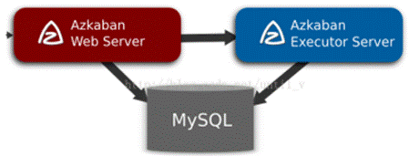

mysql服务器: 存储元数据，如项目名称、项目描述、项目权限、任务状态、SLA规则等

AzkabanWebServer:对外提供web服务，使用户可以通过web页面管理。职责包括项目管理、权限授权、任务调度、监控executor。

AzkabanExecutorServer:负责具体的工作流的提交、执行。

## 3． Azkaban三种部署模式

### 3.1． solo server mode

该模式中webServer和executorServer运行在同一个进程中，进程名是AzkabanSingleServer。使用自带的H2数据库。这种模式包含Azkaban的所有特性，但一般用来学习和测试。

### 3.2． two-server mode

该模式使用MySQL数据库， Web Server和Executor Server运行在不同的进程中。

### 3.3． multiple-executor mode

该模式使用MySQL数据库， Web Server和Executor Server运行在不同的机器中。且有多个Executor Server。该模式适用于大规模应用。

## 4． Azkaban源码编译

Azkaban3.x在安装前需要自己编译成二进制包。


**安装包下载地址中已提供编译好的安装包，如果不想自己编译，可略过本节**


并且提前安装好Maven、Ant、Node等软件，具体请参考附件资料

### 4.1． 编译环境

yum install –y git

yum install –y gcc-c++

### 4.2． 下载源码解压

wget https://github.com/azkaban/azkaban/archive/3.51.0.tar.gz

tar -zxvf 3.51.0.tar.gz 

cd ./azkaban-3.51.0/

### 4.3． 编译源码

./gradlew build installDist -x test

Gradle是一个基于Apache Ant和Apache Maven的项目自动化构建工具。-x test 跳过测试。（注意联网下载jar可能会失败、慢）


### 4.4． 编译后安装包路径

编译成功之后就可以在指定的路径下取得对应的安装包了。

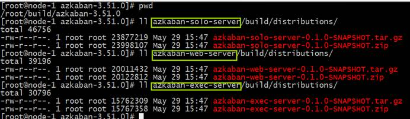

\#solo-server模式安装包路径

azkaban-solo-server/build/distributions/

\#two-server模式和multiple-executor模式web-server安装包路径

azkaban-web-server/build/distributions/

\#two-server模式和multiple-executor模式exec-server安装包路径

azkaban-exec-server/build/distributions/

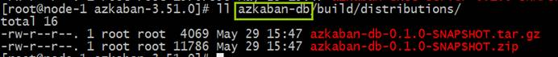

azkaban-db/build/distributions/

数据库相关安装包路径


# 三、 Azkaban安装部署

## 1． solo-server模式部署

### 1.1． 节点规划

| **HOST** | **角色**                              |
| -------- | ------------------------------------- |
| node01   | Web Server和Executor   Server同一进程 |

### 1.2． 解压配置

mkdir /export/servers/azkaban

tar -zxvf azkaban-solo-server-0.1.0-SNAPSHOT.tar.gz –C /export/servers/azkaban/

 

vim conf/azkaban.properties

```
default.timezone.id=Asia/Shanghai #修改时区
```

 

vim  plugins/jobtypes/commonprivate.properties

添加：memCheck.enabled=false

azkaban默认需要3G的内存，剩余内存不足则会报异常


### 1.3． 启动验证

cd azkaban-solo-server-0.1.0-SNAPSHOT/

bin/start-solo.sh

注:启动/关闭必须进到azkaban-solo-server-0.1.0-SNAPSHOT/目录下。

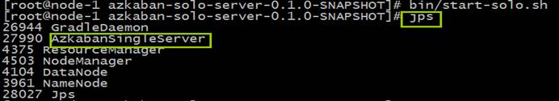

AzkabanSingleServer(对于Azkaban solo‐server模式，Exec Server和Web Server在同一个进程中)

### 1.4． 登录web页面

访问Web Server=>[http://node01:8081/](http://node-1:8081/) 默认用户名密码**azkaban**


### 1.5． 初体验测试

http://node01:8081/index登录=>Create Project=>Upload zip包 =>execute flow执行一步步操作即可。

创建两个文件one.job  two.job,内容如下，打包成zip包。

cat one.job 

  ```
type=command
command=echo "this is job one"
  ```


cat two.job 

  ```
type=command
dependencies=one
command=echo "this is job two"
  ```


创建工程：


上传zip压缩包：


execute执行：

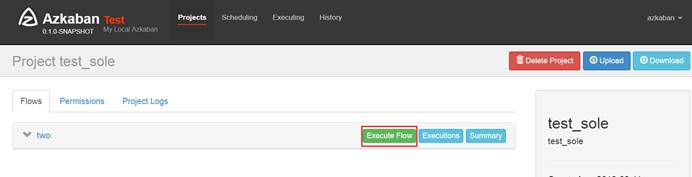


执行页面：


执行结果查看：


## 2． two-server模式部署

### 2.1． 节点规划

| **HOST** | **角色**                        |
| -------- | ------------------------------- |
| node01   | MySQL                           |
| node02   | web‐server和exec‐server不同进程 |

### 2.2． mysql配置初始化

node01：

```
mkdir /export/servers/azkaban

tar -zxvf azkaban-db-0.1.0-SNAPSHOT.tar.gz –C /export/servers/azkaban/
```


Mysql上创建对应的库、增加权限、创建表

```sql
mysql> CREATE DATABASE azkaban_two_server; -- 创建数据库

mysql> use azkaban_two_server;

mysql> source /export/servers/azkaban/azkaban-db-0.1.0-SNAPSHOT/create-all-sql-0.1.0-SNAPSHOT.sql; -- 加载初始化sql创建表
```


### 2.3． web-server服务器配置

node02:

```shell
mkdir /export/servers/azkaban

tar -zxvf azkaban-web-server-0.1.0-SNAPSHOT.tar.gz –C /export/servers/azkaban/

tar -zxvf azkaban-exec-server-0.1.0-SNAPSHOT.tar.gz –C /export/servers/azkaban/
```

 

生成ssl证书：

```shell
keytool -keystore keystore -alias jetty -genkey -keyalg RSA
```


运行此命令后,会提示输入当前生成keystore的密码及相应信息,输入的密码请记住(**所有密码统一以123456输入**)。

完成上述工作后,将在当前目录生成keystore证书文件,将keystore拷贝到 azkaban web服务器根目录中。

如: cp keystore azkaban-web-server-0.1.0-SNAPSHOT/

配置conf/azkaban.properties：

```properties
# Azkaban Personalization Settings
azkaban.name=Test
azkaban.label=My Local Azkaban
azkaban.color=#FF3601
azkaban.default.servlet.path=/index
web.resource.dir=web/
default.timezone.id=Asia/Shanghai # 时区注意后面不要有空格

# Azkaban UserManager class
user.manager.class=azkaban.user.XmlUserManager
user.manager.xml.file=conf/azkaban-users.xml

# Azkaban Jetty server properties. 开启使用ssl 并且知道端口
jetty.use.ssl=true
jetty.ssl.port=8443
jetty.maxThreads=25

# Azkaban Executor settings  指定本机Executor的运行端口
executor.host=localhost
executor.port=12321

#  KeyStore for SSL ssl相关配置  注意密码和证书路径
jetty.keystore=keystore
jetty.password=123456
jetty.keypassword=123456
jetty.truststore=keystore
jetty.trustpassword=123456

# Azkaban mysql settings by default. Users should configure their own username and password.
database.type=mysql
mysql.port=3306
mysql.host=node01
mysql.database=azkaban_two_server
mysql.user=root
mysql.password=hadoop
mysql.numconnections=100

#Multiple Executor 设置为false
azkaban.use.multiple.executors=true
#azkaban.executorselector.filters=StaticRemainingFlowSize,MinimumFreeMemory,CpuStatus 
azkaban.executorselector.comparator.NumberOfAssignedFlowComparator=1
azkaban.executorselector.comparator.Memory=1
azkaban.executorselector.comparator.LastDispatched=1
azkaban.executorselector.comparator.CpuUsage=1
```


添加azkaban.native.lib=false 和 execute.as.user=false属性：

mkdir -p plugins/jobtypes

vim commonprivate.properties

```properties
azkaban.native.lib=**false**

execute.as.user=**false**

memCheck.enabled=**false**
```


### 2.4． exec-server服务器配置

配置conf/azkaban.properties：

```pro
# Azkaban Personalization Settings
azkaban.name=Test
azkaban.label=My Local Azkaban
azkaban.color=#FF3601
azkaban.default.servlet.path=/index
web.resource.dir=web/
default.timezone.id=Asia/Shanghai

# Azkaban UserManager class
user.manager.class=azkaban.user.XmlUserManager
user.manager.xml.file=conf/azkaban-users.xml

# Loader for projects
executor.global.properties=conf/global.properties
azkaban.project.dir=projects

# Where the Azkaban web server is located
azkaban.webserver.url=https://node02:8443

# Azkaban mysql settings by default. Users should configure their own username and password.
database.type=mysql
mysql.port=3306
mysql.host=node01
mysql.database=azkaban_two_server
mysql.user=root
mysql.password=hadoop
mysql.numconnections=100

# Azkaban Executor settings
executor.maxThreads=50
executor.port=12321
executor.flow.threads=30
```


### 2.5． 集群启动

先启动exec-server 

再启动web-server。

启动webServer之后进程失败消失，可通过安装包根目录下对应启动日志进行排查。


需要手动激活executor

cd  /export/servers/azkaban/execserver

curl -G "node03:$(<./executor.port)/executor?action=activate" && echo


然后重新启动webServer就可以了。


## 3． multiple-executor模式部署

multiple-executor模式是多个executor Server分布在不同服务器上，只需要将azkaban-exec-server安装包拷贝到不同机器上即可组成分布式。

### 3.1． 节点规划

| **HOST** | **角色**                |
| -------- | ----------------------- |
| node01   | mysql                   |
| node02   | web-server、exec-server |
| node03   | exec-server             |

### 3.2． scp executor server安装包到node03

启动之后，需要手动激活executor

cd  /export/servers/azkaban/execserver

curl -G "node03:$(<./executor.port)/executor?action=activate" && echo


# 四、 Azkaban使用实战

## 1． shell command调度

- 创建job描述文件

vi command.job

```
#command.job
type=command                                                    
command=echo 'hello'
```

- 将job资源文件打包成zip文件

zip command.job

- 通过azkaban的web管理平台创建project并上传job压缩包

首先创建Project


上传zip包

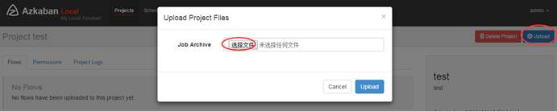

Ø  启动执行该job

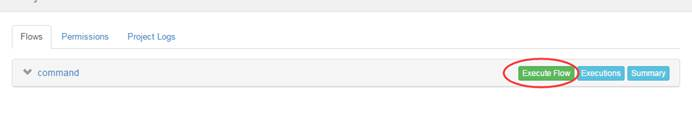


## 2． job依赖调度

- 创建有依赖关系的多个job描述

第一个job：foo.job

```
# foo.job
type=command
command=echo foo
```


第二个job：bar.job依赖foo.job

```
# bar.job
type=command
dependencies=foo
command=echo bar
```

 

- 将所有job资源文件打到一个zip包中


- 在azkaban的web管理界面创建工程并上传zip包

- 启动工作流flow


## 3． HDFS任务调度

Ø  创建job描述文件

```
# fs.job
type=command
command=/home/hadoop/apps/hadoop-2.6.1/bin/hadoop fs -mkdir /azaz

```


- 将job资源文件打包成zip文件


- 通过azkaban的web管理平台创建project并上传job压缩包

- 启动执行该job

 

## 4． MAPREDUCE任务调度

mr任务依然可以使用command的job类型来执行

- 创建job描述文件，及mr程序jar包（示例中直接使用hadoop自带的example jar）

```
# mrwc.job
type=command
command=/home/hadoop/apps/hadoop-2.6.1/bin/hadoop  jar hadoop-mapreduce-examples-2.6.1.jar wordcount /wordcount/input /wordcount/azout
```

- 将所有job资源文件打到一个zip包中

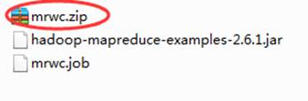

- 在azkaban的web管理界面创建工程并上传zip包

- 启动job


## 5． HIVE脚本任务调度

 

- 创建job描述文件和hive脚本

Hive脚本： test.sql

```sql
use default;
drop table aztest;
create table aztest(id int,name string) row format delimited fields terminated by ',';
load data inpath '/aztest/hiveinput' into table aztest;
create table azres as select * from aztest;
insert overwrite directory '/aztest/hiveoutput' select count(1) from aztest; 
```


Job描述文件：hivef.job

```
# hivef.job
type=command
command=/home/hadoop/apps/hive/bin/hive -f 'test.sql'
```


- 将所有job资源文件打到一个zip包中创建工程并上传zip包,启动job


## 6． 定时任务调度

除了手动立即执行工作流任务外，azkaban也支持配置定时任务调度。开启方式如下：

首页选择待处理的project

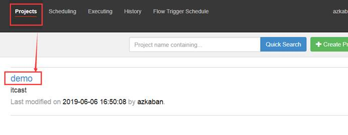

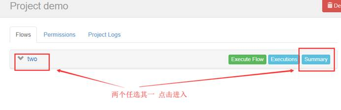

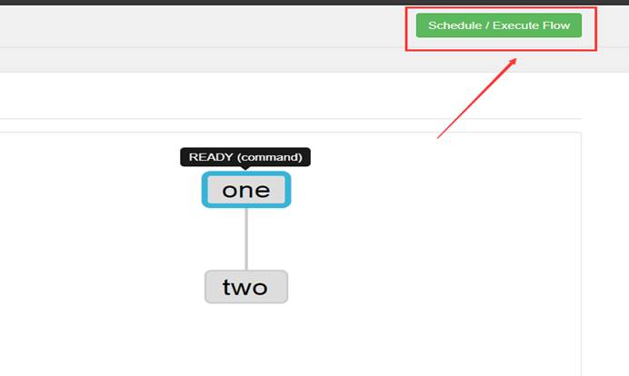

 

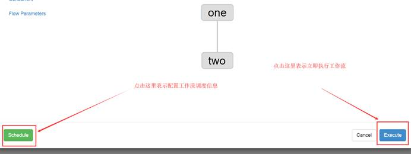

上述图片中，选择左边schedule表示配置定时调度信息，选择右边execute表示立即执行工作流任务。

